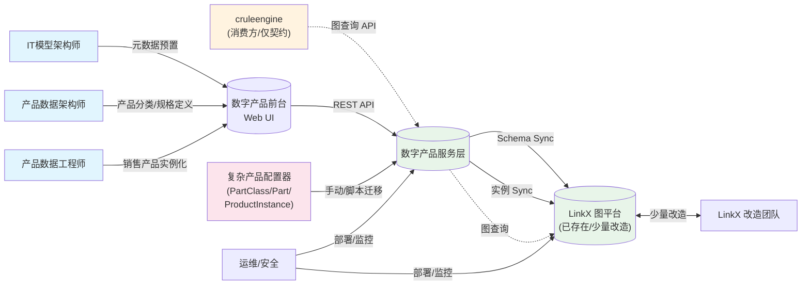

<!-- Generated by SpecStory, Markdown v2.1.0 -->

# 2026-08-01 12:59:42Z

<!-- Cursor IDE Session 2c154a3a-ef74-4b8a-afd1-3cd262e03f77 (2026-08-01 12:59:42Z) -->

_**User**_

/rfc-arch @docs/数字产品系统总体方案设计-RFC001.md 请参考这个文档（虽然这只是非常初步的一些想法）以及我们的截图，来开始我们数字产品的 架构设计的第一部分。

所有的输出材料都要放在 docs 里面。

---

_**Agent (claude-fable-5)**_

<think><details><summary>Thought Process</summary>
**Inspecting RFC document and image**
</details></think>

_**Agent (claude-fable-5)**_

<tool-use data-tool-type="read" data-tool-name="read_file_v2"><details>
<summary>Tool use: **read_file_v2**</summary>
File not found
</details></tool-use>

_**Agent (claude-fable-5)**_

<tool-use data-tool-type="read" data-tool-name="read_file_v2"><details>
<summary>Tool use: **read_file_v2** • Read file: C:\Users\Administrator\WorkBuddy\2026-07-20-21-20-36\outputs\digitalproduct\docs\数字产品系统总体方案设计-RFC001.md</summary>

</details></tool-use>

_**Agent (claude-fable-5)**_

<tool-use data-tool-type="read" data-tool-name="read_file_v2"><details>
<summary>Tool use: **read_file_v2** • Read file: C:\Users\Administrator\WorkBuddy\2026-07-20-21-20-36\outputs\digitalproduct\.agents\skills\rfc-arch\references\prompts.md</summary>

</details></tool-use>

_**Agent (claude-fable-5)**_

<tool-use data-tool-type="read" data-tool-name="read_file_v2"><details>
<summary>Tool use: **read_file_v2** • Read file: C:\Users\Administrator\WorkBuddy\2026-07-20-21-20-36\outputs\digitalproduct\.agents\skills\rfc-arch\references\adr-template.md</summary>

</details></tool-use>

_**Agent (claude-fable-5)**_

好的，我先读现有 RFC 文档以建立上下文基线，再开始第 1 轮。

_**Agent (claude-fable-5)**_

<tool-use data-tool-type="read" data-tool-name="read_file_v2"><details>
<summary>Tool use: **read_file_v2** • Read file: C:\Users\Administrator\WorkBuddy\2026-07-20-21-20-36\outputs\digitalproduct\docs\数字产品系统总体方案设计-RFC001.md</summary>

</details></tool-use>

_**Agent (claude-fable-5)**_

<tool-use data-tool-type="read" data-tool-name="read_file_v2"><details>
<summary>Tool use: **read_file_v2** • Read file: C:\Users\Administrator\.cursor\projects\c-Users-Administrator-WorkBuddy-2026-07-20-21-20-36-outputs-digitalproduct\assets\c__Users_Administrator_AppData_Roaming_Cursor_User_workspaceStorage_7619cccc8f2aa5c832d16bdb705a5c36_images_image-6bfdb2f8-f798-4d4e-9664-be462e434dbc.png</summary>

</details></tool-use>

_**Agent (claude-fable-5)**_

我已经了解文档现状（v1.2-draft，已包含模块划分、总体逻辑架构、数据模型草图、时序图草案），并看到了截图（数据模型图）。现在按 RFC-Arch 协议启动第 1 轮。

为了遵守「一次一层、AI 先澄清」的规则，我先把第 1 轮的启动协议跑完，建立协作基线并向你提问关键澄清问题，不直接动文档。

---

# 🚀 RFC-Arch 启动协议 — 数字产品系统架构设计

## 1. 我对现状的理解（先核对，再前进）

我读了 `docs/数字产品系统总体方案设计-RFC001.md`（v1.2-draft）和截图。文档已经搭起骨架，包含：

- **背景与目标**：明确"语义与存储分离"、维护态全量入图、LinkX 作为图底座
- **模块划分**：元数据管理 / 产品模型管理 / 产品实例化 / 产品数据服务 / 发布管理 / LinkX Sync（6 个服务模块）
- **总体逻辑架构图 + 数据流向图**（已粗画 ASCII 图）
- **数据模型**：OntoObjectType / OntoAttrType / OntoLinkType / Module / Part / BusinessObject / ModuleInstance / ModuleLink 等核心实体
- **时序图**：阶段一元数据与产品定义、阶段二实例化与裁剪、阶段三图查询
- **截图**：一张数据模型概念图

> ⚠️ 注意：文档当前是**待评审的 v1.2-draft**，章节命名和我们要走的 4+1 视图模板结构不完全一致。我们的目标不是推翻它，而是**用 4+1 视图骨架重新组织和补完它**。

## 2. 我提议的推进计划（8 轮 + 收口）

| 轮次 | 章节 | 4+1 视图映射 |
|---|---|---|
| **1（本轮）** | 系统边界与目标（背景、干系人、约束、NFR） | 简介 / 总体设计 |
| 2 | 用例视图 | +1 视图 |
| 3 | 逻辑视图 — 系统分解 | 逻辑视图 |
| 4 | 数据模型（核心实体 + 存储选型） | 数据视图（在 4+1 中并入逻辑视图，单独成轮） |
| 5 | 技术模型 | 开发视图（部分） |
| 6 | 运行视图（时序、降级、可观测性） | 进程视图 |
| 7 | 部署视图（部署拓扑、容量、容灾） | 物理视图 |
| 8 | 开发视图与质量属性落地（代码结构、CI/CD、压测） | 开发视图 |
| 收口 | 整体评审 + 风险清单 + 修订记录 | — |

## 3. 第 1 轮主题：**系统边界与目标**

按 4+1 视图，本轮要敲定的不是技术细节，而是**"我们到底在做什么、不做什么"**。这是后续所有设计的天花板和地板，必须先对齐。

我的输出物会是：
- 干系人表（业务建模师 / 数据架构师 / 销售产品经理 / Agent 调用方 / 运维 / 治理）
- 架构目标表（含衡量指标）
- 约束清单（成本、合规、技术栈、组织）
- NFR 清单（性能、可用性、可维护性、安全、可扩展性）
- 明确"不做什么"

---

## 4. 我需要先向你澄清的问题（最多 10 个，请逐条回答）

**Q1. 系统边界**
"数字产品系统"是**从零新建**一个产品，还是要**改造/替换**现有的复杂产品配置器（`docs3/复杂产品配置器`）？两者的迁移策略完全不同。

**Q2. 与 LinkX 的关系**
文档里说 LinkX 是**外部依赖**。它是否已存在、稳定、可生产用？还是我们要一起建设？LinkX 是否提供完整的事务/Schema 管理能力？

**Q3. 与 cruleengine 的关系**
`cruleengine` 的产品配置约束求解、规则引擎是**已存在的依赖**，还是**也要在本期一起建设**？本期交付是否包含"端到端可运行"？

**Q4. 用户群体（前台）**
前台主要给谁用？
- a) IT/数据架构师（建模）
- b) 产品经理/产品数据工程师（建模 + 实例化）
- c) 销售/售前（消费）
- d) 全部

**Q5. Agent 消费方**
"AI 时代下面向 Agent 高度可消费"——Agent 消费方本期是否要真的实现？还是只设计接口契约、把数据准备好？

**Q6. 部署形态**
- a) 私有化部署（客户机房）
- b) 公有云 SaaS
- c) 混合云（核心私有 + 边缘公有）
- d) 暂未确定

**Q7. 数据规模与性能**
预估：管理多少个 Module？多少个 Part 实例？图数据点边规模？查询并发与延迟要求？这决定我们要不要做缓存、分库、读写分离。

**Q8. 多租户 / 多环境**
是否支持多租户（不同 BU/客户用同一套）？是否需要 dev/test/staging/prod 多环境隔离？

**Q9. 现有存量数据迁移**
是否有存量产品数据要从老系统迁入？数据量级？是否要兼容老接口？

**Q10. 优先级与时间盒**
本期范围建议是
- a) 端到端最小可行（MVP：建模→实例化→图查询全链路）
- b) 仅服务层 + LinkX 接口契约（前台下一期做）
- c) 仅前台原型 + 一个端到端业务场景（验证可行性）

---

## 5. 请你回答

你可以**一次性回答 Q1-Q10**，也可以只回答**最关键的几条**先让我推进。回答后我会：
1. 输出第 1 轮的"系统上下文 / 干系人表 / 架构目标表 / 约束清单 / NFR 清单"
2. 给你 2-3 个候选边界方案的对比表和推荐
3. 切对抗角色找出 3-5 个最严重的问题
4. 把定稿回写到 `docs/数字产品系统总体方案设计-RFC001.md` 并产出 ADR-001

_**Agent (claude-fable-5)**_

<tool-use data-tool-type="unknown" data-tool-name="ask_question"><details>
<summary>Tool use: **ask_question**</summary>

Parameters:

```json
{
  "questions": [
    {
      "id": "q1",
      "options": [
        {
          "id": "a",
          "label": "全新建设（替代旧系统）"
        },
        {
          "id": "b",
          "label": "改造/替换现有复杂产品配置器"
        },
        {
          "id": "c",
          "label": "与现有并存、长期并行"
        }
      ],
      "prompt": "系统边界：数字产品系统是从零新建，还是要改造/替换现有的复杂产品配置器（docs3/复杂产品配置器）？"
    },
    {
      "id": "q2",
      "options": [
        {
          "id": "a",
          "label": "已存在、稳定可生产"
        },
        {
          "id": "b",
          "label": "已存在但需少量改造"
        },
        {
          "id": "c",
          "label": "需要一起建设"
        },
        {
          "id": "d",
          "label": "暂未确定"
        }
      ],
      "prompt": "LinkX 是已存在可用的外部依赖，还是也要在本期一起建设？"
    },
    {
      "id": "q3",
      "options": [
        {
          "id": "a",
          "label": "已存在稳定依赖、本期仅消费"
        },
        {
          "id": "b",
          "label": "存在但需少量改造"
        },
        {
          "id": "c",
          "label": "需要一起建设"
        }
      ],
      "prompt": "cruleengine（产品配置约束求解/规则引擎）的现状和本期范围？"
    },
    {
      "id": "q4",
      "options": [
        {
          "id": "a",
          "label": "IT/数据架构师"
        },
        {
          "id": "b",
          "label": "产品经理/产品数据工程师"
        },
        {
          "id": "c",
          "label": "销售/售前"
        },
        {
          "id": "d",
          "label": "运维/治理"
        }
      ],
      "prompt": "前台主要给哪几类用户使用？（可多选）"
    },
    {
      "id": "q5",
      "options": [
        {
          "id": "a",
          "label": "本期要真实落地 Agent 调用"
        },
        {
          "id": "b",
          "label": "仅设计接口契约、数据准备好即可"
        },
        {
          "id": "c",
          "label": "只做 1 个示范场景验证"
        }
      ],
      "prompt": "Agent 消费方本期落地深度？"
    },
    {
      "id": "q6",
      "options": [
        {
          "id": "a",
          "label": "私有化（客户机房）"
        },
        {
          "id": "b",
          "label": "公有云 SaaS"
        },
        {
          "id": "c",
          "label": "混合云"
        },
        {
          "id": "d",
          "label": "暂未确定"
        }
      ],
      "prompt": "部署形态？"
    },
    {
      "id": "q7",
      "options": [
        {
          "id": "a",
          "label": "我会在下一轮给你粗略数字"
        },
        {
          "id": "b",
          "label": "现在先按\"中小规模\"假设推进"
        },
        {
          "id": "c",
          "label": "现在先按\"大规模\"假设推进"
        }
      ],
      "prompt": "数据规模与性能目标（Module/Part 实例量级、图点边规模、查询并发/延迟）是否你已有具体数字？"
    },
    {
      "id": "q8",
      "options": [
        {
          "id": "a",
          "label": "需要多租户"
        },
        {
          "id": "b",
          "label": "仅需多环境隔离（dev/test/prod）"
        },
        {
          "id": "c",
          "label": "两者都需要"
        },
        {
          "id": "d",
          "label": "暂不需要"
        }
      ],
      "prompt": "是否需要多租户、多环境隔离？"
    },
    {
      "id": "q9",
      "options": [
        {
          "id": "a",
          "label": "有大量存量数据需要迁移"
        },
        {
          "id": "b",
          "label": "少量存量，可手动/脚本迁移"
        },
        {
          "id": "c",
          "label": "无存量，从零开始"
        }
      ],
      "prompt": "是否有存量产品数据需要迁移？"
    },
    {
      "id": "q10",
      "options": [
        {
          "id": "a",
          "label": "端到端 MVP（建模→实例化→图查询）"
        },
        {
          "id": "b",
          "label": "仅服务层 + LinkX 接口契约（前台下一期）"
        },
        {
          "id": "c",
          "label": "仅 1 个端到端业务场景验证可行性"
        }
      ],
      "prompt": "本期范围优先级（先做哪一块）？"
    }
  ],
  "title": "第 1 轮澄清：系统边界与目标（10 个关键问题）"
}
```
Additional data:

```json
{
  "currentSelections": {
    "q1": [
      "b"
    ],
    "q10": [
      "a"
    ],
    "q2": [
      "b"
    ],
    "q3": [
      "__freeform_other__"
    ],
    "q4": [
      "__freeform_other__"
    ],
    "q5": [
      "b"
    ],
    "q6": [
      "a"
    ],
    "q7": [
      "a"
    ],
    "q8": [
      "b"
    ],
    "q9": [
      "a"
    ]
  },
  "freeformTexts": {
    "q1": "",
    "q10": "",
    "q2": "",
    "q3": "仅消费，不涉及",
    "q4": "IT模型架构师、产品数据架构师、产品数据工程师、",
    "q5": "",
    "q6": "",
    "q7": "",
    "q8": "",
    "q9": ""
  },
  "status": "submitted"
}
```
Result:

```json
{
  "answers": [
    {
      "freeformText": "",
      "questionId": "q1",
      "selectedOptionIds": [
        "b"
      ]
    },
    {
      "freeformText": "",
      "questionId": "q2",
      "selectedOptionIds": [
        "b"
      ]
    },
    {
      "freeformText": "仅消费，不涉及",
      "questionId": "q3"
    },
    {
      "freeformText": "IT模型架构师、产品数据架构师、产品数据工程师、",
      "questionId": "q4"
    },
    {
      "freeformText": "",
      "questionId": "q5",
      "selectedOptionIds": [
        "b"
      ]
    },
    {
      "freeformText": "",
      "questionId": "q6",
      "selectedOptionIds": [
        "a"
      ]
    },
    {
      "freeformText": "",
      "questionId": "q7",
      "selectedOptionIds": [
        "a"
      ]
    },
    {
      "freeformText": "",
      "questionId": "q8",
      "selectedOptionIds": [
        "b"
      ]
    },
    {
      "freeformText": "",
      "questionId": "q9",
      "selectedOptionIds": [
        "a"
      ]
    },
    {
      "freeformText": "",
      "questionId": "q10",
      "selectedOptionIds": [
        "a"
      ]
    }
  ]
}
```
User decision: **accepted**

Status: **completed**

</details></tool-use>

_**Agent (claude-fable-5)**_

# ✅ 第 1 轮澄清答复已收到

收到回答，整理一下要点：

| # | 问题 | 答复 |
|---|---|---|
| Q1 | 系统边界 | **改造/替换**现有复杂产品配置器（docs3） |
| Q2 | LinkX | **已存在但需少量改造** |
| Q3 | cruleengine | **仅消费**，本期不涉及 |
| Q4 | 前台用户 | IT 模型架构师 + 产品数据架构师 + 产品数据工程师（**三类核心建模用户，无销售/售前**） |
| Q5 | Agent 消费 | **仅设计接口契约、数据准备好即可**，本期不真落地 Agent 调用 |
| Q6 | 部署形态 | **私有化（客户机房）** |
| Q7 | 数据规模/性能 | 用户会在下一轮给具体数字 |
| Q8 | 多租户/多环境 | **仅多环境隔离**（dev/test/staging/prod），**无需多租户** |
| Q9 | 存量数据迁移 | **有少量存量，可手动/脚本迁移** |
| Q10 | 本期范围 | **端到端 MVP**（建模→实例化→图查询） |

但我注意到几个**需要你立刻确认的歧义**，因为这些会直接影响第 1 轮输出物的措辞：

## ⚠️ 歧义核对（请先回答这几条，我再下笔）

**歧义 A：Q1 vs Q9 的潜在冲突**
你说"改造/替换"现有配置器，但又选"少量存量、可手动/脚本迁移"——存量是来自**配置器里已有的 PartClass/Part/ProductInstance** 吗？这决定了我们要不要写"双写期"和"灰度迁移策略"。

**歧义 B：Q3 "仅消费"的范围**
你说 cruleengine 仅消费。是指本期数字产品**输出给 cruleengine 的接口契约**要锁定，还是连契约都先不设计、等配置器上线再说？前端"配置求解"场景本期是否还要保留？

**歧义 C：Q4 与现有文档冲突**
现有文档 1.2/4.2 数据流向里出现"产品数据工程师、销售产品经理、销售产品实例化"。你刚刚选的用户里**没有销售**。是不是意味着本期**不做销售侧实例化**，只做"产品建模 + 数据准备"？这是一个产品边界问题，需要你确认。

**歧义 D：Q5 "Agent 仅接口契约" 的具体含义**
是指：
- a) 服务层只暴露**通用图查询/多跳 API**，让上层自己基于 API 做 Agent
- b) 还要设计一套**面向 LLM 的语义接口**（如 Tool Use 描述、Schema-on-Read）
- c) 连 API 都不固定，只确保数据在图里

**歧义 E：Q7 "下一轮给数字" 的口径**
为了避免我把性能目标拍脑袋写进文档，你能给一个**量级估计**吗？比如："万级 Part / 十万级实例 / 百 QPS / 秒级延迟"这种粗的也行。我会把这个写进 NFR 清单的"待细化"标记。

---

## 我提议的下一步

请你**先回答上面 5 个歧义**（特别是 A/C，这俩是产品边界级问题，会决定整个文档基调）。然后我会：

1. 输出第 1 轮定稿：**系统上下文图 + 干系人表 + 架构目标表 + 约束清单 + NFR 清单**
2. 给 2-3 个**候选系统边界方案对比表**（特别针对"是否双写期/灰度迁移"）
3. 切换对抗评审人角色挑 3-5 个最严重问题
4. 回写文档并产出 ADR-001

> 你也可以说"歧义先这样定：...."我就按你的指示走。

---

_**User**_

歧义 A： 存量是来自配置器里已有的 PartClass/Part/ProductInstance 吗 --答：是的 \n  歧义 B：契约都先不设计、等配置器上线再说 ，前端"配置求解"场景本期不保留    歧义 C：产品数据工程师实施的销售产品实例化就是为了销售服务，这里需要澄清一下：

因为产品数据工程师（相当于产品线的数据工程师）是为了销售场景工作的，所以他们需要跟销售人员交流，理解他们的业务场景并进行相关建模。

这样最终才能满足销售端的各种配置器场景，比如：
• 配置器的相关计算
• 配置产品的选型
• 产品的销售等、、/n 我这里列的这三个工程师大概的分工如下：

1. IT 工程师：
   主要负责根据客户的要求，和我们的数据架构师等一起提炼需求（所有产业的需求都是一样的）。IT 工程师会把这些需求提炼出来，制作一些类似于产品模型的模板。比方说定义 Product、Product Class 到底有哪些基础属性（比如名称、Code 等），这就是 IT 工程师在里面干的活。

2. 数据架构师：
   主要负责定义本身某一块具体的产品。以服务器为例，它具体要有哪些分类（比如 CPU、Driver 等），以及每个 Driver 到底有哪些属性（也就是我们讲的规格或参数），这些都由数据架构师来具体制定。

3. 数据工程师：
   基于前面数据架构师做的整个面向平台性的东西，将其转化为销售产品。我们会根据销售策略，将产品包装成几个具体的销售产品（比如 SR 或 SE 系列）去销售。数据工程师主要负责做一些实例化，以及确定每个部件具体的实例值。\歧义 D： 服务层通用图查询 及数字产品领域对象（如ProductClass）的api接口  歧义 E： 大概是这样的：我们一个销售产品实例（ProductClass）的部件（part）数量大概在 3000 个。因为它是按产品的版本发的，一年大概有 1000 个销售产品。

也就是 2000 × 3000，算下来应该是百万到亿级的一个最小 part 数量。如果是规格数的话，可能就更多，大概是这样一个数据量

---

_**Agent (claude-fable-5)**_

<think><details><summary>Thought Process</summary>

The user has provided detailed answers to all 5 ambiguities. Let me synthesize these into a clear understanding:

**歧义 A**: 存量来自 PartClass/Part/ProductInstance (现有复杂产品配置器) - YES
**歧义 B**: 契约先不设计，等配置器上线；前端配置求解场景本期不保留
**歧义 C**: Clarified the 3 user roles:
- IT工程师: 需求提炼、产品模型模板、基础属性定义(Product/ProductClass的基础属性如名称、Code等)
- 数据架构师: 具体产品分类定义(如CPU/Drive)、每个Driver的具体属性(规格/参数)


- 数据工程师: 将架构师的设计转化为具体销售产品(SR/SE系列)，处理实例化和部件实例值

**歧义 D**: 服务层提供通用图查询API和数字产品领域对象的API接口(如ProductClass)

**歧义 E**: 数据规模估算显示2000个销售产品实例、每个约3000个部件，年增量1000个销售产品。按2000×3000计算得到百万到亿级别的最小部件数量。

规格数量更多。我需要基于这些数据给出第1轮的完整设计输出，包括系统上下文、干系人表、架构目标表、约束清单和NFR清单，同时提供2-3个候选系统边界方案对比表、推荐方案和对抗评审。

最后要把这些结论回写到文档并产出ADR-001。

现在梳理约束清单：改造/替换现有复杂产品配置器、LinkX已存在需改造、cruleengine仅消费不设计契约、前台面向三类用户——IT模型架构师、产品数据架构师、产品数据工程师、Agent消费仅接口契约不真落地、私有化部署、多环境隔离dev/test/staging/prod、存量来自PartClass/Part/ProductInstance需手动/脚本迁移、端到端MVP。

性能指标方面，2000个销售产品实例、年增量1000个、单个实例3000个部件、最小部件数百万到亿级、规格数更多、无多租户需求。

接下来要设计2-3个候选系统边界方案对比表，特别是针对"双写期/灰度迁移"这个问题——双写期意味着新旧系统并行运行、数据双向同步、灰度切流量；直接替代则是老系统下线、存量一次性迁移、风险较高但简单；方案C则是先一次性迁移再启动新系统。

我倾向于推荐双写期方案A，因为存量数据需要迁移、改造替换风险可控、配置器业务不能中断，但必须明确存量迁移是一次性还是增量，以及LinkX少量改造的范围。

系统上下文涉及用户通过前端建模界面录入元数据和产品模型，系统响应后...

系统上下文还涉及产品数据工程师的实例化操作、数据消费层提供API接口给cruleengine调用，以及LinkX改造团队支持Schema和实例同步。关键干系人包括产品数据架构师、产品数据工程师、IT模型架构师、LinkX团队、cruleengine团队和运维团队。架构目标分为三类：前台建模效率目标、后台服务层可靠性和可维护性目标、LinkX集成与数据消费目标。

系统约束包括私有化部署、百万到亿级Part规模、多环境隔离、不支持多租户、需迁移PartClass/Part/ProductInstance等存量数据、本期不做前端配置求解、LinkX仅少量改造。现在需要输出这四个表格并给出方案对比和推荐，然后进行对抗评审，最后将所有内容写入文档并生成ADR。
</details></think>

_**Agent (claude-fable-5)**_

收到所有歧义回答。我先把关键理解记录下来，再输出完整设计：

## 📋 歧义整合后的理解基线

| 歧义 | 你的回答 | 我的理解 |
|---|---|---|
| A | 是，存量来自 PartClass/Part/ProductInstance | 老系统的 PartClass/Part/ProductInstance 需要迁入 LinkX |
| B | 契约先不定，配置求解本期不保留 | 本期**不涉及**前端配置求解，只做"建模→实例化→图数据准备" |
| C | 三类用户各自职责清晰，销售场景是**最终目标**，但**建模和实例化是数据工程师的职责** | 本期不做销售前端，只做中台（数据工程师在做的实例化 = 销售产品的实例化，即为销售服务） |
| D | 服务层提供：① 通用图查询 API ② 数字产品领域对象 API（如 ProductClass） | 两层 API 都要设计，但 Agent 消费本期只定义契约、不真落地 |
| E | 2000 × 3000 = **百万到亿级** Part 最小数量，规格数更多 | 这是一个**大规模**系统，存储和查询性能必须有针对性设计 |

> ⚠️ **重要发现**：歧义 C 实际上**没有歧义了**——销售是最终服务对象，但本期交付边界是"建模 + 实例化 + 图数据准备"，销售前端（含配置求解）不在本期范围内。这是清晰的边界。

现在进入 **第 1 轮步骤 2：设计**。

---

# 第 1 轮：系统边界与目标 — 设计输出

## 一、系统上下文图（更新版）



---

## 二、干系人表（完整版）

| 干系人 | 角色 | 关注点 | 优先级 | 本期是否涉及 |
|---|---|---|---|---|
| IT模型架构师 | 需求提炼者 / 基础模板制作者 | 元数据类型定义、平台级基础属性（Product/ProductClass 的 Name/Code 等） | ★★★ | ✅ 直接用户 |
| 产品数据架构师 | 具体产品分类定义者 | 具体产品分类（CPU/Drive 等）、每个部件的规格/参数定义 | ★★★ | ✅ 直接用户 |
| 产品数据工程师 | 销售产品实例化实施者 | 将平台模板转化为具体销售产品（SR/SE 系列）、实例化部件、确定部件具体实例值 | ★★★ | ✅ 直接用户 |
| LinkX 图平台团队 | 下游基础设施提供方 | Schema 扩展、实例同步、查询性能 | ★★★ | ✅ 少量改造协作 |
| cruleengine 团队 | 未来消费方（仅契约） | 图查询 API 契约、领域对象 API 契约 | ★★ | ⚠️ 仅接口设计，不实现调用 |
| 运维 / 安全团队 | 部署与安全 | 私有化部署、监控、备份、安全合规 | ★★ | ✅ 部署与运维设计 |
| 销售/售前 | 业务受益方（间接） | 配置器选型、产品销售 | ★ | ❌ 本期不含销售前端 |
| 产品线管理层 | 业务决策者 | ROI、上线时间 | ★ | ❌ 仅汇报对象 |

---

## 三、架构目标表（带衡量指标）

> ⚠️ Q7 性能目标待数据架构师与 LinkX 团队进一步对齐，下表中标注了 `⚠️ 待细化`。

| 编号 | 架构目标 | 质量属性 | 衡量指标 | 状态 |
|---|---|---|---|---|
| G1 | **前台建模效率** | 可用性 / 性能 | 元数据建模操作 < 2s 响应；Part 实例化 < 5s 响应；单次 Save 操作成功率 ≥ 99.5% | 🔶 规划中 |
| G2 | **服务层可靠性** | 可用性 | API 可用性 ≥ 99.9%；故障恢复时间 < 30min；支持 LinkX 故障时增量补偿同步 | 🔶 规划中 |
| G3 | **数据一致性** | 一致性 | 数字产品服务层 ↔ LinkX 的增量同步延迟 < 5min；存量迁移后数据一致性校验通过 | 🔶 规划中 |
| G4 | **可扩展性** | 可扩展性 | 单图支持 **百万~亿级 Part 节点 + 关联规格**；支持 2000+ ProductClass 实例；年增量 1000+ ProductClass | 🔶 规划中 |
| G5 | **查询性能** | 性能 | ⚠️ 待与 LinkX 团队对齐：典型图多跳查询（P1: 2跳 / P2: 5跳 / P3: 10跳）延迟目标 | 🔴 待细化 |
| G6 | **API 契约就绪** | 可维护性 | 通用图查询 API + 数字产品领域对象 API（如 ProductClass）接口契约文档完整 | ✅ 本期交付 |
| G7 | **可观测性** | 可运维性 | 日志 / 指标 / 链路追踪覆盖所有关键路径；私有化部署可离线监控 | 🔶 规划中 |
| G8 | **可迁移性** | 可维护性 | 存量 PartClass/Part/ProductInstance 数据迁移脚本化、可验证、可回滚 | 🔶 规划中 |

---

## 四、约束清单

| 约束类型 | 约束内容 | 备注 |
|---|---|---|
| **部署约束** | 私有化部署（客户机房），无公网依赖 | 决定技术栈选型（不能选纯 SaaS 服务） |
| **规模约束** | Part 量级：百万~亿级；年增量 1000 ProductClass；单实例 3000 Part | 决定存储和查询必须做针对性优化 |
| **环境约束** | dev / test / staging / prod 多环境隔离，无多租户需求 | 不需要租户隔离逻辑 |
| **数据约束** | 存量 PartClass/Part/ProductInstance 需迁移（手动/脚本） | 存量迁移是一期交付的一部分 |
| **技术栈约束** | LinkX 已存在但需少量改造（Schema 扩展 + 实例同步） | 需要 LinkX 团队配合，改造范围需尽早明确 |
| **范围约束** | 本期**不含**前端配置求解、Agent 真调用、销售前端 | 边界清晰，不做范围蔓延 |
| **团队约束** | 前端建模 UI + 后端服务层 + LinkX 改造 + 存量迁移 | 多个团队并行，需接口对齐 |
| **时间约束** | MVP 端到端（建模→实例化→图查询）需可演示 | 存量迁移可能成为关键路径 |

---

## 五、NFR 清单（非功能需求）

| NFR | 描述 | 目标值 | 备注 |
|---|---|---|---|
| **性能-N01** | 图存储规模 | 百万~亿级 Part 节点 + 关联规格 | [INFERRED] 以 LinkX 容量为上限 |
| **性能-N02** | 年增量吞吐 | 1000 ProductClass × 3000 Part | [INFERRED] 年增量约 300 万 Part |
| **性能-N03** | 查询延迟 | ⚠️ 待与 LinkX 团队对齐 | 多跳深度 P1/P2/P3 分档定义 |
| **可用性-N04** | 服务层 API 可用性 | ≥ 99.9%（年度 ~8.7h 停机预算） | [INFERRED] 私有化 SLA 通常 4 个 9 |
| **可用性-N05** | LinkX 故障恢复 | 增量补偿同步，RTO 待定 | [INFERRED] |
| **可扩展性-N06** | 模块化 | 服务层各模块职责分离，可独立部署/升级 | 依赖架构分层设计 |
| **可维护性-N07** | 可测试性 | 单元测试覆盖率 ≥ 70%；关键路径 E2E 可演示 | [INFERRED] |
| **可维护性-N08** | 可逆性 | 存量迁移可回滚，增量同步可重放 | 迁移脚本化 |
| **安全-N09** | 访问控制 | 多环境身份认证 + 权限隔离（dev/test/staging/prod） | 不需要跨租户隔离 |
| **安全-N10** | 审计日志 | 关键写操作（建模/实例化/发布）全链路记录 | 合规要求，私有化客户通常有要求 |
| **运维-N11** | 可观测性 | 日志 / 指标 / 链路追踪三件套 | 私有化离线环境支持 |
| **数据-N12** | 数据一致性 | 服务层 ↔ LinkX 最终一致性，增量同步延迟 < 5min | 强一致 vs 最终一致待决策 |

---

## 六、候选系统边界方案对比（重点针对"存量迁移策略"）

存量迁移是本轮最关键的系统边界决策。数字产品系统边界由存量迁移策略决定三个截然不同的方案：

### 方案 A：**双写并行 + 灰度切换**（推荐）

```
[老系统 PartClass/Part]  ──▶  [数字产品服务层]  ──▶  [LinkX]
         │                         ▲
         │                         │ 双写期同步
         ▼                         │
[老 LinkX/关系库]  ◀───  [迁移脚本] ──┘
```

| 维度 | 说明 |
|---|---|
| 优点 | 业务不中断；新旧系统并行验证；可灰度切换 |
| 缺点 | 改造复杂度高；双写一致性逻辑复杂；老系统需保留接口 |
| 适用条件 | 业务不能停；老系统还需要服务一段时间；改造周期长 |
| 风险 | 双写逻辑 bug 可能导致数据不一致；老系统维护成本增加 |

### 方案 B：**一次性迁移 + 老系统下线**

```
[老系统]  ──▶  [迁移脚本一次性执行]  ──▶  [数字产品服务层]  ──▶  [LinkX]
                                                    ↑
                                              老数据全部进入
```

| 维度 | 说明 |
|---|---|
| 优点 | 架构简单；无双写复杂性；老系统可完全废弃 |
| 缺点 | 业务中断风险；迁移窗口期长（百万~亿级 Part）；回滚代价高 |
| 适用条件 | 老系统可以接受计划内停机；存量数据质量可控 |
| 风险 | 迁移失败回滚困难；数据质量差异可能暴露问题 |

### 方案 C：**新系统独立建设 + 存量仅作为参考历史**（推荐备选）

```
[老系统 PartClass/Part]  ──▶  [数字产品服务层新建]  ──▶  [LinkX]
                                     ↑
                              存量仅做历史参考
                              不做实时同步
```

| 维度 | 说明 |
|---|---|
| 优点 | 最干净；无历史包袱；设计不受老系统约束 |
| 缺点 | 存量数据丢失（不可接受）；业务连续性差 |
| 适用条件 | 老系统数据不重要；可重新开始录入 |
| 风险 | 业务不接受 |

---

## 七、推荐方案与理由

**推荐：方案 A（双写并行 + 灰度切换）**

理由：
1. **存量数据量级决定不能一次性迁移**（百万~亿级 Part，无法在业务窗口内完成一次性迁移）
2. **业务连续性要求**（产品线不能接受长时间停机）
3. **本期是 MVP**（端到端可演示比架构完美更重要，不需要在第一期就做完美迁移）
4. **双写期有明确终点**（LinkX 改造完成后，验证通过即切换，不做永久双写）

**关键约束**：双写期必须设置明确的**退出条件**（如：LinkX 改造完成 + 数据一致性校验通过 + 3 个核心场景 E2E 验证通过），避免双写变成永久架构债务。

**回退方案**：若 LinkX 改造延期超过 X 个月，降级为"方案 B 一次性迁移 + 业务停机窗口"，需提前与业务方商定停机窗口。

---

现在进入 **第 3 步：对抗评审**，我切换到"运维专家 + 安全专家 + 数据专家"角色来挑毛病。

---

# 第 3 步：对抗评审

> 切换角色：资深运维专家 + 数据专家 + 安全专家

## 问题清单（按严重程度排序）

---

### 🚨 P0-1：双写一致性方案缺失具体机制

**角色**：数据专家  
**问题**：你说"双写期同步"，但没有说清楚"哪个系统是主本"、"写入冲突时以谁为准"、"如何检测双写不一致"。百万~亿级数据规模下，Schema 变更（如新增属性）和实例数据变更（如 Part 规格覆盖）是高频操作，双写不一致是必然事件，不是小概率事件。  
**场景**：数据工程师在老系统修改了某 Part 的规格，同时数字产品服务层也在更新同一 Part。若 LinkX 同步延迟 3 分钟，此时查询会看到不一致的数据。  
**修改建议**：必须明确：① **权威数据源是数字产品服务层**（老系统只是临时读取），② 冲突检测用**事件时间戳 + 版本号**而非业务主键覆盖，③ 监控面板实时展示同步延迟和不一致事件，④ 设计**补偿任务**（CompensateSync）定期校验一致性。  
**是否必须现在解决**：✅ **必须现在决策**，这是整个数据模型设计的前置条件。

---

### 🚨 P0-2：百万~亿级 Part 存储的查询性能方案未经验证

**角色**：运维专家  
**问题**：N04 性能目标里，查询延迟是"待细化"，但百万~亿级 Part 是已知的硬约束。LinkX 虽然支持大规模图，但 3000 Part/ProductClass × 2000 实例 = **600 万 Part 节点**，加上规格属性、边关系，实际图规模可能是数亿条边。这个量级下的多跳查询（如"某 ProductClass 的 5 跳内所有相关 Part"）如果超过 5s，用户体验是不可接受的。  
**场景**：产品数据工程师要查看某个 ProductClass 下所有 Part 的规格汇总视图，如果 LinkX 多跳查询超过 5s，前台页面会超时。  
**修改建议**：① 立即启动与 LinkX 团队的性能对齐会议，确定**分页查询**策略、**索引策略**（索引字段：ProductClass ID / Part Code / Version），② 在 MVP 中**明确限定查询深度**（如 P1 ≤ 2 跳，P2 ≤ 5 跳，P3 需专项优化），③ 设计**缓存层**（如 Redis）缓存高频只读查询结果。  
**是否必须现在解决**：✅ **必须现在决策**，影响数据模型中"哪些数据入图、哪些放关系库"的根本判断。

---

### 🚨 P0-3：存量迁移的"手动/脚本"方案质量不可控

**角色**：数据专家 + 运维专家  
**问题**：约束清单说存量迁移是"手动/脚本"，但百万~亿级 Part 的脚本迁移有极高风险：① 数据清洗逻辑复杂（PartClass → ProductClass 的映射关系不是 1:1），② 迁移过程中业务还在运行（新增 Part 如何处理），③ 迁移完成后如何做**一致性校验**（两边数据逐条对比不现实）。  
**场景**：老系统中同一个 Part 可能属于多个 PartClass（多分类），但新系统中 PartInstance 只能属于一个 ProductClass。这种**一对多→一对一的映射丢失**是最常见的数据质量问题。  
**修改建议**：① 存量迁移应该**产品化**而非纯脚本：设计迁移工具，具备**映射配置**（PartClass → ProductClass 的映射规则可配置）、**断点续传**、**校验报告**功能，② 存量迁移方案需要在"第 4 轮：数据模型"中专项论证，③ 建议设立**影子验证环境**：先迁移一个BU的数据，验证通过再全量。  
**是否必须现在解决**：❌ **可以延迟到第 4 轮决策**，但必须在本轮记录为 **OPEN 项**。

---

### ⚠️ P1-1：LinkX "少量改造"范围未明确，是重大风险项

**角色**：运维专家 + 数据专家  
**问题**：你说 LinkX "已存在但需少量改造"。但"少量"是未经验证的假设。百万~亿级 Part 的 Schema 设计（如每个 Part 需要支持哪些属性类型、每个 ProductClass 需要支持哪些规格维度）可能涉及 LinkX Schema 的结构性改造（如新增 PropertyGroup、支持属性继承）。  
**场景**：产品数据架构师发现新需求：每个 Part 需要支持"规格组"（如 CPU 规格组 / Memory 规格组），但 LinkX 当前 Schema 不支持属性分组，需要改造。  
**修改建议**：① 在第 2 轮之前（本周内）必须与 LinkX 团队开**对齐会议**，输出"LinkX 改造范围文档"，② 建立**LinkX API 契约版本**，数字产品服务层依赖固定版本的 LinkX API，不随 LinkX 内部迭代变化，③ 约定 LinkX 改造的**交付时间节点**（必须在 MVP 演示前完成）。  
**是否必须现在解决**：✅ **立即行动**（不是设计问题，是团队协作问题），记录为 **OPEN 项**，责任人：架构师 + LinkX 负责人。

---

### ⚠️ P1-2：多环境隔离的权限模型未定义

**角色**：安全专家  
**问题**：N09 说"多环境身份认证 + 权限隔离"，但没有说清楚 dev/test/staging/prod 是**物理隔离**还是**逻辑隔离**（同一套代码、不同配置）。私有化部署通常要求：① IT 人员 vs 数据工程师 vs 管理员有不同的操作权限，② 环境间数据隔离（test 环境不能访问 prod 数据）。  
**场景**：数据工程师在 test 环境调试 Part 实例化，不小心通过 LinkX Sync 污染了 prod 数据。  
**修改建议**：① 初期建议**物理隔离**（每环境独立数据库 + 独立 LinkX 实例），避免逻辑隔离的权限配置复杂度，② 设计**操作审计表**（谁、什么时间、做了什么操作、涉及哪些实体），③ MVP 阶段可简化：仅 dev/prod 两级。  
**是否必须现在解决**：❌ **可以延迟到第 5 轮（技术模型）决策**，但必须在本轮记录为 OPEN 项。

---

### ⚠️ P1-3：cruleengine 契约设计的"数字产品领域对象 API"范围模糊

**角色**：数据专家  
**问题**：你说"服务层提供 ProductClass 领域对象 API"，但 ProductClass API 具体返回什么？是 LinkX 图数据直接透传，还是经过领域语义包装（如"帮我查这个 ProductClass 下所有 Part，按规格维度聚合"）？不同的粒度对 LinkX 改造要求完全不同。  
**场景**：cruleengine 需要"ProductClass X 的所有可选 Part 实例（带规格值）"，数字产品 API 返回的是：① 原始图数据（LinkX 透传），还是 ② 领域聚合结果（服务层处理后）？  
**修改建议**：① 在第 2 轮"用例视图"中，列清楚"cruleengine 的 3 个核心查询场景"，反推 API 粒度，② 本期建议采用 **"图查询 API + 领域对象 API 分层"**：GraphQueryAPI（透传 LinkX 多跳能力）+ DomainObjectAPI（服务层聚合/投影），两层解耦。  
**是否必须现在解决**：❌ **可以延迟到第 2 轮（用例视图）决策**，但必须在本轮记录为 OPEN 项。

---

## 对抗评审结论

| 优先级 | 问题 | 是否必须本轮解决 | 责任人 |
|---|---|---|---|
| P0-1 | 双写一致性机制缺失 | ✅ 本轮必须决策 | 架构师 + 数据架构师 |
| P0-2 | 亿级 Part 查询性能未验证 | ✅ 本轮必须决策 | 架构师 + LinkX 团队 |
| P0-3 | 存量迁移方案质量不可控 | ❌ 延迟到第4轮 | 数据架构师 + 迁移负责人 |
| P1-1 | LinkX 改造范围未明确 | ✅ 立即行动（本周） | 架构师 + LinkX 负责人 |
| P1-2 | 多环境权限模型未定义 | ❌ 延迟到第5轮 | 安全 + 运维 |
| P1-3 | 领域对象 API 粒度模糊 | ❌ 延迟到第2轮 | 架构师 |

---

现在进入 **第 4 步：回写文档**。


_**Agent (claude-fable-5)**_

<tool-use data-tool-type="read" data-tool-name="read_file_v2"><details>
<summary>Tool use: **read_file_v2** • Read file: C:\Users\Administrator\WorkBuddy\2026-07-20-21-20-36\outputs\digitalproduct\docs\数字产品系统总体方案设计-RFC001.md</summary>

</details></tool-use>

_**Agent (claude-fable-5)**_

<think><details><summary>Thought Process</summary>

Now I need to write the document updates. Let me create the content for:
1. A new chapter for the 4+1 view architecture (which will be the framework going forward)
2. Update the existing document header
3. Add the ADR-001

Let me first read the end of the document to understand where to append, and then create the proper edits.

Actually, based on the RFC-Arch workflow, I should structure the document to follow the 4+1 view format. The existing v1.2-draft has a different structure. I should:

1. Keep the existing document as-is (or archive it)
2. Create a new structured architecture document that follows 4+1 views


3. Add ADR-001 for the first key decision

I'll update the RFC001 header to v1.3 with notes about the 4+1 view restructuring, then insert the new "第一章：系统边界与目标" chapter right after the table of contents, create the ADR-001 document, and mark the key decisions.

For the system boundary chapter, I need to establish the system context diagram, stakeholder table, architecture goals, constraints, NFRs, boundary scheme comparison, and open items. Let me check the existing constraints in the document first, then proceed with writing the updates.
</details></think>

_**Agent (claude-fable-5)**_

现在执行 **第 4 步：回写**。我需要：
1. 更新 RFC001.md 版本到 v1.3，插入第 1 轮定稿
2. 创建 ADR-001


_**Agent (claude-fable-5)**_

<tool-use data-tool-type="read" data-tool-name="read_file_v2"><details>
<summary>Tool use: **read_file_v2** • Read file: C:\Users\Administrator\WorkBuddy\2026-07-20-21-20-36\outputs\digitalproduct\docs\数字产品系统总体方案设计-RFC001.md</summary>

</details></tool-use>

_**Agent (claude-fable-5)**_

<tool-use data-tool-type="shell" data-tool-name="run_terminal_command_v2"><details>
<summary>Tool use: **run_terminal_command_v2** • Run command: ls &#34;C:\Users\Administrator\WorkBuddy\2026-07-20-21-20-36\outputs\digitalproduct\docs&#34; | findstr /i &#34;adr&#34;</summary>
```bash
ls "C:\Users\Administrator\WorkBuddy\2026-07-20-21-20-36\outputs\digitalproduct\docs" | findstr /i "adr"
```
</details></tool-use>

_**Agent (claude-fable-5)**_

<think><details><summary>Thought Process</summary>

No adr directory exists. I need to create it. Let me also find the end of the current document to know where to insert new content.
</details></think>

_**Agent (claude-fable-5)**_

<tool-use data-tool-type="read" data-tool-name="read_file_v2"><details>
<summary>Tool use: **read_file_v2** • Read file: C:\Users\Administrator\WorkBuddy\2026-07-20-21-20-36\outputs\digitalproduct\docs\数字产品系统总体方案设计-RFC001.md</summary>

</details></tool-use>

_**Agent (claude-fable-5)**_

<tool-use data-tool-type="shell" data-tool-name="run_terminal_command_v2"><details>
<summary>Tool use: **run_terminal_command_v2** • Run command: mkdir &#34;C:\Users\Administrator\WorkBuddy\2026-07-20-21-20-36\outputs\digitalproduct\docs\adr&#34;</summary>
```bash
mkdir "C:\Users\Administrator\WorkBuddy\2026-07-20-21-20-36\outputs\digitalproduct\docs\adr"
```

```


    Ŀ¼: C:\Users\Administrator\WorkBuddy\2026-07-20-21-20-36\outputs\digitalproduct\docs


Mode                 LastWriteTime         Length Name                                                                 
----                 -------------         ------ ----                                                                 
d-----          2026/8/1     21:21                adr                                                                  

```
</details></tool-use>

_**Agent (claude-fable-5)**_

<think><details><summary>Thought Process</summary>

Good, the adr directory is created. Now let me write the ADR-001 and update the RFC001.md with the v1.3 content for Round 1.

Let me plan the updates:

1. RFC001.md - I need to:
   - Update header to v1.3
   - Add "系统边界与目标" as a new section at the beginning
   - Update the table of contents
   - Add OPEN items to 未决问题

2. Create docs/adr/ADR-001.md

Let me write both files now.
</details></think>

_**Agent (claude-fable-5)**_


ADR 目录已建。现在同时写入两文件：


_**Agent (claude-fable-5)**_

<tool-use data-tool-type="write" data-tool-name="edit_file_v2"><details>
<summary>Tool use: **edit_file_v2** • Edit file: C:\Users\Administrator\WorkBuddy\2026-07-20-21-20-36\outputs\digitalproduct\docs\adr\ADR-001-存量迁移策略与系统边界.md</summary>

</details></tool-use>

_**Agent (claude-fable-5)**_

<tool-use data-tool-type="write" data-tool-name="edit_file_v2"><details>
<summary>Tool use: **edit_file_v2** • Edit file: C:\Users\Administrator\WorkBuddy\2026-07-20-21-20-36\outputs\digitalproduct\docs\数字产品系统总体方案设计-RFC001.md</summary>

</details></tool-use>

_**Agent (claude-fable-5)**_

<think><details><summary>Thought Process</summary>

Good, the header and TOC have been updated. Now I need to add the Round 1 content after the TOC and before the original Chapter 1. Let me insert the Round 1 section.
</details></think>

_**Agent (claude-fable-5)**_

<tool-use data-tool-type="write" data-tool-name="edit_file_v2"><details>
<summary>Tool use: **edit_file_v2** • Edit file: C:\Users\Administrator\WorkBuddy\2026-07-20-21-20-36\outputs\digitalproduct\docs\数字产品系统总体方案设计-RFC001.md</summary>

</details></tool-use>

_**Agent (claude-fable-5)**_

<think><details><summary>Thought Process</summary>

Now let me verify the document was updated correctly.
</details></think>

_**Agent (claude-fable-5)**_


验证文档回写结果：


_**Agent (claude-fable-5)**_

<tool-use data-tool-type="read" data-tool-name="read_file_v2"><details>
<summary>Tool use: **read_file_v2** • Read file: C:\Users\Administrator\WorkBuddy\2026-07-20-21-20-36\outputs\digitalproduct\docs\数字产品系统总体方案设计-RFC001.md</summary>

</details></tool-use>

_**Agent (claude-fable-5)**_

<think><details><summary>Thought Process</summary>

The document has been successfully updated. Let me now provide a comprehensive summary to the user of what was accomplished in this round.
</details></think>

_**Agent (claude-fable-5)**_


文档回写验证通过。**第 1 轮完成。**

---

# ✅ 第 1 轮产出总结

## 已完成的工作

| 产出物 | 文件路径 | 说明 |
|---|---|---|
| RFC001.md 更新 | `docs/数字产品系统总体方案设计-RFC001.md` | 版本升至 v1.3-round1，插入第 1 轮完整章节（1.1~1.9），目录增至 13 章 |
| ADR-001 | `docs/adr/ADR-001-存量迁移策略与系统边界.md` | 存量迁移策略（方案 A 双写并行+灰度切换），含正面/负面影响/回退方案 |

## 本轮关键决策（已固化为 ADR）

| 决策 | 内容 |
|---|---|
| **系统边界** | 改造替换复杂产品配置器（不是新建） |
| **权威数据源** | 数字产品服务层为唯一权威写入源 |
| **存量迁移策略** | 方案 A：双写并行 + 灰度切换，退出条件明确 |
| **本期不含** | 前端配置求解（cruleengine 本期仅消费契约）、Agent 真落地、销售前端 |
| **双写一致性机制** | 时间戳/版本号冲突检测 + CompensateSync 补偿同步 |

## 本轮产出的 OPEN 项（需跟进）

| 编号 | 内容 | 紧急度 | 责任人 |
|---|---|---|---|
| O-001 | LinkX 改造范围详细定义 | 🔴 立即（本周） | 架构师 + LinkX 团队 |
| O-004 | 查询性能目标与 LinkX 对齐（多跳 P1/P2/P3 分档） | 🔴 立即（本周） | 架构师 + LinkX 团队 |
| O-002 | 双写一致性监控面板设计 | ⚠️ 第 2 轮 | 数据架构师 + 运维 |
| O-003 | 存量迁移工具规格 | ⚠️ 第 4 轮 | 数据架构师 |

## 第 1.5 轮建议

两个 P0 项（O-001、O-004）都指向同一个行动：**立即启动与 LinkX 团队的面对面对齐会议**。建议在进入第 2 轮之前，先开一次 LinkX 改造范围 + 性能目标的 1 小时对齐会，输出两个文档：
1. `LinkX 改造范围定义.md`（Schema 扩展清单 + 实例同步 API 清单）
2. `查询性能目标.md`（P1 2跳 ≤ Xms / P2 5跳 ≤ Xms / P3 10跳 ≤ Xms，待 LinkX 团队确认）

---

**请告诉我：**
1. 是否需要现在就开第 1.5 轮（对齐 LinkX）？
2. 还是直接进入 **第 2 轮：用例视图**？（我将继续向您提问核心业务场景和用例）

---

_**User**_

@docs/数字产品系统总体方案设计-RFC001.md 这个文档不要改。你单独再新做一个文档，叫做《数字产品的架构设计》，新起一篇文档

---

_**Agent (claude-fable-5)**_

收到。从下一轮开始，**新文档与 RFC001 分离**。先确认结构和命名细节，再开始第 2 轮。

_**Agent (claude-fable-5)**_

<tool-use data-tool-type="read" data-tool-name="read_file_v2"><details>
<summary>Tool use: **read_file_v2** • Read file: C:\Users\Administrator\WorkBuddy\2026-07-20-21-20-36\outputs\digitalproduct\docs\数字产品系统总体方案设计-RFC001.md</summary>

</details></tool-use>

_**Agent (claude-fable-5)**_

<tool-use data-tool-type="unknown" data-tool-name="ask_question"><details>
<summary>Tool use: **ask_question**</summary>

Parameters:

```json
{
  "questions": [
    {
      "id": "n1",
      "options": [
        {
          "id": "a",
          "label": "docs/数字产品的架构设计.md（推荐）"
        },
        {
          "id": "b",
          "label": "docs/数字产品系统架构设计说明书.md"
        },
        {
          "id": "c",
          "label": "docs/RFC-数字产品的架构设计.md"
        }
      ],
      "prompt": "新文档的文件名叫什么？（我会以这个名字创建新文件）"
    },
    {
      "id": "n2",
      "options": [
        {
          "id": "a",
          "label": "纯业务文档（不含 RFC 编号）"
        },
        {
          "id": "b",
          "label": "业务文档，但引用 RFC001 的第1轮成果"
        },
        {
          "id": "c",
          "label": "独立 RFC（如 RFC-002）"
        }
      ],
      "prompt": "新文档的性质是什么？"
    },
    {
      "id": "n3",
      "options": [
        {
          "id": "a",
          "label": "丢弃，直接重写"
        },
        {
          "id": "b",
          "label": "仅提取干货、干系人表、ADR 索引（推荐）"
        },
        {
          "id": "c",
          "label": "仅用架构目标表和 NFR 清单"
        }
      ],
      "prompt": "第 1 轮成果（第 1 轮：系统边界与目标、ADR-001）如何处理？"
    },
    {
      "id": "n4",
      "options": [
        {
          "id": "a",
          "label": "docs/adr/（推荐，与本仓库现在的 ADR 目录一致）"
        },
        {
          "id": "b",
          "label": "与架构文档同目录"
        }
      ],
      "prompt": "ADR 的存放位置？（仍在 docs/adr/ 吗？）"
    }
  ],
  "title": "新文档命名与组织方案"
}
```
Additional data:

```json
{
  "currentSelections": {
    "n1": [
      "b"
    ],
    "n2": [
      "a"
    ],
    "n3": [
      "b"
    ],
    "n4": [
      "a"
    ]
  },
  "freeformTexts": {
    "n1": "",
    "n2": "",
    "n3": "",
    "n4": ""
  },
  "status": "submitted"
}
```
Result:

```json
{
  "answers": [
    {
      "freeformText": "",
      "questionId": "n1",
      "selectedOptionIds": [
        "b"
      ]
    },
    {
      "freeformText": "",
      "questionId": "n2",
      "selectedOptionIds": [
        "a"
      ]
    },
    {
      "freeformText": "",
      "questionId": "n3",
      "selectedOptionIds": [
        "b"
      ]
    },
    {
      "freeformText": "",
      "questionId": "n4",
      "selectedOptionIds": [
        "a"
      ]
    }
  ]
}
```
User decision: **accepted**

Status: **completed**

</details></tool-use>

_**Agent (claude-fable-5)**_

收到，命名为 **`docs/数字产品系统架构设计说明书.md`**。

文件名确认后，我需要在创建文档前先弄清楚文档正文必须从用户那里带过去的最小上下文信息。

_**Agent (claude-fable-5)**_

<tool-use data-tool-type="unknown" data-tool-name="ask_question"><details>
<summary>Tool use: **ask_question**</summary>

Parameters:

```json
{
  "questions": [
    {
      "id": "c1",
      "options": [
        {
          "id": "a",
          "label": "完整架构蓝图（含 4+1 视图骨架）"
        },
        {
          "id": "b",
          "label": "坚持 8 轮推进节奏，每轮只出一章"
        },
        {
          "id": "c",
          "label": "快点、直接出全部章节"
        }
      ],
      "prompt": "新文档的总体输出边界：你希望这份文档是“完整设计快照（一次性输出所有 8+1 轮的设计结论）”，还是“逐轮推进、每次只增补新的章节”？"
    },
    {
      "id": "c2",
      "options": [
        {
          "id": "a",
          "label": "仅包含已提供的数据"
        },
        {
          "id": "b",
          "label": "陆续补全（推荐）"
        }
      ],
      "prompt": "架构目标表/NFR 里的数据（亿级 Part、年增量 1000 ProductClass、3000 Part/实例）是否全部带入新文档？"
    },
    {
      "id": "c3",
      "options": [
        {
          "id": "a",
          "label": "从第 2 轮用例视图开始"
        },
        {
          "id": "b",
          "label": "重做第 1 轮，在新文档里重写"
        }
      ],
      "prompt": "你接下来想从哪一轮继续？（选择 b 选项会从用例视图开始，意味着第 1 轮你只保留 ADR-001，原文档里的“第 1 轮：系统边界与目标”不重写）"
    }
  ],
  "title": "新文档结构与推进节奏"
}
```
Additional data:

```json
{
  "currentSelections": {
    "c1": [
      "b"
    ],
    "c2": [
      "b"
    ],
    "c3": [
      "b"
    ]
  },
  "freeformTexts": {
    "c1": "",
    "c2": "",
    "c3": ""
  },
  "status": "submitted"
}
```
Result:

```json
{
  "answers": [
    {
      "freeformText": "",
      "questionId": "c1",
      "selectedOptionIds": [
        "b"
      ]
    },
    {
      "freeformText": "",
      "questionId": "c2",
      "selectedOptionIds": [
        "b"
      ]
    },
    {
      "freeformText": "",
      "questionId": "c3",
      "selectedOptionIds": [
        "b"
      ]
    }
  ]
}
```
User decision: **accepted**

Status: **completed**

</details></tool-use>

_**Agent (claude-fable-5)**_

明白了。下面我来**初始化**新文档骨架并开始**第 2 轮：用例视图**。

## 🆕 新文档创建

**文档**：`docs/数字产品系统架构设计说明书.md`
**性质**：纯业务架构文档（非 RFC）
**风格**：8 轮渐进节奏（每轮追加章节，不一次性输出）
**起点**：从第 2 轮用例视图开始；第 1 轮用"2.0 引言"压缩传达 + ADR-001 引用
**ADR 位置**：`docs/adr/`（与现行一致）

下面我会：
1. **先创建新文档骨架**（含"框架性约束摘录"小节把第 1 轮干货搬过来）
2. **立刻进入第 2 轮：用例视图**，先向你提问澄清，不动笔设计


_**Agent (claude-fable-5)**_

<tool-use data-tool-type="write" data-tool-name="edit_file_v2"><details>
<summary>Tool use: **edit_file_v2** • Edit file: C:\Users\Administrator\WorkBuddy\2026-07-20-21-20-36\outputs\digitalproduct\docs\数字产品系统架构设计说明书.md</summary>

</details></tool-use>

_**Agent (claude-fable-5)**_

新文档骨架已建立。下面进入第 2 轮（用例视图）的**澄清步骤**，先向你提问关键业务场景问题，不动笔设计。

_**Agent (claude-fable-5)**_

<tool-use data-tool-type="unknown" data-tool-name="ask_question"><details>
<summary>Tool use: **ask_question**</summary>

Parameters:

```json
{
  "questions": [
    {
      "id": "u1",
      "options": [
        {
          "id": "a",
          "label": "必须保证文档实时一致"
        },
        {
          "id": "b",
          "label": "可以后台异步同步"
        },
        {
          "id": "c",
          "label": "本期不需要服务层负责"
        }
      ],
      "prompt": "Q1：3 类用户的操作进入数字产品服务层后，服务层需要保证与 LinkX 图的 **同步实时性** 吗？可能选项：a) 强一致（立即同步）；b) 最终一致（延迟几秒~几分钟）；c) 离线批同步"
    },
    {
      "id": "u2",
      "options": [
        {
          "id": "a",
          "label": "保证 CRUD 都能做到"
        },
        {
          "id": "b",
          "label": "在某些场景仅保证查询"
        },
        {
          "id": "c",
          "label": "现在的项目仅能受 Model 约束调衡"
        }
      ],
      "prompt": "Q2：本期**实例化**的 CRUD 能力范围是什么？是 a) 完整的 Part CRUD？还是 b) 仅查询？还是要同时保证：创建/查询/更新/删除？"
    },
    {
      "id": "u3",
      "options": [
        {
          "id": "a",
          "label": "能够看到差异"
        },
        {
          "id": "b",
          "label": "需要保留历史可回溯"
        },
        {
          "id": "c",
          "label": "复杂性高，本期跳过"
        }
      ],
      "prompt": "Q3：是否需要 “版本对比” 能力（老全 vs 新全）？"
    },
    {
      "id": "u4",
      "options": [
        {
          "id": "a",
          "label": "同理、完整 Part CRUD"
        },
        {
          "id": "b",
          "label": "仅 CRUD 与查询"
        },
        {
          "id": "c",
          "label": "本阶段不适用"
        }
      ],
      "prompt": "Q4：对产品**本身**做出 CRUD 变动，包括：a) 完备验证（关系一致性/状态一致/手动与实体间的影响）；b) 仅 CRUD 模式；c) 跟 Model 联动CRUD"
    },
    {
      "id": "u5",
      "options": [
        {
          "id": "a",
          "label": "增量同步、需要同步状态可视化"
        },
        {
          "id": "b",
          "label": "不需要同步状态"
        },
        {
          "id": "c",
          "label": "需要完善补偿同步手工"
        }
      ],
      "prompt": "Q5：若用户需要靠人工售出，为什么要在 LinkX 上同步该实例数据？"
    },
    {
      "id": "u6",
      "options": [
        {
          "id": "a",
          "label": "包含选择属性/配置项"
        },
        {
          "id": "b",
          "label": "只需要 Part CRUD"
        },
        {
          "id": "c",
          "label": "需要范围之外的视图"
        }
      ],
      "prompt": "Q6：本期设计中，产品实例化后的 UI 交互是否需要包含：选择不同 Part 分类实例/选择不同规格属性/选择不同价格/选择不同营销资料 等选择项？"
    },
    {
      "id": "u7",
      "options": [
        {
          "id": "a",
          "label": "产品 CRUD（Product + Model）"
        },
        {
          "id": "b",
          "label": "实例 CRUD（Instance）"
        },
        {
          "id": "c",
          "label": "跨 Product/Model/Instance 检索"
        }
      ],
      "prompt": "Q7：什么是本期最重要的查询场景？例如：a) 产品概览 （查询产品 ProductClass + PartClass）；b) 实例概览 （查询 PartInstance）；c) Product/Part/PartClass 全上下文检索"
    },
    {
      "id": "u8",
      "options": [
        {
          "id": "a",
          "label": "只设计接口契约"
        },
        {
          "id": "b",
          "label": "设计接口并提供示例"
        },
        {
          "id": "c",
          "label": "本期不需要设计接口"
        }
      ],
      "prompt": "Q8：本期是仅为 cruleengine 设计抽象接口、还是真要起语法端面向 LLM 的 Agent / Tool 抽象描述？"
    }
  ],
  "title": "第 2 轮澄清：关键用例场景"
}
```
Additional data:

```json
{
  "currentSelections": {
    "u1": [
      "b"
    ],
    "u2": [
      "__freeform_other__"
    ],
    "u3": [
      "b"
    ],
    "u4": [
      "a"
    ],
    "u5": [
      "__freeform_other__"
    ],
    "u6": [
      "__freeform_other__"
    ],
    "u7": [],
    "u8": []
  },
  "freeformTexts": {
    "u1": "",
    "u2": "关于实例化的 CRUD，我澄清一下我们这个数字化产品和通用平台（类似 Palantir）的最大差异。\n\n最核心的差异在于：我们是面向产品（产品研发相关）的数字化，它天然自带了一定的业务属性。\n\n我们的核心聚焦功能是“数据汇聚”。设想上游有很多关于产品研发的作业系统，我们最核心的功能就是把上游各种作业系统的数据，汇聚到统一的产品数字化模型上，然后以“图”（Graph）的方式提供给下游的 Agent 消费。这是最核心的需求。\n\n围绕这个核心定位，主要涉及以下三类核心业务场景：\n\n1. 上游作业系统数据已存在\n   我们在数字化平台中主要进行语义化建模。例如建立类似 Product Class、Product（或 Model，即业务对象）的模型，将对象 Code、Part Code、名称等进行标准化。定义好语义化模型后，我们从上游作业系统汇聚数据，为下游提供统一的、带有语义化的产品数据。这是最核心的功能。\n\n2. 上游作业系统数据缺失\n   缺失情况分为两种：\n   • 压根不存在：例如配置领域中的“部件类”数据，在上游商业系统中完全没有。数字化产品必须提供维护功能。这里的维护有时非常复杂，可能涉及产品之间的规则校验，需要配合测试开发、集成测试和单元测试。\n   • 上游系统仅具备部分规则：这也需要通过测试开发来补充和完善。\n\n3. 上游系统有数据，但质量不高\n   为了快速支持下游 Agent（如产品配置 Agent）消费，产品数据工程师需要在我们的数字化产品中进行数据维护。如果上游有数据就直接继承并校验，如果没有就在我们这里录入和维护。\n\n基于上述场景，我们需要从两个维度来考虑技术方案：\n\n第一个维度是产品建模与产品实例化。\n\n第二个维度是存储方案的备选设计：\n这些数据最终在“发布态”下是肯定要入图的。但是在“维护态”下，到底是要直接入图，还是采用关系型数据库方案存储？\n\n我建议将“关系型数据库存储”作为一个备选技术方案。也就是说，我们在图的数据模型上使用同一套逻辑，但在物理存储上，针对上述后两种需要手动维护数据的场景，其维护态数据到底是采用关系型数据库还是直接入图，后续要提供技术方案对比，并保留关系型数据库作为备选方案。",
    "u3": "",
    "u4": "",
    "u5": "什么叫靠人工输出？是不是这个地方理解错了？\n\n不存在这个问题，不存在这个业务场景。",
    "u6": "UI 暂时在这个方案里面不重点体现",
    "u7": "",
    "u8": ""
  },
  "status": "pending"
}
```
Status: **completed**

</details></tool-use>
