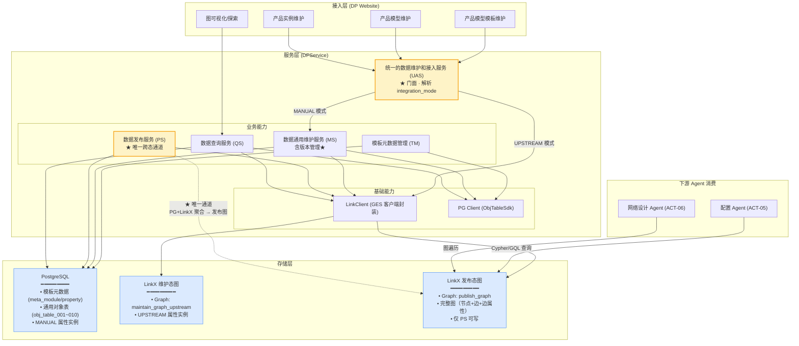
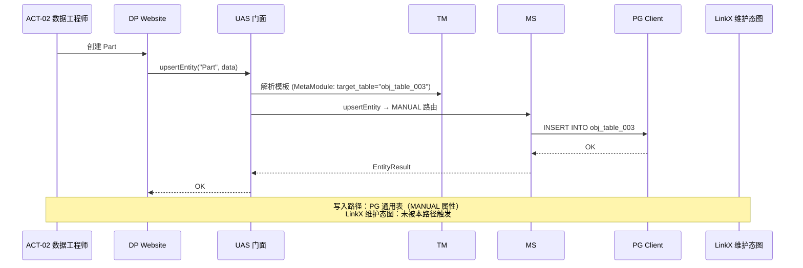
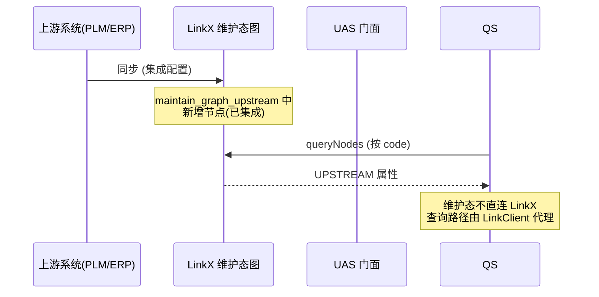
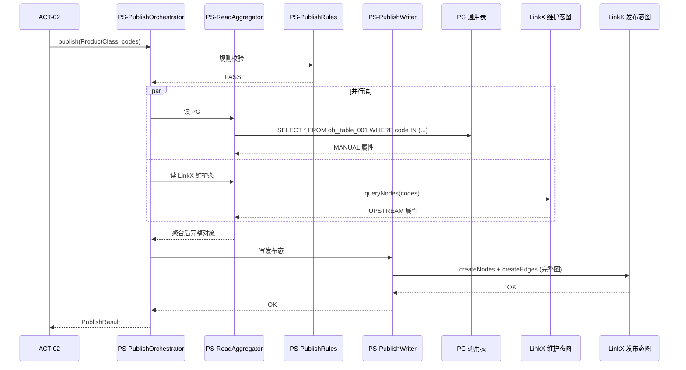
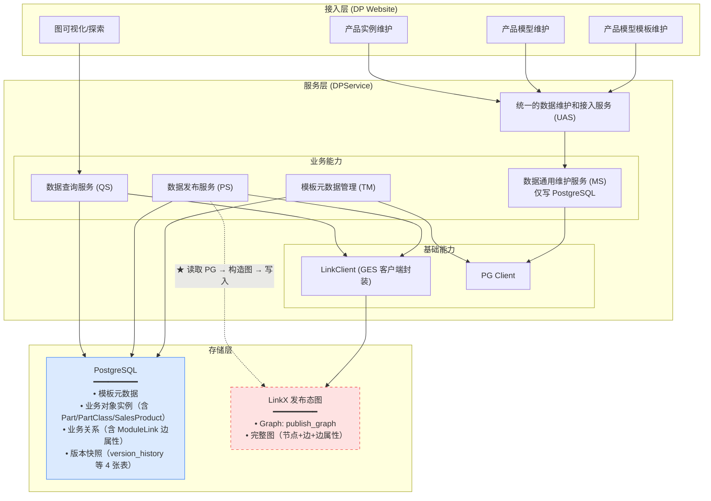
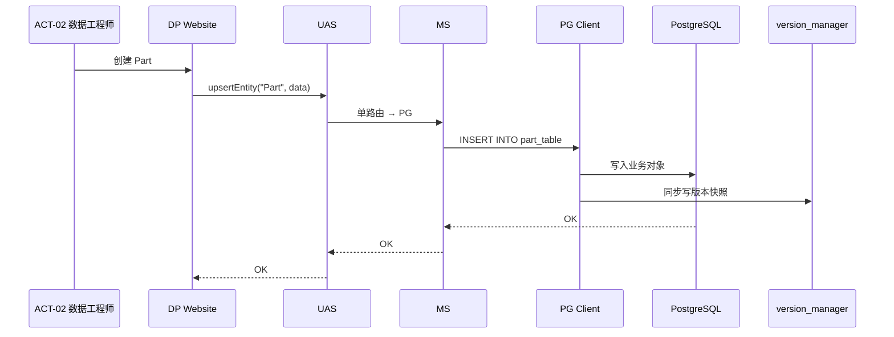
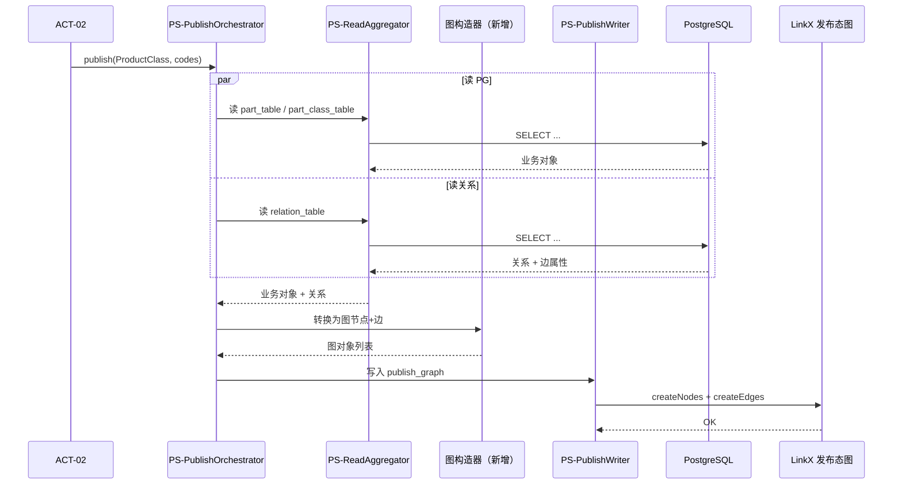

# ADR-001：维护态与发布态数据统一存储方案

| 属性 | 值 |
| --- | --- |
| **ADR ID** | ADR-001 |
| **标题** | 维护态与发布态数据统一存储方案 |
| **状态** | Accepted |
| **决策日期** | 2026-08-01 |
| **最后更新** | 2026-08-02 |
| **决策者** | 产品数据架构师（ACT-01）、IT 数据架构师（ACT-03） |
| **影响范围** | 数据存储层、服务层（DPService 全模块）、部署层、LinkX Client |
| **关联文档** | [RFC-003 数据通用维护服务 - 通用对象表映射机制](./RFC-003-数据通用维护服务-通用对象表映射机制.md)、[ADR-003 维护态与发布态数据隔离方案](./ADR-003-维护态与发布态数据隔离方案.md)、[ADR-002 CB+New 并行运行策略](./ADR-002-CB+New并行运行策略.md) |

---

## 1. 背景与问题

### 1.1 业务场景

数字产品系统中，数据存在两种状态，承担不同角色：

| 状态 | 含义 | 典型操作方 | 典型用例 |
| --- | --- | --- | --- |
| **维护态** | 数据正在编辑、校验、治理中，尚未对外发布 | 产品数据架构师（ACT-01）、产品数据工程师（ACT-02）、IT 数据架构师（ACT-03） | UC-A1~A6（创建/导入/校验）、UC-A7~A8（模板定义）、UC-D1（维护态图可视化） |
| **发布态** | 数据已通过校验，正式发布，可供下游 Agent 消费 | 配置 Agent（ACT-05）、网络设计 Agent（ACT-06） | UC-B1a~B1f（发布数据包）、UC-B2（发布态查询）、UC-C1~C4（多跳查询、BOM 遍历、规格匹配） |

### 1.2 核心矛盾

[第二章 C4 关键澄清](./数字产品系统架构设计说明书.md) 明确：**维护态与发布态物理分离是基础前提**，两态数据"两个独立存储，维护态允许草稿，发布态只接收完整数据包"。

但维护态本身在数据来源上又存在两类截然不同的形态：

- **场景一：本地手工维护**（数据缺失 / 数据质量差，[§1.3 P0](./数字产品系统架构设计说明书.md)）—— 需要 CRUD、版本快照、规则校验，对写入吞吐和事务一致性要求高
- **场景二：上游汇聚**（PLM/ERP/SCM/MES/CRM 自动同步，[§1.3 P1](./数字产品系统架构设计说明书.md)）—— LinkX 已汇聚好，数据"随取随用"，需要避免重复落库
- **场景三：CB+New 迁移**（存量产品数据迁移，[ADR-002](./ADR-002-CB+New并行运行策略.md)）—— 兼容老系统维护方式，需考虑双写与一致性

### 1.3 问题陈述

**维护态和发布态数据应该采用何种存储方案？** 具体细化为三个子问题：

1. **发布态存储**：维护态与发布态是否落入同一图数据库？还是发布态单独存？
2. **维护态存储**：维护态是统一入图，还是落关系型数据库，还是两者混合？
3. **跨态通道**：两态之间数据如何流动？（写入单向、查询隔离、版本对齐）

### 1.4 候选方案

| 方案 | 描述 | 关键特征 |
| --- | --- | --- |
| **方案 A：统一入图** | 维护态和发布态数据都存入 GES 图数据库（LinkX） | 单存储介质；维护态与发布态共用一套图查询接口；用 `_maintenance_state` 属性 + 物理 Graph 区分两态 |
| **方案 B：分离存储** | 维护态用关系型数据库（PostgreSQL），发布态入 GES 图数据库 | 双存储介质；维护态走 PG（事务强、写入快），发布态走 LinkX（图查询强） |

> **注**：方案 A 在演进过程中分化为两个子方案：
> - **A1（纯图）**：维护态全部入 LinkX 一个 Graph
> - **A2（图+关系型混合）**：维护态按 `integration_mode` 路由，MANUAL 属性落 PG 通用表、UPSTREAM 属性落 LinkX 维护态图（详见 [RFC-003 §4 OPEN-Q1 用户决策](./RFC-003-数据通用维护服务-通用对象表映射机制.md)）
>
> **最终采纳方案 A2**（[RFC-003 v0.4 2026-08-02](./RFC-003-数据通用维护服务-通用对象表映射机制.md) 用户决策 OPEN-Q1）。下文"方案 A"均指 A2。

---

## 2. 决策

**采纳方案 A：统一入图（A2 子方案——PG + LinkX 混合）**

具体落地为：

| 存储层 | 内容 | 状态 |
| --- | --- | --- |
| **PostgreSQL** | 模板元数据（`meta_module` / `meta_property` / `meta_relation` / `meta_catalog_node`）<br>+ 通用对象表（`obj_table_001~010`） | 维护态（MANUAL 属性） |
| **LinkX 维护态图** | `maintain_graph_upstream`（单一 Graph）<br>存储 `integration_mode=UPSTREAM` 的属性实例数据 | 维护态（UPSTREAM 属性） |
| **LinkX 发布态图** | `publish_graph`（单一 Graph）<br>存储聚合后的完整产品图（节点+边+边属性） | 发布态 |

**关键原则**：
1. 维护态**不分两套存储**：PG + LinkX 共同构成"维护态"，对外表现为单一逻辑存储（由 UAS 门面屏蔽差异）
2. 发布态**独立图**：`publish_graph` 仅由数据发布服务（PS）作为唯一写入通道写入
3. 跨态查询**禁止直接执行**：必须通过应用层编排（[ADR-003 §6 边界规则](./ADR-003-维护态与发布态数据隔离方案.md)）
4. 维护态**不支持图查询**（Cypher），仅支持可视化聚合（后台同时查 PG + LinkX）；发布态支持完整图查询（OPEN-Q7）

---

## 3. 详细实现方式

### 3.1 方案 A：统一入图（最终采纳）

#### 3.1.1 总体架构图



**图例**：
- 🟡 `UAS`、`PS` 为关键网关（决定数据落点 / 跨态通道）
- 🔵 存储层三类介质共同构成"统一入图"方案

#### 3.1.2 改动点详解

| 改动点 | 位置 | 改动内容 | 触发章节 |
| --- | --- | --- | --- |
| **① UAS 门面新增** | DPService.uasservice | 新增 `IntegrationModeRouter`，解析 `MetaModule.integration_mode` / `MetaProperty.integration_mode` 自动路由到 MANUAL 或 UPSTREAM 通道 | [§3.2.2](./数字产品系统架构设计说明书.md) |
| **② 模板元数据扩展字段** | `meta_module` | 新增 `target_table` / `target_table_key_column` / `biz_key_strategy` 字段 | [§3.2.3 §4.2.4](./数字产品系统架构设计说明书.md) |
| **③ 模板元数据扩展字段** | `meta_property` | 新增 `attr_column` / `attr_required` / `attr_indexed` 字段 | [§3.2.3 §4.2.4](./数字产品系统架构设计说明书.md) |
| **④ 通用对象表预建** | `obj_table_001~010` | 预建 10 张通用对象表（每张 20 列 + JSONB + `_maintenance_state`） | [§3.3.2 RFC-003 §5.2](./数字产品系统架构设计说明书.md) |
| **⑤ LinkClient 拆分 Graph 上下文** | `LinkClient` | 内部按 Graph 名路由：`maintain_graph_upstream` vs `publish_graph`；按角色控制写权限（仅 PS 可写 `publish_graph`） | [§3.3.1 ADR-003 §6](./数字产品系统架构设计说明书.md) |
| **⑥ MS 分发器** | `MS.HybridStorageDispatcher` | 按 `integration_mode` 将属性分别写入 PG（MANUAL）或 LinkX 维护态图（UPSTREAM） | [§3.2.4 §6.2.1](./数字产品系统架构设计说明书.md) |
| **⑦ PS 编排器** | `PS-PublishOrchestrator` | 唯一跨态写入通道：`ReadAggregator` 并行读 PG + LinkX → `PublishRules` 校验 → `PublishWriter` 写入 `publish_graph` | [ADR-003 §5](./ADR-003-维护态与发布态数据隔离方案.md) |
| **⑧ 可视化聚合服务** | `QS.VisualizationAggregationService` | 同时查 PG + LinkX（维护态），内存聚合后返回图结构；不暴露 Cypher 接口 | [§3.2.6 OPEN-Q7](./数字产品系统架构设计说明书.md) |
| **⑨ 元数据同步** | `TM.SchemaSyncService` | 模板元数据变更时同步更新 LinkX Schema（Label/EdgeType） | [§3.2.3](./数字产品系统架构设计说明书.md) |
| **⑩ 部署拓扑** | K8s 部署清单 | `digitalproduct-app` 一体化部署 + PostgreSQL（RDS）+ 托管 LinkX（双 Graph） | [§7.2](./数字产品系统架构设计说明书.md) |

#### 3.1.3 关键数据流

**数据流 1：本地维护（MANUAL 路径，UC-A3 创建 Part）**



**数据流 2：上游汇聚（UPSTREAM 路径，UC-A1 ROUTER_PLATFORM）**



**数据流 3：发布（UC-B1a 发布产品类）**



---

### 3.2 方案 B：分离存储（PG 落维护态）

#### 3.2.1 总体架构图



**与方案 A 的核心区别**：
- ❌ **没有 LinkX 维护态图**：`maintain_graph_upstream` 不存在
- ✅ **PG 承担所有维护态**：包括元数据 + 业务对象实例 + 关系 + 边属性 + 版本快照
- ✅ **LinkX 仅存发布态**：发布态图作为下游唯一图查询入口
- ⚠️ **新增 4 张版本表**：`version_manager` / `version_history` / `version_tag` / `rollback_record`

#### 3.2.2 改动点详解

| 改动点 | 位置 | 改动内容 | 与方案 A 的差异 |
| --- | --- | --- | --- |
| **① PG 表新增 4 张** | `version_manager` 等 | `version_manager`（版本主表）、`version_history`（行级快照）、`version_tag`（语义标签）、`rollback_record`（回滚审计） | 方案 A 无独立版本表（融入通用对象表） |
| **② 业务对象表拆分** | PG 新增多张表 | `part_table` / `part_class_table` / `sales_product_table` / `business_object_table` 等，每类业务对象独立表 | 方案 A 用 `obj_table_001~N` 通用对象表承载 |
| **③ 关系表** | PG 新增 `relation_table` | 存储 ModuleLink、ModuleObjectRelation 等关系及边属性 | 方案 A 关系由 LinkX 维护态图表达 |
| **④ LinkClient 移除维护态图** | `LinkClient` | 删除 `maintain_graph_upstream` 相关 API；仅保留 `publish_graph` 一个 Graph | 方案 A 维护态图存在并承担 UPSTREAM 属性 |
| **⑤ PS 增加图构造逻辑** | `PS-PublishOrchestrator` | 新增"PG 关系 → 图边"的转换层（含 ModuleLink 边属性的图序列化） | 方案 A 仅需做"PG 行 + LinkX 节点"的合并 |
| **⑥ MS 仅写 PG** | `MS` | 移除 `HybridStorageDispatcher`；所有维护态数据 100% 走 PG | 方案 A MS 需按 `integration_mode` 双写 |
| **⑦ 可视化** | `QS` | 图可视化完全依赖 PG 关联查询 + 应用层组装；不再有"后台同时查 PG + LinkX"的复杂逻辑 | 方案 A 需要后台聚合 |
| **⑧ 边属性序列化** | `PS / QS` | 边属性（cardinality / specOverrides 等）需在 PG 中以 JSON 存储并在发布时还原为图边 | 方案 A 边属性直接由 LinkX 维护态图承载 |

#### 3.2.3 关键数据流

**数据流 1：本地维护（UC-A3 创建 Part）**



**数据流 2：发布**



#### 3.2.4 与方案 A 的关键架构差异

| 维度 | 方案 A（统一入图，A2） | 方案 B（分离存储） |
| --- | --- | --- |
| 维护态存储介质 | PostgreSQL + LinkX（混合） | PostgreSQL（单一） |
| 维护态图（maintain_graph） | ✅ 存在（UPSTREAM 属性） | ❌ 不存在 |
| 发布态存储介质 | LinkX（独立 Graph） | LinkX（独立 Graph） |
| 业务对象表 | 通用对象表 `obj_table_001~010` | 每类业务对象独立表 |
| 版本快照 | `id=UUID + code` 双键，无独立表 | `version_manager` 等 4 张表 |
| 关系存储 | LinkX 边（含边属性） | PG `relation_table`（含边属性 JSON） |
| 图构造复杂度 | 低（PG 行 + LinkX 节点合并） | 中（PG 多表 JOIN + JSON 序列化） |
| 上游汇聚（UPSTREAM） | 直接落 LinkX 维护态图，不重复落 PG | 需要全部同步到 PG，丢弃 LinkX 已汇聚数据 |

---

## 4. 方案优缺点对比

### 4.1 综合对比表

| 评估维度 | 方案 A：统一入图（A2）⭐ | 方案 B：分离存储 |
| --- | --- | --- |
| **工作量** | ⭐⭐⭐⭐（较小） | ⭐⭐（较大） |
| **性能** | ⭐⭐⭐⭐⭐（最优） | ⭐⭐⭐（中等） |
| **复杂度** | ⭐⭐⭐⭐（中等偏低） | ⭐⭐⭐⭐（中等偏高） |
| **可维护性** | ⭐⭐⭐⭐⭐（最优） | ⭐⭐⭐（中等） |
| **综合** | ⭐⭐⭐⭐⭐ | ⭐⭐⭐ |

### 4.2 详细对比

#### 4.2.1 工作量

| 维度 | 方案 A | 方案 B | 评估 |
| --- | --- | --- | --- |
| **新增 PG 表** | 0 张通用表 + 4 张模板表（已有）扩展字段 | 4 张版本表 + N 张业务对象表 + 1 张关系表（粗估 8~10 张） | A 优 |
| **新增 LinkX Graph** | 2 个（maintain + publish） | 1 个（仅 publish） | B 略优 |
| **代码改动量** | LinkClient 拆分 Graph 上下文；MS 增加分发器；PS 增加聚合器；QS 增加可视化聚合 | 移除 LinkX 维护态图相关代码；PS 增加图构造器；PG 多表 DAO 全部新建 | A 优 |
| **集成上游改造** | 0（LinkX 已有能力复用） | 需重新实现上游 → PG 的全量同步 | A 显著优 |
| **预估工作量** | 约 **15~20 人天** | 约 **35~45 人天** | A 节省约 50% |

#### 4.2.2 性能

| 维度 | 方案 A | 方案 B | 评估 |
| --- | --- | --- | --- |
| **维护态写入吞吐** | MANUAL 走 PG（≥1000 条/秒达成）；UPSTREAM 直写 LinkX（异步） | 全部走 PG（含业务对象表、关系表、版本表、事务）≥1000 条/秒但需更多事务 | A 略优 |
| **维护态查询（单实体）** | PG 单表查询（毫秒级） | PG 单表查询（毫秒级） | 持平 |
| **维护态查询（图可视化）** | 后台聚合 PG + LinkX（10ms~100ms） | PG 关联查询 + 应用层组装（50ms~200ms） | A 优 |
| **发布态图查询（3 跳）** | LinkX Cypher/GQL P99 ≤ 200ms（GOAL-03 达成） | LinkX Cypher/GQL P99 ≤ 200ms（GOAL-03 达成） | 持平 |
| **跨态数据一致性延迟** | 秒级（PS 编排同步） | 秒级（PS 编排同步） | 持平 |
| **维护态写一致性** | UPSTREAM 走 LinkX（弱事务），MANUAL 走 PG（强事务），混合事务复杂 | 全部 PG（强事务一致） | B 略优 |

#### 4.2.3 复杂度

| 维度 | 方案 A | 方案 B | 评估 |
| --- | --- | --- | --- |
| **架构组件数** | 6 个 L1（UAS/TM/MS/PS/QS/LinkClient）+ 2 个 Graph | 6 个 L1 + 1 个 Graph + 多张业务表 | A 略优 |
| **存储介质数** | 2（PG + LinkX） | 2（PG + LinkX） | 持平 |
| **代码复杂度热点** | MS.HybridStorageDispatcher（按模式分发）；QS.VisualizationAggregationService（双源聚合） | PS.图构造器（PG 关系 → 图边序列化）；PG DAO 层（多表管理） | A 略优 |
| **事务复杂度** | 跨介质事务（PG + LinkX）需应用层补偿；单介质事务简单 | 单一 PG 事务，事务边界清晰 | B 略优 |
| **学习/认知成本** | 中等（需理解双介质路由规则） | 中等偏高（需理解 PG 关系模型到图模型的映射） | A 略优 |
| **运维复杂度** | 需运维两套存储；GES 专人已有（[§1.4 §理由 5](./数字产品系统架构设计说明书.md)） | 需运维两套存储；新增业务表运维成本 | A 略优 |

#### 4.2.4 可维护性

| 维度 | 方案 A | 方案 B | 评估 |
| --- | --- | --- | --- |
| **业务对象扩展** | 新增 MetaModule + 元数据即可，无需新建表 | 新建业务对象表 + DAO + 迁移脚本 | A 显著优（GOAL-01 满足） |
| **Schema 演进** | 模板元数据 + 自动建图；新增属性只需元数据登记 | ALTER TABLE + 应用层 DDL 同步 | A 显著优 |
| **图可视化** | 维护态 + 发布态图均可在 LinkX 中可视化 | 维护态需 PG 关联查询 + 应用层组装图 | A 优 |
| **CB+New 并行适配** | 通用对象表天然兼容多种 maintenance_mode | 需为每种 maintenance_mode 写不同的表 DAO | A 优（ADR-002 满足） |
| **历史版本回溯** | `id=UUID + code` 双键，保留物理行快照 | `version_history` 表行快照 | 持平 |
| **故障定位** | 双介质问题需排查两层 | 单一 PG 链路清晰 | B 略优 |
| **数据一致性追踪** | 通过 `_maintenance_state` 单字段即可区分态 | 通过表分区 + 版本号管理 | 持平 |
| **数据迁移/归档** | 通用对象表方便批量归档 | 多业务表分别处理 | A 优 |

### 4.3 关键业务场景支撑对比

下表针对架构说明书 [§1.3 三类核心业务场景](./数字产品系统架构设计说明书.md) 和第二章关键用例，对方案支撑度做对比：

| 业务场景 | 方案 A 支撑度 | 方案 B 支撑度 | 说明 |
| --- | --- | --- | --- |
| **场景一：上游已存在数据** | ⭐⭐⭐⭐⭐ 直接复用 LinkX 已汇聚数据 | ⭐⭐⭐ 需重新同步到 PG | A 优 |
| **场景二：数据缺失需本地维护** | ⭐⭐⭐⭐⭐ PG 通用表 + LinkX 互不干扰 | ⭐⭐⭐⭐ 全部落 PG，简单清晰 | A 略优 |
| **场景三：数据质量差需治理** | ⭐⭐⭐⭐⭐ 图可视化直观，治理体验好 | ⭐⭐⭐ PG 表单易编辑但缺乏图视角 | A 优 |
| **CB+New 迁移（ADR-002）** | ⭐⭐⭐⭐⭐ 通用对象表兼容多种维护方式 | ⭐⭐⭐ 需为 CB+New 专门建表 | A 优 |
| **GOAL-01 语义模型快速构建（≤ 1 人天）** | ⭐⭐⭐⭐⭐ 元数据驱动，零 DDL | ⭐⭐ 需 DDL + 迁移 | A 显著优 |
| **GOAL-03 图查询 P99 ≤ 200ms** | ⭐⭐⭐⭐⭐ 发布态 LinkX 完整图 | ⭐⭐⭐⭐⭐ 发布态 LinkX 完整图 | 持平 |
| **GOAL-04 数据一致性 100%** | ⭐⭐⭐⭐⭐ PS 编排原子化发布 | ⭐⭐⭐⭐ PS 编排原子化发布 | 持平 |
| **GOAL-07 业务规则覆盖率 ≥ 80%** | ⭐⭐⭐⭐⭐ 规则校验 + 强阻塞 | ⭐⭐⭐⭐⭐ 规则校验 + 强阻塞 | 持平 |
| **UC-A1~A4 维护态 CRUD** | ⭐⭐⭐⭐⭐ 通用对象表 + LinkX 双源 | ⭐⭐⭐⭐ PG 单一源 | 持平 |
| **UC-A5 Excel 批量导入（≥1000 条/秒）** | ⭐⭐⭐⭐⭐ PG 批量 + LinkX 批量异步 | ⭐⭐⭐⭐ PG 批量 + 事务开销大 | A 略优 |
| **UC-B1a~B1f 发布数据包** | ⭐⭐⭐⭐⭐ 通用图构造逻辑 | ⭐⭐⭐ 需为不同业务类型构造不同图结构 | A 优 |
| **UC-B2 发布态查询 / UC-C1~C4 Agent 多跳查询** | ⭐⭐⭐⭐⭐ LinkX 完整图 | ⭐⭐⭐⭐⭐ LinkX 完整图 | 持平 |
| **UC-D1 维护态图可视化** | ⭐⭐⭐⭐⭐ 双源聚合呈现完整图 | ⭐⭐⭐ PG 表单视图为主，无图视角 | A 优 |

### 4.4 关键风险对比

| 风险 | 方案 A 风险等级 | 方案 B 风险等级 | 说明 |
| --- | --- | --- | --- |
| **GES 写入性能瓶颈** | 🟡 中（OPEN-05 待验证） | 🟢 低（无 GES 写入路径） | B 优 |
| **跨介质事务一致性** | 🟡 中（应用层补偿） | 🟢 低（PG 单事务） | B 略优 |
| **Schema 演进锁库** | 🟢 低（元数据驱动） | 🔴 高（DDL 锁表） | A 优 |
| **图可视化体验差** | 🟢 低（双源聚合） | 🟡 中（PG 关联查询） | A 优 |
| **业务对象新增成本** | 🟢 低 | 🟡 中（DDL + 迁移） | A 优 |
| **存量数据迁移** | 🟢 低（通用对象表批量导入） | 🟡 中（按业务类型分别迁移） | A 略优 |
| **运维复杂度** | 🟢 低（GES 专人已有） | 🟡 中（多业务表 + 索引维护） | A 略优 |

---

## 5. 决策理由（综合）

### 5.1 决策原则

[§1.10 对抗评审结论](./数字产品系统架构设计说明书.md) 明确：用户决策"等业务场景明确后，再结合场景对严重问题深入分析"。结合本章 §4 对比，最终采纳方案 A 的核心理由：

### 5.2 采纳方案 A 的 6 大理由

| # | 理由 | 关联事实 |
| --- | --- | --- |
| 1 | **业务对象快速扩展（GOAL-01）**：数字产品系统核心定位是"语义模型快速构建"，方案 A 通过元数据驱动实现零 DDL，新增业务对象 ≤ 1 人天；方案 B 需 ALTER TABLE，无法满足 | [§1.1 §1.6 GOAL-01](./数字产品系统架构设计说明书.md) |
| 2 | **上游数据复用（场景一）**：LinkX 已汇聚 PLM/ERP 等上游数据，方案 A 直接复用 `maintain_graph_upstream`，避免数据重复落库；方案 B 需重新同步到 PG，浪费存储和同步成本 | [§1.3 §3.1 场景一](./数字产品系统架构设计说明书.md) |
| 3 | **图可视化体验最佳（UC-D1/D2）**：方案 A 在维护态即可通过后台聚合呈现完整图视角，符合"在图上建模"的设计哲学；方案 B 维护态退化为表格式编辑 | [UC-D1](./数字产品系统架构设计说明书.md) |
| 4 | **工作量节省 50%+**：方案 A 无需新增 4 张版本表、N 张业务对象表、关系表，且 LinkClient 改动局限于 Graph 上下文拆分；方案 B 需重建 PG 侧完整数据模型 | §4.2.1 |
| 5 | **运维统一**：GES 团队已有专人维护（[§1.4 理由 5](./数字产品系统架构设计说明书.md)），方案 A 复用现有能力；方案 B 需新增 PG 侧复杂业务对象运维能力 | [§1.4](./数字产品系统架构设计说明书.md) |
| 6 | **CB+New 迁移最优（ADR-002）**：v1.0 期间 CB+New 与数字产品并行运行，方案 A 通用对象表天然兼容多种 maintenance_mode；方案 B 需为每种维护方式单独建表 | [ADR-002 §1](./ADR-002-CB+New并行运行策略.md) |

### 5.3 不采纳方案 B 的原因

| # | 原因 | 影响 |
| --- | --- | --- |
| 1 | **上游数据重复落库**：LinkX 已汇聚的数据需再同步到 PG，存储翻倍 + 同步开销翻倍 | 浪费资源 |
| 2 | **业务对象新增受 DDL 束缚**：每次新增需 ALTER TABLE + 应用层 + 迁移脚本，违反 GOAL-01 "≤ 1 人天"目标 | GOAL-01 失守 |
| 3 | **图视角丧失**：维护态退化为表编辑，无法满足 UC-D1"在图上建模"的核心体验 | UX 降级 |
| 4 | **图构造层复杂化**：PS 需把 PG 关系表 + 边属性 JSON 反序列化为图边，增加出错面 | PS 复杂度↑ |
| 5 | **运维负担加重**：多张业务对象表 + 索引 + 版本表，PG 侧运维成本显著上升 | 运维成本↑ |

---

## 6. 后果

### 6.1 正面后果

- ✅ **架构简洁性**：维护态由 PG（MANUAL）+ LinkX（UPSTREAM）共同构成，对外通过 UAS 门面屏蔽；下游 Agent 仅依赖 LinkX 发布态图
- ✅ **业务对象扩展零 DDL**：新增 MetaModule + 元数据即可，符合 GOAL-01
- ✅ **图可视化体验最佳**：维护态可视化通过后台聚合实现，无需在 PG 侧重建图模型
- ✅ **数据溯源完整**：维护态 → 发布态的转换通过 PS 编排，每步可审计；维护态内 `id=UUID + code` 实现行级历史
- ✅ **CB+New 兼容**：通用对象表天然支持多种 maintenance_mode，符合 ADR-002 并行运行策略
- ✅ **运维统一**：复用 GES 运维团队，PG 侧仅需管理元数据 + 通用对象表

### 6.2 负面后果与风险

| 风险 | 严重度 | 应对措施 | 负责人 | 跟进文档 |
| --- | --- | --- | --- | --- |
| **GES 写入性能待验证** | 🔴 严重（OPEN-05） | 上线前完成基准测试；如不达标，回退到方案 B（PG 全量） | 数据架构师 | 第四章数据模型跟进 |
| **跨介质事务一致性弱** | 🟡 中等 | 应用层实现幂等 + 补偿；PS 编排阶段保证一致性 | 后端架构师 | [§3.5.2 OPEN-28](./数字产品系统架构设计说明书.md) |
| **维护态图查询不支持 Cypher** | 🟡 中等 | 可视化通过后台聚合；UC-C 系列多跳查询全部走发布态 | 数据架构师 | 已决策 OPEN-Q7 |
| **混合存储对运维要求高** | 🟡 中等 | 制定运维手册 + 监控告警（PG + LinkX 双指标） | 运维团队 | [§7.3 §7.4](./数字产品系统架构设计说明书.md) |
| **理论支撑尚不充分** | 🟢 已缓解 | 通过 RFC-003 v0.4 完善了混合存储的判定规则 | 数据架构师 | [RFC-003 §4](./RFC-003-数据通用维护服务-通用对象表映射机制.md) |

### 6.3 待验证项（OPEN）

- [ ] **OPEN-05**：GES 写入性能基准测试（≥1000 条/秒达成验证）
- [ ] **OPEN-04**：维护态统一入图（混合存储）的理论支撑与数据论证（[RFC-003 v0.4](./RFC-003-数据通用维护服务-通用对象表映射机制.md) 已部分回答）
- [ ] **OPEN-14**：维护态图与发布态图的数据同步机制（由 PS-PublishOrchestrator 保证，[ADR-003 §5](./ADR-003-维护态与发布态数据隔离方案.md) 已实现）
- [ ] **OPEN-26**：LinkX Client 是否需要连接池（影响高并发性能）
- [ ] **OPEN-28**：是否需要分布式事务（影响跨服务操作一致性）

---

## 7. 演进路径

如未来 GES 写入性能不达标（OPEN-05 验证失败），可按以下路径回退：

```
方案 A2 (当前)
    │
    │ [OPEN-05 不达标]
    ▼
方案 B (回退)
    │
    │ 维护态全部落 PG
    │ 上游数据需重新同步
    │ PS 增加图构造器
    ▼
最终方案 B
```

**回退成本预估**：约 **25~30 人天**（需重建 PG 业务对象表 + 关系表 + 版本表 + 上游同步链路）。

---

## 8. 关联决策

| 文档 | 关系 |
| --- | --- |
| [ADR-002：CB+New 并行运行策略](./ADR-002-CB+New并行运行策略.md) | 方案 A 的 maintenance_mode 兼容性由 ADR-002 约束 |
| [ADR-003：维护态与发布态数据隔离方案](./ADR-003-维护态与发布态数据隔离方案.md) | 方案 A 的跨态通道实现细节由 ADR-003 定义 |
| [RFC-003：数据通用维护服务 - 通用对象表映射机制](./RFC-003-数据通用维护服务-通用对象表映射机制.md) | 方案 A 的维护态混合存储映射规则由 RFC-003 定义 |

---

## 9. 修订记录

| 版本 | 日期 | 修订内容 |
| --- | --- | --- |
| 1.0 | 2026-08-01 | 初始版本（仅对比方案 A / B，未细化） |
| 1.1 | 2026-08-02 | **细化版本**：① 区分方案 A1 / A2（RFC-003 v0.4 决策后）；② 新增详细实现方式（架构图、改动点、关键数据流）；③ 新增方案 B 详细实现方式；④ 新增 4 维度对比（工作量/性能/复杂度/可维护性）；⑤ 新增关键业务场景支撑对比；⑥ 新增关键风险对比；⑦ 新增演进路径；⑧ 反映 OPEN-Q1 / Q6 / Q7 用户决策 |

