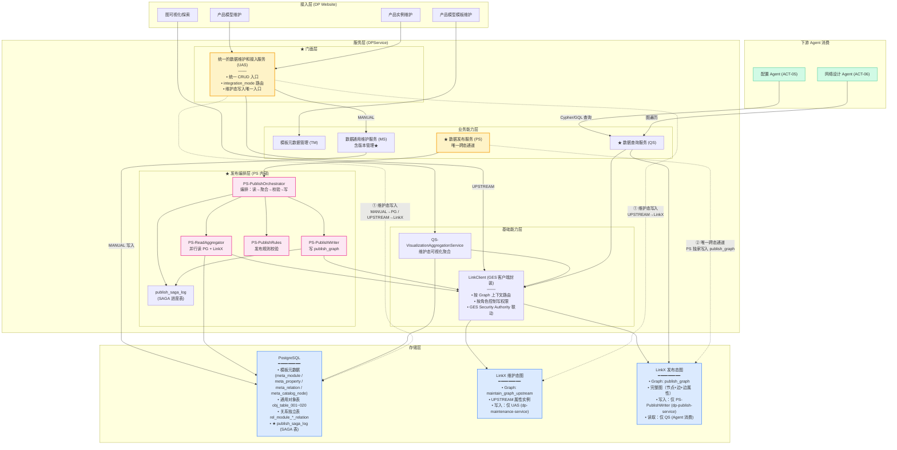
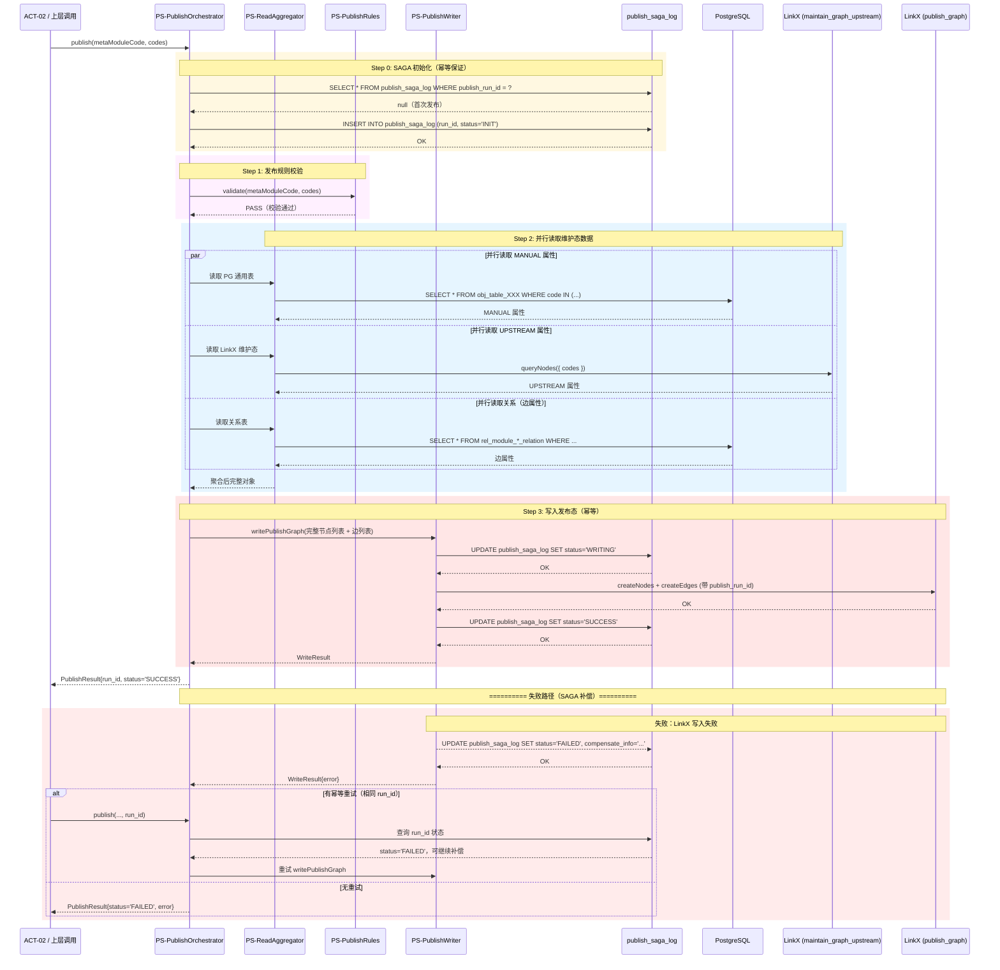

# ADR-003：维护态与发布态数据隔离方案

| 属性 | 值 |
| --- | --- |
| **ADR ID** | ADR-003 |
| **标题** | 维护态与发布态数据隔离方案 |
| **状态** | Accepted |
| **创建日期** | 2026-08-02 |
| **最后更新** | 2026-08-02 |
| **决策者** | 产品数据架构师（ACT-01）、IT 数据架构师（ACT-03） |
| **影响范围** | 数据存储层、服务层（DPService 全模块）、LinkX Client、数据发布服务（PS） |
| **关联文档** | [ADR-001 维护态与发布态数据统一存储方案](./ADR-001-维护态与发布态数据统一存储方案.md)、[ADR-002 CB+New 并行运行策略](./ADR-002-CB+New并行运行策略.md)、[ADR-004 发布原子性与跨介质事务方案](./ADR-004-发布原子性与跨介质事务方案.md)、[RFC-003 数据通用维护服务 - 通用对象表映射机制](./RFC-003-数据通用维护服务-通用对象表映射机制.md) |

---

## 1. 背景与问题

### 1.1 业务场景

数字产品系统的两态数据（[架构说明书 §1.1 ~ §1.3](./数字产品系统架构设计说明书.md)）承担不同角色，隔离需求来自以下核心业务约束：

#### 维护态特征

| 特征 | 说明 | 关联用例 |
| --- | --- | --- |
| **数据未审核** | 维护态允许草稿、校验中、不完整状态 | UC-A1~A6（创建/导入/校验）、UC-A7~A8（模板定义） |
| **允许错误** | 数据编辑过程中可能存在校验失败、规则违规 | UC-A6（业务规则校验，强阻塞）、UC-B4（发布异常处理） |
| **图可视化编辑** | 需要"在图上建模"的沉浸式编辑体验 | UC-D1（维护态图可视化） |
| **版本快照** | 每次变更产生快照，支持回溯 | UC-B3（版本回滚） |

#### 发布态特征

| 特征 | 说明 | 关联用例 |
| --- | --- | --- |
| **数据已审核** | 必须通过校验，100% 符合 Schema | UC-B1a~B1b（发布数据包）、UC-B1c~B1f（关系边属性发布） |
| **仅读** | 供下游 Agent 消费，不允许维护操作 | UC-C1~C4（配置 Agent / 网络设计 Agent 多跳查询） |
| **高性能图查询** | P99 ≤ 200ms（3 跳以内，GOAL-03） | UC-B2（发布态查询）、UC-C1（标书规格匹配） |

### 1.2 核心矛盾

[架构说明书 §2.4 关键概念 C4](./数字产品系统架构设计说明书.md) 明确：**维护态与发布态物理分离是基础前提**，两态数据"两个独立存储，维护态允许草稿，发布态只接收完整数据包"。

但隔离不仅仅是"物理分开存储"，还涉及三个维度的隔离需求：

| 隔离维度 | 矛盾描述 | 不隔离的后果 |
| --- | --- | --- |
| **① 物理隔离** | 维护态与发布态是否共用同一存储介质？ | 维护态查询混入未发布数据，Agent 消费到草稿 |
| **② 写入隔离** | 谁有权向发布态写入？跨态写入是否被允许？ | 维护操作直接污染发布态，数据被意外覆盖 |
| **③ 读取隔离** | 维护态数据能否被 Agent 直接查询？发布态数据能否被维护操作修改？ | Agent 查询到不完整数据，维护操作覆盖已发布数据 |

### 1.3 问题陈述

**维护态和发布态数据应如何实现三维度隔离（物理 / 写入 / 读取）？**

---

## 2. 方案选型

### 2.1 物理隔离方案

> **问题**：维护态与发布态是否共用同一存储介质？

| 方案 | 描述 | 推荐度 | 说明 |
| --- | --- | --- | --- |
| **P-A：双实例** | 两套 LinkX 实例（维护态 + 发布态） | ⭐⭐ | 成本高；运维复杂；GES 无多实例支持 |
| **P-B：单实例双图** | 同一 LinkX 实例，两个 Graph（`maintain_graph_upstream` / `publish_graph`） | ⭐⭐⭐⭐ | 成本低；复用实例；需 LinkClient 按 Graph 上下文路由 |
| **P-C：属性隔离** | 同一 Graph，通过 `_maintenance_state` 属性区分（DRAFT / PUBLISH） | ⭐⭐⭐⭐⭐ | 最简；所有读写需附加态过滤条件 |

### 2.2 写入隔离方案

> **问题**：谁有权向发布态写入？维护态到发布态的数据流转如何控制？

| 方案 | 描述 | 推荐度 | 说明 |
| --- | --- | --- | --- |
| **W-A：无约束** | 任何模块可向任意 Graph 写入 | ⭐ | 无隔离；无法保证发布态数据完整性 |
| **W-B：服务角色校验** | LinkClient 按调用方服务 ID 校验写权限（MS 不可写 publish_graph） | ⭐⭐⭐ | 应用层校验；依赖 LinkClient 不被绕过 |
| **W-C：GES Security Authority** | GES 控制层按账号授权 Graph 写权限（dp-publish-service 专属） | ⭐⭐⭐⭐ | GES 主防线；强制隔离；配合 LinkClient 次防线 |
| **W-D：PS 唯一通道** | 跨态写入仅 PS（PublishOrchestrator）可执行，其他模块禁止 | ⭐⭐⭐⭐⭐ | 架构约束；配合 W-C 权限控制 |

### 2.3 读取隔离方案

> **问题**：Agent 能否查询维护态？维护操作能否读取发布态？

| 方案 | 描述 | 推荐度 | 说明 |
| --- | --- | --- | --- |
| **R-A：无约束** | 任何读取方无差别查询所有数据 | ⭐ | 隔离失效；Agent 可能消费到草稿 |
| **R-B：查询路径隔离** | 维护态仅 VAS 可读（可视化聚合）；发布态仅 QS 可读（图查询） | ⭐⭐⭐⭐ | 路径隔离；Agent 不感知维护态 |
| **R-C：态过滤查询** | 同一查询路径，通过 `_maintenance_state` 过滤态 | ⭐⭐⭐ | 简单但容易出错；需处处记得过滤 |

### 2.4 候选组合

| 组合 | 物理 | 写入 | 读取 | 推荐度 | 说明 |
| --- | --- | --- | --- | --- | --- |
| **组合 1** | P-B 双图 | W-D + W-C | R-B | ⭐⭐⭐⭐⭐ | **最终采纳** |
| **组合 2** | P-C 属性隔离 | W-D | R-C | ⭐⭐⭐ | 简单但查询条件复杂 |
| **组合 3** | P-A 双实例 | W-C | R-B | ⭐⭐ | 成本高；复用性低 |
| **组合 4** | P-B 双图 | W-B | R-B | ⭐⭐⭐⭐ | 缺少 GES 主防线 |
| **组合 5** | P-C 属性隔离 | W-B | R-A | ⭐⭐ | 无隔离；不推荐 |

---

## 3. 决策

**采纳：组合 1（P-B 双图 + W-D+W-C 写入隔离 + R-B 读取隔离）**

具体落地：

| 维度 | 决策 | 实现机制 |
| --- | --- | --- |
| **物理隔离** | LinkX 单实例 + 双 Graph | `maintain_graph_upstream`（维护态 UPSTREAM 属性）+ `publish_graph`（发布态完整图） |
| **写入隔离** | PS 唯一通道 + GES Security Authority 双层 | W-D：仅 PS 可写 `publish_graph`（架构约束）；W-C：GES Security Authority 配置（dp-publish-service 账号） |
| **读取隔离** | VAS / QS 分路径 | VAS：维护态可视化聚合；QS：发布态图查询；Agent 仅接 QS |

---

## 4. 详细实现方式

### 4.1 方案 B+C 总体架构图



**图例**：

- 🟡 **门面/网关**（UAS、PS）：关键控制点（数据落点路由 / 跨态唯一通道）
- 🩷 **发布编排**（PS 子模块）：发布全流程由 4 个子模块协作
- 🔵 **存储层**：三类介质共同构成两态隔离架构
- 🟢 **Agent 消费**：仅通过 QS 接入发布态图

### 4.2 改动点详解

| # | 改动点 | 位置 | 改动内容 | 影响模块 |
| --- | --- | --- | --- | --- |
| **①** | **UAS 新增路由分发器** | `uasservice / UAS.IntegrationModeRouter` | 解析 `MetaModule.integration_mode` → MANUAL → MS → PG；UPSTREAM → LinkClient → `maintain_graph_upstream` | UAS、MS、LC |
| **②** | **LinkClient 拆分 Graph 上下文** | `LinkClient` | 内部按 `graphName` 参数路由到 `maintain_graph_upstream` 或 `publish_graph` | LC |
| **③** | **LinkClient 角色权限拦截** | `LinkClient / GES Security Authority` | 按调用方服务 ID（UAS / PS）校验写权限；PS 可写 `publish_graph`，UAS 不可 | LC、ADR-004 |
| **④** | **MS 混合存储分发器** | `msservice / MS.HybridStorageDispatcher` | 按 `MetaProperty.integration_mode` 分发属性写入（MANUAL → PG / UPSTREAM → LC） | MS、PG Client、LC |
| **⑤** | **PS PublishOrchestrator 新增** | `psservice / PS-PublishOrchestrator` | 编排发布全流程：校验 → 并行读 PG+LinkX → 聚合 → 写 `publish_graph`；管理 SAGA 进度 | PS、RA、WR、RL |
| **⑥** | **PS ReadAggregator 新增** | `psservice / PS-ReadAggregator` | 并行读取 PG 通用表 + LinkX 维护态图数据，按 MetaModule 定义聚合为完整对象 | PS、PG Client、LC |
| **⑦** | **PS PublishWriter 改造** | `psservice / PS-PublishWriter` | 按 `publish_run_id` 幂等写入 `publish_graph`（节点 + 边）；失败触发补偿 | PS、LC、ADR-004 |
| **⑧** | **PS PublishRules 改造** | `psservice / PS-PublishRules` | 发布规则校验（过滤/转换/校验）；校验失败阻止发布 | PS |
| **⑨** | **QS VisualizationAggregationService 新增** | `qsservice / QS-VisualizationAggregationService` | 同时查询 PG + LinkX（维护态），内存聚合后返回图结构；不暴露 Cypher 接口 | QS、PG Client、LC |
| **⑩** | **GES Security Authority 配置** | GES 控制台 | 为 `maintain_graph_upstream` 配置 `dp-maintenance-service` 账号写权限；为 `publish_graph` 配置 `dp-publish-service` 账号写权限 | GES 运维 |
| **⑪** | **publish_saga_log 表新增** | PostgreSQL | 记录每次发布的 SAGA 步骤进度（`publish_run_id` / `step` / `status` / `compensate_info`）；支持幂等重试和补偿回滚 | PS、ADR-004 |

### 4.3 三维度隔离机制

#### 4.3.1 物理隔离（维护态 vs 发布态）

| 存储 | Graph/表 | 存储内容 | 状态 |
| --- | --- | --- | --- |
| **PG** | `obj_table_001~020` | MANUAL 属性实例数据（ProductClass / PartClass / Part 等） | 维护态 |
| **PG** | `rel_module_*_relation` | 关系独立表（含边属性，如 ModuleStructRelation 的 cardinality） | 维护态 |
| **PG** | `meta_module / meta_property / meta_relation / meta_catalog_node` | 模板元数据 | 维护态 |
| **PG** | `publish_saga_log` | 发布 SAGA 进度表 | 维护态 |
| **LinkX** | `maintain_graph_upstream` | UPSTREAM 属性实例数据（来自 PLM/ERP 等上游系统） | 维护态 |
| **LinkX** | `publish_graph` | 聚合后的完整图（节点 + 边 + 边属性）；由 PS 独家写入 | 发布态 |

#### 4.3.2 写入隔离（跨态唯一通道）

| 写入方 | 允许目标 | 禁止目标 | 权限来源 |
| --- | --- | --- | --- |
| **UAS（MANUAL 路径）** | `obj_table_001~020`（MANUAL 属性） | `publish_graph` | 应用层 + PG 事务 |
| **UAS（UPSTREAM 路径）** | `maintain_graph_upstream`（UPSTREAM 属性） | `publish_graph` | GES Security Authority（dp-maintenance-service） |
| **PS-PublishWriter** | `publish_graph`（完整图） | `maintain_graph_upstream`（禁止覆盖维护态） | GES Security Authority（dp-publish-service）+ LinkClient 拦截 |
| **QS / VAS** | 仅读（无写入） | — | 只读查询 |

**写入隔离边界规则**：

1. **维护态只写 PG 通用对象表**：MS 服务配置写目标为 `obj_table_001~020`（MANUAL 属性）
2. **UPSTREAM 属性写 LinkX 维护态图**：MS 服务按 `integration_mode=UPSTREAM` 路由到 LinkClient
3. **跨图写入仅 PS 允许**：LinkClient 内部按角色校验，`publish_graph` 仅 PS-PublishWriter 可写
4. **发布态图只读**：除 PS-PublishWriter 外，其他所有模块只能读取 `publish_graph`
5. **维护态图只写不读**：LinkClient 的 `maintain_graph_upstream` 对外暴露为"维护态写入专用"，可视化读取走 VAS 聚合层

#### 4.3.3 读取隔离（查询路径分离）

| 读取方 | 允许来源 | 禁止操作 | 说明 |
| --- | --- | --- | --- |
| **DP Website（图可视化 UC-D1）** | VAS（维护态聚合） | 直接查询 PG 或 LinkX | VAS 后台同时查 PG + LinkX，内存聚合 |
| **DP Website（发布态探索 UC-D2）** | QS（图查询） | 查询维护态图 | QS 仅查 `publish_graph` |
| **配置 Agent（UC-C1~C4）** | QS（图查询） | 查询维护态图 | 仅接入 `publish_graph`，不感知维护态 |
| **网络设计 Agent（UC-C4）** | QS（图查询） | 查询维护态图 | 同上 |
| **运营人员（UC-B4）** | PS（发布异常查询） | — | 查询发布 SAGA 状态 |

### 4.4 读写边界矩阵

| 调用方 → 目标 ↓ | `obj_table_001~N` | `rel_module_*_relation` | `maintain_graph_upstream` | `publish_graph` | `publish_saga_log` |
| --- | --- | --- | --- | --- | --- |
| **UAS（MANUAL）** | ✅ 读写 | — | ❌ | ❌ | ❌ |
| **UAS（UPSTREAM）** | ❌ | — | ✅ 写 | ❌ | ❌ |
| **MS** | ✅ 读写 | ✅ 读写 | ❌ | ❌ | ❌ |
| **PS-PublishOrchestrator** | ✅ 只读 | ✅ 只读 | ✅ 只读 | ❌（由 WR 写入） | ✅ 读写 |
| **PS-PublishWriter** | ❌ | ❌ | ❌ | ✅ 写 | ✅ 读写 |
| **QS** | ✅ 只读 | ✅ 只读 | ❌ | ✅ 只读 | ❌ |
| **VAS** | ✅ 只读 | ✅ 只读 | ✅ 只读 | ❌ | ❌ |
| **TM** | ✅ 读写 | ❌ | ❌ | ❌ | ❌ |

### 4.5 PS 子模块详解

数据发布服务（PS）内部划分为 4 个子模块（[架构说明书 §3.2.5](./数字产品系统架构设计说明书.md)）：

| 子模块 | 职责 | 关键设计 |
| --- | --- | --- |
| **PS-PublishOrchestrator** | 编排发布全流程（读取维护态 → 聚合 → 校验 → 写入发布态）；管理 SAGA 进度；幂等重试；补偿触发 | 编排引擎；SAGA 状态机 |
| **PS-ReadAggregator** | 并行读取 PG 通用表（MANUAL 属性）+ LinkX 维护态图（UPSTREAM 属性）+ 关系表（边属性），按 MetaModule 定义聚合为完整节点 | 双源并行读；内存聚合 |
| **PS-PublishWriter** | 将聚合后的完整节点 + 边（含边属性）写入 `publish_graph`；带 `publish_run_id` 属性；失败触发补偿 | 幂等写入；按 run_id 定位回滚 |
| **PS-PublishRules** | 发布规则的过滤 / 转换 / 校验；校验失败阻止发布（强阻塞） | 规则引擎；强阻塞策略 |

### 4.6 PS PublishOrchestrator 时序图



---

## 5. 方案优缺点对比

### 5.1 综合对比表

| 评估维度 | 方案 B+C（双图+双层隔离）⭐ | 方案 P-C+W-B+R-C（属性隔离+路径约束） | 方案 P-A（双实例） |
| --- | --- | --- | --- |
| **工作量** | ⭐⭐⭐⭐（适中） | ⭐⭐⭐⭐⭐（最小） | ⭐⭐（最大） |
| **物理隔离强度** | ⭐⭐⭐⭐⭐（Graph 物理隔离） | ⭐⭐（同一 Graph 靠条件过滤） | ⭐⭐⭐⭐⭐（实例物理隔离） |
| **写入隔离强度** | ⭐⭐⭐⭐⭐（GES SA 主防 + LC 次防） | ⭐⭐⭐（仅 LC 拦截） | ⭐⭐⭐⭐（实例隔离） |
| **读取隔离强度** | ⭐⭐⭐⭐⭐（路径分离） | ⭐⭐⭐（条件过滤） | ⭐⭐⭐⭐（路径分离） |
| **复杂度** | ⭐⭐⭐⭐（中） | ⭐⭐⭐⭐⭐（低） | ⭐⭐⭐（高） |
| **可维护性** | ⭐⭐⭐⭐（好） | ⭐⭐⭐⭐（好，但依赖查询条件） | ⭐⭐⭐（运维成本高） |
| **综合** | ⭐⭐⭐⭐⭐ | ⭐⭐⭐⭐ | ⭐⭐⭐ |

### 5.2 详细对比

#### 5.2.1 工作量

| 维度 | 方案 B+C | 方案 P-C+W-B+R-C | 方案 P-A（双实例） |
| --- | --- | --- | --- |
| **新增 GES Graph** | 2 个（`maintain_graph_upstream` + `publish_graph`） | 1 个（共享图） | 2 个（维护实例 + 发布实例） |
| **LinkClient 改造** | Graph 上下文路由 + 角色拦截（中等） | 移除 Graph 路由（简单） | 跨实例路由（复杂） |
| **PS 改造** | 新增 Orchestrator + ReadAggregator（中等） | 简化（无需双源聚合） | 简化（单实例写入） |
| **VAS 聚合层** | 需双源聚合（中等） | 简单（单源查询） | 简单（单实例查询） |
| **GES Security Authority** | 配置 2 个账号（简单） | 无需配置 | 配置 2 个实例账号（复杂） |
| **预估工作量** | 约 **25~35 人天** | 约 **10~15 人天** | 约 **40~50 人天** |

#### 5.2.2 物理隔离强度

| 维度 | 方案 B+C | 方案 P-C+W-B+R-C | 方案 P-A（双实例） |
| --- | --- | --- | --- |
| **隔离机制** | LinkX Graph 物理隔离 | `_maintenance_state` 属性过滤 | 完全独立的 LinkX 实例 |
| **维护态查询混入风险** | 无（Graph 名不同，无法混查） | 有（条件遗漏则混入） | 无（实例完全独立） |
| **图 Schema 差异** | 两 Graph 可独立演进 | 共享 Schema，演进需同步 | 可独立演进 |
| **评估** | **最强隔离** | 依赖代码纪律，风险较高 | 最强隔离，但成本最高 |

#### 5.2.3 写入隔离强度

| 维度 | 方案 B+C | 方案 P-C+W-B+R-C | 方案 P-A（双实例） |
| --- | --- | --- | --- |
| **隔离机制** | GES Security Authority（主防）+ LinkClient 拦截（次防） | LinkClient 路由拦截（单一防线） | 实例级权限（较强） |
| **被绕过风险** | 极低（GES 层强制） | 中等（应用层拦截可绕过） | 低（实例独立） |
| **权限回收** | GES 控制台操作 | 代码改动 | 账号禁用 |
| **评估** | **最强隔离** | 依赖代码纪律 | 较强隔离 |

#### 5.2.4 读取隔离强度

| 维度 | 方案 B+C | 方案 P-C+W-B+R-C | 方案 P-A（双实例） |
| --- | --- | --- | --- |
| **隔离机制** | VAS / QS 分路径，Agent 仅接 QS | 查询条件过滤 | 实例独立，路径自然隔离 |
| **Agent 误读风险** | 无（路径固定） | 有（条件遗漏则误读） | 无（实例独立） |
| **维护态图探索** | VAS 聚合后图结构 | 同一图中探索（需过滤条件） | 维护实例探索（无限制） |
| **评估** | **最强隔离** | 依赖代码纪律 | 较强隔离 |

#### 5.2.5 复杂度

| 维度 | 方案 B+C | 方案 P-C+W-B+R-C | 方案 P-A（双实例） |
| --- | --- | --- | --- |
| **架构组件数** | 2 Graph + 分路径 | 1 Graph + 条件过滤 | 2 实例 + 分路径 |
| **LinkClient 逻辑** | Graph 上下文路由 + 角色拦截（中等） | 条件过滤（简单） | 跨实例路由（复杂） |
| **PS 编排** | 双源并行读 + 聚合（中等） | 单源读取（简单） | 单源写入（简单） |
| **运维复杂度** | GES 1 实例 + PG 1 RDS（中等） | GES 1 实例 + PG 1 RDS（最低） | GES 2 实例 + PG 1 RDS（高） |
| **评估** | **中等** | **最低** | **最高** |

#### 5.2.6 可维护性

| 维度 | 方案 B+C | 方案 P-C+W-B+R-C | 方案 P-A（双实例） |
| --- | --- | --- | --- |
| **图演进灵活性** | 两 Graph 可独立演进 Schema | 共享 Schema，演进需同步测试 | 两实例可独立演进 |
| **故障定位** | Graph 名不同，隔离清晰 | 依赖过滤条件，定位复杂 | 实例独立，隔离清晰 |
| **容量规划** | 两 Graph 分别估算 | 统一估算 | 两实例分别估算 |
| **监控告警** | 按 Graph 分别监控 | 统一监控 | 按实例分别监控 |
| **评估** | **较好** | **好（但风险高）** | **较好（但成本高）** |

### 5.3 关键风险对比

| 风险 | 方案 B+C 风险 | 方案 P-C+W-B+R-C 风险 | 方案 P-A（双实例）风险 |
| --- | --- | --- | --- |
| **维护态数据被 Agent 误消费** | 🟢 低（路径隔离） | 🟡 中（条件可能遗漏） | 🟢 低（实例隔离） |
| **发布态被维护操作污染** | 🟢 低（GES SA 强制） | 🟡 中（LC 拦截可绕过） | 🟢 低（实例隔离） |
| **跨态查询不一致** | 🟢 低（VAS/QS 分路径） | 🟡 中（条件可能遗漏） | 🟢 低（实例隔离） |
| **GES 运维成本** | 🟡 中（需配置 Security Authority） | 🟢 低（无需额外配置） | 🔴 高（2 实例运维） |
| **查询性能** | 🟢 好（各 Graph 独立优化） | 🟢 好（单 Graph 无跨 Graph 开销） | 🟡 中（跨实例查询需网络） |
| **成本** | 🟡 中（1 实例 + PG） | 🟢 低（1 实例 + PG） | 🔴 高（2 实例 + PG） |

---

## 6. 决策理由

### 6.1 采纳方案 B+C 的核心理由

| # | 理由 | 关联事实 |
| --- | --- | --- |
| 1 | **隔离强度最强**：Graph 物理隔离（维护态 / 发布态）+ GES Security Authority 主防线（写权限）+ LinkClient 次防线（应用层拦截）+ 路径分离（VAS / QS 分流）。四层隔离，任何单点失效不会导致隔离完全失效。 | §5.2.2 / §5.2.3 |
| 2 | **Agent 消费安全**：配置 Agent / 网络设计 Agent 仅通过 QS 接入 `publish_graph`，物理上无法触及维护态数据，保证 GOAL-04 "发布态数据 100% 符合 Schema" | UC-C1~C4 / GOAL-04 |
| 3 | **成本可控**：复用现有 LinkX 实例，仅新增 1 个 Graph（`maintain_graph_upstream`），与方案 P-A（双实例）相比，运维成本降低约 50% | §5.2.1 |
| 4 | **图演进灵活性**：两 Graph 可独立演进 Schema，维护态图可快速变更，发布态图保持稳定，互不干扰 | §5.2.6 |
| 5 | **与 ADR-001 / RFC-003 协同**：维护态混合存储（PG + LinkX 维护态图）天然支持方案 B+C 的双 Graph 隔离；发布态图由 PS 独家写入 | [ADR-001 §3](./ADR-001-维护态与发布态数据统一存储方案.md) |
| 6 | **与 ADR-004 协同**：SAGA 补偿 + `publish_run_id` 幂等 + GES Security Authority 权限控制，方案 B+C 提供完整的跨介质写入安全底座 | [ADR-004](./ADR-004-发布原子性与跨介质事务方案.md) |

### 6.2 不采纳其他方案的原因

| 方案 | 不采纳原因 |
| --- | --- |
| **P-C+W-B+R-C（属性隔离）** | 依赖代码纪律（处处加 `_maintenance_state` 过滤），一旦遗漏即隔离失效；无法防御内部绕过；不符合"防御深度"原则 |
| **P-A（双实例）** | GES 双实例运维成本高（需两套 HA 配置）；成本是方案 B+C 的 2 倍；收益（实例隔离）并不比 Graph 隔离显著更高 |

---

## 7. 后果

### 7.1 正面后果

- ✅ **物理隔离完整**：维护态与发布态 Graph 物理隔离，查询路径天然分开
- ✅ **写入安全**：GES Security Authority 主防线 + LinkClient 次防线，防止维护操作污染发布态
- ✅ **Agent 消费安全**：配置 Agent 仅接 QS → `publish_graph`，不感知维护态（强隔离）
- ✅ **图演进灵活**：两 Graph 独立演进 Schema，维护态快速迭代，发布态稳定
- ✅ **PS 编排可测试**：PS-ReadAggregator / PS-PublishWriter / PS-PublishRules 均支持 Mock，单独测试

### 7.2 负面后果与风险

| 风险 | 严重度 | 应对措施 | 负责人 | 跟进 |
| --- | --- | --- | --- | --- |
| **跨 Graph 查询不可直接执行** | 🟡 中等 | 禁止 Cypher/GQL 跨 Graph JOIN；统一通过 PS 编排 | 后端架构师 | OPEN-14 |
| **维护态 + 发布态存在数据延迟** | 🟡 中等 | SAGA + 幂等重试；发布延迟 SLA 定义（≤ 10s） | 后端架构师 | ADR-004 §3 |
| **PS 编排复杂度高** | 🟡 中等 | PS 子模块按单一职责拆分；Orchestrator 独立测试 | 后端架构师 | §4.5 |
| **G ES Security Authority 配置错误** | 🟡 中等 | 自动化配置脚本；发布前安全审计 | GES 运维 | §4.2 #10 |
| **维护态图与 PG 数据不一致** | 🟡 中等 | VAS 聚合层做最终一致性展示；定期巡检 | 运营 | OPEN-14 |

### 7.3 待验证项（OPEN）

- [ ] **OPEN-14**：维护态图与发布态图的数据同步机制（由 PS-PublishOrchestrator 保证，[ADR-004](./ADR-004-发布原子性与跨介质事务方案.md) 进一步细化）
- [ ] **OPEN-25**：批量操作的事务边界（详见 [架构说明书 §3.5.2 OPEN-25](./数字产品系统架构设计说明书.md)）
- [ ] **ADR-004 OPEN-Q8**：发布原子性（SAGA vs 本地消息表）、幂等键设计、跨介质事务协调器、LinkX 写权限最终方案（Security Authority 方案待 GES 团队确认）、部分发布回滚机制

---

## 8. 与 ADR-004 的关联

ADR-004（发布原子性与跨介质事务方案）是本 ADR 的**深化子题**，本 ADR 规定了"谁可以写 / 写到哪里"，ADR-004 规定了"写的原子性如何保证"。

| 本 ADR 规定的 | ADR-004 细化的 |
| --- | --- |
| 跨态写入仅 PS 允许（W-D） | 如何保证 PG + LinkX 跨介质写入的原子性（SAGA） |
| GES Security Authority 隔离（W-C） | `publish_graph` / `maintain_graph_upstream` 账号授权配置细节 |
| PS-PublishWriter 幂等写入 | `publish_run_id` 作为幂等键 + 按 run_id 回滚 |
| `publish_saga_log` 表新增（#11） | `publish_saga_log` 表的完整字段设计 + SAGA 步骤定义 |
| VAS 聚合读取（R-B） | 维护态图与 PG 数据不一致时的聚合策略 |

---

## 9. 演进路径

### 9.1 当前状态（v1.0）

方案 B+C 完整落地，包含：
- LinkX 双 Graph（`maintain_graph_upstream` + `publish_graph`）
- PS 4 子模块（Orchestrator / ReadAggregator / PublishWriter / PublishRules）
- GES Security Authority 配置（dp-maintenance-service / dp-publish-service）
- `publish_saga_log` 表

### 9.2 未来演进

```
v1.0 (当前)
  │
  │ [ADR-004 OPEN-Q8 决策完成]
  ▼
v1.1（完善）
  - SAGA 步骤细化（Step1~Step5）
  - `publish_saga_log` 表字段完整定义
  - GES Security Authority 配置脚本自动化
  │
  │ [维护态图探索需求明确]
  ▼
v1.2（扩展）
  - 维护态图探索（UC-D1）深化
  - VAS 聚合策略优化
  - 跨 Graph 影响分析
```

---

## 10. 关联文档

| 文档 | 关系 |
| --- | --- |
| [ADR-001 维护态与发布态数据统一存储方案](./ADR-001-维护态与发布态数据统一存储方案.md) | 本 ADR 的存储层基础（维护态 PG+LinkX / 发布态 LinkX）；与 §4 改动点 #1~#4 协同 |
| [ADR-002 CB+New 并行运行策略](./ADR-002-CB+New并行运行策略.md) | 不直接关联；CB+New 双写一致性由 ADR-004 覆盖 |
| [ADR-004 发布原子性与跨介质事务方案](./ADR-004-发布原子性与跨介质事务方案.md) | 本 ADR 的写入原子性深化；SAGA + `publish_run_id` + Security Authority |
| [RFC-003 数据通用维护服务 - 通用对象表映射机制](./RFC-003-数据通用维护服务-通用对象表映射机制.md) | 维护态混合存储（PG 通用表 + LinkX 维护态图）的映射规则；与 §4.3 隔离机制协同 |
| [架构说明书 §3.2.5 数据发布服务（PS）](./数字产品系统架构设计说明书.md) | PS 子模块职责定义 |
| [架构说明书 §3.4 服务依赖关系](./数字产品系统架构设计说明书.md) | PS 作为跨态唯一通道的服务依赖 |
| [架构说明书 §4.3 维护态 vs 发布态隔离方案](./数字产品系统架构设计说明书.md) | 本 ADR 的架构说明书对应章节（精简版摘要） |
| [架构说明书 §6.2.4 发布流程时序图](./数字产品系统架构设计说明书.md) | 发布全流程时序（与 §4.6 PS 时序图对应） |

---

## 11. 修订记录

| 版本 | 日期 | 修订内容 |
| --- | --- | --- |
| 1.0 | 2026-08-02 | 初稿（从架构说明书 4.3 章节抽取并扩展） |
| 1.1 | 2026-08-02 | **细化版本**：① 新增背景章节（1.1 业务场景 / 1.2 核心矛盾 / 1.3 问题陈述）；② 重新组织方案选型（2.1 物理隔离 / 2.2 写入隔离 / 2.3 读取隔离 / 2.4 组合）；③ 新增 4.1 总体架构图（mermaid）；④ 新增 4.2 改动点详解（11 项）；⑤ 新增 4.3 三维度隔离机制；⑥ 新增 4.4 读写边界矩阵；⑦ 细化 4.5 PS 子模块详解；⑧ 新增 4.6 PS PublishOrchestrator 时序图（含 SAGA）；⑨ 新增第 5 章方案对比（工作量/物理隔离/写入隔离/读取隔离/复杂度/可维护性 + 风险对比）；⑩ 新增第 6 章决策理由；⑪ 新增第 7 章后果（正面+负面+OPEN）；⑫ 新增第 8 章与 ADR-004 的关联；⑬ 新增第 9 章演进路径；⑭ 更新关联文档；⑮ 更新修订记录 |

