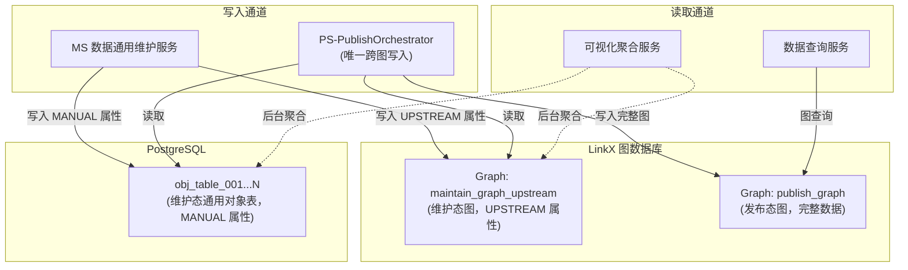
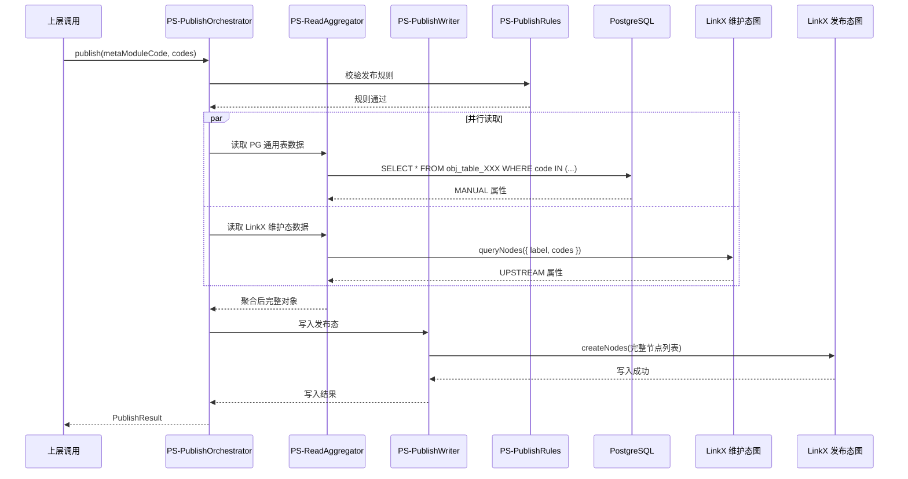

# ADR-003：维护态与发布态数据隔离方案

|| 属性 | 值 |
| --- | --- | --- |
| **ADR ID** | ADR-003 |
| **标题** | 维护态与发布态数据隔离方案 |
| **状态** | Accepted |
| **创建日期** | 2026-08-02 |
| **最后更新** | 2026-08-02 |
| **关联章节** | 第三章 3.4 / 第四章 4.3 / 第五章 5.6 |
| **架构影响** | 架构说明书 v1.11，依据本 ADR 修订 |

---

## 1. 背景与问题

数字产品系统需要支撑**维护态**（数据工程师手动维护 + 上游汇聚）和**发布态**（供 Agent 消费）两类数据视图。两态数据需要物理隔离，避免：

- 维护态数据未审核即被消费
- 发布态数据被维护操作污染
- 跨态查询产生不一致结果

## 2. 方案选型

|| 方案 | 描述 | 推荐度 |
| --- | --- | --- |
| **方案 A：双实例** | 两套 LinkX 实例（维护态 + 发布态） | ⭐⭐ |
| **方案 B：单实例双图** | 同一 LinkX 实例，两个 Graph（maintain / publish） | ⭐⭐⭐⭐ |
| **方案 C：属性隔离** | 同一 Graph，通过 `_maintenance_state` 属性区分 | ⭐⭐⭐⭐⭐ |

## 3. 决策

**采纳：方案 B（图隔离）+ 方案 C（属性隔离）结合**

- 维护态和发布态使用**不同 Graph**（`maintain_graph_upstream` / `publish_graph`）
- 同一 Graph 内通过 `_maintenance_state` 属性标识态（DRAFT / PUBLISH）
- 跨态数据写入仅允许**数据发布服务（PS）**作为唯一通道
- 跨态查询禁止直接执行，必须通过应用层聚合

## 4. 隔离架构

## 5. 数据发布服务（PS）子模块

数据发布服务（PS）内部划分为 4 个子模块，依据 L1 视图中的发布子服务定义：

| 子模块 | 职责 | 依赖 |
| --- | --- | --- |
| **PS-PublishOrchestrator** | 编排发布全流程（读取维护态 → 聚合 → 校验 → 写入发布态） | PS-ReadAggregator、PS-PublishWriter、PS-PublishRules |
| **PS-ReadAggregator** | 从 PG 通用表 + LinkX 维护态图读取数据，按 MetaModule 聚合 | ObjTableSdk、LinkClient |
| **PS-PublishWriter** | 将聚合后的完整节点/边写入发布态 LinkX | LinkClient |
| **PS-PublishRules** | 发布规则的过滤/转换/校验 | 无 |

**PS-PublishOrchestrator 时序**：

## 6. 边界规则

| 规则 | 实现机制 |
| --- | --- |
| **维护态只写 PG 通用对象表** | MS 服务配置写目标为 `obj_table_001...N` |
| **UPSTREAM 属性写 LinkX 维护态图** | MS 服务按 `integration_mode=UPSTREAM` 路由到 LinkClient |
| **跨图写入仅 PS 允许** | LinkClient 内部按角色校验，PS 角色可写 `publish_graph` |
| **跨态查询禁止直接执行** | 应用层编排 + 后台聚合，禁止 Cypher/GQL 跨 Graph JOIN |
| **发布态不支持 DML** | `publish_graph` 标记为只读，仅 PS-PublishWriter 可写入 |
| **可视化聚合由 VAS 负责** | 维护态不支持图查询，可视化通过同时查 PG + LinkX 内存聚合 |

## 7. 后果

**正面**：

- 维护态/发布态物理隔离，发布前可充分校验
- 发布态数据 100% 符合 Schema（GOAL-04）
- 维护操作不影响发布态，发布失败不回滚维护态
- 发布态只读，Agent 消费安全

**负面 / 风险**：

- 跨态查询需要在应用层实现，性能低于单实例
- 维护态 + 发布态存在数据延迟（聚合发布耗时）
- PS 编排复杂度高，需考虑幂等性和补偿机制

## 8. 关联文档

- 第三章 3.4 服务依赖关系
- 第三章 3.2.5 数据发布服务（PS）
- 第四章 4.3 维护态 vs 发布态隔离方案（精简版摘要）
- 第五章 5.6 本章结论
- 第六章 6.2.4 发布流程时序图
- [RFC-003 通用对象表映射机制](./RFC-003-数据通用维护服务-通用对象表映射机制.md)
- [ADR-001 维护态与发布态数据统一存储方案](./ADR-001-维护态与发布态数据统一存储方案.md)

## 9. 修订记录

|| 版本 | 日期 | 修订内容 |
| --- | --- | --- | --- |
| 1.0 | 2026-08-02 | 初稿（从架构说明书 4.3 章节抽取并扩展） |
