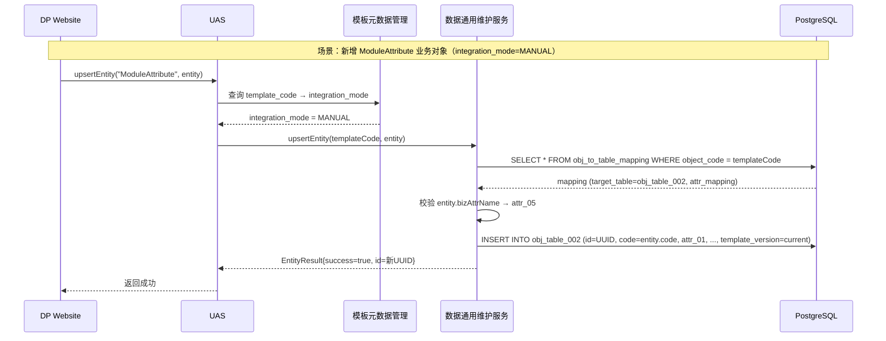
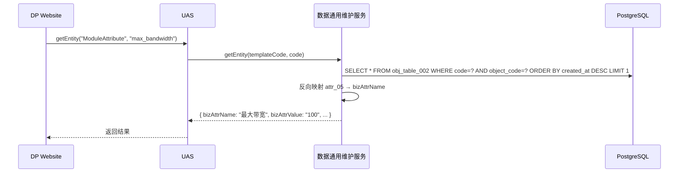
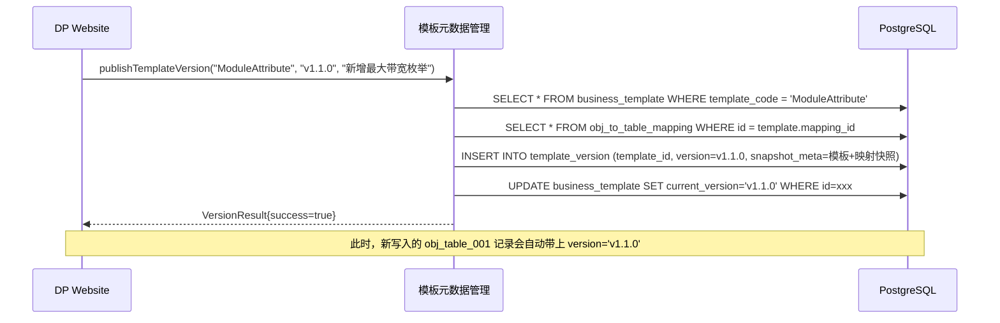
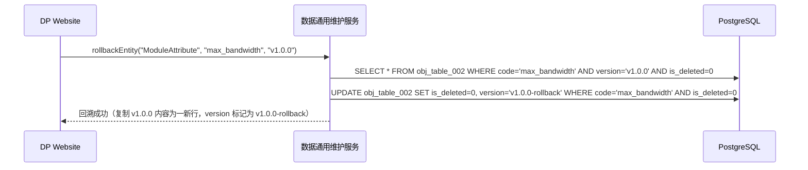

# RFC-003：数据通用维护服务 - 通用对象表映射机制（v0.2）

|| 属性 | 值 |
| --- | --- | --- |
| **RFC ID** | RFC-003 |
| **标题** | 数据通用维护服务 - 通用对象表映射机制 |
| **状态** | Draft v0.2（基于用户反馈修正） |
| **创建日期** | 2026-08-02 |
| **最后更新** | 2026-08-02 |
| **关联章节** | 第三章 3.2.3 模板元数据管理 / 3.2.4 数据通用维护服务 / 3.3.2 原版本管理章节 |
| **架构影响** | RFC-003 接受后，架构说明书 4.4 版本管理存储方案、5.3 版本管理机制整章删除 |

---

## 1. 模块所有权

| 区域 | 范围 |
| --- | --- |
| **3.2.3 模板元数据管理** | **business_template**（业务模板）、**obj_to_table_mapping**（业务对象↔通用表映射）、**template_version**（模板版本）三张表 + 对应服务 |
| **3.2.4 数据通用维护服务** | **obj_table_001...N**（通用对象表，含 `id`=版本号、`code`=业务数据唯一标识、扩展属性列） + 业务对象 CRUD 服务 |
| **跨模块边界** | 模板元数据管理 ←→ 数据通用维护服务：前者定义"映射规则和模板"，后者按规则落通用表；UAS 路由保持不变 |

> **关键约束**：模板管理**不再**作为数据通用维护服务的子模块。它属于"模板元数据管理"，符合 3.2.3 现有职责边界。

---

## 2. 复用优先

- **现有入口点**：
  - 3.2.3 模板元数据管理的"模板定义服务 + Schema 同步服务"职责不变，仅扩展存储对象
  - 3.2.4 数据通用维护服务的"结构/属性/关系维护"三大子模块**简化为"通用对象表 CRUD"**
  - 3.2.2 UAS 接口契约完全保留
- **现有 helper**：
  - 4.2.4 `MetaModule` / `MetaProperty` 元数据模型可直接被 `business_template` 引用
  - 5.3.2 现有 `version_manager` / `version_history` / `version_tag` / `rollback_record` 四张表 **整章删除**（用户决策）
- **现有测试基类**：
  - 5.2.3 `MockLinkXClient` 不可复用；测试改用 Testcontainers Postgres + MyBatis Mock
- **现有 DSL 或注解**：
  - `business_template.template_meta` 复用 `MetaModule` 的 synonyms/maintenance_mode/integration_mode 字段
  - `obj_to_table_mapping.attr_mapping` 复用 `MetaProperty` 的 schema 字段
- **不新增**：
  - 不引入新的存储介质（PG 单一存储）
  - 不引入新的协议/中间件
- **可由上下文推导的字段**：
  - `template_version` = `business_template.current_version`，不要两处并存
  - `obj_table_*.template_version` = 反查 `business_template.current_version`（避免双写）
- **相似测试**：
  - 5.3.3 `VersionQueryService` 测试可作为 `TemplateVersionQueryService` 测试基线

---

## 3. 背景与现状

### 3.1 架构说明书 v1.6 的既定方案（被本 RFC 取代）

- 存储介质：业务对象**统一入 LinkX 图数据库**（ADR-001）
- 数据通用维护服务：对 ModuleStruct / ModuleAttribute / Part / Relation 做 CRUD，落 LinkX
- 版本管理：5.3.2 四张 PG 表（version_manager / version_history / version_tag / rollback_record）+ LinkX 节点带 `version` 属性的混合方案

### 3.2 用户的构想（v0.2 修正）

> 引用用户原文（v0.2 修正版）：
>
> 1. **通用表预建**：在 PG 里预建 N 张通用表，每张表预留 attr_01~attr_N 扩展属性 + JSONB 兜底
> 2. **索引最小化**：只对 1 个业务 Key 建索引
> 3. **id=版本、code=业务数据**：`obj_table_001` 中 `id` 列表示快照版本号，`code` 列表示业务数据唯一标识；**同一对象的所有版本都存同一张表**
> 4. **业务对象 ↔ 通用表映射**：由"模板元数据管理"维护 `obj_to_table_mapping`
> 5. **业务模板存表**：由"模板元数据管理"维护 `business_template`
> 6. **版本管理融入通用表**：不再单独建版本表，版本管理完全通过 `obj_table_001` 自身的 `id`/`code` 设计实现
> 7. **架构说明书 4.4、5.3 整章删除**：版本管理方案不再独立成章

---

## 4. 目标与非目标

### 4.1 目标

| ID | 描述 | 衡量指标 |
| --- | --- | --- |
| G-1 | 业务对象新增不修改物理表结构 | 新增业务对象类型 ≤ 1 人天（GOAL-01） |
| G-2 | 通用表数量固定 | 通用表数量 ≤ N（OPEN-Q3） |
| G-3 | 模板与映射关系由"模板元数据管理"统一维护 | 100% 可在 PG 库中查出 |
| G-4 | 版本管理"轻度可用" | 通过 `id`=版本 + `code`=业务标识实现 |
| G-5 | 单实例查询 P99 ≤ 200ms | 1.8.2 NFR |
| G-6 | 与 UAS 路由契约保持一致 | `integration_mode = MANUAL` 走本方案 |

### 4.2 非目标

- **N-1** 不做完整图遍历查询（多跳关系查询不在本方案能力范围）
- **N-2** 不做发布态数据建模（发布态由独立 ADR 决定）
- **N-3** 不替代 4.2.4 元数据模型（MetaModule / MetaProperty 仍按现行设计）
- **N-4** 不引入独立的版本管理表（用户决策：版本融入通用表）

---

## 5. 详细设计

### 5.1 总体架构

```
┌────────────────────────────────────────────────────────────────────────────┐
│                     数据通用维护服务 & 模板元数据管理（本方案）                  │
├────────────────────────────────────────────────────────────────────────────┤
│                                                                            │
│   ┌───────────────────────────────────────────────────────────────────┐   │
│   │  UAS（统一的数据维护和接入服务 — 门面入口）                          │   │
│   │  ────────────────────────────────────────────────────────────────  │   │
│   │  • 复用 UAS.upsertEntity / getEntity / queryEntities 接口契约       │   │
│   │  • 解析模板元数据 → 路由到数据通用维护服务或外部适配器                │   │
│   └───────────────────────────────────────────────────────────────────┘   │
│              │                               │                            │
│        ┌─────┴─────┐               ┌─────────┴─────────┐                  │
│        ↓           ↓               ↓                   ↓                  │
│   ┌─────────┐  ┌─────────┐    ┌─────────────────────────────┐              │
│   │ 模板元数据│  │ 外部系统 │    │  数据通用维护服务             │              │
│   │  管理    │  │ 适配器   │    │  (Common MS)                │              │
│   │ (TM)    │  │         │    │                             │              │
│   │         │  │         │    │  • 通用对象表 CRUD          │              │
│   │ • 业务模板│  │         │    │  • 业务对象映射执行          │              │
│   │ • 映射规则│  │         │    │  • 版本标记（id=version）   │              │
│   │ • 模板版本│  │         │    │                             │              │
│   └────┬────┘  └─────────┘    └──────────────┬──────────────┘              │
│        │                                     │                             │
│        ↓                                     ↓                             │
│   ┌────────────────────────────────────────────────────────────────────┐   │
│   │   PostgreSQL                                                        │   │
│   │   ────────────────────────────────────────────────────────────────  │   │
│   │   • business_template        ← 模板元数据管理                        │   │
│   │   • obj_to_table_mapping    ← 模板元数据管理                        │   │
│   │   • template_version        ← 模板元数据管理                        │   │
│   │   • MetaModule / MetaProperty（继承 4.2.4）                       │   │
│   │   • obj_table_001...N        ← 数据通用维护服务（同一对象各版本共存） │   │
│   └────────────────────────────────────────────────────────────────────┘   │
└────────────────────────────────────────────────────────────────────────────┘
```

### 5.2 数据库对象设计

#### 5.2.1 通用对象表（obj_table_001 ~ obj_table_N）— 数据通用维护服务

**核心设计**：`id` = 快照版本号（UUID），`code` = 业务数据唯一标识。所有版本共表，可按 `(code, id)` 唯一定位一行。

```sql
-- 通用对象表（预建 N 张，此处示例一张）
CREATE TABLE obj_table_001 (
    -- 1. 快照版本 UUID（每条记录独立 UUID，用于版本追溯）
    id              VARCHAR(36) PRIMARY KEY,

    -- 2. 业务数据唯一标识（同一对象的所有版本共享同一 code）
    code            VARCHAR(100) NOT NULL,
    INDEX idx_code (code),

    -- 3. 业务对象编码（决定"是哪张映射"）
    object_code     VARCHAR(50) NOT NULL,
    INDEX idx_object_code (object_code),

    -- 4. 版本号（语义版本，如 v1.0.0 / v1.1.0）
    version         VARCHAR(50) NOT NULL,

    -- 5. 通用扩展属性（按用户要求预留）
    attr_01         VARCHAR(500),
    attr_02         VARCHAR(500),
    attr_03         VARCHAR(500),
    attr_04         VARCHAR(500),
    attr_05         VARCHAR(500),
    attr_06         VARCHAR(500),
    attr_07         VARCHAR(500),
    attr_08         VARCHAR(500),
    attr_09         VARCHAR(500),
    attr_10         VARCHAR(500),
    -- attr_11 ~ attr_20 见 OPEN-Q4

    -- 6. JSONB 兜底（避免漏写列）
    attr_extra      JSONB,

    -- 7. 维护态/发布态标记
    _maintenance_state VARCHAR(20) NOT NULL DEFAULT 'DRAFT',
    INDEX idx_state (_maintenance_state),

    -- 8. 审计列
    created_at      DATETIME NOT NULL DEFAULT CURRENT_TIMESTAMP,
    created_by      VARCHAR(100),
    is_deleted      BOOLEAN NOT NULL DEFAULT FALSE
) ENGINE=InnoDB DEFAULT CHARSET=utf8mb4 COMMENT '通用对象表 - 001';
```

**关键设计点**：

- **`id` 是行级 UUID，每条记录独立**（包括同一业务对象的不同版本） → 实现"快照 = 物理行"
- **`code` 是业务标识**（同一对象的所有版本共享同一 code）
- 只对 `(code)` 和 `(object_code)` 建索引 → 符合用户"只对 1~2 个 Key 建索引"的要求
- 查询方式：
  - 取**最新版本**：`WHERE code = ? ORDER BY created_at DESC LIMIT 1`
  - 取**指定版本**：`WHERE code = ? AND id = ?`
  - 取**所有版本**：`WHERE code = ? ORDER BY created_at DESC`
  - 取**某版本下的所有对象**：`WHERE version = ? AND _maintenance_state='PUBLISH'`

#### 5.2.2 业务模板表（business_template）— 模板元数据管理

```sql
CREATE TABLE business_template (
    id              VARCHAR(36) PRIMARY KEY,
    template_code   VARCHAR(50) NOT NULL COMMENT '业务模板编码（业务侧可读）',
    template_name   VARCHAR(200) NOT NULL,
    template_type   VARCHAR(50) NOT NULL COMMENT 'MODULE_STRUCT / MODULE_ATTRIBUTE / MODULE_INSTANCE / PARAM',
    description     VARCHAR(500),

    -- 模板元数据：合并 MetaModule + 当前映射关系
    template_meta   JSON NOT NULL COMMENT 'synonyms / maintenance_mode / integration_mode / dimension',
    mapping_id      VARCHAR(36) NOT NULL COMMENT '关联 obj_to_table_mapping',

    -- 当前版本（去版本表化，融入字段）
    current_version VARCHAR(50) NOT NULL DEFAULT 'v1.0.0',

    status          VARCHAR(20) NOT NULL DEFAULT 'DRAFT' COMMENT 'DRAFT / ACTIVE / DEPRECATED',
    created_at      DATETIME NOT NULL DEFAULT CURRENT_TIMESTAMP,
    created_by      VARCHAR(100),
    updated_at      DATETIME NOT NULL DEFAULT CURRENT_TIMESTAMP ON UPDATE CURRENT_TIMESTAMP,
    updated_by      VARCHAR(100),
    UNIQUE KEY uk_template_code (template_code),
    FOREIGN KEY (mapping_id) REFERENCES obj_to_table_mapping(id)
);
```

#### 5.2.3 业务对象 ↔ 通用表映射表（obj_to_table_mapping）— 模板元数据管理

```sql
CREATE TABLE obj_to_table_mapping (
    id              VARCHAR(36) PRIMARY KEY,
    object_code     VARCHAR(50) NOT NULL COMMENT '业务对象编码，如 PartClass / ModuleAttribute',
    target_table    VARCHAR(50) NOT NULL COMMENT '目标通用表名，如 obj_table_002',
    attr_mapping    JSON NOT NULL COMMENT '业务属性 → 通用表列 的映射',
    biz_key_strategy VARCHAR(20) NOT NULL DEFAULT 'SINGLE' COMMENT 'SINGLE / COMPOSITE',
    description     VARCHAR(500),
    created_at      DATETIME NOT NULL DEFAULT CURRENT_TIMESTAMP,
    created_by      VARCHAR(100),
    UNIQUE KEY uk_object (object_code)
);
```

**attr_mapping 示例**：

```json
{
  "bizAttrName":   { "column": "attr_01", "dataType": "STRING",  "required": true  },
  "bizAttrCode":   { "column": "attr_02", "dataType": "STRING",  "required": true  },
  "bizAttrValue":  { "column": "attr_03", "dataType": "STRING",  "required": false },
  "bizAttrUnit":   { "column": "attr_04", "dataType": "STRING",  "required": false },
  "bizAttrEnum":   { "column": "attr_05", "dataType": "ENUM",    "required": false },
  "bizAttrJson":   { "column": "attr_extra", "dataType": "JSON", "required": false }
}
```

#### 5.2.4 模板版本表（template_version）— 模板元数据管理

> **本表只记录"模板级版本"快照（元数据层面），不再记录实例数据快照**——实例数据快照通过 `obj_table_001` 的 `id` = 版本号实现。

```sql
CREATE TABLE template_version (
    id              VARCHAR(36) PRIMARY KEY,
    template_id     VARCHAR(36) NOT NULL,
    version         VARCHAR(50) NOT NULL,
    snapshot_meta   JSON NOT NULL COMMENT '模板元数据快照（含 mapping + template_meta）',
    version_type    VARCHAR(20) NOT NULL DEFAULT 'AUTO' COMMENT 'AUTO / MANUAL / PUBLISH',
    description     VARCHAR(500),
    created_at      DATETIME NOT NULL DEFAULT CURRENT_TIMESTAMP,
    created_by      VARCHAR(100),
    FOREIGN KEY (template_id) REFERENCES business_template(id),
    UNIQUE KEY uk_template_version (template_id, version)
);
```

### 5.3 服务层接口契约

#### 5.3.1 模板元数据管理（3.2.3）— 新增职责

```typescript
// 模板元数据管理服务 — 扩建后接口
interface ITemplateMetaService {

    // ========== 既有职责（保留） ==========
    createMetaModule(metaModule: MetaModule): Promise<MetaModuleResult>;
    createMetaProperty(metaProperty: MetaProperty): Promise<MetaPropertyResult>;

    // ========== 新增：业务模板 ==========
    createBusinessTemplate(template: BusinessTemplate): Promise<TemplateResult>;
    updateBusinessTemplate(templateCode: string, template: BusinessTemplate): Promise<TemplateResult>;
    getBusinessTemplate(templateCode: string): Promise<BusinessTemplate>;
    listBusinessTemplates(criteria: QueryCriteria): Promise<QueryResult<BusinessTemplate>>;

    // ========== 新增：业务对象 ↔ 通用表映射 ==========
    createMapping(mapping: ObjToTableMapping): Promise<MappingResult>;
    updateMapping(objectCode: string, mapping: ObjToTableMapping): Promise<MappingResult>;
    getMappingByObjectCode(objectCode: string): Promise<ObjToTableMapping>;

    // ========== 新增：模板版本 ==========
    publishTemplateVersion(templateCode: string, version: string, description: string): Promise<VersionResult>;
    rollbackTemplate(templateCode: string, targetVersion: string): Promise<RollbackResult>;
    listTemplateVersions(templateCode: string): Promise<VersionListResult>;
    getTemplateVersion(templateCode: string, version: string): Promise<TemplateVersionDetail>;
}
```

#### 5.3.2 数据通用维护服务（3.2.4）— 简化后接口

```typescript
// 数据通用维护服务 — 简化后接口（删除模板/映射/版本管理子模块）
interface ICommonMaintenanceService {

    // ========== 通用对象 CRUD（透过映射表自动路由） ==========
    upsertEntity(templateCode: string, entity: Record<string, any>): Promise<EntityResult>;
    getEntity(templateCode: string, code: string, version?: string): Promise<Record<string, any>>;
    deleteEntity(templateCode: string, code: string): Promise<DeleteResult>;
    queryEntities(templateCode: string, criteria: QueryCriteria): Promise<QueryResult<Record<string, any>>>;

    // ========== 批量操作 ==========
    batchUpsert(templateCode: string, entities: Record<string, any>[]): Promise<BatchResult>;
    batchDelete(templateCode: string, codes: string[]): Promise<BatchResult>;

    // ========== 版本快照（融入通用表） ==========
    snapshotEntity(templateCode: string, code: string, version: string): Promise<SnapshotResult>;
    listVersions(templateCode: string, code: string): Promise<VersionListResult>;
    getVersionData(templateCode: string, code: string, version: string): Promise<Record<string, any>>;
}
```

### 5.4 关键流程

#### 5.4.1 新增业务对象



#### 5.4.2 查询业务对象（按 code 取最新版本）



#### 5.4.3 模板版本发布（业务模板层）



#### 5.4.4 数据版本回溯（融入通用表）



> **回溯策略说明**：通过"复制目标版本内容 + 标记新 version"实现，避免 UPDATE 覆盖导致的历史链路丢失。

---

## 6. 验收与测试

### 6.1 验收命令

```bash
# 单元测试
mvn -pl digitalproduct-template-meta test -Dtest=TemplateMetaServiceTest
mvn -pl digitalproduct-maintenance test -Dtest=CommonMaintenanceServiceTest

# 集成测试（Testcontainers Postgres）
mvn -pl digitalproduct-template-meta,digitalproduct-maintenance verify -P integration

# 性能基线（单点查询 P99）
mvn -pl digitalproduct-maintenance jmeter:run -PperfTest
```

### 6.2 验收用例

| ID | 场景 | 期望 |
| --- | --- | --- |
| AC-1 | 新增业务对象 `Part`，不修改物理表 | 写入成功，落到 obj_table_001 |
| AC-2 | 同一业务对象 `max_bandwidth` 写入两次，产生两条记录（不同 id，相同 code） | 两条记录，`id` 不同，`code` 相同 |
| AC-3 | 按 `code` 查询，最新版本被正确返回 | P99 ≤ 200ms |
| AC-4 | 模板版本发布到 v1.1.0 | `template_version` 写入，`business_template.current_version` 更新 |
| AC-5 | 数据版本回溯到 v1.0.0 | 新行被复制，version 标记为 rollback |
| AC-6 | 通用表扩展 attr_11 字段 | 仅 DDL，业务模板不需改动 |
| AC-7 | DP Website 通过 UAS 调用，外部 Adapter 通过 UPSTREAM 调用 | 两者对上层完全透明 |
| AC-8 | 模板元数据管理服务管理 business_template / obj_to_table_mapping / template_version | 100% CRUD 可用 |
| AC-9 | 数据通用维护服务不直接持有版本表 | 模板管理子模块已删除 |

### 6.3 必含测试基线

- **复用现有测试基类**：5.2.3 `MockLinkXClient` 不可用，需新增 `TestcontainersPostgresExtension`
- **断言风格**：断言通过属性名（bizAttrName）而非列名（attr_05），确保映射层测试透传
- **相似测试**：5.3.3 `VersionQueryServiceTest` 整体迁移为 `TemplateVersionQueryServiceTest`

---

## 7. 风险与冲突分析

### 7.1 与现有架构的冲突（v0.2 缓解后）

| # | 冲突点 | v1.6 原方案 | 本方案 v0.2 | 严重度 |
| --- | --- | --- | --- | --- |
| **C-1** | 存储介质 | 业务对象统一入 LinkX | 业务对象落 PG 通用表 | 🔴 严重 |
| **C-2** | LinkX Client 接口 | 5.2.1 完整 Graph/Cypher 接口 | 大部分方法废弃，仅保留只读 Cypher | 🟡 中等 |
| **C-3** | 版本管理机制 | 5.3.2 四表 + LinkX 节点带 version | **完全融入通用表，删除 5.3.2 整章** | 🟢 已消除 |
| **C-4** | 模板归属 | 模板管理是 MS 子模块 | **模板管理划归模板元数据管理** | 🟢 已消除 |
| **C-5** | 多跳查询 | 1.8.2 P99 ≤ 200ms（3 跳） | 仅单点查询，关系遍历需 JOIN | 🟡 中等 |
| **C-6** | 元数据 vs 业务数据 | 模板存 PG；业务存 LinkX | 全部存 PG（template_meta 用 JSON） | 🟢 较小 |
| **C-7** | CB+New 并行 | ADR-002 并行 | 兼容 | 🟢 较小 |

### 7.2 新增风险

| 风险 ID | 描述 | 概率 | 影响 | 应对措施 |
| --- | --- | --- | --- | --- |
| RISK-R1 | 通用表列数耗尽（attr_extra 兜底） | 中 | 高 | 监听 attr_extra 写入率，>10% 触发列扩展 DDL |
| RISK-R2 | 跨表 JOIN 性能差（关系降级为 JSON） | 高 | 中 | 引入 ES 或 ClickHouse 副本做分析查询 |
| RISK-R3 | 通用表数量 N 估错，需要 DDL 分表 | 中 | 高 | OPEN-Q3 必须由用户给出 |
| RISK-R4 | 与 LinkX 投资冲突（LinkX 平台已采购） | 低 | 极高 | OPEN-Q7 必须由架构委员会决定 |
| RISK-R5 | 回溯策略（复制+标记）导致通用表数据膨胀 | 中 | 中 | 定期归档 is_deleted=TRUE 的历史版本 |

### 7.3 实现路径风险

- **重构面广**：5.3.1 5.3.2 都要删除重建，3.3.1 LinkX Client 大部分代码废弃
- **建议**：先在 v1.0 MVP 之外做 POC 验证（5 个业务对象、1000 条数据、两周性能基线）

---

## 8. 与 ADR/既有决策的对齐

| 既有决策 | 本 RFC 立场 | 行动 |
| --- | --- | --- |
| ADR-001（维护态/发布态统一入图） | **部分违反**（维护态落 PG） | OPEN-Q1 待用户裁决 |
| ADR-002（CB+New 并行） | 不冲突 | 保持 |
| 4.2.4 MetaModule/MetaProperty | 高契合 | 复用 |
| 5.3.2 version_manager/history/tag/rollback_record | **整章删除** | 用户决策 |
| 3.2.4 数据通用维护服务职责 | 保留（子模块重组） | 简化为通用表 CRUD |
| 3.2.2 UAS 接口契约 | 完全兼容 | 内部实现替换 |
| 4.4 版本管理存储方案 | **整章删除** | 用户决策 |
| 5.3 版本管理机制 | **整章删除** | 用户决策 |

---

## 9. 未决问题（OPEN）

| ID | 问题 | 决策建议 | 扣留项 |
| --- | --- | --- | --- |
| **OPEN-Q1** | 是否接受本方案（业务对象从 LinkX 迁回 PG）？ | 接受前需评估 LinkX 投资沉没成本 | 整个 RFC |
| **OPEN-Q2** | 通用表数量 N 应该是多少？ | 建议 8 张 | 5.2.1 通用表 DDL |
| **OPEN-Q3** | 扩展属性列数（attr_01~attr_N）？ | 建议 20 固定 + 1 JSONB 兜底 | 5.2.1 |
| **OPEN-Q4** | 业务对象↔映射关系是 1:1 还是 1:N？ | 1:1（单一映射） | 5.2.3 |
| **OPEN-Q5** | 关系（ModuleStructRelation / HAS / DEPENDS_ON）如何存储？ | 建议先存 attr_extra JSON | 5.2.1 |
| **OPEN-Q6** | 发布态数据如何处理？沿用 LinkX 还是独立发版？ | 单独 ADR | ADR-003 候选 |
| **OPEN-Q7** | 是否保留 Cypher 查询能力（兜底场景）？ | 建议保留只读 Cypher 给发布态用 | 7.1 C-2 |

---

## 10. 修订记录

| 版本 | 日期 | 修订内容 |
| --- | --- | --- |
| 0.1 | 2026-08-02 | 初稿 |
| 0.2 | 2026-08-02 | **基于用户反馈重构**：① 模板管理划归"模板元数据管理"，删除 MS 中的模板/映射子模块；② 通用表引入 `id`=版本号 / `code`=业务数据唯一标识设计；③ 版本管理完全融入通用表，4.4/5.3 整章删除；④ 模板元数据管理职责扩展为 `business_template` / `obj_to_table_mapping` / `template_version` 三表 |

---

## 附录 A：架构说明书同步修改清单

| 章节 | 原内容 | 修改后 |
| --- | --- | --- |
| 3.2.3 模板元数据管理 | 仅描述"模板定义服务 + Schema 同步服务" | 新增 business_template / obj_to_table_mapping / template_version 三表的存储与服务 |
| 3.2.4 数据通用维护服务 | "结构维护 / 属性维护 / 关系维护 / 版本管理" 四子模块 | 简化为"通用对象表 CRUD + 业务对象映射执行" |
| 3.3.2 版本管理（3.3 节） | 独立描述版本管理 | 改为：版本管理完全融入通用表（每行 id=UUID 快照、code=业务标识），本节仅描述快照与回溯方式 |
| 4.4 版本管理存储方案 | 4.4.1 + 4.4.2 + 4.4.3（SQL DDL + Cypher 查询示例） | **整章删除** |
| 5.3 版本管理机制 | 5.3.1 + 5.3.2 + 5.3.3（策略 + DDL + VersionQueryService） | **整章删除** |
| 3.5 章节 / 5.6 章节 | 引述版本管理 | 删除相关条目 |
| OPEN-11 / OPEN-24 / OPEN-27 | 关于版本管理策略 | 标记 CLOSED 或更新 |
| 文档变更记录 | - | 追加 v1.7：依据 RFC-003 重构数据通用维护服务设计 |

## 附录 B：术语映射

| 旧术语（v1.6） | 新术语（本 RFC v0.2） | 说明 |
| --- | --- | --- |
| ModuleStruct | BusinessTemplate.template_type = MODULE_STRUCT | 模板类型，不变 |
| ModuleAttribute | BusinessTemplate.template_type = MODULE_ATTRIBUTE | 模板类型，不变 |
| ModuleInstance | BusinessTemplate.template_type = MODULE_INSTANCE | 模板类型，不变 |
| LinkX Graph | obj_table_001...N（PG） | 存储介质替换 |
| Cypher 查询 | SQL + 映射表 | 查询语言替换 |
| `_maintenance_state` | 通用表 `_maintenance_state` 列 | 字段保留 |
| `version` 属性（LinkX） | `obj_table_*.version` 列 + `id`=UUID 快照 | 设计替换 |
| version_manager / version_history / version_tag / rollback_record | **删除**（融入通用表） | 整章删除 |
