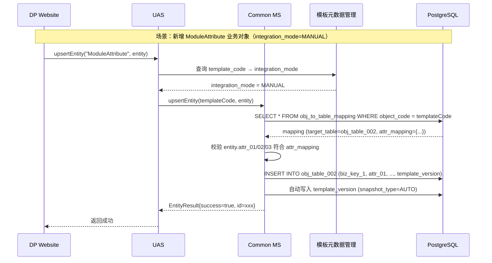
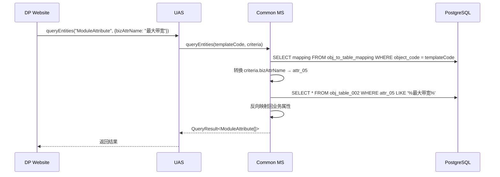
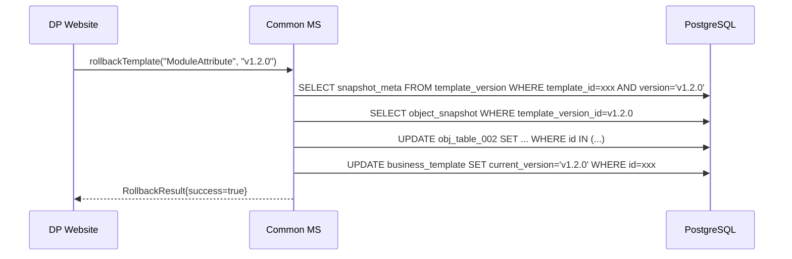

# RFC-003：数据通用维护服务 - 通用对象表映射机制

|| 属性 | 值 |
| --- | --- |
| **RFC ID** | RFC-003 |
| **标题** | 数据通用维护服务 - 通用对象表映射机制（多模板对应多通用表，前置属性+映射关系+业务模板存表） |
| **状态** | Draft |
| **创建日期** | 2026-08-02 |
| **关联章节** | 第三章 3.2.4 数据通用维护服务；第四章 4.2.4 元数据模型；第五章 5.3 版本管理 |
| **取代/补充** | 架构说明书 v1.6 中 3.2.4 数据通用维护服务（基于图数据库的纯 Module/Attribute 抽象）— 本 RFC 提出**第三条路：通用关系表 + 映射表 + 业务模板表** |
| **决策影响** | 存储介质选型（PG vs LinkX）、3.3.2 版本管理机制需相应调整、UAS 路由需扩展 |

> **文档立场（顶层反驳）**
>
> 本 RFC 在采纳前必须先回答一个压倒性问题：在「存储介质固化」与「长期演进成本」之间，架构说明书 v1.6 走的图数据库路线（Module/Attribute 全部入 LinkX 维护态图）是否已经过度工程化？
> 用户提出的方案（**通用对象表 + 映射表 + 业务模板表**）逻辑上更接近 Palantir Object/Property Set 的 RDBMS 实体化建模路线，与 v1.6 的纯图路线存在范式冲突。
> 本 RFC **不**强行调和两者，而是先精确呈现用户构想、列出与现有架构的冲突点、把决策权交回用户。

---

## 1. 模块所有权

| 区域 | 范围 |
| --- | --- |
| 顶层 | 本 RFC 主要落在 DPService 内"数据通用维护服务（Common MS）"模块；若采用本方案，"统一的数据维护和接入服务（UAS）"的路由逻辑与"模板元数据管理（TM）"的存储介质需要相应调整 |
| cruleengine | **不涉及**（本仓库不含 cruleengine 子模块） |
| crulemgr | **不涉及** |
| 跨模块边界 | 若按本方案实施，`LinkX Client` 在 3.3.1 的接口契约需要重新审视，因为存储介质从 LinkX 退回 PG（详见第 7 节冲突点） |

> **警告 [INFERRED]**：从仓库结构（`docs/adr/` + `docs/GES的数据模型及API/`）来看，本项目是一个**未拆分的单体架构文档**，`cruleengine`/`crulemgr` 拆分尚未发生。Skill 提到的拆分规则在本仓库暂不适用，模块所有权仅围绕"顶层 DPService 内部模块"展开。

---

## 2. 复用优先

> 本节评估用户方案与现有架构设计的复用点。

- 现有入口点：
  - 3.2.4 数据通用维护服务的「结构维护 / 属性维护 / 关系维护」三个子模块可复用其**职责边界**（不变更业务对象分类），但**需要改造其底层的存储后端**（从 LinkX 改为 PG 通用表）。
  - 3.2.2 UAS 的 `upsertEntity / getEntity / queryEntities` 接口签名可继续复用，内部由"调 LinkX"改为"调 PG + 映射表"。
- 现有 helper：
  - 3.3.1 `LinkXClient` 接口对图操作封装严密，但**PGSQL 化后该接口大量方法语义失效**（如 `executeCypher` 不可用），最终会演变为"IFace 名字保留，实现类替换为 JDBC/MyBatis"。
- 现有测试基类：
  - 5.2.3 `MockLinkXClient` 不可复用；测试需改用 H2/Testcontainers Postgres + JPA/Hibernate 内存库。
- 现有 DSL 或注解：
  - 4.2.4 元数据模型（MetaModule / MetaProperty / MetaRelation / MetaCatalogNode）**与本方案高度契合**：
    - `MetaModule` 当前存 PG → 本方案的核心映射表可直接挂在 MetaModule 之下
    - `MetaProperty` 当前的 JSON Schema 定义可作为"通用对象表的元数据蓝图"
    - 4.4.2 已有的 `version_manager` / `version_history` / `publish_record` 三张表**几乎是用户所需"业务模板表"的 80% 镜像**，只是现在它们只服务于"版本元数据"，本方案可将其扩展为"业务模板 + 版本"的统一快照系统。
- 不新增：
  - 不引入新的存储介质（已确定 PG 用于模板元数据，MySQL/PG 二选一）。
  - 不引入新的协议/中间件（Kafka、Redis 与本方案无关）。
- 可由上下文推导的字段：
  - `attr_key_1`, `attr_key_2`, `attr_key_3` 的"通用扩展属性"列宽、可空性、默认值等应由 `MetaProperty` 模板驱动，不应要求用户重复填写。
  - 业务模板的 `version` 字段 = `version_manager.current_version`，不要两处并存。
- 相似测试：
  - 与 5.3.3 `VersionQueryService` 的查询测试同构，可作为本方案"业务模板表 CRUD"的测试基线。

---

## 3. 背景与现状

### 3.1 现状（架构说明书 v1.6 的既定方案）

- **存储介质**：维护态与发布态数据**统一入 LinkX 图数据库**（ADR-001）
- **数据模型**：四张核心建模图（Module Structure / Module Attribute / Relation / MetaData）
- **数据通用维护服务（Common MS）**的职责：对 ModuleStruct / ModuleAttribute / Part / Relation 等业务对象做 CRUD，落 LinkX
- **元数据存储**：模板元数据（MetaModule / MetaProperty）存 PG（5.1.1）
- **属性级维护方式**：通过 `maintenance_mode = GENERAL / CB_NEW_COMPATIBLE` 区分
- **版本管理**：5.3.2 已给出 `version_manager / version_history / version_tag / rollback_record` 四张表（存 PG），配 4.4.3 提到的"LinkX 节点带 `version` 属性"实现快照+版本标签混合方案

### 3.2 用户的构想

> 引用用户原文（精简整理）：
>
> 1. **通用表预建**：在关系数据库里预先建 N 张通用表，每张表预留若干扩展属性（attr1、attr2、attr3…）。
> 2. **索引最小化**：只对 1~2 个 Key 字段建索引，其他字段不建索引。
> 3. **业务对象 ↔ 通用表映射**：新增业务对象时，在「业务对象」与「某张通用表 + 实体」之间建立映射关系；后续修改不需改物理表。
> 4. **业务模板表**：把这个映射关系本身用一张表存起来（即"业务模板"）。
> 5. **长期演化诉求**：支持"稍微有一些版本管理"，但架构上不要做得太复杂；目前阶段"能安全地存起来就行"。

### 3.3 现实约束与诉求解构

- **"通用表预留扩展属性"** → 用户想避免频繁 DDL（按 GOAL-01 "新增业务对象类型 ≤ 1 人天"）。
- **"只对 Key 建索引"** → 用户预期通用表是宽表稀疏列，不希望每次新增字段都建索引，吃写入性能。
- **"业务对象 ↔ 通用表 + 实体"映射** → 经典 EAV（Entity-Attribute-Value）或 Palantir Object Type 模式。
- **"映射关系存表"** → 用户希望"模板"本身是一等公民，可持久化、可查询、可版本化。
- **"版本管理有就行，不要复杂"** → 反 5.3.2 设计的"快照+标签+回溯记录"四表全套，强调**轻量级**。

### 3.4 隐含的用户决策（标 [INFERRED] 警示）

- **[INFERRED]** 用户隐含认为：图数据库方案"过度工程化"，与其"能安全地存起来就行"的目标不匹配。
- **[INFERRED]** 用户隐含认为：维护态数据的"快查"诉求高于"多跳关系查询"诉求（v1.0 MVP 主要服务配置 Agent，且配置 Agent 消费的是发布态数据）。
- **[INFERRED]** 用户预期"通用表"数量有限（不是无限扩展），所以预先建 N 张表是可行的人天预算。
- **[GUESS]** 用户未明确"通用表是否需要跨模块共享"、"映射关系是否需要支持一对多"、"模板版本与数据版本是否耦合"。

---

## 4. 目标与非目标

### 4.1 目标

| 目标 ID | 描述 | 衡量指标 |
| --- | --- | --- |
| G-1 | 业务对象新增不修改物理表结构 | 新增业务对象类型 ≤ 1 人天（GOAL-01） |
| G-2 | 通用表数量固定，不随业务增长而扩张 | 通用表数量 ≤ N（详见 OPEN-Q3） |
| G-3 | 业务模板可声明、可查询、可版本化 | 业务模板 100% 可在 PG 库中查出 |
| G-4 | 版本管理"轻度可用" | 支持快照、回溯、对比 |
| G-5 | 性能满足单点查询 | 单实例 P99 ≤ 200ms（架构说明书 1.8.2） |
| G-6 | 与 UAS 路由契约保持一致 | `integration_mode = MANUAL` 走本方案；`UPSTREAM` 仍走外部适配器 |

### 4.2 非目标

- **N-1** 不做完整的图遍历查询能力（多跳关系查询不在本方案能力范围）
- **N-2** 不做发布态数据建模（发布态仍按 ADR-001 维持原方案或独立 RFC 决定）
- **N-3** 不做复杂的 Property Graph 特性（继承多态、动态类型推导等）
- **N-4** 不替代 PG 元数据存储（MetaModule / MetaProperty 仍按 4.2.4 现行设计）

---

## 5. 详细设计

### 5.1 总体架构

```
┌───────────────────────────────────────────────────────────────────────────┐
│                  数据通用维护服务（本方案改造后）                              │
├───────────────────────────────────────────────────────────────────────────┤
│                                                                           │
│   ┌─────────────────────────────────────────────────────────────────┐    │
│   │  UAAS 适配层（UAS → 维护服务的转发器）                              │    │
│   │  ──────────────────────────────────────────────────────────────  │    │
│   │  • 复用 UAS.upsertEntity / getEntity / queryEntities 接口契约     │    │
│   │  • 内部判 integration_mode = MANUAL 后调用本服务                    │    │
│   │  • 解析 MetaProperty 模板，校验映射合法性                            │    │
│   └─────────────────────────────────────────────────────────────────┘    │
│                              ↓                                             │
│   ┌─────────────────────────────────────────────────────────────────┐    │
│   │  数据通用维护服务（Common MS）                                      │    │
│   │  ──────────────────────────────────────────────────────────────  │    │
│   │  • 结构维护（ObjectSpec 维护）                                      │    │
│   │  • 属性维护（AttributeValue 维护）                                  │    │
│   │  • 关系维护（ObjectRelation 维护）                                  │    │
│   │  • 模板管理（BusinessTemplate 维护）                                │    │
│   │  • 版本管理★（轻量级快照）                                          │    │
│   └─────────────────────────────────────────────────────────────────┘    │
│                              ↓                                             │
│   ┌─────────────────────────────────────────────────────────────────┐    │
│   │  通用对象表 + 映射表 + 业务模板表（PG 单一存储）                     │    │
│   │  ──────────────────────────────────────────────────────────────  │    │
│   │  • obj_table_1, obj_table_2, ..., obj_table_N  ← 通用对象表(预建)    │    │
│   │  • obj_to_table_mapping          ← 业务对象↔通用表映射              │    │
│   │  • business_template             ← 业务模板（映射+元数据）           │    │
│   │  • template_version              ← 模板版本（轻量级）               │    │
│   │  • object_snapshots              ← 快照（按需写入）                  │    │
│   │  • 继承 MetaModule / MetaProperty / version_manager               │    │
│   └─────────────────────────────────────────────────────────────────┘    │
│                                                                           │
└───────────────────────────────────────────────────────────────────────────┘
```

### 5.2 通用对象表（obj_table_*）

#### 5.2.1 表结构模板

```sql
-- 通用对象表（预建 N 张，此处只示例一张）
CREATE TABLE obj_table_001 (
    -- 1. 主键（唯一索引）
    id              VARCHAR(36) PRIMARY KEY,

    -- 2. 业务 Key（联合唯一索引，按用户要求 1~2 个 Key）
    biz_key_1       VARCHAR(100) NOT NULL,
    biz_key_2       VARCHAR(100),
    UNIQUE KEY uk_biz_key (biz_key_1, biz_key_2),

    -- 3. 业务对象编码（决定"是哪张映射"）
    object_code     VARCHAR(50) NOT NULL,
    INDEX idx_object_code (object_code),

    -- 4. 通用扩展属性（按用户要求预留；索引按需后期加）
    attr_01         VARCHAR(500),
    attr_02         VARCHAR(500),
    attr_03         VARCHAR(500),
    attr_04         VARCHAR(500),
    attr_05         VARCHAR(500),
    attr_06         VARCHAR(500),
    attr_07         VARCHAR(500),
    attr_08         VARCHAR(500),
    attr_09         VARCHAR(500),
    attr_10        VARCHAR(500),
    -- ... 继续到 attr_N，N 由 OPEN-Q3 决定

    -- 5. 扩展 JSON 字段（兜底，避免漏写列）
    attr_extra      JSONB,

    -- 6. 模板版本号（来自 business_template.current_version）
    template_version VARCHAR(50) NOT NULL,

    -- 7. 维护态/发布态标记
    _maintenance_state VARCHAR(20) NOT NULL DEFAULT 'DRAFT',

    -- 8. 审计列
    created_at      DATETIME NOT NULL DEFAULT CURRENT_TIMESTAMP,
    created_by      VARCHAR(100),
    updated_at      DATETIME NOT NULL DEFAULT CURRENT_TIMESTAMP ON UPDATE CURRENT_TIMESTAMP,
    updated_by      VARCHAR(100),
    is_deleted      BOOLEAN NOT NULL DEFAULT FALSE
) ENGINE=InnoDB DEFAULT CHARSET=utf8mb4 COMMENT '通用对象表 - 001';
```

#### 5.2.2 通用表数量与列宽

| 决策项 | 建议值 | OPEN 问题 |
| --- | --- | --- |
| 通用表数量 N | **8 张**（按业务体量估算：产品类、部件分类、Part、规格属性、参数属性、营销属性、关系、其他） | OPEN-Q3 |
| 扩展属性列数 | **20 个固定列 + 1 个 JSONB 兜底** | OPEN-Q4 |
| 索引数量 | **只对 (biz_key_1, biz_key_2) 和 (object_code) 建索引**（按用户要求） | OPEN-Q5 |
| 行存储引擎 | InnoDB（事务、行锁、外键） | 已确定 |

### 5.3 业务对象 ↔ 通用表映射表

```sql
CREATE TABLE obj_to_table_mapping (
    id              VARCHAR(36) PRIMARY KEY,
    object_code     VARCHAR(50) NOT NULL COMMENT '业务对象编码，如 PartClass / ModuleAttribute',
    target_table    VARCHAR(50) NOT NULL COMMENT '目标通用表名，如 obj_table_002',
    attr_mapping    JSON NOT NULL COMMENT '业务属性列映射：{ bizAttr: "attr_05", dataType: "ENUM", required: false }',
    biz_key_strategy VARCHAR(20) NOT NULL DEFAULT 'COMPOSITE' COMMENT 'SINGLE / COMPOSITE',
    description     VARCHAR(500),
    template_id     VARCHAR(36) NOT NULL COMMENT '关联业务模板 ID',
    created_at      DATETIME NOT NULL DEFAULT CURRENT_TIMESTAMP,
    created_by      VARCHAR(100),
    UNIQUE KEY uk_object (object_code, template_id)
);
```

**attr_mapping 示例**：

```json
{
  "bizAttrName":   { "column": "attr_01", "dataType": "STRING",  "required": true,  "indexed": false },
  "bizAttrCode":   { "column": "attr_02", "dataType": "STRING",  "required": true,  "indexed": false },
  "bizAttrValue":  { "column": "attr_03", "dataType": "STRING",  "required": false, "indexed": false },
  "bizAttrUnit":   { "column": "attr_04", "dataType": "STRING",  "required": false, "indexed": false },
  "bizAttrEnum":   { "column": "attr_05", "dataType": "ENUM",    "required": false, "indexed": false },
  "bizAttrJson":   { "column": "attr_extra", "dataType": "JSON", "required": false, "indexed": false }
}
```

### 5.4 业务模板表

```sql
CREATE TABLE business_template (
    id              VARCHAR(36) PRIMARY KEY,
    template_code   VARCHAR(50) NOT NULL COMMENT '业务模板编码（业务侧可读）',
    template_name   VARCHAR(200) NOT NULL,
    template_type   VARCHAR(50) NOT NULL COMMENT 'MODULE_STRUCT / MODULE_ATTRIBUTE / MODULE_INSTANCE / PARAM',
    description     VARCHAR(500),
    -- 模板元数据：合并 MetaModule + 当前映射关系
    template_meta   JSON NOT NULL COMMENT 'MetaModule 等价物，含 maintenance_mode / integration_mode',
    mapping_id      VARCHAR(36) NOT NULL COMMENT '关联的 obj_to_table_mapping.id',
    current_version VARCHAR(50) NOT NULL DEFAULT 'v1.0.0',
    status          VARCHAR(20) NOT NULL DEFAULT 'DRAFT' COMMENT 'DRAFT / ACTIVE / DEPRECATED',
    created_at      DATETIME NOT NULL DEFAULT CURRENT_TIMESTAMP,
    created_by      VARCHAR(100),
    updated_at      DATETIME NOT NULL DEFAULT CURRENT_TIMESTAMP ON UPDATE CURRENT_TIMESTAMP,
    UNIQUE KEY uk_template_code (template_code),
    FOREIGN KEY (mapping_id) REFERENCES obj_to_table_mapping(id)
);
```

**模板元数据示例**：

```json
{
  "synonyms": { "zh": ["最大带宽"], "en": ["Max Bandwidth"] },
  "maintenance_mode": "GENERAL",
  "integration_mode": "MANUAL",
  "dimension": "SPEC",
  "data_type": "ENUM",
  "values": ["10", "40", "100", "400"]
}
```

### 5.5 模板版本表（轻量级）

> 按用户"版本管理有就行，不要复杂"的要求，本方案**只引入 2 张轻量表**，不复用 5.3.2 的四表全套。

```sql
CREATE TABLE template_version (
    id              VARCHAR(36) PRIMARY KEY,
    template_id     VARCHAR(36) NOT NULL,
    version         VARCHAR(50) NOT NULL,
    snapshot_meta   JSON NOT NULL COMMENT '业务模板快照（含 mapping + template_meta）',
    snapshot_data   JSON COMMENT '该版本下所有实例数据快照（按需生成）',
    version_type    VARCHAR(20) NOT NULL DEFAULT 'AUTO' COMMENT 'AUTO / MANUAL / PUBLISH',
    description     VARCHAR(500),
    created_at      DATETIME NOT NULL DEFAULT CURRENT_TIMESTAMP,
    created_by      VARCHAR(100),
    FOREIGN KEY (template_id) REFERENCES business_template(id),
    UNIQUE KEY uk_template_version (template_id, version)
);

-- 通用对象快照表（按需写入，仅 PUBLISH 快照必写）
CREATE TABLE object_snapshot (
    id              VARCHAR(36) PRIMARY KEY,
    template_version_id VARCHAR(36) NOT NULL,
    object_code     VARCHAR(50) NOT NULL,
    object_id       VARCHAR(36) NOT NULL,
    snapshot_data   JSON NOT NULL,
    created_at      DATETIME NOT NULL DEFAULT CURRENT_TIMESTAMP,
    FOREIGN KEY (template_version_id) REFERENCES template_version(id),
    INDEX idx_object (object_code, object_id)
);
```

**对比 5.3.2 全套版本的精简**：

| 5.3.2 原表 | 本方案 | 处理 |
| --- | --- | --- |
| `version_manager` | 能力合并到 `business_template.current_version` | 删除 |
| `version_history` | 重命名为 `template_version` | 保留（合并 snapshot_meta） |
| `version_tag` | 暂不引入，语义版本号直接写在 `template_version.version` | 删除 |
| `rollback_record` | 暂不引入，回溯操作通过审计日志记录 | 删除 |

### 5.6 服务层接口契约

> 完全复用 3.2.2 UAS 接口签名，但内部实现从 LinkX 改为 PG。

```typescript
// 数据通用维护服务（Common MS）— 改建后接口
interface ICommonMaintenanceService {

    // ========== 业务对象 CRUD（透过映射表，自动路由到通用表） ==========
    upsertEntity(templateCode: string, entity: Record<string, any>): Promise<EntityResult>;
    getEntity(templateCode: string, id: string): Promise<Record<string, any>>;
    deleteEntity(templateCode: string, id: string): Promise<DeleteResult>;
    queryEntities(templateCode: string, criteria: QueryCriteria): Promise<QueryResult<Record<string, any>>>;

    // ========== 批量操作 ==========
    batchUpsert(templateCode: string, entities: Record<string, any>[]): Promise<BatchResult>;
    batchDelete(templateCode: string, ids: string[]): Promise<BatchResult>;

    // ========== 模板与映射管理 ==========
    createMapping(mapping: ObjToTableMapping): Promise<MappingResult>;
    createTemplate(template: BusinessTemplate): Promise<TemplateResult>;
    publishTemplate(templateCode: string, version: string): Promise<PublishResult>;
    rollbackTemplate(templateCode: string, targetVersion: string): Promise<RollbackResult>;
    listTemplateVersions(templateCode: string): Promise<VersionListResult>;
}
```

### 5.7 关键流程

#### 5.7.1 新增业务对象



#### 5.7.2 查询业务对象



#### 5.7.3 版本回溯（轻量级）



### 5.8 数据通用维护服务子模块重整

| 原 3.2.4 子模块 | 本方案改造 | 备注 |
| --- | --- | --- |
| **结构维护** | 保留职责，对应通用表 obj_table_001 | 落 obj_table_001 |
| **属性维护** | 保留职责，对应通用表 obj_table_002 | 落 obj_table_002 |
| **关系维护** | **降级为模板内 JSON 字段**（attr_extra 兜底） | OPEN-Q6 |
| **版本管理 ★** | 简化为 2 张表（template_version + object_snapshot） | 删除 5.3.2 四表 |
| **新增：模板管理** | 提供 createTemplate / publishTemplate / rollbackTemplate | 等同 MetaModule 持久层 |
| **新增：映射管理** | 提供 createMapping / listMapping | 映射表 CRUD |

---

## 6. 验收与测试

### 6.1 验收命令

> 以下命令在仓库尚无代码情况下给出**伪命令**，待 RFC 接受后由 RFC-003-impl 任务补齐。

```bash
# 单元测试
mvn -pl digitalproduct-maintenance test -Dtest=CommonMaintenanceServiceTest

# 集成测试（H2/Testcontainers Postgres）
mvn -pl digitalproduct-maintenance verify -P integration

# 性能基线（单点查询 P99）
mvn -pl digitalproduct-maintenance jmeter:run -PperfTest
```

### 6.2 验收用例

| 用例 ID | 场景 | 期望 |
| --- | --- | --- |
| AC-1 | 新增业务对象 `Part`，不修改物理表 | 写入成功，落到 obj_table_001 |
| AC-2 | 修改业务对象映射，从 obj_table_001 改到 obj_table_003 | 业务模板表更新成功，新数据落新表 |
| AC-3 | 查询某业务对象列表（按 bizAttrName 模糊匹配） | P99 ≤ 200ms |
| AC-4 | 模板版本发布到 v1.1.0 | template_version 写入 PUBLISH 快照 |
| AC-5 | 模板回滚到 v1.0.0 | obj_table_002 数据按 v1.0.0 快照恢复 |
| AC-6 | 通用表扩展 attr_11 字段 | 仅 DDL，业务模板不需改动 |
| AC-7 | DP Website 通过 UAS 调用，外部 Adapter 通过 UPSTREAM 调用 | 两者对上层完全透明 |

### 6.3 必含测试基线

- **复用现有测试基类**：5.2.3 `MockLinkXClient` 不可用，需新增 `MockJdbcTemplate` / `TestcontainersPostgresExtension`。
- **断言风格**：断言通过属性名（bizAttrName）而非列名（attr_05），确保映射层测试透传。
- **相似测试**：5.3.3 `VersionQueryServiceTest` 的查询逻辑可整体迁移到 `TemplateVersionQueryServiceTest`。

---

## 7. 风险与冲突分析

### 7.1 与现有架构的冲突（必须用户决策）

| # | 冲突点 | 现有架构（v1.6） | 本方案 | 严重度 |
| --- | --- | --- | --- | --- |
| **C-1** | **存储介质** | 业务对象统一入 LinkX（ADR-001） | 业务对象落 PG 通用表 | 🔴 严重 |
| **C-2** | **LinkX Client 接口** | 5.2.1 完整 Graph/Cypher 接口 | 大部分方法废弃，仅 Label 查询保留 | 🔴 严重 |
| **C-3** | **版本管理机制** | 5.3.2 四表 + LinkX 节点带 version 属性 | 简化为 2 张表，删除四表 | 🟡 中等 |
| **C-4** | **关系建模** | 4.2.2 三类 Relation 都是边（CONTAINS/HAS/...） | 关系降级为 JSON 字段或单独通用表 | 🟡 中等 |
| **C-5** | **多跳查询** | 1.8.2 P99 ≤ 200ms（3 跳） | 仅单点查询，关系遍历需 JOIN 通用表 | 🟡 中等 |
| **C-6** | **元数据 vs 业务数据** | 4.2.4 模板元数据存 PG；业务数据存 LinkX | 全部存 PG，模板元数据与业务数据同库 | 🟢 较小 |
| **C-7** | **CB+New 并行** | ADR-002 并行策略 | 兼容，但 CB+New 适配器需要重新评估 | 🟢 较小 |

### 7.2 新增风险

| 风险 ID | 描述 | 概率 | 影响 | 应对措施 |
| --- | --- | --- | --- | --- |
| RISK-R1 | 通用表列数耗尽（attr_extra 兜底） | 中 | 高 | 监听 attr_extra 写入率，>10% 触发列扩展 DDL |
| RISK-R2 | 跨表 JOIN 性能差（关系降级为 JSON） | 高 | 中 | 引入 Elasticsearch 或 ClickHouse 副本做分析查询 |
| RISK-R3 | 业务模板版本与实例数据版本耦合 | 中 | 中 | 暂不引入实例级版本，仅模板级版本 |
| RISK-R4 | 通用表数量 N 估错，导致需要 DDL 分表 | 中 | 高 | OPEN-Q3 必须由用户给出 |
| RISK-R5 | 与 LinkX 投资冲突（LinkX 平台已采购） | 低 | 极高 | OPEN-Q7 必须由架构委员会决定 |

### 7.3 实现路径风险

- **重构面广**：5.3.1 5.3.2 都要重写，3.3.1 LinkX Client 大部分代码废弃。
- **可逆性差**：一旦落 PG，后续要迁回 LinkX 几乎不可能。
- **建议**：先在 v1.0 MVP 之外**做 POC 验证**，输入 5 个业务对象、1000 条数据，跑两周性能基线。

---

## 8. 与 ADR/既有决策的对齐

| 既有决策 | 本 RFC 立场 | 行动 |
| --- | --- | --- |
| ADR-001（维护态/发布态统一入图） | 本方案**部分违反**（维护态落 PG） | OPEN-Q1 待用户裁决 |
| ADR-002（CB+New 并行） | 不冲突 | 保持 |
| 4.2.4 MetaModule/MetaProperty 元数据 | 高契合 | 复用 |
| 5.3.2 version_manager / version_history | 重叠 80% | 合并精简 |
| 3.2.4 数据通用维护服务职责 | 保留 | 子模块重组 |
| 3.2.2 UAS 接口契约 | 完全兼容 | 内部实现替换 |
| 5.2 LinkX Client 大接口 | 大部分失效 | 缩减为只读接口 |

---

## 9. 未决问题（OPEN）

> 以下问题必须由用户决策，本 RFC 不擅自裁决。

| ID | 问题 | 决策建议 | 扣留项 |
| --- | --- | --- | --- |
| **OPEN-Q1** | 是否接受本方案（业务对象从 LinkX 迁回 PG）？ | 接受前需评估 LinkX 投资沉没成本 | 整个 RFC |
| **OPEN-Q2** | 通用表数量 N 应该是多少？ | 建议 8 张 | 5.2.2 通用表 DDL |
| **OPEN-Q3** | 扩展属性列数（attr_01~attr_N）应该是多少？ | 建议 20 固定 + 1 JSONB 兜底 | 5.2.1 |
| **OPEN-Q4** | attr_extra JSONB 是否足够，还是必须严格列化？ | 建议 JSONB 兜底，主流字段列化 | 5.5 |
| **OPEN-Q5** | 业务对象↔映射关系 是 1:1 还是 1:N？ | 建议 1:1（单一映射） | 5.3 |
| **OPEN-Q6** | ModuleStructRelation、HAS、DEPENDS_ON 关系如何存储？ | 建议先存 attr_extra JSON，再独立通用表 | 5.5 |
| **OPEN-Q7** | 发布态数据如何处理？沿用 LinkX 还是独立发版？ | 单独 ADR，本 RFC 仅约束维护态 | ADR-003 候选 |
| **OPEN-Q8** | 关系建模降级为 JSON 字段后，是否影响 UC-C1~C4 的图查询？ | 需要重新评估 1.8.2 性能要求 | 7.1 C-5 |
| **OPEN-Q9** | 是否需要保留 Cypher 查询能力（例如兜底场景）？ | 建议保留只读 Cypher 给发布态用 | 7.2 RISK-R5 |

---

## 10. 修订记录

| 版本 | 日期 | 修订内容 |
| --- | --- | --- |
| 0.1 | 2026-08-02 | 初稿 |

---

## 附录 A：与 5.3.2 版本管理方案的对比表

| 维度 | 5.3.2 全套方案 | 本 RFC 轻量方案 |
| --- | --- | --- |
| 表数量 | 4 张（version_manager + version_history + version_tag + rollback_record） | 2 张（template_version + object_snapshot） |
| 快照粒度 | AUTO / MANUAL / PUBLISH 三类 | AUTO / MANUAL / PUBLISH 三类（保留） |
| 标签能力 | 独立的 `version_tag` 表 | 暂不引入，语义版本直接作为 version 字段 |
| 回溯记录 | 独立 `rollback_record` 表 | 审计日志（不另建表） |
| 与 LinkX 关系 | 双向：PG 存指针 + LinkX 节点带 version | 单向：仅 PG 存快照 |
| 复杂度 | 高 | 低 |

## 附录 B：术语映射

| 旧术语（v1.6） | 新术语（本 RFC） | 说明 |
| --- | --- | --- |
| ModuleStruct | BusinessTemplate.template_type = MODULE_STRUCT | 模板类型，不变 |
| ModuleAttribute | BusinessTemplate.template_type = MODULE_ATTRIBUTE | 模板类型，不变 |
| ModuleInstance | BusinessTemplate.template_type = MODULE_INSTANCE | 模板类型，不变 |
| LinkX Graph | PostgreSQL 通用表 | 存储介质替换 |
| Cypher 查询 | SQL + 映射表 | 查询语言替换 |
| `_maintenance_state` | 通用表 `_maintenance_state` 列 | 字段保留 |
| `version` 属性 | `template_version` 表 + `obj_table_*.template_version` 列 | 拆分为两处关联 |
