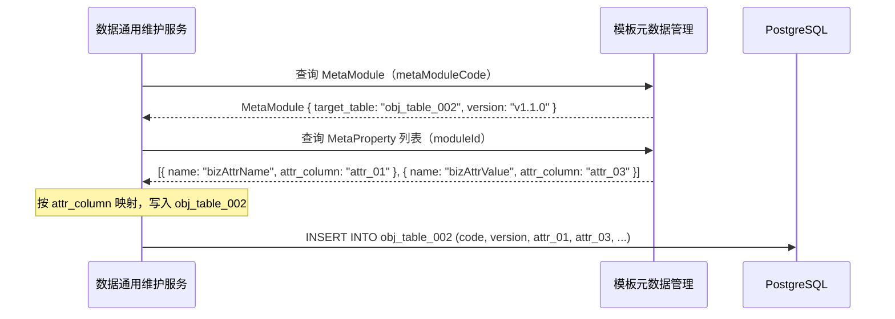

# RFC-003：数据通用维护服务 - 通用对象表映射机制（v0.3）

|| 属性 | 值 |
| --- | --- |
| **RFC ID** | RFC-003 |
| **标题** | 数据通用维护服务 - 通用对象表映射机制 |
| **状态** | Draft v0.3（基于用户反馈简化） |
| **创建日期** | 2026-08-02 |
| **最后更新** | 2026-08-02 |
| **关联章节** | 第三章 3.2.3 模板元数据管理 / 3.2.4 数据通用维护服务 / 3.3.2 / 第四章 4.2.4 元数据模型 |
| **架构影响** | RFC-003 接受后，架构说明书 4.4 版本管理存储方案、5.3 版本管理机制整章删除；`business_template` / `obj_to_table_mapping` / `template_version` 三张表**不再引入**，改为在现有元数据表上扩展字段 |

---

## 1. 模块所有权

| 区域 | 范围 |
| --- | --- |
| **3.2.3 模板元数据管理** | 扩展 `MetaModule` 和 `MetaProperty` 字段（`version`、`target_table`、`attr_column`），复用现有元数据存储 |
| **3.2.4 数据通用维护服务** | 按 `MetaModule.target_table` 和 `MetaProperty.attr_column` 路由到通用对象表 |
| **跨模块边界** | 模板元数据管理 → 数据通用维护服务：前者提供元数据（映射规则+版本），后者按规则执行 CRUD |

> **核心原则**：不在元数据层引入新的表结构，版本和映射直接附在现有的 `MetaModule` / `MetaProperty` 上。

---

## 2. 复用优先

- **现有入口点**：
  - 3.2.3 模板元数据管理的"模板定义服务 + Schema 同步服务"职责**扩展**（不减原有职责）
  - 3.2.4 数据通用维护服务的"结构/属性/关系维护"三大子模块**简化**（只路由到通用表）
  - 3.2.2 UAS 接口契约完全保留
- **现有 helper**：
  - 4.2.4 `MetaModule` / `MetaProperty` 元数据模型**直接扩展字段**，不复用已有的 PK/UK/FK 结构
- **现有 DSL 或注解**：
  - `MetaModule` 新增 `version` / `target_table` 字段 → 复用现有字段追加
  - `MetaProperty` 新增 `attr_column` 字段 → 复用现有字段追加
- **不新增**：
  - **不建 `business_template` 表**（用户决策）
  - **不建 `obj_to_table_mapping` 表**（用户决策）
  - **不建 `template_version` 表**（用户决策）
  - 不引入新的存储介质
- **可由上下文推导的字段**：
  - `MetaModule.version` 由变更自动递增（v1.0.0 → v1.0.1）
  - `MetaProperty.attr_column` 可按 `property_name` 推导（`bizAttrName` → `attr_01`），除非显式覆盖

---

## 3. 背景与现状

### 3.1 v0.2 的问题

v0.2 方案在 `MetaModule` / `MetaProperty` 之外额外引入了三张表：

- `business_template` — 业务模板（重复了 `MetaModule` 的职责）
- `obj_to_table_mapping` — 映射规则（拆分了 `MetaProperty` 的职责）
- `template_version` — 模板版本（拆分了 `MetaModule.version` 的职责）

**问题**：一个模板元数据，被拆到了 4 张表里查询。这比原来的 LinkX 方案还复杂。

### 3.2 你的诉求（v0.3 简化原则）

> 引用用户原文（精简）：
>
> 1. **版本**：在 `MetaModule`（或 `MetaProperty`）上加 `version` 字段就 OK，不应单独建表
> 2. **映射**：`MetaModule` 加 `target_table`；`MetaProperty` 加 `attr_column`，不需要额外表
> 3. **通用表数量固定**：预先建 N 张，不随业务增长扩张

### 3.3 简化后的数据模型

```
MetaModule ─────────────────────────────────────────────────┐
  id, code, name, struct_type, maintenance_mode, ...       │
  version VARCHAR(50)     ★新增：当前语义版本号              │
  target_table VARCHAR(50) ★新增：映射到的通用表名            │─── 数据通用维护服务
                                                              │   按 target_table + attr_column
MetaProperty ─────────────────────────────────────────────┐ │   路由到 obj_table_001~N
  id, module_id, name, data_type, schema, ...              │
  attr_column VARCHAR(50) ★新增：映射到的通用表列名           │
                                                              │
obj_table_001 ~ obj_table_N  ←────────────────────────────┘
  id（快照UUID）, code（业务标识）, version, attr_01~attr_N, attr_extra
```

---

## 4. 目标与非目标

### 4.1 目标

| ID | 描述 | 衡量指标 |
| --- | --- | --- |
| G-1 | 业务对象新增不修改物理表结构 | 新增业务对象类型 ≤ 1 人天（GOAL-01） |
| G-2 | 通用表数量固定 | 通用表数量 ≤ N（OPEN-Q3） |
| G-3 | 版本管理"轻量化" | `MetaModule.version` 字段就够，不需要版本表 |
| G-4 | 映射规则"轻量化" | `MetaModule.target_table` + `MetaProperty.attr_column` 就够，不需要映射表 |
| G-5 | 元数据单一表查询 | 一个模板的所有元数据从 2 张表（MetaModule + MetaProperty）查出 |

### 4.2 非目标

- **N-1** 不做完整图遍历查询
- **N-2** 不做发布态数据建模（由独立 ADR 决定）
- **N-3** 不引入 `business_template` / `obj_to_table_mapping` / `template_version` 表
- **N-4** 不做独立的版本快照表（实例快照通过 `obj_table_*.id` 实现）

---

## 5. 详细设计

### 5.1 元数据表扩展（核心变更）

#### 5.1.1 `MetaModule` 扩展字段

```sql
-- 仅展示新增字段（原有字段保持不变）
ALTER TABLE meta_module
    ADD COLUMN version VARCHAR(50) NOT NULL DEFAULT 'v1.0.0' COMMENT '当前语义版本',
    ADD COLUMN target_table VARCHAR(50) NOT NULL COMMENT '映射到的通用表名，如 obj_table_001',
    ADD COLUMN target_table_key_column VARCHAR(50) NOT NULL DEFAULT 'code' COMMENT '通用表中业务标识字段，默认 code',
    ADD COLUMN biz_key_strategy VARCHAR(20) NOT NULL DEFAULT 'SINGLE' COMMENT 'SINGLE / COMPOSITE',
    ADD INDEX idx_target_table (target_table);
```

#### 5.1.2 `MetaProperty` 扩展字段

```sql
-- 仅展示新增字段（原有字段保持不变）
ALTER TABLE meta_property
    ADD COLUMN attr_column VARCHAR(50) COMMENT '映射到的通用表列名，如 attr_01。若为空则自动推导',
    ADD COLUMN attr_required BOOLEAN NOT NULL DEFAULT FALSE COMMENT '是否必填',
    ADD COLUMN attr_indexed BOOLEAN NOT NULL DEFAULT FALSE COMMENT '是否建索引';
```

**自动推导规则**：若 `attr_column` 为空，则按 `property_name` 字典序 + 序号自动分配到 `attr_01`、`attr_02` ...

### 5.2 通用对象表（obj_table_001 ~ obj_table_N）

#### 5.2.1 表结构模板

```sql
-- 通用对象表（预建 N 张，此处示例一张）
CREATE TABLE obj_table_001 (
    -- 1. 快照版本 UUID（每条记录独立 UUID，用于版本追溯）
    id                  VARCHAR(36) PRIMARY KEY,
    -- 2. 业务数据唯一标识（同一对象的所有版本共享同一 code）
    code                VARCHAR(100) NOT NULL,
    INDEX idx_code (code),
    -- 3. 业务对象编码（决定"是哪张映射"）
    object_code         VARCHAR(50) NOT NULL,
    INDEX idx_object_code (object_code),
    -- 4. 版本号（语义版本，如 v1.0.0）
    version             VARCHAR(50) NOT NULL,
    -- 5. 通用扩展属性（按用户要求预留 20 列 + JSONB 兜底）
    attr_01             VARCHAR(500),
    attr_02             VARCHAR(500),
    attr_03             VARCHAR(500),
    attr_04             VARCHAR(500),
    attr_05             VARCHAR(500),
    attr_06             VARCHAR(500),
    attr_07             VARCHAR(500),
    attr_08             VARCHAR(500),
    attr_09             VARCHAR(500),
    attr_10             VARCHAR(500),
    attr_11             VARCHAR(500),
    attr_12             VARCHAR(500),
    attr_13             VARCHAR(500),
    attr_14             VARCHAR(500),
    attr_15             VARCHAR(500),
    attr_16             VARCHAR(500),
    attr_17             VARCHAR(500),
    attr_18             VARCHAR(500),
    attr_19             VARCHAR(500),
    attr_20             VARCHAR(500),
    attr_extra          JSONB,
    -- 6. 维护态/发布态标记
    _maintenance_state  VARCHAR(20) NOT NULL DEFAULT 'DRAFT',
    INDEX idx_state (_maintenance_state),
    -- 7. 审计列
    created_at          DATETIME NOT NULL DEFAULT CURRENT_TIMESTAMP,
    created_by          VARCHAR(100),
    is_deleted          BOOLEAN NOT NULL DEFAULT FALSE
) ENGINE=InnoDB DEFAULT CHARSET=utf8mb4 COMMENT '通用对象表 - 001';
```

### 5.3 服务层接口契约

#### 5.3.1 模板元数据管理（3.2.3）— 扩展职责

```typescript
// 模板元数据管理服务 — 扩展后接口（复用现有接口，仅扩展字段）
interface ITemplateMetaService {
    // ========== 既有职责（保留） ==========
    createMetaModule(metaModule: MetaModule): Promise<MetaModuleResult>;
    createMetaProperty(metaProperty: MetaProperty): Promise<MetaPropertyResult>;
    updateMetaModule(code: string, metaModule: MetaModule): Promise<MetaModuleResult>;
    updateMetaProperty(id: string, metaProperty: MetaProperty): Promise<MetaPropertyResult>;

    // ========== 新增：元数据扩展字段的便捷操作 ==========
    // 以上接口已覆盖（通过 metaModule.version / target_table / metaProperty.attr_column 字段）
    // 无需新增接口，只需要在 create/update 时传入扩展字段即可
}
```

#### 5.3.2 数据通用维护服务（3.2.4）— 简化后接口

```typescript
// 数据通用维护服务 — 简化后接口
interface ICommonMaintenanceService {
    // ========== 通用对象 CRUD ==========
    upsertEntity(metaModuleCode: string, entity: Record<string, any>): Promise<EntityResult>;
    getEntity(metaModuleCode: string, code: string, version?: string): Promise<Record<string, any>>;
    deleteEntity(metaModuleCode: string, code: string): Promise<DeleteResult>;
    queryEntities(metaModuleCode: string, criteria: QueryCriteria): Promise<QueryResult<Record<string, any>>>;

    // ========== 批量操作 ==========
    batchUpsert(metaModuleCode: string, entities: Record<string, any>[]): Promise<BatchResult>;
    batchDelete(metaModuleCode: string, codes: string[]): Promise<BatchResult>;

    // ========== 版本快照（融入通用表） ==========
    listVersions(metaModuleCode: string, code: string): Promise<VersionListResult>;
    getVersionData(metaModuleCode: string, code: string, version: string): Promise<Record<string, any>>;
}
```

### 5.4 关键流程

#### 5.4.1 查询元数据并路由



#### 5.4.2 版本管理

- **模板级版本**：`MetaModule.version` 字段（变更时递增）
- **实例快照**：`obj_table_*.id`（每条写入独立 UUID）
- 查询所有版本：`SELECT * FROM obj_table_002 WHERE code = ? ORDER BY created_at DESC`
- 语义版本标记：`MetaModule.version` 决定当前写入行的 `version` 字段值

---

## 6. 验收与测试

| ID | 场景 | 期望 |
| --- | --- | --- |
| AC-1 | 创建 MetaModule 时指定 `target_table` 和 `version` | 元数据写入成功，查询可返回 |
| AC-2 | 创建 MetaProperty 时指定 `attr_column` | 属性与通用表列正确映射 |
| AC-3 | 新增业务对象，落到正确的通用表 | `MetaModule.target_table` 决定目标表 |
| AC-4 | 修改 `MetaModule.version` | 语义版本更新，后续写入的实例带新版本号 |
| AC-5 | 查询某业务对象所有版本 | 按 `code` 查询，返回多条记录（不同 `id`，相同 `code`） |
| AC-6 | DP Website 通过 UAS 调用 | 对上层完全透明 |

---

## 7. 风险与冲突分析

| # | 冲突点 | v1.6 原方案 | 本方案 v0.3 | 严重度 |
| --- | --- | --- | --- | --- |
| **C-1** | 存储介质 | 业务对象入 LinkX | 业务对象落 PG 通用表 | 🔴 严重 |
| **C-2** | LinkX Client 接口 | 完整 Graph/Cypher | 大部分废弃（仅只读 Cypher 保留，OPEN-Q7） | 🟡 中等 |
| **C-3** | 元数据表结构 | 仅有 `MetaModule` / `MetaProperty` | 扩展字段（version / target_table / attr_column） | 🟢 极小 |
| **C-4** | 多跳查询 | 1.8.2 P99 ≤ 200ms（3 跳） | 仅单点查询 | 🟡 中等 |
| **C-5** | CB+New 并行 | ADR-002 | 兼容 | 🟢 较小 |

### 新增风险

| 风险 ID | 描述 | 概率 | 影响 | 应对措施 |
| --- | --- | --- | --- | --- |
| RISK-R1 | 通用表列数耗尽（attr_extra 兜底） | 中 | 高 | 监听 attr_extra 写入率，>10% 触发列扩展 DDL |
| RISK-R2 | 跨表 JOIN 性能差 | 高 | 中 | ES / ClickHouse 副本做分析查询 |
| RISK-R3 | `attr_column` 留空导致自动推导冲突 | 中 | 中 | 冲突时拒绝写入，要求显式指定 |

---

## 8. 与既有决策的对齐

| 既有决策 | 本 RFC 立场 | 行动 |
| --- | --- | --- |
| 4.2.4 MetaModule / MetaProperty 元数据模型 | **扩展字段**（轻量化） | 添加 2~3 个字段即可 |
| 3.2.3 模板元数据管理职责 | **扩展**（不减原有职责） | 无需新建服务 |
| 3.2.4 数据通用维护服务职责 | **简化**（映射从元数据读） | 无需新建子模块 |
| 5.3.2 version_manager / version_history / version_tag / rollback_record | **删除** | 用户决策 |
| 4.4 / 5.3 整章 | **删除** | 用户决策 |
| ADR-001 | **部分违反**（维护态落 PG） | OPEN-Q1 待裁决 |

---

## 9. 未决问题（OPEN）

| ID | 问题 | 决策建议 | 扣留项 |
| --- | --- | --- | --- |
| **OPEN-Q1** | 是否接受本方案（业务对象从 LinkX 迁回 PG）？ | 接受前评估 LinkX 沉没成本 | 整个 RFC |
| **OPEN-Q2** | 通用表数量 N 应该是多少？ | 建议 8 张 | 5.2 |
| **OPEN-Q3** | 扩展属性列数（attr_01~attr_N）？ | 建议 20 固定 + 1 JSONB 兜底 | 5.2 |
| **OPEN-Q4** | 发布态数据如何处理？ | 单独 ADR | ADR-003 候选 |
| **OPEN-Q5** | 是否保留 LinkX 只读 Cypher 能力（兜底场景）？ | 建议保留 | 7.1 C-2 |

---

## 10. 修订记录

| 版本 | 日期 | 修订内容 |
| --- | --- | --- |
| 0.1 | 2026-08-02 | 初稿 |
| 0.2 | 2026-08-02 | **重构**：① 模板管理划归"模板元数据管理"；② 通用表引入 `id`/`code`/`version` 三字段；③ 版本管理融入通用表；④ 删除 4.4 / 5.3 整章 |
| 0.3 | 2026-08-02 | **简化**（用户反馈）：① 删除 `business_template` / `obj_to_table_mapping` / `template_version` 三张表；② 版本字段直接加到 `MetaModule`（`version`）；③ 映射字段直接加到 `MetaModule`（`target_table`）和 `MetaProperty`（`attr_column`）；④ 元数据层零新增表，架构极简化 |

---

## 附录 A：与 v0.2 对比

| 维度 | v0.2（已废弃） | v0.3（当前） |
| --- | --- | --- |
| 业务模板存储 | 独立 `business_template` 表 | 直接加字段到 `MetaModule`（`version`） |
| 映射规则存储 | 独立 `obj_to_table_mapping` 表 | 直接加字段到 `MetaModule`（`target_table`）+ `MetaProperty`（`attr_column`） |
| 模板版本存储 | 独立 `template_version` 表 | 直接加字段到 `MetaModule`（`version`） |
| 新增表数量 | 3 张（+ 通用对象表） | **0 张**（仅扩展现有字段） |
| 元数据查询复杂度 | 需 JOIN 4 张表 | 只需查询 `MetaModule` + `MetaProperty`（2 张表） |
| 架构复杂度 | 中等 | **极简** |

## 附录 B：MetaModule 完整字段（v0.3）

| 字段 | 类型 | 说明 |
| --- | --- | --- |
| `id` | VARCHAR(36) PK | 全局唯一 ID |
| `code` | VARCHAR(50) UK | 业务编码 |
| `name` | VARCHAR(200) | 名称 |
| `struct_type` | VARCHAR(50) | PRODUCT_CLASS / PART_CLASS / PART / MODULE_ATTRIBUTE / ... |
| `parent_id` | VARCHAR(36) FK | 父节点引用（可空） |
| `depth` | INT | 层级深度 |
| `status` | VARCHAR(20) | DRAFT / ACTIVE / DEPRECATED |
| `version` | VARCHAR(50) ★新增 | 当前语义版本（如 v1.0.0） |
| `target_table` | VARCHAR(50) ★新增 | 映射到的通用表名（如 obj_table_001） |
| `target_table_key_column` | VARCHAR(50) ★新增 | 通用表中业务标识字段，默认 code |
| `biz_key_strategy` | VARCHAR(20) ★新增 | SINGLE / COMPOSITE |
| `maintenance_mode` | VARCHAR(20) | GENERAL / CB_NEW_COMPATIBLE |
| `integration_mode` | VARCHAR(20) | MANUAL / UPSTREAM |
| `synonyms` | JSON | 同义词 |
| `created_at / created_by / updated_at / updated_by` | — | 审计字段 |

## 附录 C：MetaProperty 完整字段（v0.3）

| 字段 | 类型 | 说明 |
| --- | --- | --- |
| `id` | VARCHAR(36) PK | 全局唯一 ID |
| `module_id` | VARCHAR(36) FK | 所属模块 ID |
| `name` | VARCHAR(200) | 属性名称 |
| `data_type` | VARCHAR(20) | STRING / NUMBER / BOOLEAN / ENUM / JSON |
| `schema` | JSON | 数据结构定义 |
| `attr_column` | VARCHAR(50) ★新增 | 映射到的通用表列名（如 attr_01）。为空时按字典序自动推导 |
| `attr_required` | BOOLEAN ★新增 | 是否必填 |
| `attr_indexed` | BOOLEAN ★新增 | 是否建索引 |
| `status` | VARCHAR(20) | ACTIVE / INACTIVE |
| `created_at / created_by / updated_at / updated_by` | — | 审计字段 |
