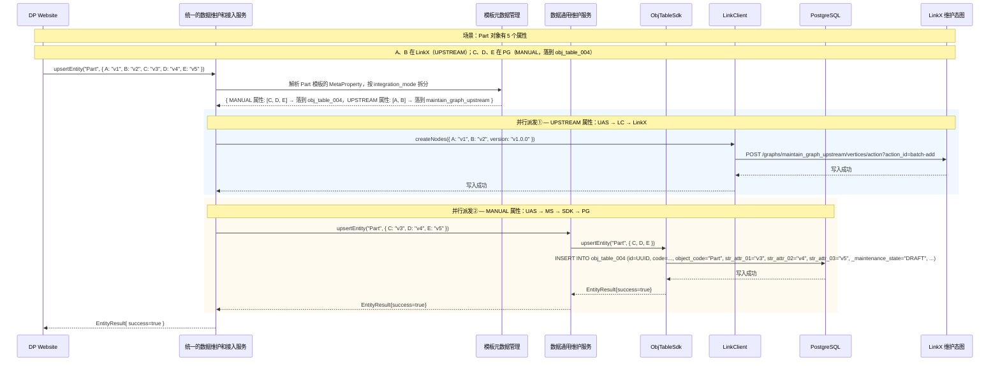
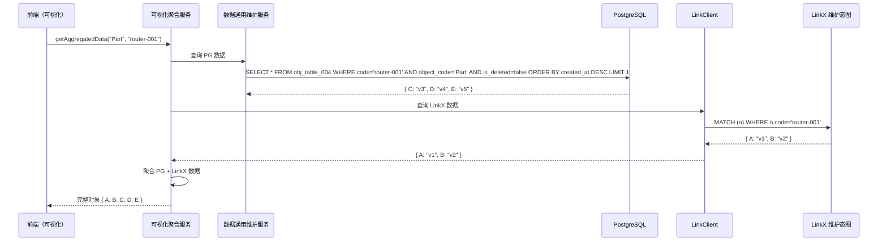
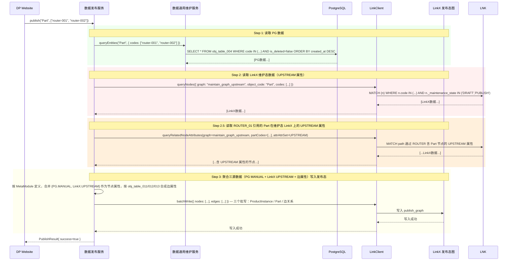

# RFC-003：数据通用维护服务 - 通用对象表映射机制（v0.5）

||| 属性 | 值 |
|| --- | --- |
|| **RFC ID** | RFC-003 |
|| **标题** | 数据通用维护服务 - 通用对象表映射机制 |
|| **状态** | Draft v0.5（通用表分配策略 + 关系实例统一建模） |
|| **创建日期** | 2026-08-02 |
|| **最后更新** | 2026-08-02 |
|| **关联章节** | 第三章 3.2.3 / 3.2.4 / 3.3.2 / 第四章 4.2.4 |
|| **架构影响** | 架构说明书 v1.14，依据本 RFC 修订 |

---

## 1. 模块所有权

| 区域 | 范围 |
| --- | --- |
| **3.2.3 模板元数据管理** | 扩展 `MetaModule` 和 `MetaProperty` 字段（`version` / `target_table` / `attr_column`），复用现有元数据存储 |
| **3.2.4 数据通用维护服务** | 按 `MetaModule.target_table` 和 `MetaProperty.attr_column` 路由到通用对象表（PG） |
| **3.2.5 数据发布服务** | 将维护态数据（PG + LinkX）聚合后，构造完整图写入发布态 LinkX |
| **跨模块边界** | 模板元数据管理 → 数据通用维护服务：前者定义映射规则，后者按规则落 PG；数据发布服务负责 PG+LinkX 聚合写入 LinkX |

---

## 2. 复用优先

- **现有入口点**：
  - 3.2.3 模板元数据管理的"模板定义服务 + Schema 同步服务"职责**扩展**（不减原有职责）
  - 3.2.2 UAS 接口契约完全保留
- **现有 helper**：
  - 4.2.4 `MetaModule` / `MetaProperty` 元数据模型**直接扩展字段**，不复用已有的 PK/UK/FK 结构
- **不新增**：
  - **不建 `business_template` / `obj_to_table_mapping` / `template_version` 表**（v0.3 已决策）
  - 不引入新的存储介质
- **可由上下文推导的字段**：
  - `MetaModule.version` 由变更自动递增
  - `MetaProperty.attr_column` 可按 `property_name` 字典序自动分配

---

## 3. OPEN 问题回答（用户决策）

| ID | 用户回答 | 含义 |
| --- | --- | --- |
| **OPEN-Q1** | 维护态采用 **PG + LinkX 混合存储**，非"LinkX 退回到 PG" | 一个业务对象的属性，按 `integration_mode` 分别落在 PG 或 LinkX；查询/可视化时需后台聚合 |
| **OPEN-Q2** | **N = 20 张**（从 v0.4 的 10 张上调） | 通用表数量为 20 张；详见 §5.2 通用表分配策略 |
| **OPEN-Q3** | **每张通用表预留 20 int + 50 String 列**，其中**前 10 int + 前 10 String 列入索引区**（可建索引），后 10 int + 后 40 String 为宽表区（不建索引） | 列类型按属性值实际类型落 int 列或 String 列；详见 §5.2.2 通用对象表 DDL |
| **OPEN-Q3b** | **关系实例与节点实例都是业务对象，统一进 `obj_table_XXX`** | 关系（ModuleStructRelation 等）通过 `MetaProperty` 定义属性，落到 `obj_table_011~013`；**不存在 `rel_module_*_relation` 独立表**；详见 §5.2.3 |
| **OPEN-Q6** | **走 LinkX**，通过发布服务按元数据在发布库构造完整图 | 发布态仍是 LinkX（ADR-001 维持），由 PS 按 MetaModule 定义构造图结构 |
| **OPEN-Q7** | 维护态**不支持图查询**（因混合存储），但支持**可视化**（后台聚合 PG+LinkX） | 不需要 Cypher 只读接口；可视化通过数据聚合层实现 |

---

## 4. 核心概念重构

### 4.1 维护态混合存储模型

> **核心原则**：一个业务对象的部分属性由 LinkX 存储，部分属性由 PG 存储，由 `integration_mode` 决定。

```
业务对象（比如一个服务器 Part）
  ├── 属性 A、B（前两个在 LinkX，通过 UPSTREAM 模式从上游同步）
  │      └── 存 LinkX 维护态图（单独的 Graph `maintain_graph_upstream`）
  ├── 属性 C、D、E（后三个在 PG，通过 MANUAL 模式在平台维护）
  │      └── 存 PG 通用表 `obj_table_004`（按 §5.2.1 分配，Part 实例落到此表）
  └── 查询时：后台同时查 LinkX + PG，聚合后返回给前端
```

### 4.2 混合存储判定规则

| `integration_mode` | 数据落哪里 | 说明 |
| --- | --- | --- |
| `MANUAL` | PostgreSQL 通用表 | 在平台手动维护 |
| `UPSTREAM` | LinkX 维护态图 | 从上游系统同步，不落 PG |
| **同一业务对象** | **PG + LinkX 混合** | 按属性粒度区分，各走各的存储 |

### 4.3 发布态流程（OPEN-Q6）

```
维护态（PG 通用表 + LinkX 维护态图）
            ↓
    数据发布服务（PS）
  ├── 按 MetaModule 定义，读取 PG 数据
  ├── 按 MetaModule 定义，读取 LinkX 维护态图数据
  └── 聚合后，按元数据 Schema 在发布态 LinkX 构造完整图
            ↓
发布态（LinkX 发布态图）
```

---

## 5. 详细设计

### 5.1 元数据表扩展

#### 5.1.1 `MetaModule` 扩展字段

```sql
ALTER TABLE meta_module
    ADD COLUMN version VARCHAR(50) NOT NULL DEFAULT 'v1.0.0' COMMENT '当前语义版本',
    ADD COLUMN target_table VARCHAR(50) COMMENT '映射到的 PG 通用表名（如 integration_mode=MANUAL）',
    ADD COLUMN target_table_key_column VARCHAR(50) NOT NULL DEFAULT 'code',
    ADD COLUMN biz_key_strategy VARCHAR(20) NOT NULL DEFAULT 'SINGLE',
    ADD INDEX idx_target_table (target_table);
```

#### 5.1.2 `MetaProperty` 扩展字段

```sql
ALTER TABLE meta_property
    ADD COLUMN attr_column VARCHAR(50) COMMENT '映射到的 PG 列名，如 str_attr_01 / int_attr_03',
    ADD COLUMN attr_required BOOLEAN NOT NULL DEFAULT FALSE,
    ADD COLUMN attr_indexed BOOLEAN NOT NULL DEFAULT FALSE;
```

### 5.2 通用表分配策略（v0.5 关键决策）

> 本节明确通用表的范围、分配原则、共用约束，以及**关系实例与节点实例统一建模**的原则。这是 v0.5 的**最关键修订**。

#### 5.2.0 设计原则

| # | 原则 | 说明 |
|---|---|---|
| 1 | **所有业务对象统一进通用表** | 节点实体（ProductClass / ProductInstance / PartClass / Part / ModuleAttribute）和**关系实体**（ModuleStructRelation / ModuleStructAttributeRelation / ModuleAttributeRelation）都是业务对象，**都按 `object_code` 分表落 `obj_table_001~020`**——不再有"节点进通用表、关系进独立表"的区分 |
| 2 | **关系实例的属性与节点实例的属性同等建模** | `min_cardinality` / `max_cardinality` / `selection_policy` / `enabled_parts` / `disabled_parts` / `spec_overrides` 等都是关系的**属性**，通过 `MetaProperty` 元数据定义，与节点的 `attr_column` 一样落到 `int_attr_01~10`（可索引）或 `str_attr_01~10`（可索引）或 `int_attr_11~20` / `str_attr_11~50`（宽表区）——**不要写死列名** |
| 3 | **每张通用表预留固定列池** | 20 个 int 列 + 50 个 String 列（详见 §5.2.2 DDL），**前 10 int + 前 10 String 是索引区**（可建索引），后 10 int + 后 40 String 是宽表区（不建索引，兜底用） |
| 4 | **图数据库的边属性是多属性，不是 JSON** | 到 LinkX 时边上的多属性由 GES 直接存为边属性（key-value 集合），**不是 JSON 字符串**。维护态和发布态两侧均不允许出现"边属性塞进 JSONB 字段" |

#### 5.2.1 通用对象表分配（节点实体 + 关系实体 × 20 张表）

> **N = 20 张**（用户决策 OPEN-Q2 上调）。**节点实体和关系实体都是业务对象**，都按 `object_code` 分表落 `obj_table_001~020`——不再有"节点进通用表、关系进独立表"的区分。下表给出 20 张表的预分配。

| 表名 | 承载实体类型 | object_code / struct_type | 目标行数（v1.0） | 备注 |
|---|---|---|---|---|
| `obj_table_001` | ProductClass | PRODUCT_CLASS | ~5,000 | 路由器/服务器/交换机等大类 |
| `obj_table_002` | ProductInstance | PRODUCT_INSTANCE | ~2,000 | 销售产品实例 |
| `obj_table_003` | PartClass | PART_CLASS | ~50,000 | 部件分类（含 CB+New 兼容位） |
| `obj_table_004` | Part | PART | ~2,000,000 | **最大表** |
| `obj_table_005` | ModuleAttribute（SPEC 维度） | META_ATTR_SPEC | ~10,000 | 规格属性定义 |
| `obj_table_006` | ModuleAttribute（PARAM 维度） | META_ATTR_PARAM | ~5,000 | 参数属性 |
| `obj_table_007` | ModuleAttribute（MARKETING） | META_ATTR_MARKETING | ~3,000 | 营销属性 |
| `obj_table_008` | ModuleAttribute（DELIVERY） | META_ATTR_DELIVERY | ~2,000 | 交付属性 |
| `obj_table_009` | ModuleAttribute（FINANCE） | META_ATTR_FINANCE | ~1,000 | 财务属性 |
| `obj_table_010` | ModuleAttribute（OPERATION） | META_ATTR_OPERATION | ~1,000 | 运维属性 |
| `obj_table_011` | **ModuleStructRelation**（结构间关系） | STRUCT_RELATION | ~500,000 | ProductClass → PartClass（CONTAINS/EXTENDS/REFERENCES/INSTANTIATES） |
| `obj_table_012` | **ModuleStructAttributeRelation**（结构-属性关系） | STRUCT_ATTR_RELATION | ~200,000 | PartClass → ModuleAttribute（HAS） |
| `obj_table_013` | **ModuleAttributeRelation**（属性间关系） | ATTR_RELATION | ~50,000 | ModuleAttribute → ModuleAttribute（DEPENDS_ON / MUTUALLY_EXCLUSIVE / REQUIRES） |
| `obj_table_014~020` | **预留**（v1.1+ 扩展位） | — | — | 当上述任一表行数超 80% 上限或新增 `object_code` 时启用 |

**共用约束**：
- 每张通用表只承载**一种 `object_code`**——通过 `object_code` 字段做硬约束，应用层 SDK（ObjTableSdk）写入时强制校验
- 单表物理行数上限 **500 万行**（按 200 万 Part + 5 倍增长预估，PG 单表性能拐点）
- 单表预留 20 int + 50 String 列池，**先填索引区（前 10/10），再用宽表区**——`MetaProperty.attr_indexed = true` 的属性必须落到索引区
- **关系实例的属性（如 `min_cardinality` / `max_cardinality` / `selection_policy` / `enabled_parts` / `spec_overrides` 等）也按上述规则**，通过 `MetaProperty` 定义后落到对应 `int_attr_NN` / `str_attr_NN` 列——**不要写死列名**
- 跨表 JOIN **禁止**——20 张表之间无任何 FK 关系，跨实体引用通过 `code` 业务键（应用层校验一致性）

#### 5.2.2 通用对象表 DDL（索引区 + 宽表区）

```sql
-- 通用对象表（预建 20 张，此处示例 obj_table_001，对应 ProductClass）
-- 所有业务对象（节点 + 关系）共用此 DDL 模板
CREATE TABLE obj_table_001 (
    -- ========== 系统字段 ==========
    id                  VARCHAR(36) PRIMARY KEY,            -- 快照 UUID（每行独立）
    code                VARCHAR(100) NOT NULL,              -- 业务标识（同一实体所有版本共享）
    object_code         VARCHAR(50)  NOT NULL,              -- 实体类型（= "ProductClass"，硬约束）
    version             VARCHAR(50)  NOT NULL,              -- 语义版本（由 MetaModule.version 注入）
    _maintenance_state  VARCHAR(20)  NOT NULL DEFAULT 'DRAFT', -- DRAFT / PUBLISH
    created_at          DATETIME     NOT NULL DEFAULT CURRENT_TIMESTAMP,
    created_by          VARCHAR(100),
    is_deleted          BOOLEAN      NOT NULL DEFAULT FALSE,

    -- ========== 索引区（10 int + 10 String，可建索引）==========
    -- 用法：MetaProperty.attr_indexed = true 的属性分配到这里
    int_attr_01         BIGINT,                              int_attr_02         BIGINT,
    int_attr_03         BIGINT,                              int_attr_04         BIGINT,
    int_attr_05         BIGINT,                              int_attr_06         BIGINT,
    int_attr_07         BIGINT,                              int_attr_08         BIGINT,
    int_attr_09         BIGINT,                              int_attr_10         BIGINT,
    str_attr_01         VARCHAR(500),                        str_attr_02         VARCHAR(500),
    str_attr_03         VARCHAR(500),                        str_attr_04         VARCHAR(500),
    str_attr_05         VARCHAR(500),                        str_attr_06         VARCHAR(500),
    str_attr_07         VARCHAR(500),                        str_attr_08         VARCHAR(500),
    str_attr_09         VARCHAR(500),                        str_attr_10         VARCHAR(500),

    -- ========== 宽表区（10 int + 40 String，不建索引，仅兜底）==========
    int_attr_11         BIGINT,                              int_attr_12         BIGINT,
    int_attr_13         BIGINT,                              int_attr_14         BIGINT,
    int_attr_15         BIGINT,                              int_attr_16         BIGINT,
    int_attr_17         BIGINT,                              int_attr_18         BIGINT,
    int_attr_19         BIGINT,                              int_attr_20         BIGINT,
    str_attr_11         VARCHAR(500),                        str_attr_12         VARCHAR(500),
    str_attr_13         VARCHAR(500),                        str_attr_14         VARCHAR(500),
    str_attr_15         VARCHAR(500),                        str_attr_16         VARCHAR(500),
    str_attr_17         VARCHAR(500),                        str_attr_18         VARCHAR(500),
    str_attr_19         VARCHAR(500),                        str_attr_20         VARCHAR(500),
    str_attr_21         VARCHAR(500),                        str_attr_22         VARCHAR(500),
    str_attr_23         VARCHAR(500),                        str_attr_24         VARCHAR(500),
    str_attr_25         VARCHAR(500),                        str_attr_26         VARCHAR(500),
    str_attr_27         VARCHAR(500),                        str_attr_28         VARCHAR(500),
    str_attr_29         VARCHAR(500),                        str_attr_30         VARCHAR(500),
    str_attr_31         VARCHAR(500),                        str_attr_32         VARCHAR(500),
    str_attr_33         VARCHAR(500),                        str_attr_34         VARCHAR(500),
    str_attr_35         VARCHAR(500),                        str_attr_36         VARCHAR(500),
    str_attr_37         VARCHAR(500),                        str_attr_38         VARCHAR(500),
    str_attr_39         VARCHAR(500),                        str_attr_40         VARCHAR(500),
    str_attr_41         VARCHAR(500),                        str_attr_42         VARCHAR(500),
    str_attr_43         VARCHAR(500),                        str_attr_44         VARCHAR(500),
    str_attr_45         VARCHAR(500),                        str_attr_46         VARCHAR(500),
    str_attr_47         VARCHAR(500),                        str_attr_48         VARCHAR(500),
    str_attr_49         VARCHAR(500),                        str_attr_50         VARCHAR(500),

    -- ========== 索引（系统字段 + 索引区）==========
    INDEX idx_code (code),
    INDEX idx_object_code (object_code),
    INDEX idx_state (_maintenance_state),
    INDEX idx_int_attr_01 (int_attr_01),
    INDEX idx_int_attr_02 (int_attr_02),
    INDEX idx_int_attr_03 (int_attr_03),
    INDEX idx_int_attr_04 (int_attr_04),
    INDEX idx_int_attr_05 (int_attr_05),
    INDEX idx_int_attr_06 (int_attr_06),
    INDEX idx_int_attr_07 (int_attr_07),
    INDEX idx_int_attr_08 (int_attr_08),
    INDEX idx_int_attr_09 (int_attr_09),
    INDEX idx_int_attr_10 (int_attr_10),
    INDEX idx_str_attr_01 (str_attr_01),
    INDEX idx_str_attr_02 (str_attr_02),
    INDEX idx_str_attr_03 (str_attr_03),
    INDEX idx_str_attr_04 (str_attr_04),
    INDEX idx_str_attr_05 (str_attr_05),
    INDEX idx_str_attr_06 (str_attr_06),
    INDEX idx_str_attr_07 (str_attr_07),
    INDEX idx_str_attr_08 (str_attr_08),
    INDEX idx_str_attr_09 (str_attr_09),
    INDEX idx_str_attr_10 (str_attr_10)
) ENGINE=InnoDB DEFAULT CHARSET=utf8mb4 COMMENT '通用对象表 - 001 (ProductClass)';
```

**列分配规则**：

| 条件 | 落到哪 |
|---|
| `MetaProperty.data_type IN (NUMBER, INTEGER, BOOLEAN)` + `attr_indexed = true` | `int_attr_01~10`（按字典序自动分配） |
| `MetaProperty.data_type IN (NUMBER, INTEGER, BOOLEAN)` + `attr_indexed = false` | `int_attr_11~20` |
| `MetaProperty.data_type IN (STRING, ENUM, DATE)` + `attr_indexed = true` | `str_attr_01~10` |
| `MetaProperty.data_type IN (STRING, ENUM, DATE)` + `attr_indexed = false` | `str_attr_11~50` |
| **超出 70 列上限** | **报错拒绝**（不允许跨表 / 不允许 JSONB） |

#### 5.2.3 关系实例建模（与节点实例同等对待）

> **v0.5 修订（架构评审用户反馈）**：~~关系独立成 `rel_module_*_relation` 表~~（v0.5 已废）。**关系实体与节点实体是同类的业务对象，都按 `object_code` 分表落 `obj_table_001~020`**。关系的属性（如 `min_cardinality` / `max_cardinality` / `selection_policy` / `enabled_parts` / `disabled_parts` / `spec_overrides` 等）通过 `MetaProperty` 元数据定义，与节点的属性一样落到 `int_attr_01~20` / `str_attr_01~50`，**不要写死列名**。

##### 5.2.3.1 关系实例的元数据建模示例

以 **ModuleStructRelation**（ProductClass → PartClass，CONTAINS）为例：

**Step 1：创建 MetaModule**

```json
{
  "id": "meta-module-struct-relation-001",
  "code": "ModuleStructRelation",
  "name": "结构间关系",
  "struct_type": "STRUCT_RELATION",
  "version": "v1.0.0",
  "target_table": "obj_table_011",
  "target_table_key_column": "code",
  "biz_key_strategy": "SINGLE",
  "maintenance_mode": "GENERAL",
  "integration_mode": "MANUAL",
  "status": "ACTIVE"
}
```

**Step 2：创建 MetaProperty（关系的属性）**

| 属性名 | code | data_type | integration_mode | attr_column | attr_indexed |
|---|---|---|---|---|---|
| 源实体 code | `source_module_code` | STRING | MANUAL | `str_attr_01` | true |
| 目标实体 code | `target_module_code` | STRING | MANUAL | `str_attr_02` | true |
| 关系类型 | `relation_type` | ENUM | MANUAL | `str_attr_03` | true |
| 最小数量 | `min_cardinality` | INTEGER | MANUAL | `int_attr_01` | true |
| 最大数量 | `max_cardinality` | INTEGER | MANUAL | `int_attr_02` | true |
| 选择策略 | `selection_policy` | ENUM | MANUAL | `str_attr_04` | false |
| 默认选中 | `default_selected` | BOOLEAN | MANUAL | `int_attr_03` | false |
| 继承策略 | `inheritance_policy` | ENUM | MANUAL | `str_attr_05` | false |
| 维度标记 | `dimension` | ENUM | MANUAL | `str_attr_06` | false |
| 最小数量（Part 用） | `min_qty` | INTEGER | MANUAL | `int_attr_04` | false |
| 最大数量（Part 用） | `max_qty` | INTEGER | MANUAL | `int_attr_05` | false |

##### 5.2.3.2 关系实例的 PG 落库结果（示例）

ModuleStructRelation 实例（ROUTER_PLATFORM → ROUTER_CPU，CONTAINS，数量约束 1~10）：

```json
// 调用 MS.upsertEntity("ModuleStructRelation", { ... })
// 实际写入 obj_table_011
{
  "id": "UUID-rel-001",
  "code": "ROUTER_PLATFORM-CONTAINS-ROUTER_CPU-001",
  "object_code": "ModuleStructRelation",
  "version": "v1.0.0",
  "_maintenance_state": "DRAFT",
  "created_at": "2026-08-02T...",
  "created_by": "ACT-02",
  "is_deleted": false,
  "str_attr_01": "ROUTER_PLATFORM",
  "str_attr_02": "ROUTER_CPU",
  "str_attr_03": "CONTAINS",
  "str_attr_04": "REQUIRED",
  "str_attr_05": null,
  "str_attr_06": null,
  "int_attr_01": 1,
  "int_attr_02": 10,
  "int_attr_03": 1,
  "int_attr_04": null,
  "int_attr_05": null
}
```

##### 5.2.3.3 LinkX 发布态的关系边（边属性直接映射）

发布时，PS.ReadAggregator 从 `obj_table_011` 读取 ModuleStructRelation 实例，PS.PublishWriter 按 MetaModule 定义，将行字段一一映射为 **LinkX GES 边属性**（key-value 集合，GES 原生支持多属性边）：

```
GES Edge:
  source: 节点 (code: "ROUTER_PLATFORM", label: "ProductClass")
  target: 节点 (code: "ROUTER_CPU", label: "PartClass")
  label: "CONTAINS"
  properties: {
    source_module_code: "ROUTER_PLATFORM",
    target_module_code: "ROUTER_CPU",
    relation_type: "CONTAINS",
    min_cardinality: 1,
    max_cardinality: 10,
    selection_policy: "REQUIRED",
    default_selected: true,
    version: "v1.0.0",
    _maintenance_state: "DRAFT"
  }
```

##### 5.2.3.4 与节点实例的对比

| 维度 | 节点实例（ProductClass） | 关系实例（ModuleStructRelation） |
|---|---|---|
| object_code | `"ProductClass"` | `"ModuleStructRelation"` |
| 落哪张表 | `obj_table_001` | `obj_table_011` |
| 元数据定义 | MetaProperty 定义属性（name / positioning 等） | MetaProperty 定义属性（source_module_code / min_cardinality 等） |
| PG 列映射 | `str_attr_01` = name, `str_attr_02` = positioning, ... | `str_attr_01` = source_module_code, `int_attr_01` = min_cardinality, ... |
| LinkX 发布态 | GES 节点（带属性） | GES 边（带多属性，GES 原生支持） |
| MetaModule.target_table | `obj_table_001` | `obj_table_011` |

### 5.3 通用对象表 SDK 设计（ObjTableSdk）

> 本节定义数据通用维护服务对 PostgreSQL 通用对象表的 Java SDK。**节点和关系共用同一 SDK**，通过 `object_code` 自动路由到对应表。

#### 设计原则

| 原则 | 说明 |
| --- | --- |
| **映射直读** | 映射规则从 `MetaModule.target_table` / `MetaProperty.attr_column` 直读，无需 JOIN 映射表 |
| **动态列名** | SQL 中的列名通过元数据获取，禁止拼接用户输入的列名 |
| **参数化查询** | 所有属性值必须参数化（`PreparedStatement`），防止 SQL 注入 |
| **版本快照=物理行** | 每次写入产生新 `id`（UUID），`code` 不变，`version` 由 `MetaModule.version` 注入 |

#### Java SDK 实现

```java
package com.digitalproduct.maintenance.sdk;

@Service
@RequiredArgsConstructor
public class ObjTableSdk {

    private final NamedParameterJdbcTemplate jdbcTemplate;
    private final MetaModuleRepository metaModuleRepo;
    private final MetaPropertyRepository metaPropertyRepo;

    /** 通用对象 upsert：按 metaModuleCode 读取 target_table，再按 attr_column 构造 INSERT */
    public EntityResult upsertEntity(String metaModuleCode, Map<String, Object> entityData,
                                     String operator) {
        // Step 1: 读取元数据（缓存）
        MetaModule meta = metaModuleRepo.findByCode(metaModuleCode)
            .orElseThrow(() -> new BusinessException("META_NOT_FOUND", metaModuleCode));
        List<MetaProperty> props = metaPropertyRepo.findByModuleId(meta.getId());

        // Step 2: 提取业务标识（target_table_key_column，默认 code）
        String keyColumn = meta.getTargetTableKeyColumn();
        Object keyValue = entityData.get(keyColumn);

        // Step 3: 按 attr_column 分组属性
        Map<String, Object> attrValues = new HashMap<>();
        for (MetaProperty prop : props) {
            if (prop.getAttrColumn() != null && entityData.containsKey(prop.getCode())) {
                attrValues.put(prop.getAttrColumn(), entityData.get(prop.getCode()));
            }
        }

        // Step 4: 构造 INSERT（每次写入新行，即快照）
        String sql = buildInsertSql(meta.getTargetTable(), keyColumn, attrValues.keySet());
        MapSqlParameterSource params = new MapSqlParameterSource();
        params.addValue("id", UUID.randomUUID().toString());
        params.addValue(keyColumn, keyValue);
        params.addValue("object_code", metaModuleCode);
        params.addValue("version", meta.getVersion());
        params.addValue("_maintenance_state", "DRAFT");
        params.addValue("created_by", operator);
        for (Map.Entry<String, Object> e : attrValues.entrySet()) {
            params.addValue(e.getKey(), e.getValue());
        }
        jdbcTemplate.update(sql, params);
        return EntityResult.success();
    }

    /** 按 code 查询最新版本 */
    public Optional<Map<String, Object>> getByCode(String metaModuleCode, String code) {
        MetaModule meta = metaModuleRepo.findByCode(metaModuleCode).orElse(null);
        if (meta == null) return Optional.empty();
        String sql = String.format(
            "SELECT * FROM %s WHERE code = :code AND is_deleted = false ORDER BY created_at DESC LIMIT 1",
            meta.getTargetTable());
        List<Map<String, Object>> rows = jdbcTemplate.queryForList(sql,
            new MapSqlParameterSource("code", code));
        return rows.isEmpty() ? Optional.empty() : Optional.of(rows.get(0));
    }

    /** 查询所有版本（按 code） */
    public List<Map<String, Object>> listVersions(String metaModuleCode, String code) {
        MetaModule meta = metaModuleRepo.findByCode(metaModuleCode).orElse(null);
        if (meta == null) return Collections.emptyList();
        String sql = String.format(
            "SELECT * FROM %s WHERE code = :code AND is_deleted = false ORDER BY created_at DESC",
            meta.getTargetTable());
        return jdbcTemplate.queryForList(sql, new MapSqlParameterSource("code", code));
    }

    /** 列名全部来自元数据，无用户输入拼接，安全 */
    private String buildInsertSql(String table, String keyColumn, Set<String> attrColumns) {
        List<String> allColumns = Arrays.asList(
            "id", keyColumn, "object_code", "version",
            "_maintenance_state", "created_by");
        allColumns.addAll(attrColumns);
        allColumns.add("is_deleted");
        String cols = String.join(", ", allColumns);
        String placeholders = allColumns.stream().map(c -> ":" + c).collect(Collectors.joining(", "));
        return String.format("INSERT INTO %s (%s, is_deleted) VALUES (%s, false)", table, cols, placeholders);
    }
}
```

### 5.4 LinkX 维护态图设计

> 当 `integration_mode = UPSTREAM` 时，属性的实例数据存在 LinkX 维护态图，与 PG 通用表完全独立。

| 配置项 | 值 |
| --- | --- |
| Graph 名称 | `maintain_graph_upstream` |
| Label 命名 | `{object_code}`（如 `RouterPartClass`） |
| 属性存储 | 节点属性存储该属性的值 |
| 版本字段 | `version` 属性（语义版本） |
| 维护态/发布态 | `_maintenance_state` 属性标记 |

### 5.5 数据通用维护服务（3.2.4）

```typescript
interface ICommonMaintenanceService {
    // ========== 通用对象 CRUD（仅 PG 部分） ==========
    upsertEntity(metaModuleCode: string, entity: Record<string, any>): Promise<EntityResult>;
    getEntity(metaModuleCode: string, code: string, version?: string): Promise<Record<string, any>>;
    deleteEntity(metaModuleCode: string, code: string): Promise<DeleteResult>;
    queryEntities(metaModuleCode: string, criteria: QueryCriteria): Promise<QueryResult<Record<string, any>>>;

    // ========== 批量操作 ==========
    batchUpsert(metaModuleCode: string, entities: Record<string, any>[]): Promise<BatchResult>;
    batchDelete(metaModuleCode: string, codes: string[]): Promise<BatchResult>;

    // ========== 版本快照（融入通用表） ==========
    listVersions(metaModuleCode: string, code: string): Promise<VersionListResult>;
    getVersionData(metaModuleCode: string, code: string, version: string): Promise<Record<string, any>>;
}
```

### 5.6 数据发布服务（3.2.5）

```typescript
interface IPublishService {
    /**
     * 发布：将维护态数据（PG + LinkX）聚合后，写入发布态 LinkX
     * 按 MetaModule 定义，读取 PG 数据 + LinkX 维护态图数据，构造完整图
     */
    publish(metaModuleCode: string, codes: string[]): Promise<PublishResult>;

    /**
     * 回滚：删除发布态中指定版本的数据
     */
    rollbackPublished(metaModuleCode: string, version: string): Promise<RollbackResult>;
}
```

### 5.7 可视化数据聚合层

> 维护态不支持图查询，但支持可视化展示。
> 实现方式：后台同时查询 PG + LinkX，数据在内存聚合后返回前端。

```typescript
interface IVisualizationAggregationService {
    /**
     * 聚合查询：同时查 PG + LinkX，聚合后返回
     * 用于图可视化展示
     */
    aggregateForVisualization(metaModuleCode: string, code: string): Promise<AggregatedResult>;
}
```

---

## 6. 关键流程

### 6.1 混合存储写入（UAS 并行派发，与架构文档 v1.14 §6.2.6 对齐）



### 6.2 混合存储查询（用于可视化）



### 6.3 发布流程



---

## 7. 验收与测试

### 7.1 验收命令

```bash
# 单元测试
mvn -pl digitalproduct-template-meta test -Dtest=TemplateMetaServiceTest
mvn -pl digitalproduct-maintenance test -Dtest=CommonMaintenanceServiceTest

# 集成测试（Testcontainers Postgres + H2 LinkX Mock）
mvn -pl digitalproduct-template-meta,digitalproduct-maintenance verify -P integration

# 性能基线（单点查询 P99）
mvn -pl digitalproduct-maintenance jmeter:run -PperfTest
```

### 7.2 验收用例

| ID | 场景 | 期望 |
| --- | --- | --- |
| AC-1 | 创建 MetaModule 时指定 `target_table` 和 `version` | 元数据写入成功 |
| AC-2 | 创建 MetaProperty 时指定 `attr_column` | 属性与 PG 列正确映射 |
| AC-3 | MANUAL 属性写入 PG | 落到正确的通用表 |
| AC-4 | UPSTREAM 属性写入 LinkX | 落到 maintain_graph_upstream |
| AC-5 | 同一对象 5 个属性，部分 MANUAL、部分 UPSTREAM | 分别落入 PG 和 LinkX |
| AC-6 | 可视化聚合查询 | 后台同时查 PG + LinkX，返回完整对象 |
| AC-7 | 修改 `MetaModule.version` | 语义版本更新，后续写入带新版本号 |
| AC-8 | 按 `code` 查询所有版本 | 返回多条记录（不同 `id`，相同 `code`） |
| AC-9 | 发布服务聚合 PG + LinkX 数据写入发布态 | 发布态 LinkX 包含完整对象 |
| AC-10 | DP Website 通过 UAS 调用 | 对上层完全透明 |
| **AC-11（v0.5 新增）** | ModuleStructRelation 实例写入 | 落到 `obj_table_011`，属性按 `MetaProperty.attr_column` 映射到 `int_attr_01` / `str_attr_01` 等 |
| **AC-12（v0.5 新增）** | ModuleStructRelation 发布为 GES 边 | PS.ReadAggregator 从 `obj_table_011` 读取，PS.PublishWriter 映射为 GES 边属性 |

---

## 8. 简化版服务器样例数据验收

### 8.1 场景说明

以一个简化的"服务器"（Server）业务对象为例，验证数据通用维护服务的完整能力。

**服务器有 5 个属性**（按 §5.2.1 分配原则，PART 落到 `obj_table_004`）：

| 属性名 | 业务含义 | integration_mode | data_type | 存储位置 | 列分配 |
| --- | --- | --- | --- | --- | --- |
| `server_code` | 服务器编码 | MANUAL | STRING | PG | `str_attr_01`（索引区，建索引） |
| `server_name` | 服务器名称 | MANUAL | STRING | PG | `str_attr_02`（索引区，建索引） |
| `cpu_count` | CPU 数量 | UPSTREAM | NUMBER | LinkX | 节点属性 `cpu_count` |
| `memory_gb` | 内存大小 | UPSTREAM | NUMBER | LinkX | 节点属性 `memory_gb` |
| `status` | 运行状态 | MANUAL | ENUM | PG | `str_attr_03`（索引区，建索引） |

### 8.2 元数据配置

**Step 1：创建 MetaModule**

```json
{
  "id": "meta-server-001",
  "code": "Server",
  "name": "服务器",
  "struct_type": "PART",
  "version": "v1.0.0",
  "target_table": "obj_table_004",
  "target_table_key_column": "code",
  "biz_key_strategy": "SINGLE",
  "maintenance_mode": "GENERAL",
  "integration_mode": "MANUAL",
  "status": "ACTIVE"
}
```

**Step 2：创建 MetaProperty（5 个属性）**

| 属性名 | code | data_type | integration_mode | attr_column / LinkX 属性 | attr_indexed |
| --- | --- | --- | --- | --- | --- |
| 服务器编码 | `server_code` | STRING | MANUAL | `str_attr_01` | true |
| 服务器名称 | `server_name` | STRING | MANUAL | `str_attr_02` | true |
| CPU 数量 | `cpu_count` | NUMBER | UPSTREAM | LinkX 属性 `cpu_count` | — |
| 内存大小 | `memory_gb` | NUMBER | UPSTREAM | LinkX 属性 `memory_gb` | — |
| 运行状态 | `status` | ENUM | MANUAL | `str_attr_03` | true |

### 8.3 业务数据写入

**写入请求（通过 UAS 调用）**

```json
{
  "server_code": "SRV-001",
  "server_name": "测试服务器",
  "cpu_count": 8,
  "memory_gb": 64,
  "status": "RUNNING"
}
```

**实际落库结果**

| 存储 | 位置 | 数据 |
| --- | --- | --- |
| PG | `obj_table_004` | `{ id: UUID-1, code: "SRV-001", object_code: "Server", version: "v1.0.0", str_attr_01: "SRV-001", str_attr_02: "测试服务器", str_attr_03: "RUNNING" }` |
| LinkX | `maintain_graph_upstream` | Node: `{ code: "SRV-001", object_code: "Server", version: "v1.0.0", cpu_count: 8, memory_gb: 64 }` |

### 8.4 查询（可视化聚合）

```mermaid
sequenceDiagram
    participant FE as 前端
    participant VAS as 可视化聚合服务
    participant MS as 数据通用维护服务
    participant PG as PostgreSQL
    participant LC as LinkClient
    participant LNK as LinkX

    FE->>VAS: GET /visualize/Server/SRV-001

    par 并行查询
        VAS->>MS: getEntity("Server", "SRV-001")
        MS->>PG: SELECT * FROM obj_table_004 WHERE code='SRV-001' AND object_code='Server' ORDER BY created_at DESC LIMIT 1
        PG-->>MS: { str_attr_01: "SRV-001", str_attr_02: "测试服务器", str_attr_03: "RUNNING" }
        MS-->>VAS: { server_code: "SRV-001", server_name: "测试服务器", status: "RUNNING" }
    and 并行查询
        VAS->>LC: queryNodes({ object_code: "Server", code: "SRV-001" })
        LC->>LNK: MATCH (n) WHERE n.code='SRV-001'
        LNK-->>LC: { cpu_count: 8, memory_gb: 64 }
        LC-->>VAS: { cpu_count: 8, memory_gb: 64 }
    end

    VAS->>VAS: 聚合为完整对象
    VAS-->>FE: {
        server_code: "SRV-001",
        server_name: "测试服务器",
        cpu_count: 8,
        memory_gb: 64,
        status: "RUNNING"
    }
```

### 8.5 版本管理验证

**修改属性值（触发 AUTO 快照）**

```json
{
  "server_name": "测试服务器-V2",
  "status": "MAINTENANCE"
}
```

结果：

| 存储 | 结果 |
| --- | --- |
| PG | 新行：`{ id: UUID-2, code: "SRV-001", version: "v1.0.0", str_attr_01: "SRV-001", str_attr_02: "测试服务器-V2", str_attr_03: "MAINTENANCE" }`（UUID-1 保留为历史） |
| LinkX | 新节点：`{ code: "SRV-001", cpu_count: 8, memory_gb: 64, version: "v1.0.0" }` |

**查询所有版本**

```sql
SELECT * FROM obj_table_004 WHERE code = 'SRV-001' AND is_deleted=false ORDER BY created_at DESC;
```

返回 2 条记录（UUID-1 和 UUID-2），version 均为 v1.0.0（语义版本不变，除非显式发布新版本）。

### 8.6 发布验证

发布后，发布态 LinkX（`publish_graph`）包含聚合后的完整节点：

```json
{
  "code": "SRV-001",
  "object_code": "Server",
  "version": "v1.0.0",
  "server_code": "SRV-001",
  "server_name": "测试服务器-V2",
  "cpu_count": 8,
  "memory_gb": 64,
  "status": "MAINTENANCE",
  "_maintenance_state": "PUBLISH"
}
```

---

## 9. 风险与冲突分析

| # | 冲突点 | v1.6 原方案 | 本方案 v0.5 | 严重度 |
| --- | --- | --- | --- | --- |
| **C-1** | 维护态存储 | 全部入 LinkX | **PG + LinkX 混合** | 🔴 严重 |
| **C-2** | LinkX 角色 | 业务数据主要存储 | 仅存 UPSTREAM 属性 + 发布态 | 🟡 中等 |
| **C-3** | 图查询 | 全场景 Cypher | 仅发布态支持图查询；维护态仅可视化聚合 | 🟡 中等 |
| **C-4** | 发布态 | 未明确 | 维护态 PG+LinkX → PS 聚合 → 发布态 LinkX | 🟢 已解决 |
| **C-5** | 元数据表结构 | 仅有基础字段 | 扩展 `version` / `target_table` / `attr_column` | 🟢 极小 |
| **C-6（v0.5 新增）** | 关系存储 | ~~独立 `rel_module_*_relation` 表~~ | **统一进 `obj_table_001~020`**，通过 MetaProperty 定义属性 | 🟢 已解决 |

---

## 10. 修订记录

| 版本 | 日期 | 修订内容 |
| --- | --- | --- |
| 0.1 | 2026-08-02 | 初稿 |
| 0.2 | 2026-08-02 | 重构：① 模板管理划归"模板元数据管理"；② 通用表引入 `id`/`code`/`version` 三字段；③ 版本管理融入通用表；④ 删除 4.4 / 5.3 整章 |
| 0.3 | 2026-08-02 | 简化：删除 business_template / obj_to_table_mapping / template_version 三张表；版本和映射直接加字段到 MetaModule / MetaProperty |
| 0.4 | 2026-08-02 | **OPEN 问题用户回答**：① OPEN-Q1 = 维护态 PG+LinkX 混合存储（非退回到 PG）；② OPEN-Q2 = N=10；③ OPEN-Q6 = 发布态走 LinkX（由 PS 按元数据构造图）；④ OPEN-Q7 = 维护态不支持图查询但支持可视化（后台聚合）；⑤ 新增验收章节（含服务器简化样例） |
| **0.5** | **2026-08-02** | **架构对抗评审第二轮修订**：① OPEN-Q2 = **N=20 张**；② OPEN-Q3 = 每张通用表预留 **20 int + 50 String**，前 10/10 为索引区（可建索引），后 10/40 为宽表区；③ OPEN-Q3b = **关系实例与节点实例统一建模**，`rel_module_*_relation` 表**已废**，ModuleStructRelation / ModuleStructAttributeRelation / ModuleAttributeRelation 分别进 `obj_table_011~013`；④ §5.2.1 分配表补 3 行 Relation 表；⑤ §5.2.3 整章重写为"关系实例建模（与节点实例同等对待）"：元数据建模示例 + PG 落库结果 + GES 边映射 + 节点/关系对比表；⑥ §6.1 时序图重构为 **UAS 并行派发**；⑦ §6.3 发布流程加 **Step 2.5 + 三源聚合**；⑧ §7.2 新增 AC-11/AC-12 关系实例验收用例；⑨ OPEN-Q3b 回答更新为"统一建模"；⑩ 风险分析新增 C-6 |

---

## 附录 A：OPEN 问题最终状态

| ID | 问题 | 决策 | 说明 |
| --- | --- | --- | --- |
| OPEN-Q1 | 维护态存储介质 | **混合存储** | PG（MANUAL）+ LinkX（UPSTREAM）各存一部分 |
| OPEN-Q2 | 通用表数量 | **N=20** | v0.5 用户决策（从 v0.4 的 N=10 上调） |
| OPEN-Q3 | 扩展属性列结构 | **20 int + 50 String（前 10/10 索引区，后 10/40 宽表区）** | v0.5 用户决策；DATA_TYPE 决定 int/str 列；attr_indexed 决定索引/宽表 |
| OPEN-Q3b | 关系实例存储（v0.5 修订） | **统一进 `obj_table_001~020`**，通过 `MetaProperty` 定义属性 | v0.5 用户决策；~~`rel_module_*_relation`~~ 表已废；ModuleStructRelation → `obj_table_011`，ModuleStructAttributeRelation → `obj_table_012`，ModuleAttributeRelation → `obj_table_013` |
| OPEN-Q4 | 发布态数据 | **走 LinkX** | 由数据发布服务按元数据构造完整图 |
| OPEN-Q5 | LinkX 只读 Cypher | **不需要** | 维护态不支持图查询，仅发布态支持 |
| OPEN-Q6 | 可视化 | **后台聚合** | 同时查 PG + LinkX，内存聚合后返回前端 |

## 附录 B：关键字段变更汇总

| 字段 | 所属表 | 说明 |
| --- | --- | --- |
| `version` | MetaModule | 当前语义版本（变更时递增） |
| `target_table` | MetaModule | 映射到的 PG 通用表名（MANUAL 时使用） |
| `target_table_key_column` | MetaModule | 通用表中业务标识字段名，默认 code |
| `biz_key_strategy` | MetaModule | SINGLE / COMPOSITE |
| `attr_column` | MetaProperty | 映射到的 PG 列名（MANUAL 时使用）；**关系实例的属性也走此字段** |
| `attr_required` | MetaProperty | 该属性写入 PG 时是否必填 |
| `attr_indexed` | MetaProperty | 是否需要建索引（决定落索引区还是宽表区） |
