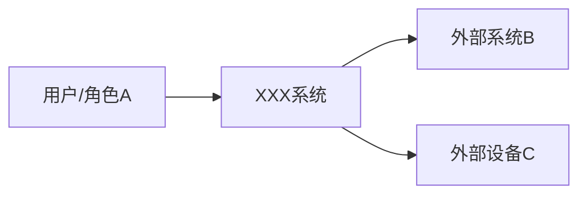
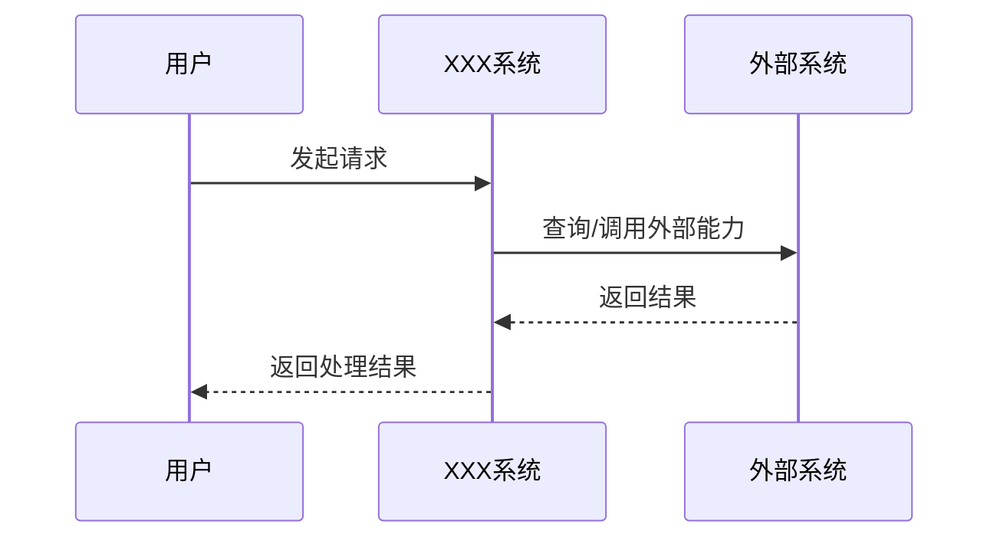
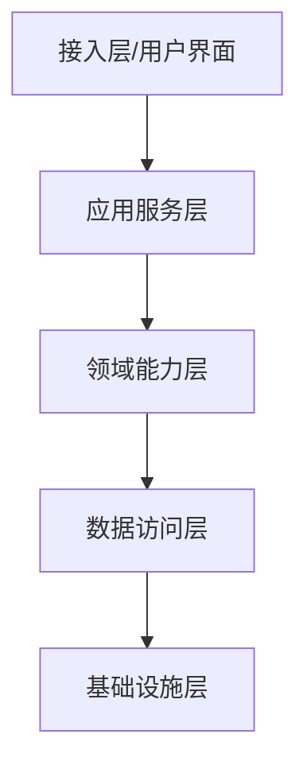
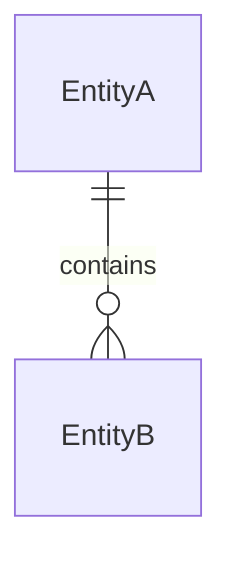
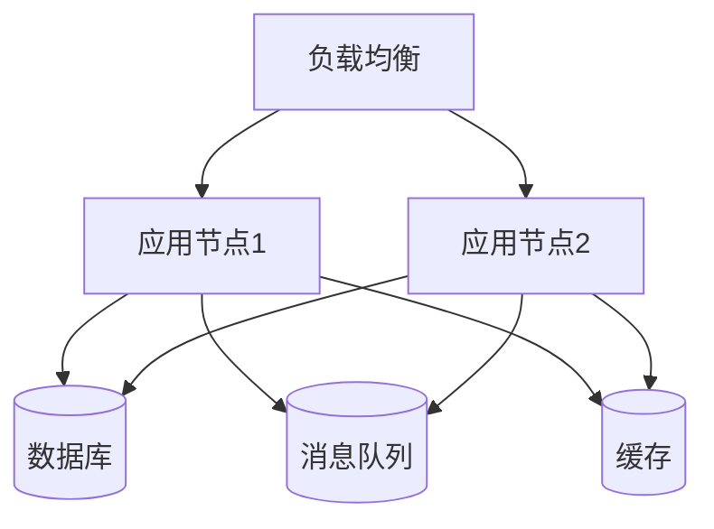
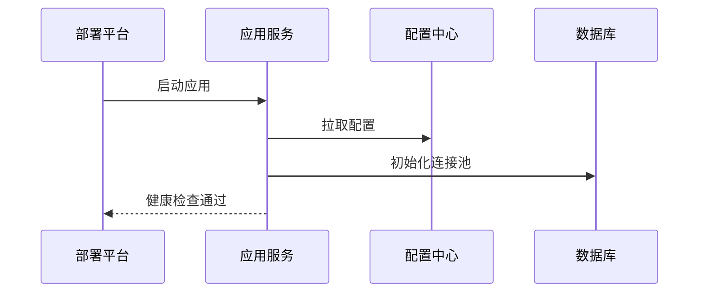
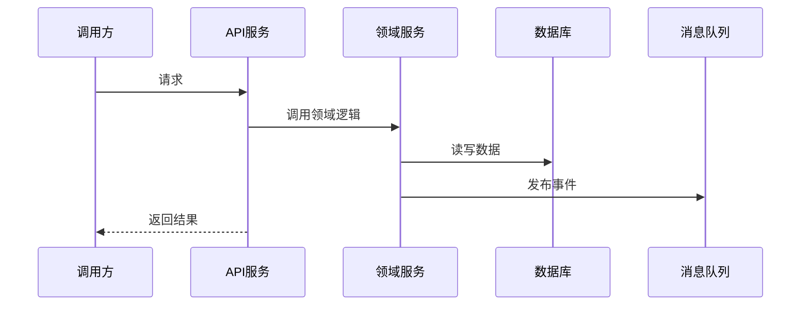
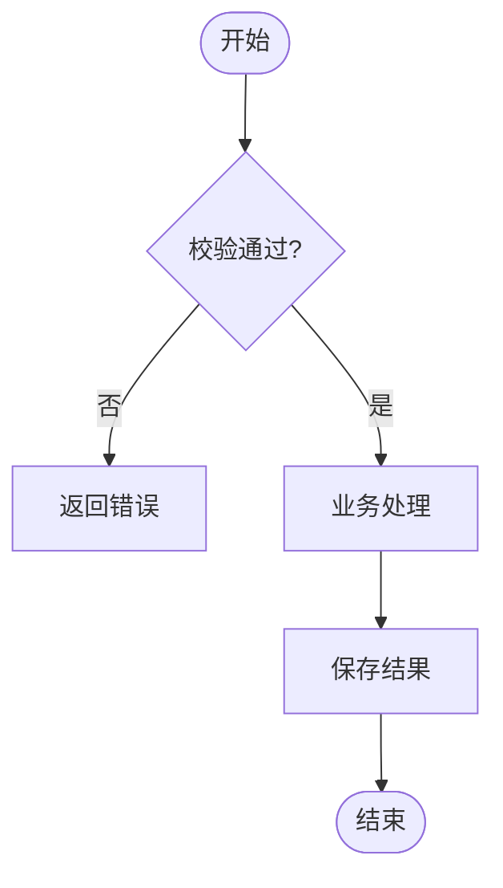

# 华为风格系统架构设计说明书模板

> 说明：本文档根据华为公开资料整理，重点参考华为云 Stack / CodeArts Modeling 公开文档中关于“架构设计说明书模板”的 4+1 架构视图说明，并结合通用系统架构设计说明书实践补齐可执行章节。未确认到可公开下载的、可直接复用的华为官方 Word 模板文件，因此本文档是“华为风格/华为公开方法参考”的 Markdown 模板，不应表述为华为内部正式模板。

## 参考资料

1. 华为云 Stack 8.5.0/8.6.1 解决方案描述公开文档：其中说明 4+1 视图是一组相关模型集合，通过逻辑、开发、部署、运行四个典型视角描述系统切面，并以用例视图串接和验证设计。
2. CodeArts Modeling 使用指南公开文档：包含 4+1 视图、用例视图、上下文模型、用例模型、逻辑模型、数据模型、领域模型、功能模型、技术模型、代码模型、构建模型、交付模型、部署模型、运行模型等内容。
3. HarmonyOS 系统定义公开文档：可作为系统架构分层表达参考，强调“系统 > 子系统 > 功能/模块”逐级展开，以及按设备资源能力和业务特征进行组件化裁剪。

---

# 《XXX 系统架构设计说明书》

| 文档属性 | 内容 |
|---|---|
| 文档名称 | XXX 系统架构设计说明书 |
| 系统名称 | XXX 系统 |
| 项目编号 | XXX |
| 版本号 | V0.1 |
| 作者 | XXX |
| 评审人 | XXX |
| 批准人 | XXX |
| 创建日期 | YYYY-MM-DD |
| 最近更新 | YYYY-MM-DD |
| 保密级别 | 内部公开 / 秘密 / 机密 |
|

## 修订记录

| 版本 | 日期 | 作者 | 修改说明 |
|---|---|---|---|
| V0.1 | YYYY-MM-DD | XXX | 初稿 |
| V0.2 | YYYY-MM-DD | XXX | 根据评审意见修订 |

## 评审与派发清单

| 角色 | 姓名 | 部门 | 动作 | 备注 |
|---|---|---|---|---|
| 架构师 | XXX | XXX | 编写/评审 |  |
| 开发负责人 | XXX | XXX | 评审 |  |
| 测试负责人 | XXX | XXX | 评审 |  |
| 运维负责人 | XXX | XXX | 评审 |  |
| 产品负责人 | XXX | XXX | 批准 |  |

---

# 1. 简介

## 1.1 目的

说明本文档的编写目的，例如：

- 明确系统架构设计目标、约束、原则和关键决策。
- 统一研发、测试、运维、交付、安全、产品等干系人的架构认知。
- 指导后续详细设计、编码实现、测试验证、部署交付和运行维护。
- 作为架构评审、方案评估和后续演进的依据。

## 1.2 文档范围

说明本文档覆盖的系统边界和不覆盖的内容。

示例：

- 覆盖：系统逻辑架构、开发架构、运行架构、部署架构、关键数据模型、关键技术机制、质量属性设计。
- 不覆盖：详细接口字段定义、详细数据库 DDL、页面交互原型、测试用例明细。

## 1.3 预期读者和阅读建议

| 读者 | 关注重点 |
|---|---|
| 产品经理 | 系统边界、关键用例、业务能力、演进路线 |
| 系统架构师 | 架构目标、逻辑视图、关键技术机制、质量属性 |
| 开发人员 | 开发视图、代码结构、构建模型、模块职责 |
| 测试人员 | 用例视图、运行视图、关键质量属性、异常场景 |
| 运维人员 | 部署视图、运行视图、可观测性、容量和容灾 |
| 安全人员 | 安全架构、权限、数据保护、审计机制 |

## 1.4 参考文档

| 编号 | 文档名称 | 版本 | 链接/位置 |
|---|---|---|---|
| REF-001 | 产品需求规格说明书 | Vx.x |  |
| REF-002 | 接口设计说明书 | Vx.x |  |
| REF-003 | 数据库设计说明书 | Vx.x |  |
| REF-004 | 部署运维手册 | Vx.x |  |

## 1.5 缩略语和术语

| 术语 | 说明 |
|---|---|
| 4+1 视图 | 逻辑、开发、部署、运行四个视图，加用例视图进行驱动和验证 |
| 逻辑视图 | 描述系统业务上下文、逻辑分解及逻辑元素关系 |
| 开发视图 | 描述代码结构、构建结构和软件管理结构 |
| 部署视图 | 描述交付、安装、部署结构和部署约束 |
| 运行视图 | 描述系统启动过程、运行期交互和关键数据流 |
| 用例视图 | 以关键用例串接并验证其他架构视图 |

---

# 2. 总体设计思路

## 2.1 业务背景

说明系统建设的业务背景、问题来源和业务价值。

建议回答：

- 为什么要建设该系统？
- 当前业务痛点是什么？
- 系统服务哪些业务对象、组织和流程？
- 系统成功后带来的业务收益是什么？

## 2.2 架构目标

| 目标类别 | 架构目标 | 衡量指标 |
|---|---|---|
| 功能目标 | 支撑核心业务闭环 | 覆盖 XX 个核心业务流程 |
| 性能目标 | 支撑高并发访问 | TPS、响应时间、吞吐量 |
| 可用性目标 | 支撑连续服务 | SLA、RTO、RPO |
| 可扩展性目标 | 支撑业务模块扩展 | 新增模块改动范围可控 |
| 可维护性目标 | 降低开发和运维复杂度 | 模块边界清晰、故障可定位 |
| 安全目标 | 保障身份、权限、数据安全 | 权限闭环、审计可追溯 |

## 2.3 架构原则

| 原则 | 说明 |
|---|---|
| 业务驱动 | 以关键业务用例驱动架构设计，不为技术而技术 |
| 分层解耦 | 按业务、应用、数据、技术基础设施分层，降低耦合 |
| 模块内聚 | 每个模块职责清晰，避免跨域职责混杂 |
| 接口契约化 | 系统间通过稳定接口和契约协作 |
| 数据权威源清晰 | 明确每类核心数据的创建、维护、消费和归属 |
| 可观测可运维 | 架构设计阶段内置日志、指标、追踪、告警能力 |
| 安全内建 | 身份、权限、审计、数据保护纳入架构主设计 |

## 2.4 设计方法

建议采用 4+1 架构视图方法：

- 用例视图：定义系统范围、外部参与者和关键用例，用于驱动并验证其他视图。
- 逻辑视图：描述系统的业务上下文、逻辑分解和逻辑元素关系。
- 开发视图：描述代码结构、代码仓库、构建结构、制品映射。
- 部署视图：描述交付件、部署节点、部署关系、网络和安装约束。
- 运行视图：描述启动过程、运行期交互、关键数据流、时序和活动流程。

## 2.5 设计可选方案

| 方案 | 描述 | 优点 | 缺点 | 结论 |
|---|---|---|---|---|
| 方案一 |  |  |  |  |
| 方案二 |  |  |  |  |
| 推荐方案 |  |  |  |  |

## 2.6 架构决策记录

| 决策编号 | 决策主题 | 决策内容 | 备选方案 | 决策理由 | 影响范围 |
|---|---|---|---|---|---|
| ADR-001 | 技术架构选型 |  |  |  |  |
| ADR-002 | 数据存储选型 |  |  |  |  |

---

# 3. 用例视图

> 华为公开 4+1 视图资料中，用例视图作为“+1”视图，用于驱动和验证逻辑、开发、部署、运行四个视图。用例视图本身不增加设计元素，主要提供用例输入。

## 3.1 上下文模型

描述系统与外部环境的关系、依赖和交互，用于定义系统范围、职责和边界。

### 3.1.1 外部参与者

| 参与者 | 类型 | 说明 | 交互接口 |
|---|---|---|---|
| 用户/角色 A | 人 |  | Web/API/消息 |
| 外部系统 B | 系统 |  | API/文件/消息 |
| 外部设备 C | 设备 |  | 协议/网关 |

### 3.1.2 系统边界



需要说明：

- 系统内部职责是什么？
- 哪些能力由外部系统提供？
- 哪些接口是本系统提供？
- 哪些接口是本系统依赖？

## 3.2 用例模型

| 用例编号 | 用例名称 | 参与者 | 触发条件 | 主成功场景 | 异常场景 | 验证的架构点 |
|---|---|---|---|---|---|---|
| UC-001 |  |  |  |  |  |  |
| UC-002 |  |  |  |  |  |  |

## 3.3 关键用例时序



---

# 4. 逻辑视图

> 华为公开资料中，逻辑视图面向系统逻辑分析和设计，描述业务上下文、系统逻辑分解，以及逻辑元素之间的关系。逻辑视图主要解决系统分析和设计问题。

## 4.1 总体逻辑架构

说明系统的总体逻辑分层和核心模块。



## 4.2 逻辑模型（必选）

逻辑模型描述系统逻辑功能模块分解，将系统分解为相应逻辑功能元素，并描述各元素之间的关系。

| 模块 | 职责 | 输入 | 输出 | 依赖模块 | 备注 |
|---|---|---|---|---|---|
| 模块 A |  |  |  |  |  |
| 模块 B |  |  |  |  |  |

## 4.3 数据模型（强数据场景必选）

数据模型定义系统关键数据设计，包括关键数据结构、数据流、数据所有权等。

### 4.3.1 核心数据对象

| 数据对象 | 含义 | 主键 | 数据所有者 | 创建来源 | 消费方 |
|---|---|---|---|---|---|
| EntityA |  |  |  |  |  |
| EntityB |  |  |  |  |  |

### 4.3.2 数据关系模型



### 4.3.3 数据流


### 4.3.4 数据所有权

| 数据对象 | 权威源 | 维护角色 | 变更审批 | 同步策略 |
|---|---|---|---|---|
|  |  |  |  |  |

## 4.4 领域模型（可选）

领域模型描述业务域概念及其关系，用于建立统一业务语言并指导后续架构设计。

| 领域概念 | 定义 | 关键属性 | 关系 |
|---|---|---|---|
|  |  |  |  |

## 4.5 功能模型（可选）

功能模型描述特性、功能组、功能元素及其依赖关系。

| 特性 | 功能组 | 功能项 | 依赖 | 优先级 |
|---|---|---|---|---|
|  |  |  |  |  |

## 4.6 技术模型（必选）

技术模型定义系统采用的关键技术部件和技术栈，包括整体框架技术、公共机制、基础设施、公共服务/组件，以及各逻辑元素的技术方案。

| 技术部件 | 选型 | 使用位置 | 选型理由 | 风险 |
|---|---|---|---|---|
| Web 框架 |  |  |  |  |
| 数据库 |  |  |  |  |
| 消息队列 |  |  |  |  |
| 缓存 |  |  |  |  |
| 搜索引擎 |  |  |  |  |

## 4.7 系统分层与裁剪说明

参考 HarmonyOS 公开架构说明，可按“系统 > 子系统 > 功能/模块”逐级展开。

| 层级 | 内容 | 是否可裁剪 | 裁剪条件 |
|---|---|---|---|
| 系统 | XXX 系统 | 否 |  |
| 子系统 | 子系统 A | 是/否 |  |
| 功能/模块 | 模块 A1 | 是/否 |  |

---

# 5. 开发视图

> 华为公开资料中，开发视图面向系统开发及软件管理，描述代码结构和构建结构，并依托逻辑视图建立逻辑元素到代码和构建制品的映射。

## 5.1 代码模型（必选）

定义代码结构、代码逻辑元素关系，并建立逻辑元素与代码仓库/目录的映射。

| 逻辑模块 | 代码仓库 | 目录/包路径 | 主要类/组件 | 负责人 |
|---|---|---|---|---|
| 模块 A | repo-a | /src/... |  |  |
| 模块 B | repo-b | /src/... |  |  |

## 5.2 构建模型（必选）

定义软件构建结构和工具链，建立代码与运行文件之间的映射和可追溯关系。

| 构建单元 | 源码位置 | 构建工具 | 构建命令 | 输出制品 | 运行位置 |
|---|---|---|---|---|---|
| service-a | repo-a | Maven/Gradle/npm |  | jar/image |  |

## 5.3 分支与版本策略

| 项目 | 策略 |
|---|---|
| 主干分支 |  |
| 开发分支 |  |
| 发布分支 |  |
| Tag 规则 |  |
| 版本号规则 |  |

## 5.4 依赖管理

| 依赖项 | 版本 | 用途 | 引入方式 | 风险 |
|---|---|---|---|---|
|  |  |  |  |  |

---

# 6. 部署视图

> 华为公开资料中，部署视图面向系统部署，描述系统交付、安装、部署关系。部署视图通常包含交付模型和部署模型。

## 6.1 交付模型（必选）

定义发布包/交付包，说明构建结果和外部软件依赖。

| 交付件 | 类型 | 来源 | 版本 | 部署目标 | 说明 |
|---|---|---|---|---|---|
| xxx-service.jar | 应用包 | 构建产物 |  | 应用服务器 |  |
| xxx-image | 容器镜像 | 镜像仓库 |  | K8s |  |
| init.sql | 脚本 | 代码仓库 |  | 数据库 |  |

## 6.2 部署模型（必选）

描述构建文件或交付件与部署实体之间的依赖和约束。



## 6.3 网络结构

| 网络区域 | 组件 | 访问方向 | 协议/端口 | 安全策略 |
|---|---|---|---|---|
| DMZ |  |  |  |  |
| 应用区 |  |  |  |  |
| 数据区 |  |  |  |  |

## 6.4 部署模式

| 部署模式 | 说明 | 适用场景 | 优缺点 |
|---|---|---|---|
| 单机部署 |  | 开发/测试 |  |
| 集群部署 |  | 生产 |  |
| 多活部署 |  | 高可用场景 |  |

## 6.5 容量规划

| 指标 | 当前值 | 目标值 | 计算依据 |
|---|---|---|---|
| 用户数 |  |  |  |
| TPS/QPS |  |  |  |
| 数据量 |  |  |  |
| 存储容量 |  |  |  |
| 网络带宽 |  |  |  |

---

# 7. 运行视图

> 华为公开资料中，运行视图面向系统运行，描述系统启动过程、运行期交互，以及可执行交付件在运行期的交互关系。运行视图通常包含运行模型、顺序图和活动图。

## 7.1 运行模型

说明系统运行期的主要进程、线程、服务实例、任务调度和交互关系。

| 运行单元 | 类型 | 职责 | 启动方式 | 依赖 |
|---|---|---|---|---|
| service-a | 服务进程 |  | systemd/K8s | DB/MQ |
| job-b | 定时任务 |  | scheduler | DB |

## 7.2 启动流程



## 7.3 关键业务运行时序



## 7.4 活动流程



## 7.5 异常与降级机制

| 异常场景 | 检测方式 | 处理策略 | 降级方案 | 恢复机制 |
|---|---|---|---|---|
| 数据库不可用 | 健康检查/异常码 | 快速失败/重试 | 只读缓存 | 自动恢复 |
| 外部接口超时 | 超时监控 | 熔断 | 返回默认值 | 半开探测 |
| 消息堆积 | 队列深度 | 扩容消费者 | 限流 | 补偿处理 |

---

# 8. 关键技术与公共机制

## 8.1 关键技术设计

| 技术主题 | 设计说明 | 适用范围 | 风险与约束 |
|---|---|---|---|
| 分布式事务 |  |  |  |
| 缓存设计 |  |  |  |
| 消息机制 |  |  |  |
| 搜索机制 |  |  |  |
| 文件存储 |  |  |  |
| API 网关 |  |  |  |

## 8.2 公共机制说明

| 公共机制 | 设计要点 |
|---|---|
| 认证 | 用户身份来源、登录方式、Token 策略 |
| 授权 | RBAC/ABAC、资源权限、数据权限 |
| 审计 | 操作日志、审计字段、留存周期 |
| 日志 | 日志级别、TraceId、敏感信息脱敏 |
| 指标 | QPS、延迟、错误率、资源使用率 |
| 链路追踪 | TraceId 传播、跨服务追踪 |
| 配置管理 | 配置中心、环境隔离、灰度配置 |
| 灰度发布 | 流量切分、版本回滚、灰度验证 |
| 幂等 | 幂等键、状态机、防重复提交 |
| 限流熔断 | 限流维度、熔断条件、恢复策略 |

## 8.3 安全设计

| 安全域 | 设计内容 |
|---|---|
| 身份认证 |  |
| 权限控制 |  |
| 数据加密 | 传输加密、存储加密 |
| 数据脱敏 | 日志脱敏、展示脱敏、导出脱敏 |
| 审计追踪 | 操作留痕、敏感操作审批 |
| 安全边界 | 网络隔离、访问控制、最小权限 |

## 8.4 可靠性设计

| 可靠性主题 | 设计内容 |
|---|---|
| 高可用 | 多实例、故障切换 |
| 容灾 | 同城/异地容灾、RTO、RPO |
| 备份恢复 | 备份策略、恢复演练 |
| 故障隔离 | 舱壁隔离、限流、熔断 |
| 补偿机制 | 失败补偿、重试、死信队列 |

## 8.5 性能设计

| 性能主题 | 设计内容 |
|---|---|
| 响应时间 | 关键接口 SLA |
| 并发能力 | 峰值并发、容量估算 |
| 缓存策略 | 本地缓存、分布式缓存、失效策略 |
| 异步化 | 消息队列、任务调度 |
| 数据库优化 | 索引、分库分表、读写分离 |

---

# 9. 系统重用设计

## 9.1 既有能力复用

| 复用对象 | 来源系统/组件 | 复用方式 | 改造点 |
|---|---|---|---|
| 统一认证 |  | API/SDK |  |
| 消息平台 |  | MQ Topic |  |
| 文件服务 |  | API |  |

## 9.2 公共组件沉淀

| 组件 | 职责 | 复用范围 | 维护团队 |
|---|---|---|---|
|  |  |  |  |

---

# 10. 架构约束与风险

## 10.1 架构约束

| 约束类型 | 约束内容 | 影响 |
|---|---|---|
| 技术约束 |  |  |
| 组织约束 |  |  |
| 成本约束 |  |  |
| 合规约束 |  |  |
| 历史系统约束 |  |  |

## 10.2 关键风险

| 风险编号 | 风险描述 | 影响 | 概率 | 应对措施 | 责任人 |
|---|---|---|---|---|---|
| R-001 |  | 高/中/低 | 高/中/低 |  |  |

## 10.3 未决问题

| 问题编号 | 问题描述 | 当前状态 | 责任人 | 计划解决时间 |
|---|---|---|---|---|
| OPEN-001 |  | 待确认 |  |  |

---

# 11. 架构验证

## 11.1 用例验证

| 用例 | 验证的逻辑视图元素 | 验证的开发视图元素 | 验证的部署视图元素 | 验证的运行视图元素 | 结论 |
|---|---|---|---|---|---|
| UC-001 |  |  |  |  |  |

## 11.2 质量属性验证

| 质量属性 | 目标 | 验证方法 | 验证结果 |
|---|---|---|---|
| 性能 |  | 压测 |  |
| 可用性 |  | 故障演练 |  |
| 安全性 |  | 安全测试 |  |
| 可维护性 |  | 架构评审 |  |

## 11.3 架构检查清单

| 检查项 | 是否通过 | 说明 |
|---|---|---|
| 是否定义系统边界和外部依赖 |  |  |
| 是否完成逻辑模块分解 |  |  |
| 是否明确关键数据模型和数据所有权 |  |  |
| 是否完成代码结构和逻辑模块映射 |  |  |
| 是否完成构建产物和部署实体映射 |  |  |
| 是否描述关键运行时序和异常流程 |  |  |
| 是否覆盖安全、可靠性、性能等质量属性 |  |  |
| 是否记录关键架构决策和风险 |  |  |

---

# 12. 附录

## 12.1 图表示例清单

建议在架构设计说明书中至少包含以下图：

| 图 | 所属视图 | 是否建议必选 | 说明 |
|---|---|---|---|
| 系统上下文图 | 用例视图 | 是 | 表达系统边界和外部参与者 |
| 总体逻辑架构图 | 逻辑视图 | 是 | 表达系统逻辑分层和模块关系 |
| 核心数据模型图 | 逻辑视图 | 强数据场景必选 | 表达核心数据对象和关系 |
| 技术架构图 | 逻辑视图 | 是 | 表达技术组件和技术栈 |
| 代码结构图 | 开发视图 | 是 | 表达仓库、模块、包结构 |
| 构建制品图 | 开发视图 | 是 | 表达源码到制品的映射 |
| 部署架构图 | 部署视图 | 是 | 表达部署节点和网络关系 |
| 关键时序图 | 运行视图 | 是 | 表达关键用例运行过程 |
| 异常/降级流程图 | 运行视图 | 建议 | 表达故障处理策略 |

## 12.2 章节裁剪建议

| 项目类型 | 必选章节 | 可裁剪章节 |
|---|---|---|
| 普通业务系统 | 简介、总体设计、用例视图、逻辑视图、开发视图、部署视图、运行视图、关键机制 | 领域模型、复杂容量规划 |
| 数据密集型系统 | 数据模型、数据流、数据所有权、数据质量、安全设计 | 部分 UI 相关内容 |
| 微服务系统 | 逻辑视图、开发视图、部署视图、运行视图、服务治理、可观测性 | 单机部署说明 |
| 嵌入式/端侧系统 | 分层架构、子系统、功能模块、裁剪策略、资源约束 | 云部署相关内容 |
| AI/Agent 系统 | 上下文模型、数据模型、知识检索、工具调用、运行时序、安全边界 | 传统页面功能模型 |

## 12.3 写作注意事项

1. 不要只画一张“技术栈堆叠图”，必须说明模块职责、关系、运行时序和部署映射。
2. 不要把需求说明书内容原样搬进架构说明书，架构说明书要回答“系统如何被组织和运行”。
3. 不要只写正常流程，关键异常、降级、补偿和恢复机制必须写清楚。
4. 强数据场景必须写数据模型、数据流和数据所有权。
5. 每个关键架构决策都应保留备选方案和决策理由。
6. 如果某章无内容，建议明确写 N/A 并说明原因；如果内容见其他文档，应写明引用文档及章节。

## 12.4 一页式目录版本

```text
1. 简介
2. 总体设计思路
3. 用例视图
   3.1 上下文模型
   3.2 用例模型
4. 逻辑视图
   4.1 逻辑模型
   4.2 数据模型
   4.3 领域模型
   4.4 功能模型
   4.5 技术模型
5. 开发视图
   5.1 代码模型
   5.2 构建模型
6. 部署视图
   6.1 交付模型
   6.2 部署模型
7. 运行视图
   7.1 运行模型
   7.2 顺序图
   7.3 活动图
8. 关键技术与公共机制
9. 系统重用设计
10. 架构约束与风险
11. 架构验证
12. 附录
```

---

# 13. 对数字化产品项目的套用建议

如果用于“数字化产品”项目，建议重点强化以下章节：

| 章节 | 强化原因 | 建议写法 |
|---|---|---|
| 3 用例视图 | 数字化产品面向多角色和 Agent 消费 | 按营销、销售、研发、供应、服务、财务、Agent 分角色定义关键用例 |
| 4.3 数据模型 | 数字化产品本质是语义数据载体 | 明确 ProductClass、PartClass、ProductInstance、PartInstance、SourceSystemMapping 等核心对象 |
| 4.4 领域模型 | 需要统一产品本体语言 | 建立产品类、部件类、产品实例、销售包、SKU、生命周期事件等领域概念 |
| 4.6 技术模型 | 需要解释关系库、图数据库、向量索引的边界 | 用“关系库治理、图谱连接、向量召回、语义 API 消费”表达主流方案 |
| 7 运行视图 | Agent 消费需要动态上下文展开 | 画出 Agent 查询产品节点、图谱多跳扩展、文档召回、答案生成的时序图 |
| 11 架构验证 | 需要证明不是概念设计 | 用跨产品配套查询、供应风险影响分析、生命周期追溯三个用例验证架构 |
