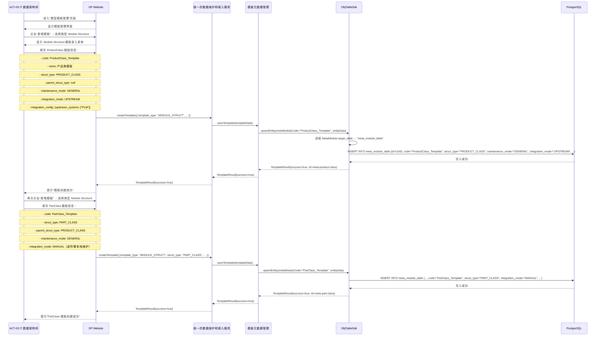
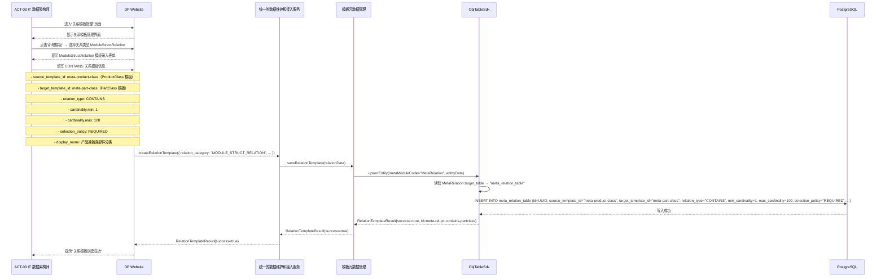
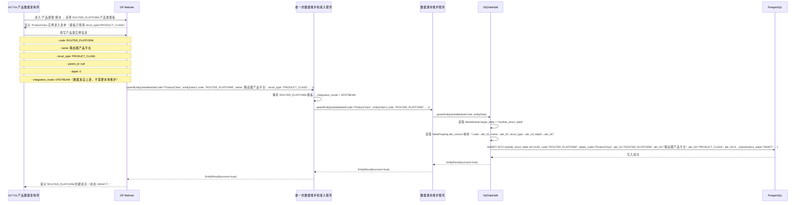
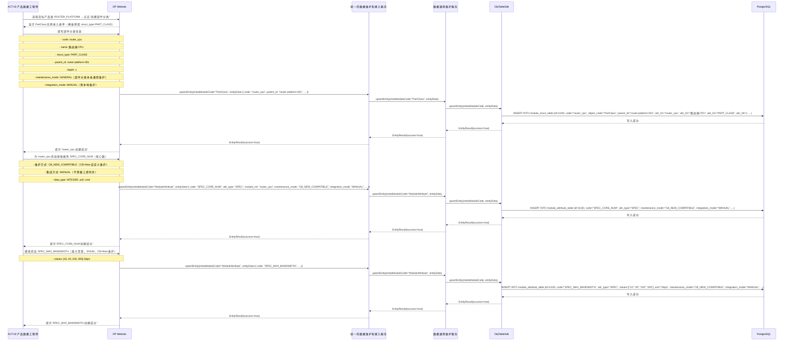
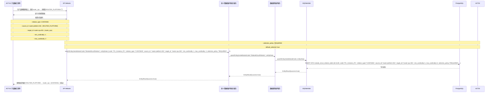
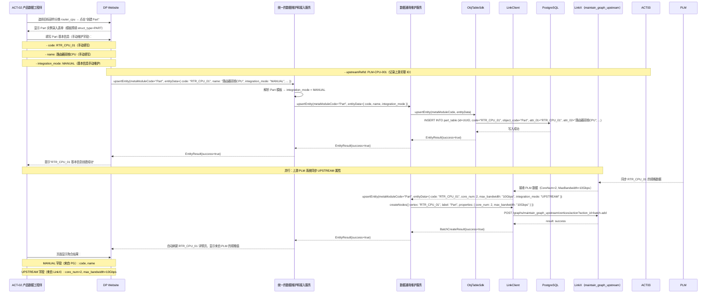
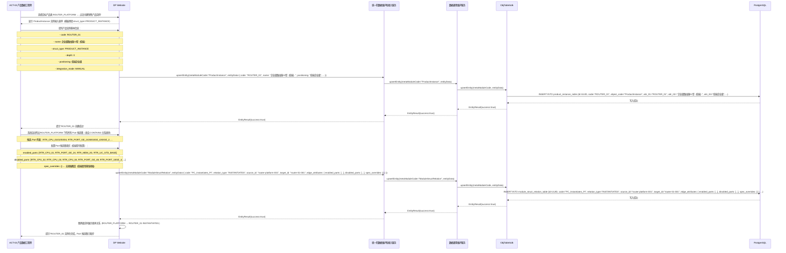
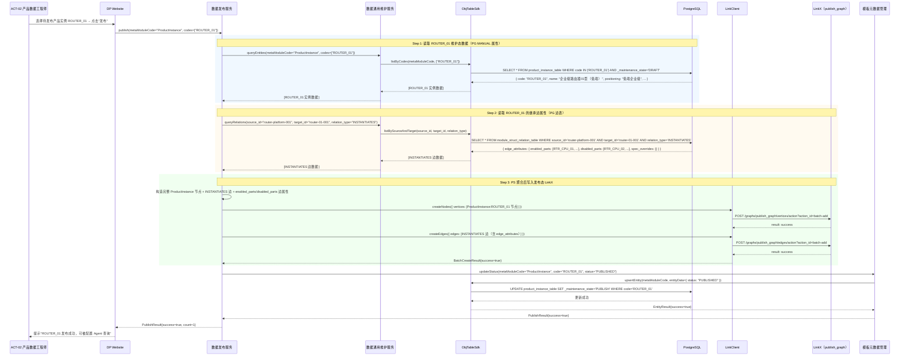

## 第六章：运行视图

> 本章定义系统运行期的核心时序流程，基于 L1 逻辑视图描述组件间交互，不展开内部实现。
>
> **主线样例**：所有时序图以"路由器产品（ROUTER_PLATFORM）"为例，完整展示从模板建模到销售产品实例发布的全生命周期。

### 6.1 样例数据说明

> 本节定义第六章所有时序图使用的样例数据，基于参考文档《数字产品数据模型》的完整案例。

#### 路由器产品完整层级

```
ROUTER_PLATFORM（ProductClass，PRODUCT_CLASS）
├── CONTAINS → router_cpu（PartClass，PART_CLASS）
│   ├── CONTAINS → RTR_CPU_01（Part，核心数=2）
│   ├── CONTAINS → RTR_CPU_02（Part，核心数=4）
│   ├── CONTAINS → RTR_CPU_03（Part，核心数=8）
│   └── CONTAINS → RTR_CPU_04（Part，核心数=16）
├── CONTAINS → router_port（PartClass，PART_CLASS）
│   ├── CONTAINS → RTR_PORT_GE_24（Part，端口类型=GE，数量=24）
│   ├── CONTAINS → RTR_PORT_GE_48（Part，端口类型=GE，数量=48）
│   ├── CONTAINS → RTR_PORT_10GE_4（Part，端口类型=10GE，数量=4）
│   └── CONTAINS → RTR_PORT_40GE_2（Part，端口类型=40GE，数量=2）
├── CONTAINS → router_memory（PartClass，PART_CLASS）
│   └── ...
└── INSTANTIATES → ROUTER_01（ProductInstance，PRODUCT_INSTANCE，低端）
    ├── enabled_parts: [RTR_CPU_01, RTR_PORT_GE_24, RTR_MEM_2G, RTR_LIC_STD_BASE]
    ├── disabled_parts: [RTR_CPU_02/03/04, RTR_PORT_GE_48/10GE_4/40GE_2, RTR_MEM_4G/8G/16G, ...]
    └── spec_overrides: {}   ← 无规格覆盖（低端型号使用基线规格）
```

#### 核心实体数据

**ModuleStructure（结构模型）**

| id | code | struct_type | parent_id | depth | status |
| --- | --- | --- | --- | --- | --- |
| router-platform-001 | ROUTER_PLATFORM | PRODUCT_CLASS | null | 0 | DRAFT |
| router-cpu-001 | router_cpu | PART_CLASS | router-platform-001 | 1 | DRAFT |
| rtr-cpu-01-001 | RTR_CPU_01 | PART | router-cpu-001 | 2 | ACTIVE |
| router-01-001 | ROUTER_01 | PRODUCT_INSTANCE | null | 0 | DRAFT |

**ModuleAttribute（属性模型）**

| id | code | attr_type | schema |
| --- | --- | --- | --- |
| spec-core-num-001 | SPEC_CORE_NUM | SPEC | {type: INTEGER, unit: core} |
| spec-max-bandwidth-001 | SPEC_MAX_BANDWIDTH | SPEC | {type: ENUM, unit: Gbps, values: [10,40,100,400]} |

**ModuleStructRelation（结构间关系）**

| id | code | relation_type | source_id | target_id | selection_policy |
| --- | --- | --- | --- | --- | --- |
| rel-platform-cpu-001 | PC_Contains_PC | CONTAINS | router-platform-001 | router-cpu-001 | REQUIRED |
| rel-platform-instantiates-01 | PC_Instantiates_PI | INSTANTIATES | router-platform-001 | router-01-001 | OPTIONAL |

---

### 6.2 核心时序图

#### 6.2.1 UC-A7：创建模型模板（IT 数据架构师）

> ACT-03（IT 数据架构师）通过 DP Website 创建 ProductClass 模板（ROUTER_PLATFORM 模板），定义 struct_type、parent_struct_type、maintenance_mode、integration_mode 等元数据。



**说明**：IT 数据架构师在模板建模阶段只定义模板本身（元数据），不录入任何具体实例数据（如 ROUTER_PLATFORM、router_cpu）。具体实例数据由产品数据架构师/产品数据工程师在后续用例中录入。

---

#### 6.2.2 UC-A8：创建关系模板（IT 数据架构师）

> ACT-03（IT 数据架构师）创建 ProductClass → PartClass 的 CONTAINS 关系模板，定义源/目标 Module Structure 模板、基数约束（min/max cardinality）、选择策略（selection_policy）等。



**说明**：关系模板定义后，在 UC-A1/UC-A2 中填充具体实例时可直接引用此模板，系统自动注入基数约束和选择策略。

---

#### 6.2.3 UC-A1：创建产品类（产品数据架构师）

> ACT-01（产品数据架构师）基于 ProductClass 模板，创建路由器产品类实例 `ROUTER_PLATFORM`。**关注点：数据来自上游系统 PLM/ERP，不需要本地维护（integration_mode=UPSTREAM）。**



**说明**：产品类数据（ROUTER_PLATFORM）的字段由上游 PLM/ERP 系统同步写入（integration_mode=UPSTREAM），产品数据架构师在此步骤中确认数据并发布到维护态，不需要手动维护具体字段值。

---

#### 6.2.4 UC-A2：创建部件分类及规格（产品数据工程师）

> ACT-02（产品数据工程师）为 ROUTER_PLATFORM 创建部件分类 `router_cpu` 及规格属性 `SPEC_CORE_NUM`、`SPEC_MAX_BANDWIDTH`。**关注点：规格通过 CB+New 自定义维护方式录入（maintenance_mode=CB_NEW_COMPATIBLE，integration_mode=MANUAL）。**



**说明**：规格维度（SPEC_CORE_NUM、SPEC_MAX_BANDWIDTH）通过 CB+New 自定义维护方式录入，数据不依赖上游系统，integration_mode=MANUAL。这是系统"业务规则补齐"能力的体现（GOAL-07）。

---

#### 6.2.5 UC-B1c：建立部件分类与产品的关系（产品数据工程师）

> ACT-02（产品数据工程师）建立 ROUTER_PLATFORM（ProductClass）与 router_cpu（PartClass）的 CONTAINS 关系，设置基数约束（min=1, max=2）和选择策略（REQUIRED）。



**说明**：此关系定义后，ROUTER_PLATFORM 的所有产品实例（ROUTER_01/02/03）将自动继承 router_cpu 作为 Part 候选集，并通过 enabled_parts/disabled_parts 在实例层级做裁剪。

---

#### 6.2.6 UC-A3：创建 Part 对象（产品数据工程师）

> ACT-02（产品数据工程师）基于 router_cpu（PartClass）创建 Part 实例 `RTR_CPU_01`。**关注点：部分属性来自上游系统 PLM（integration_mode=UPSTREAM，如核心数 CoreNum=2），部分属性需要本地维护（integration_mode=MANUAL，如采购批次）。**



**说明**：Part 对象是混合存储的典型场景——基本信息（code/name）由产品数据工程师手动维护（落 PG），规格属性（core_num/max_bandwidth）由上游 PLM 自动同步（落 LinkX）。DP Website 通过可视化聚合服务（VAS）同时查询 PG + LinkX，内存合并后展示完整视图，对用户透明。

---

#### 6.2.7 UC-A4：销售产品实例化与继承修改（产品数据工程师）

> ACT-02（产品数据工程师）基于 ROUTER_PLATFORM（ProductClass）创建销售产品实例 `ROUTER_01`（低端型号）。**关注点：① 体现基础继承（INSTANTIATES 关系）；② 关系的裁剪（enabled_parts/disabled_parts 边属性，禁用 RTR_CPU_02/03/04 等高端 CPU）；③ 不做规格覆盖（低端型号使用基线规格）。**



**说明**：销售产品实例（ROUTER_01）是完整的"产品"，代表了可交付给客户的具体 SKU。通过 enabled_parts/disabled_parts 边属性，ROUTER_01 继承了 ROUTER_PLATFORM 的所有 Part 候选，但在实例层级做了裁剪（禁用高端 CPU/端口/内存/许可）。这是产品配置层级与销售层级的关键差异——ProductClass 定义候选范围，ProductInstance 定义具体配置。

---

#### 6.2.8 UC-B1b：发布销售产品实例（产品数据工程师）

> ACT-02（产品数据工程师）触发发布，PS 将 ROUTER_01 的完整数据（ProductInstance + Part 候选集裁剪 + 继承边属性）从维护态 PG 聚合后，构造完整图写入发布态 LinkX。



**说明**：发布是维护态→发布态的唯一通道（PS 独家写入 publish_graph）。ROUTER_01 发布后，继承边及其 enabled_parts/disabled_parts 边属性将一同写入发布态图，供配置 Agent（ACT-05）查询。

---

#### 6.2.9 UC-B2：发布态数据查询（下游消费）

> ACT-05（配置 Agent）通过数据查询服务查询发布态 LinkX，获取 ROUTER_01 销售产品实例下所有启用的 Part 及其规格数据，验证配置方案。

```mermaid
sequenceDiagram
    participant AGENT as ACT-05 配置 Agent
    participant WEB as DP Website
    participant QS as 数据查询服务
    participant LC as LinkClient
    participant LNK_PUB as LinkX（publish_graph）

    AGENT->>WEB: 查询 ROUTER_01 销售产品实例的完整配置（已启用的 Part 列表及规格）
    WEB->>QS: queryGraph({ entity_type: "ProductInstance", code: "ROUTER_01", depth: 2 })

    QS->>LC: executeGql({ gql: "
        MATCH (pi:ProductInstance {code: 'ROUTER_01'})-[:INSTANTIATES {enabled_parts: [...]}]->(pc:ProductClass)
                 -[:CONTAINS]->(part:Part)
        RETURN pi, pc, part
    " })

    LC->>LNK_PUB: POST /graphs/publish_graph/gql
    LNK_PUB-->>LC: {
        nodes: [
            { code: "ROUTER_01", struct_type: "PRODUCT_INSTANCE", positioning: "低端企业级" },
            { code: "RTR_CPU_01", struct_type: "PART", name: "路由器双核CPU" },
            { code: "RTR_PORT_GE_24", struct_type: "PART", name: "24口千兆" }
        ],
        edges: [
            { type: "INSTANTIATES", source: "ROUTER_PLATFORM", target: "ROUTER_01", edge_attributes: { enabled_parts: ["RTR_CPU_01", ...], disabled_parts: [...] } },
            { type: "CONTAINS", source: "ROUTER_PLATFORM", target: "RTR_CPU_01" }
        ]
    }
    LC-->>QS: 图查询结果
    QS-->>WEB: { productInstance: ROUTER_01, enabledParts: [RTR_CPU_01, RTR_PORT_GE_24, ...], disabledParts: [RTR_CPU_02/03/04, ...] }
    WEB-->>AGENT: 返回 ROUTER_01 完整配置数据
```

**说明**：配置 Agent 可直接利用 enabled_parts/disabled_parts 边属性，在查询结果中直接过滤出当前产品实例已启用的 Part 列表，无需在应用层二次裁剪。这是"继承边属性"设计的核心价值——配置边界在图数据层直接表达，下游消费无感知。

---

### 6.3 异常与降级

|| 场景 | 降级策略 |
|| --- | --- |
| **LinkX 不可用（维护态 UPSTREAM 同步）** | UPSTREAM 属性同步失败 → 记录失败日志，触发重试（max_retry=3）；前端显示"部分规格数据同步中" |
| **LinkX 不可用（发布态查询）** | 发布态 LinkX 查询失败 → 返回错误，阻止配置 Agent 消费；运维告警 |
| **PG 不可用** | PG 写入/查询失败 → 返回 503，前端提示"系统暂时不可用"；不影响 LinkX 维护态数据 |
| **Part 候选集为空** | enabled_parts 为空 → 阻止 ProductInstance 发布，提示"产品实例无有效 Part 候选" |
| **规则校验失败（UC-A6）** | 校验规则引擎返回 violation → 阻止保存/发布，列出具体违规项 |
| **发布失败** | 发布态 LinkX 写入失败 → 维护态不受影响；错误日志记录；运维告警；支持重试 |

---

### 6.4 本章结论

|| 结论 | 说明 |
|| --- | --- |
| **时序基于 L1 视图** | 所有流程均按 L1 逻辑视图的组件关系描述（接入层→UAS→MS/PS/QS→LinkClient→存储层），不展开内部实现 |
| **混合存储透明** | 可视化聚合层（VAS/QS）屏蔽 PG + LinkX 差异；Part 对象的部分字段落 PG（MANUAL），部分字段落 LinkX（UPSTREAM），用户无感知 |
| **发布态走 LinkX** | 发布服务（PS）聚合维护态数据（PG+LinkX）后，统一写入发布态 LinkX（publish_graph），作为下游唯一数据源 |
| **继承边属性下推** | enabled_parts/disabled_parts/spec_overrides 等边属性在 ProductClass→ProductInstance INSTANTIATES 边上表达，配置 Agent 可直接利用，无需应用层二次处理 |
| **路由器案例完整闭环** | 从 ProductClass 模板（UC-A7）→关系模板（UC-A8）→ROUTER_PLATFORM（UC-A1）→router_cpu+规格（UC-A2）→关系建立（UC-B1c）→RTR_CPU_01（UC-A3）→ROUTER_01 实例化（UC-A4）→发布（UC-B1b）→Agent 查询（UC-B2）全链路自洽 |

