# 数字产品系统架构设计说明书

> **文档状态**：草稿
> **版本**：v1.13
> **创建日期**：2026-08-01
> **最后更新**：2026-08-02

---

## 文档变更记录

| 版本 | 日期 | 作者 | 变更说明 |
| --- | --- | --- | --- |
| v0.1 | 2026-08-01 | - | 初始版本，启动架构设计 |
| v0.2 | 2026-08-01 | - | 第一轮系统边界与目标完成（含对抗评审结论） |
| v0.3 | 2026-08-01 | - | 第二章用例视图完成（14 个用例，覆盖维护态、发布态、Agent 消费三大域） |
| v0.4 | 2026-08-01 | - | 第二章用例视图优化（新增关系用例 UC-B1c~f、图可视化用例 UC-D1/D2，共 21 个用例） |
| v0.5 | 2026-08-01 | - | 第三章逻辑视图完成（分层架构、维护态/发布态双域、共享服务层、边界规则 R-B1~R-B4） |
| v0.6 | 2026-08-01 | - | 第四章数据模型完成（GES 图模型：顶点/边/属性 Schema、版本管理方案 OPEN-11 决策、隔离方案） |
| v0.7 | 2026-08-01 | - | 第四章数据模型重构：新增四张核心建模图（扩展维度/抽象模型/LinkX映射/元数据模型），引入 ModuleStruct/ModuleAttribute 新抽象，删除原始 GES 设计 |
| v0.8 | 2026-08-02 | - | 第四章数据模型修订：层级扩展改为 ProductClass→PartClass→Part 三层，新增元数据模型说明（MetaModule/MetaProperty/MetaRelation） |
| v0.9 | 2026-08-02 | - | 检视意见优化：新增干系人 ACT-03（IT 数据架构师）、简化 Agent（保留配置 Agent 和网络设计 Agent）、架构目标分级（合并 GOAL-01/07）、删除生态约束、新增 UC-A7/A8 用例、元数据模型引入 MetaCatalogNode 替换 MetaDomain、新增属性级维护/集成方式、调整版本管理章节位置 |
| v1.0 | 2026-08-02 | - | 核心概念重构：引入 Module Structure（结构模型）和 Module Attribute（属性模型）两大分类，重写第一张图、第二张图、UC-A7/A8 用例 |
| v1.1 | 2026-08-02 | - | 第三章逻辑视图：服务分层、LinkX Client 接口设计、版本管理服务、业务编排服务；第五章技术模型：LinkX Client 实现方案、版本管理机制、公共机制 |
| v1.2 | 2026-08-02 | - | 第三章完善 L1 级逻辑视图：根据架构草图，新增六层分层架构（应用层/接入层/网关层/核心服务层/数据访问层/数据仓库层），新增宏仓库/元仓库/LinF 数据仓库分层，绘制五大核心数据流 |
| v1.3 | 2026-08-02 | - | L1 级逻辑视图简化：去掉应用层/接入层/网关层，只保留 DP Website（含三大功能入口）、DPService（含四个子模块）、LinkClient、存储层（PG+LinkX）；模板元数据存储于 PostgreSQL，实例数据存储于 LinkX |
| v1.4 | 2026-08-02 | - | 3.1.3 服务分层架构（详细版）重写：严格基于 L1 视图的四层结构展开（接入层/服务层/数据访问层/存储层），去除无中生有的网关/MS/PS/SS/BC/VM/PR 等组件 |
| v1.5 | 2026-08-02 | - | 3.2 服务职责划分整体重写：与 3.1.2 L1 视图严格对齐，新增"统一的数据维护和接入服务（UAS）"作为服务层门面（处理本地/外部数据路由），版本管理内嵌为数据通用维护服务的子子模块；3.1.3 同步补充 UAS 和版本管理 |
| v1.6 | 2026-08-02 | - | 一、L1 详细图：LinkClient 移入 DPService 内部，发布/查询服务并排下沉；二、术语统一："本地维护/外部托管"刷为 integration_mode；三、ILinkXClient 接口按 GES API 重组（图/元数据/节点/边/Cypher）；四、3.3.2 版本管理改为子子模块；五、删除 3.3.3 业务编排 + 重写 3.4；六、OPEN-23 挂起 / OPEN-24 决策全量 / OPEN-25 按场景细化 |
| v1.7 | 2026-08-02 | - | 依据 [RFC-003](./adr/RFC-003-数据通用维护服务-通用对象表映射机制.md) v0.2 重构：① 3.2.3 模板元数据管理扩展为业务模板 / 映射 / 模板版本三表；② 3.2.4 数据通用维护服务简化为通用对象表 CRUD，删除模板管理、映射管理、版本管理三个子模块；③ 3.3.2 改为通用对象表设计，版本管理融入通用表（id=UUID + code=业务标识）；④ 4.4 版本管理存储方案整章删除；⑤ 5.3 版本管理机制整章删除；⑥ 3.4 服务依赖关系图重画，移除 LinkX 依赖；⑦ 5.1.1 核心技术栈移除 LinkX 业务数据存储角色；⑧ OPEN-11 / OPEN-24 / OPEN-27 标记 CLOSED，新增 OPEN-Q1~Q7 |
| v1.8 | 2026-08-02 | - | 依据 [RFC-003](./adr/RFC-003-数据通用维护服务-通用对象表映射机制.md) v0.3 简化：① 删除 business_template / obj_to_table_mapping / template_version 三张表（用户反馈"搞复杂了"）；② 版本字段直接加到 MetaModule（version），映射表名直接加到 MetaModule（target_table），属性列映射直接加到 MetaProperty（attr_column）；③ 4.2.4 ERDiagram 更新 MetaModule / MetaProperty 新增字段；④ 3.3.2 核心设计原则补充"映射直读"；⑤ 3.5.1 已确定事项精简；⑥ OPEN-Q4~Q5 更新；⑦ 4.2.4 元数据模型新增"通用对象表映射说明"节 |
| v1.9 | 2026-08-02 | - | RFC-003 v0.4 OPEN 问题用户回答：OPEN-Q1=PG+LinkX混合存储, Q2=N=10, Q6=发布态走LinkX, Q7=维护态不支持图查询但支持可视化 |
| v1.10 | 2026-08-02 | - | 5.2.1与3.3.1对齐（按GES API五类重组）；新增5.3通用对象表SDK；第六章运行视图（5个时序图+路由器产品样例）；第七章部署视图（K8s拓扑+交付物+容量）；第八章开发视图（代码结构+构建+质量属性）；全文档一致性检查 |
| v1.11 | 2026-08-02 | - | 一、删除 5.2 LinkX Client 详细设计（3.3.1 已有）；二、5.3 通用表 SDK 合并到 RFC-003 §5.2.1；三、7.2 部署拓扑简化版（DPWebsite + DPService 一体化部署）；四、8.1 代码结构补 UAS + digitalproduct-client 作为 digitalproduct-service 子模块；五、4.3 抽取为独立 ADR-003；六、PS-PublishOrchestrator 按 L1 子模块（Orchestrator/ReadAggregator/PublishWriter/PublishRules）刷新 |
| v1.12 | 2026-08-02 | - | 第八章 8.1 代码结构按 3.1.2 L1 逻辑视图重构：① 严格按 6 个 L1 组件（UAS / TM / MS / PS / QS / LinkClient）拆分 Maven 模块（5 服务 + 1 SDK），每个 L1 组件一个独立模块；② 旧 digitalproduct-template-meta / digitalproduct-maintenance 模块名替换为 digitalproduct-tmservice / digitalproduct-msservice；③ 新增 PS-PublishOrchestrator（Orchestrator / ReadAggregator / PublishWriter / PublishRules）、QS-VisualizationAggregationService、MS-HybridStorageDispatcher；④ 8.2 构建命令同步指向新模块路径；⑤ 8.4 结论改为"L1 → Maven 模块一一对应" |
| v1.13 | 2026-08-02 | - | ① UC-A7 Module Structure 模板示例改为 ProductClass + ProductInstance 两个例子，struct_type 枚举扩展为 PRODUCT_CLASS / PRODUCT_INSTANCE / PART_CLASS / PART 四种；② UC-A7 Module Attribute 模板示例重构为"属性元数据形式（Schema）"模板（定义属性长什么样的字段结构），不再混入 SPEC_MAX_BANDWIDTH 这类具体业务属性；具体规格属性实例（最大带宽、营销描述）按模板形式由产品数据架构师在 4.2.4 MetaProperty 中录入；③ UC-A7 架构关注点补充"模板 vs 实例"区分；④ UC-A8 关系模板示例仅保留 ProductClass→PartClass CONTAINS，并在关系类型枚举中新增 INSTANTIATES；⑤ 4.2.1 / 4.2.2 mermaid 图与 ER 图新增 ProductInstance 节点与 INSTANTIATES 边，扩展性描述同步更新；⑥ 4.2.3 LinkX 节点/边示例新增 ProductInstance 节点与 ProductClass→ProductInstance INSTANTIATES 边；⑦ 4.2.4 元数据示例中新增 ProductInstance MetaModule 示例、MetaProperty 的 module_id 改为 meta-product-class、MetaRelation 改用 ProductClass→PartClass CONTAINS 样例，MetaModule / MetaProperty / MetaRelation 的示例同步补齐 RFC-003 v0.3 新增字段（target_table / attr_column 等），并补充"按 UC-A7 模板录入的实例"说明；⑧ 3.3.1 LinkX Client mockData / 测试用例样例改为 ProductClass；⑨ 6.1 样例场景改为产品实例 NetworkPro-2000 + 部件层，6.2.1 时序图改为创建产品实例（ProductInstance） |

---

## 目录

1. [第一章：系统边界与目标](./#第一章系统边界与目标)
2. [第二章：用例视图](./#第二章用例视图)
3. [第三章：逻辑视图](./#第三章逻辑视图)
4. [第四章：数据模型](./#第四章数据模型)
5. [第五章：技术模型](./#第五章技术模型)
6. [第六章：运行视图](./#第六章运行视图)
7. [第七章：部署视图](./#第七章部署视图)
8. [第八章：开发视图](./#第八章开发视图)
9. [附录：ADR 汇总](./#附录adr-汇总)

---

## 第一章：系统边界与目标

> 本章定义了系统的边界、干系人、核心价值定位、架构目标和关键约束条件。

### 1.1 系统定位与核心价值

#### 1.1.1 系统定位

数字产品系统的核心定位是：**对外提供一个基于图（Graph）的、统一的产品数据库**。

相对于传统系统（如 CB+New），新系统在扩展性上有两个最核心的设计点：
1. **业务对象快速新增**：支持快速新增上游的业务对象（例如新增一个"营销资料"对象），而不需要修改数据库表结构
2. **多层数据定制**：数据层次支持多层结构，并支持自定义与定制化

此外，系统还具备两大核心能力：
- **语义模型快速构建**：上游作业系统大多是基于 IT 实现而非语义模型，系统需要提供语义模型快速构建能力，将上游的 IT 数据快速映射为语义模型（包括同义词等语义关联）
- **业务规则补齐**：上游系统的语义模型中，绝大多数没有业务规则或规则不健全，系统需要支持补齐产品级业务规则（如配置约束、依赖规则、校验规则等）

#### 1.1.2 核心价值链

```
┌────────────────────────────────────────────────────────────────────────────────────────┐
│                              数字产品系统 - 核心价值链                                    │
├────────────────────────────────────────────────────────────────────────────────────────┤
│                                                                                        │
│   【上游作业系统】                    【产品数字化平台】                 【下游 Agent】      │
│                                                                                        │
│   ┌─────────┐  ┌─────────┐        ┌───────────────────┐         ┌─────────────────┐  │
│   │   PLM   │  │   ERP   │   ──▶   │   数据汇聚         │   ──▶   │  Config Agent   │  │
│   ├─────────┤  ├─────────┤        │   语义化建模       │         ├─────────────────┤  │
│   │   SCM   │  │   MES   │        │                   │         │  Bidding Agent  │  │
│   ├─────────┤  ├─────────┤        │  ┌─────────────┐  │         ├─────────────────┤  │
│   │   CRM   │  │   ...   │        │  │  维护态数据   │  │         │ Product Design  │  │
│   └─────────┘  └─────────┘        │  │  (待定存储)   │  │         ├─────────────────┤  │
│                                    │  ├─────────────┤  │         │ Supply Agent    │  │
│                                    │  │  发布态数据   │  │         ├─────────────────┤  │
│                                    │  │  (Graph)     │  │         │ Sales Design    │  │
│                                    │  └─────────────┘  │         └─────────────────┘  │
│                                    └───────────────────┘                               │
│                                                                                        │
│   【基础平台】                                                                         │
│   ┌─────────────────────────────────────────────────────────────────────────────────┐ │
│   │                              LinkX 基础平台                                      │ │
│   │                         (GES 图数据库 / Schema 管理)                              │ │
│   └─────────────────────────────────────────────────────────────────────────────────┘ │
│                                                                                        │
└────────────────────────────────────────────────────────────────────────────────────────┘
```

#### 1.1.3 与 Palantir 类通用平台的核心差异

| 维度 | Palantir 类通用平台 | 数字产品系统 |
| --- | --- | --- |
| **核心定位** | 通用数据平台，任何业务场景 | 面向产品研发的数据平台 |
| **核心功能** | 数据连接、分析、建模 | 数据汇聚 + 语义化建模 + 图服务 |
| **天然属性** | 业务无关性 | 自带产品业务属性 |
| **扩展方向** | 横向扩展（连接更多数据源） | 纵向深化（丰富产品模型） |

### 1.2 业务全流程与系统模块

从业务维度来看，整个数字产品可以分为三个阶段：

```
┌────────────────────────────────────────────────────────────────────────────────────┐
│                              数字产品业务全流程                                       │
├────────────────────────────────────────────────────────────────────────────────────┤
│                                                                                    │
│  ┌─────────────────┐    ┌─────────────────┐    ┌─────────────────┐               │
│  │  阶段一           │    │  阶段二           │    │  阶段三           │               │
│  │  产品建模         │───▶│  产品实例化       │───▶│  产品数据服务      │               │
│  │                  │    │                  │    │                  │               │
│  │  • 定义产品结构   │    │  • 创建具体产品   │    │  • 图查询接口     │               │
│  │  • 定义 Schema   │    │  • 数据录入/汇聚  │    │  • 多跳遍历       │               │
│  │  • 定义业务对象   │    │  • 数据校验治理   │    │  • 订阅推送       │               │
│  │  • 发布产品模板   │    │  • 发布可售产品   │    │  • 数据订阅       │               │
│  └─────────────────┘    └─────────────────┘    └─────────────────┘               │
│                                                                                    │
└────────────────────────────────────────────────────────────────────────────────────┘
```

### 1.3 三类核心业务场景

| 场景 | 描述 | 数据状态 | 处理方式 |
| --- | --- | --- | --- |
| **场景一** | 上游作业系统数据已存在 | 数据存在 | 汇聚 + 语义化建模 + 校验 |
| **场景二** | 上游作业系统数据缺失 | 压根不存在 | 在平台内维护（含规则校验、测试） |
| **场景三** | 上游系统有数据但质量不高 | 数据存在但不完整/不准 | 继承 + 补录 + 治理 |

### 1.4 维护态 vs 发布态数据存储（待决策）

> **⚠️ 待澄清**：维护态数据和发布态数据的存储方案尚未确定。
>
> 当前有两种思路：
> 1. **统一入图**：维护态和发布态数据都存入 GES 图数据库
> 2. **分离存储**：维护态用关系型数据库，发布态入 GES 图数据库
>
> 此决策将影响系统架构和数据流设计。

### 1.5 干系人分析

#### 1.5.1 核心干系人

| 干系人 ID | 角色 | 描述 | 关注点 | 优先级 |
| --- | --- | --- | --- | --- |
| **ACT-01** | 产品数据架构师 | 定义 Module、BusinessObject、规格定义等 Schema；构建语义模型 | Schema 扩展性、模型完整性 | P0 |
| **ACT-02** | 产品数据工程师 | 维护产品实例数据（Part、PartClass、销售产品）；执行发布审核 | 数据录入效率、数据质量 | P0 |
| **ACT-03** | IT 数据架构师 | 管理所有产品（产业）的数据标准化；定义元数据规范（属性定义、关系模板）；规划数据集成策略 | 数据标准化、数据治理、集成规范 | P0 |
| **ACT-04** | 运营人员 | 监控数据同步任务、处理失败告警、执行重试 | 系统稳定性、数据同步状态 | P1 |

#### 1.5.2 消费 Agent

| Agent ID | 角色 | 描述 | 关注点 | 优先级 |
| --- | --- | --- | --- | --- |
| **ACT-05** | 配置 Agent | 消费发布态数据进行配置方案设计与校验 | 图查询性能、数据一致性 | P0 |
| **ACT-06** | 网络设计 Agent | 消费产品数据进行网络拓扑设计、影响分析 | 多跳查询、影响分析 | P1 |

### 1.6 架构目标

#### 1.6.1 目标分级

| 等级 | 说明 | 目标 ID |
| --- | --- | --- |
| **P0（核心目标）** | 必须达成，系统价值的基础支撑 | GOAL-01、GOAL-02、GOAL-03、GOAL-05 |
| **P1（重要目标）** | 重要，系统能力的关键差异化 | GOAL-04、GOAL-06、GOAL-07 |
| **P2（增强目标）** | 锦上添花，系统能力的持续优化 | GOAL-08 |

#### 1.6.2 目标清单

| 目标 ID | 等级 | 架构目标 | 衡量指标 | 质量属性 |
| --- | --- | --- | --- | --- |
| **GOAL-01** | P0 | **语义模型快速构建**：上游作业系统大多是基于 IT 实现而非语义模型，系统需要提供语义模型快速构建能力，将上游的 IT 数据快速映射为语义模型（包括同义词等语义关联） | 新增业务对象类型 ≤ 1 人天；上游系统接入后，语义模型构建周期 ≤ 1 周 | 可扩展性 |
| **GOAL-02** | P0 | **上游数据自动汇聚**：支持多上游系统的数据自动汇聚 | 汇聚任务延迟 ≤ 5 分钟 | 性能 |
| **GOAL-03** | P0 | **图查询高性能**：提供高性能的图查询服务 | P99 ≤ 200ms（3 跳以内查询） | 性能 |
| **GOAL-04** | P1 | **数据一致性保障**：发布态数据 100% 符合 Schema | 发布态数据合规率 = 100% | 可靠性 |
| **GOAL-05** | P0 | **向后兼容 CB+New**：存量数据 100% 迁移，v1.0 支持 CB+New 场景 | 存量迁移率 = 100%；CB+New 场景覆盖 ≥ 90% | 兼容性 |
| **GOAL-06** | P1 | **故障恢复能力**：系统具备快速故障恢复能力 | RTO ≤ 30 分钟，RPO ≤ 5 分钟 | 可用性 |
| **GOAL-07** | P1 | **业务规则补齐**：上游系统的语义模型中，绝大多数没有业务规则或规则不健全，系统需要支持在数字产品侧补齐产品级业务规则（如配置约束、依赖规则、校验规则等） | 产品级规则覆盖率 ≥ 80% | 可靠性 |
| **GOAL-08** | P2 | **持续扩展**：支持 Agent 消费层的持续扩展 | 新增 Agent 类型接入周期 ≤ 2 周 | 可扩展性 |

### 1.7 约束条件

| 约束类型 | 约束内容 | 来源 |
| --- | --- | --- |
| **平台约束** | 必须基于 LinkX 基础平台构建 | 内部要求 |
| **技术约束** | 底层使用 GES 图数据库 | 内部已有资产 |
| **兼容约束** | 需要逐步融合 CB+New 系统（并行运行，第一版必须能支持 CB+New 的场景） | 存量系统迁移 |
| **演进约束** | 支持 Agent 消费层的持续扩展 | 业务规划 |
| **并发约束** | v1.0 MVP 期间，CB+New 与数字产品并行运行 | 双轨运行策略 |

### 1.8 非功能需求（NFR）

#### 1.8.1 规模指标

| 指标 | 目标值 | 说明 |
| --- | --- | --- |
| 产品实例规模 | 2000 个销售产品实例 | v1.0 预估规模 |
| 单产品 Part 数量 | 约 1000 个 Part/产品实例 | 平均值，实际可能有较大差异 |
| 估算总 Part 规模 | 约 200 万个 Part | 2000 × 1000 |
| 上游作业系统数 | 5~10 个 | PLM、ERP、SCM、MES、CRM 等 |

#### 1.8.2 质量属性需求

| 类别 | 需求项 | 目标值 | 备注 |
| --- | --- | --- | --- |
| **性能** | 图查询 P99 延迟 | ≤ 200ms | 针对 3 跳以内查询 |
| **性能** | 批量导入吞吐 | ≥ 1000 条/秒 | |
| **性能** | 语义模型构建周期 | ≤ 1 周/上游系统 | GOAL-07 落地 |
| **可用性** | 系统可用率 | ≥ 99.9% | |
| **可用性** | 故障恢复时间 RTO | ≤ 30 分钟 | |
| **可用性** | 数据恢复点 RPO | ≤ 5 分钟 | |
| **可扩展性** | Schema 扩展周期 | ≤ 1 人天/类型 | |
| **可扩展性** | Agent 接口新增 | ≤ 0.5 人天/接口 | |
| **可靠性** | 业务规则覆盖率 | ≥ 80% | GOAL-08 落地 |
| **安全性** | 数据权限控制 | 模块级 | 未来可扩展至属性级 |
| **可观测性** | 关键指标覆盖率 | 100% | |

### 1.9 本章结论与未决问题

#### 1.9.1 已确定事项

- ✅ 系统定位为"基于图的产品数据库"
- ✅ 核心功能是数据汇聚 + 语义化建模 + 业务规则补齐
- ✅ 建立在 LinkX（基础汇聚、Schema 构建、入图、图查询）+ GES 基础之上
- ✅ LinkX 缺少语义定义能力（如同义词），需要扩展
- ✅ 三阶段流程：建模 → 实例化 → 服务
- ✅ 三类业务场景：数据存在 / 数据缺失 / 数据质量低
- ✅ MVP 只支持配置 Agent
- ✅ 成功标准：兼容 CB+New + 支持产品配置 Agent
- ✅ 维护态存储方案：统一入 GES（选项 A），待补充论证
- ✅ CB+New 策略：并行运行，v1.0 必须能支持 CB+New 场景
- ✅ 最大风险：上游系统对接难度大、图模型设计不完善

#### 1.9.2 未决问题（OPEN）

| ID | 问题 | 状态 | 责任人 | 优先级 |
| --- | --- | --- | --- | --- |
| ~~OPEN-01~~ | ~~维护态数据存储方案（RDB vs Graph）~~ | **CLOSED → 方案 A** | - | - |
| ~~OPEN-02~~ | ~~CB+New 迁移策略~~ | **CLOSED → 并行运行** | - | - |
| OPEN-03 | 各 Agent 的 SLA 承诺 | OPEN | 待定 | P2 |
| OPEN-04 | 维护态统一入图的理论支撑与数据论证 | OPEN | 待定 | P1 |
| OPEN-05 | GES 写入性能基准测试 | OPEN | 数据模型章节跟进 | P0 |
| OPEN-06 | CB+New → 数字产品的数据同步机制设计 | OPEN | 逻辑视图章节跟进 | P0 |
| OPEN-07 | LinkX 语义能力缺口调研 | OPEN | 技术模型章节跟进 | P1 |
| OPEN-08 | 规模预测和容量规划 | OPEN | 部署视图章节跟进 | P1 |

#### 1.9.3 关键风险

| 风险 ID | 风险描述 | 概率 | 影响 | 应对措施 | 负责人 | 优先级 |
| --- | --- | --- | --- | --- | --- | --- |
| RISK-01 | 上游系统对接难度大（数据格式不统一、接口不稳定） | 高 | 高 | 早期 POC、预留缓冲时间 | 待定 | P0 |
| RISK-02 | 图模型设计不完善（扩展性不足、查询性能差） | 中 | 高 | 充分评审、预留重构成本 | 待定 | P0 |
| RISK-03 | LinkX 语义能力缺失（同义词等） | 中 | 中 | 自研或集成语义组件 | 待定 | P1 |
| RISK-04 | CB+New 并行运行期间数据一致性 | 中 | 高 | 设计双写同步机制 | 待定 | P0 |

---

### 1.10 对抗评审结论（第一轮定稿）

#### 1.10.1 评审概要

| 角色 | 主要关切 |
| --- | --- |
| **安全专家** | 攻击面、权限粒度、接口审计 |
| **运维专家** | 可观测性、故障恢复、容量规划 |
| **数据专家** | 一致性、数据质量、性能基准 |

#### 1.10.2 评审发现

| 严重程度 | 问题 | 状态 | 跟进轮次 |
| --- | --- | --- | --- |
| 🔴 **严重** | GES 写入性能待基准测试验证 | OPEN-05 | 数据模型章节 |
| 🔴 **严重** | CB+New → 数字产品数据同步机制缺失 | OPEN-06 | 逻辑视图章节 |
| 🟡 **中等** | LinkX 语义能力缺口具体范围未定义 | OPEN-07 | 技术模型章节 |
| 🟡 **中等** | 2000 产品实例规模可能偏保守，缺乏增长预测 | OPEN-08 | 部署视图章节 |
| 🟡 **中等** | 权限模型模块级 vs 属性级的扩展路径不清 | 持续关注 | 数据模型章节 |
| 🟢 **建议** | 架构目标需要更具体的验收标准 | 本轮已记录 | - |
| 🟢 **建议** | 风险清单需要补充责任人 | 本轮已更新 | - |

#### 1.10.3 用户决策记录

- ✅ 用户认可上述评审结论
- ✅ 用户选择"等业务场景明确后，再结合场景对严重问题深入分析"
- ✅ 后续轮次将基于业务场景对上述 🔴 严重问题作针对性分析

---

## 第二章：用例视图

> 本章定义了系统的关键用例，作为后续视图的验证锚点。
>
> **关键概念澄清**：
> - **产品建模的本质是 Instance Data**：无论是 Part Class 定义还是销售产品实例化，在图数据视角下都是"实例数据"，产品数据工程师做的"建模"本质是实例数据的编辑和发布（C1）
> - **两种维护路径并存**：通用维护（数字产品侧新建）+ CB+New 继承维护（老系统迁移路径），两者最终都要入图（C2）
> - **数据发布是核心用例**：按正确顺序打包发布（Part → Part Class → 关联关系 → 销售产品），保证数据齐套性（C3）
> - **维护态与发布态物理分离**：两个独立存储，维护态允许草稿，发布态只接收完整数据包（C4）

### 2.1 系统上下文

```
┌────────────────────────────────────────────────────────────────────────────────────────────────────────────┐
│                                          数字产品系统 - 系统上下文                                              │
├────────────────────────────────────────────────────────────────────────────────────────────────────────────┤
│                                                                                                              │
│   【外部系统】                                         【数字产品系统】                       【下游消费者】    │
│                                                                                                              │
│   ┌─────────────────┐                                   ┌─────────────────────┐             ┌────────────┐  │
│   │   LinkX 平台    │                                   │    维护态域          │             │            │  │
│   │  (上游数据汇聚) │─────── Excel 文件导入 ─────────▶│   (草稿数据编辑)     │             │            │  │
│   ├─────────────────┤                                   ├─────────────────────┤             │  配置 Agent │  │
│   │   CB+New       │                                   │    发布态域          │──────────▶ │            │  │
│   │ (老系统迁移)    │───────── 继承维护 ───────────────▶│  (完整数据包)        │             │            │  │
│   └─────────────────┘                                   └─────────────────────┘             └────────────┘  │
│                                                                                                              │
│   【参与者】                                                                                                  │
│                                                                                                              │
│   ┌─────────────────┐    ┌─────────────────┐    ┌─────────────────┐    ┌─────────────────┐                 │
│   │  产品数据架构师  │    │  产品数据工程师  │    │  IT 人员        │    │  运营人员       │                 │
│   │  (Schema 定义)   │    │  (数据维护)      │    │  (系统配置)     │    │  (运维监控)     │                 │
│   └─────────────────┘    └─────────────────┘    └─────────────────┘    └─────────────────┘                 │
│                                                                                                              │
└────────────────────────────────────────────────────────────────────────────────────────────────────────────┘
```

### 2.2 参与者（角色）清单

| 角色 ID | 角色名称 | 职责描述 | MVP 优先级 |
| --- | --- | --- | --- |
| ACT-01 | 产品数据架构师 | 定义 Module、BusinessObject、规格定义等 Schema；构建语义模型 | P0 |
| ACT-02 | 产品数据工程师 | 维护产品实例数据（Part、Part Class、销售产品）；执行发布审核 | P0 |
| ACT-03 | IT 人员 | 配置系统参数、定义 Parameter 业务对象；管理集成方式 | P1 |
| ACT-04 | 运营人员 | 监控数据同步任务、处理失败告警、执行重试 | P1 |
| ACT-05 | 配置 Agent | 消费发布态数据进行配置方案设计与校验 | P0 |

### 2.3 业务场景优先级

基于您的反馈，MVP 期间的业务场景优先级如下：

| 优先级 | 场景类型 | 说明 | MVP 深度 |
| --- | --- | --- | --- |
| **P0** | 数据缺失 / 数据质量差 | LinkX 底层不支持数据维护，这是数字产品的核心建设点 | 深度设计 |
| **P1** | 数据存在 | 主要是继承 LinkX 已汇聚的数据，深度较低 | 中度设计 |
| **P2** | CB+New 场景覆盖 | 以 CB+New 的产品数据对象为样例，验证通用能力 | 覆盖验证 |

### 2.4 核心用例详述

#### 2.4.1 用例分组总览

```
┌────────────────────────────────────────────────────────────────────────────────────────────────────────────┐
│                                           数字产品系统 - 用例分组                                              │
├────────────────────────────────────────────────────────────────────────────────────────────────────────────┤
│                                                                                                              │
│   【用例组 A：产品建模与数据维护】                    【用例组 B：数据发布】           【用例组 C：Agent 数据消费】 │
│                                                                                                              │
│   A-1: 创建产品类                                  B-1: 发布产品数据包               C-1: 标书规格匹配             │
│   A-2: 创建部件分类及规格                           B-2: 发布态数据查询              C-2: BOM 树状遍历             │
│   A-3: 创建 Part 对象                               B-3: 版本回滚                    C-3: 逐层配置方案设计          │
│   A-4: 销售产品实例化与继承修改                     B-4: 发布异常处理                C-4: 多跳反向推理              │
│   A-5: Excel 批量导入                                                                                        │
│   A-6: 业务规则校验                                                                                          │
│                                                                                                              │
└────────────────────────────────────────────────────────────────────────────────────────────────────────────┘
```

---

#### 2.4.2 用例组 A：产品建模与数据维护

##### UC-A1：创建产品类

| 属性 | 值 |
| --- | --- |
| **用例 ID** | UC-A1 |
| **用例名称** | 创建产品类 |
| **用例描述** | 创建一个新的产品类（如"服务器 X86"），定义其基本属性和业务对象 |
| **参与者** | ACT-01 产品数据架构师 |
| **前置条件** | 用户已登录系统，具备产品类创建权限 |
| **后置条件** | 产品类数据保存至维护态，可被后续用例引用 |

**关键路径**：
1. 产品数据架构师进入"产品建模"模块
2. 选择"创建产品类"，填写产品类基本信息（Code、名称、描述）
3. 选择该产品类关联的业务对象类型（如 Part、Part Class 等）
4. 系统校验产品类 Code 不重复
5. 系统保存产品类数据至维护态
6. 系统返回创建成功通知

**异常路径**：
- E1：产品类 Code 重复 → 提示"该 Code 已存在，请修改后重试"
- E2：关联业务对象不存在 → 提示"所选业务对象类型未定义"

**架构关注点**：
- **数据一致性**：产品类 Code 需要全局唯一
- **扩展性**：未来新增产品类类型时，不应修改表结构

---

##### UC-A2：创建部件分类及规格

| 属性 | 值 |
| --- | --- |
| **用例 ID** | UC-A2 |
| **用例名称** | 创建部件分类及规格 |
| **用例描述** | 为某个产品类创建部件分类（如"CPU 分类"），并定义该分类的规格属性（如容量、大小、高度等） |
| **参与者** | ACT-01 产品数据架构师、ACT-02 产品数据工程师 |
| **前置条件** | 关联的产品类已存在（UC-A1 完成） |
| **后置条件** | 部件分类及规格定义保存至维护态 |

**关键路径**：
1. 产品数据工程师选择目标产品类
2. 选择"创建部件分类"，填写分类基本信息（Code、名称）
3. 为该分类添加规格定义（如 Specification_A、Specification_B 等）
4. 每个规格定义需指定：规格名称、数据类型、默认值、是否必填
5. 系统校验规格定义的合法性
6. 系统保存部件分类及规格至维护态
7. 系统返回创建成功通知

**异常路径**：
- E1：规格名称冲突（同类下已存在同名规格）→ 提示"该规格名称已存在"
- E2：数据类型不支持 → 提示"当前不支持该数据类型"

**架构关注点**：
- **扩展性**：规格定义可动态新增，无需修改 Schema
- **语义关联**：规格定义需支持同义词关联（LinkX 缺失能力）

---

##### UC-A3：创建 Part 对象

| 属性 | 值 |
| --- | --- |
| **用例 ID** | UC-A3 |
| **用例名称** | 创建 Part 对象 |
| **用例描述** | 创建一个具体的 Part 对象，并填写该 Part 对应的规格值 |
| **参与者** | ACT-02 产品数据工程师 |
| **前置条件** | 关联的部件分类已存在（UC-A2 完成） |
| **后置条件** | Part 对象保存至维护态，规格值已填充 |

**关键路径**：
1. 产品数据工程师选择目标部件分类
2. 选择"创建 Part"，填写 Part 基本信息（Code、名称、描述）
3. 系统根据部件分类的规格定义，自动生成规格值录入表单
4. 产品数据工程师填写各规格的具体值
5. 系统执行业务规则校验（UC-A6）
6. 校验通过后，系统保存 Part 至维护态
7. 系统返回创建成功通知

**异常路径**：
- E1：业务规则校验失败 → 按 UC-A6 异常处理
- E2：Part Code 重复 → 提示"该 Part Code 已存在"

**架构关注点**：
- **规则校验**：规格值必须通过业务规则校验才能保存
- **数据溯源**：需记录 Part 的数据来源（上游集成 or 本地维护）

---

##### UC-A4：销售产品实例化与继承修改

| 属性 | 值 |
| --- | --- |
| **用例 ID** | UC-A4 |
| **用例名称** | 销售产品实例化与继承修改 |
| **用例描述** | 基于某个产品类创建一个销售产品实例（如"服务器 SR2"），继承产品类的所有 Part，并允许在实例层级修改规格值 |
| **参与者** | ACT-02 产品数据工程师 |
| **前置条件** | 关联的产品类已存在，且至少有一个 Part（UC-A3 完成） |
| **后置条件** | 销售产品实例保存至维护态，继承关系已建立 |

**关键路径**：
1. 产品数据工程师选择目标产品类
2. 选择"创建销售产品实例"，填写实例基本信息（Code、名称、客户标签等）
3. 系统自动列出该产品类下的所有 Part 列表
4. 产品数据工程师选择需要继承的 Part（可全选或部分选择）
5. 对于选中的 Part，允许在实例层级覆盖/修改规格值（如高端服务器配置 CPU3/CPU4，低端配置 CPU1/CPU2）
6. 系统保存销售产品实例及继承关系至维护态
7. 系统返回创建成功通知

**扩展路径**：
- EXT-1：支持多层级继承（A 继承 B，B 继承 C）

**异常路径**：
- E1：选择的 Part 不属于该产品类 → 提示"所选 Part 不在当前产品类下"
- E2：规格值覆盖违反业务规则 → 按 UC-A6 异常处理

**架构关注点**：
- **继承模型**：需设计"模板 → 实例"的继承关系在图中的表示方式
- **覆盖粒度**：实例层级可覆盖哪些规格，是否需要限制

---

##### UC-A5：Excel 批量导入

| 属性 | 值 |
| --- | --- |
| **用例 ID** | UC-A5 |
| **用例名称** | Excel 批量导入 |
| **用例描述** | 通过 Excel 文件批量导入 Part 或销售产品数据，适用于数据补录或大规模迁移 |
| **参与者** | ACT-02 产品数据工程师、ACT-03 IT 人员 |
| **前置条件** | 已下载导入模板，模板中定义了所需字段 |
| **后置条件** | 导入数据保存至维护态，错误数据记录至错误日志 |

**关键路径**：
1. 产品数据工程师下载 Excel 导入模板
2. 按模板格式填写数据（一个 Sheet 对应一个业务对象类型）
3. 上传 Excel 文件，系统解析并校验格式
4. 系统逐行校验数据合法性（字段格式、业务规则等）
5. 校验通过的数据写入维护态
6. 校验失败的数据记录至错误日志，生成错误报告
7. 系统返回导入结果（含成功数量、失败数量、错误详情）

**异常路径**：
- E1：Excel 格式不符合模板 → 提示"文件格式错误，请下载最新模板"
- E2：存在校验失败行 → 展示错误列表，允许用户修正后重新导入（支持部分导入）

**架构关注点**：
- **批量性能**：需支持大批量导入（NFR：≥ 1000 条/秒）
- **事务处理**：批量导入是否支持部分成功回滚

---

##### UC-A6：业务规则校验

| 属性 | 值 |
| --- | --- |
| **用例 ID** | UC-A6 |
| **用例名称** | 业务规则校验 |
| **用例描述** | 在数据保存前执行全面的业务规则校验，包括配置约束、依赖规则、值域校验等 |
| **参与者** | （系统自动触发） |
| **前置条件** | 数据已编辑完成，等待保存 |
| **后置条件** | 校验通过：数据保存；校验失败：返回错误详情 |

**关键路径**：
1. 系统收集待校验数据及其关联数据
2. 系统按规则引擎加载对应的业务规则
3. 系统逐条执行规则校验
4. 规则校验结果汇总：
   - **全部通过**：数据标记为"校验通过"，进入待发布状态
   - **部分失败**：数据标记为"校验未通过"，记录失败规则及原因
5. 系统返回校验结果

**异常路径**：
- E1：规则引擎异常 → 记录错误日志，通知运营人员（ACT-04）介入
- E2：规则定义缺失 → 允许跳过校验（需配置项控制），但需记录"规则未定义"警告

**架构关注点**：
- **规则引擎选型**：Drools / OCL / 自研
- **规则覆盖率**：GOAL-07 要求 ≥ 80%，需设计规则增量建设机制
- **强阻塞策略**：校验失败必须阻止数据入发布态（按您的要求）

---

##### UC-A7：新增模型模板

> 本用例由 IT 数据架构师（ACT-03）执行，用于定义新的模型模板。模型模板分为两类：
> - **Module Structure 模板**：定义产品本体结构（如 ProductClass、ProductInstance、PartClass、Part）
> - **Module Attribute 模板**：定义产品业务特征（如 SPEC、PARAM、MARKETING 等维度）

| 属性 | 值 |
| --- | --- |
| **用例 ID** | UC-A7 |
| **用例名称** | 新增模型模板 |
| **用例描述** | IT 数据架构师定义新的模型模板，包括 Module Structure 模板（如 ProductClass、ProductInstance）和 Module Attribute 模板（如 SPEC 规格属性） |
| **参与者** | ACT-03 IT 数据架构师 |
| **前置条件** | IT 数据架构师已登录系统，具有模板定义权限 |
| **后置条件** | 新的模型模板已创建，可供产品数据工程师使用 |

**关键路径**：

1. IT 数据架构师进入"模型模板管理"页面
2. IT 数据架构师选择要创建的模板类型：
   - **Module Structure 模板**：定义产品本体结构
   - **Module Attribute 模板**：定义产品业务特征

3. **如果是 Module Structure 模板**：
   - 填写基本信息：
     - 模板名称（code）
     - 显示名称（name）
     - 描述（description）
     - 层级类型（struct_type：PRODUCT_CLASS / PRODUCT_INSTANCE / PART_CLASS / PART）
   - 设置模板的数据维护方式和集成方式
   - 关联可选的 Module Attribute 模板

4. **如果是 Module Attribute 模板**：
   - 填写基本信息：
     - 模板名称（code）
     - 显示名称（name）
     - 描述（description）
     - 维度类型（attr_type：SPEC / PARAM / MARKETING / DELIVERY / FINANCE / OPERATION）
   - 定义属性 Schema（数据类型、值域、单位等）
   - 设置属性级维护方式和集成方式

5. 系统保存模板至元数据层（MetaModule）
6. 系统返回创建成功通知

**Module Structure 模板示例**：

- 示例 1：ProductClass（产品类，struct_type=PRODUCT_CLASS）

```json
{
  "template_type": "MODULE_STRUCT",
  "code": "ProductClass",
  "name": "产品类",
  "description": "可配置产品的抽象定义，代表一类产品的统一规格基线",
  "struct_type": "PRODUCT_CLASS",
  "parent_struct_type": null,
  "maintenance_mode": "GENERAL",
  "integration_mode": "MANUAL",
  "integration_config": {}
}
```

- 示例 2：ProductInstance（产品实例，struct_type=PRODUCT_INSTANCE）

```json
{
  "template_type": "MODULE_STRUCT",
  "code": "ProductInstance",
  "name": "产品实例",
  "description": "基于 ProductClass 实例化得到的可售 / 可配置具体产品对象（含继承边属性覆盖）",
  "struct_type": "PRODUCT_INSTANCE",
  "parent_struct_type": "PRODUCT_CLASS",
  "maintenance_mode": "GENERAL",
  "integration_mode": "UPSTREAM",
  "integration_config": {
    "upstream_systems": ["ERP"]
  }
}
```

**Module Attribute 模板示例**：

> **模板 vs 实例的区分**：Module Attribute 模板是"任意具体属性在系统中如何被描述"的形式定义（Schema），不是某一具体业务属性（如"最大带宽"）的定义。具体业务属性（如带宽、端口数、功耗）是按本模板形式由产品数据架构师在 MetaProperty 中录入的**实例数据**。本例展示"规格维度（SPEC）"这一属性维度模板的结构化形式。

```json
{
  "template_type": "MODULE_ATTRIBUTE",
  "code": "MODULE_ATTRIBUTE_TEMPLATE",
  "name": "属性元数据模板",
  "description": "本模板定义系统中所有具体属性（MetaProperty 实例）的形式（Schema）。具体业务属性（如 SPEC_MAX_BANDWIDTH、SPEC_PORT_COUNT）由产品数据架构师按此 Schema 录入，而非在 UC-A7 中定义。",
  "module_ref": null,
  "attr_type": "META",
  "version": "v1.0.0",
  "schema": {
    "code":          { "type": "string",  "required": true,  "display_name": "属性编码", "description": "业务唯一编码，如 SPEC_MAX_BANDWIDTH" },
    "display_name":  { "type": "string",  "required": true,  "display_name": "显示名称" },
    "description":   { "type": "string",  "required": false, "display_name": "描述" },
    "data_type":     { "type": "enum",    "required": true,  "values": ["STRING", "NUMBER", "BOOLEAN", "ENUM", "JSON"], "display_name": "数据类型" },
    "unit":          { "type": "string",  "required": false, "display_name": "单位" },
    "values":        { "type": "array",   "required": false, "display_name": "枚举可选值", "description": "data_type=ENUM 时填写" },
    "default_value": { "type": "any",     "required": false, "display_name": "默认值" },
    "synonyms":      { "type": "object",  "required": false, "display_name": "同义词", "description": "多语言映射，如 {\"zh\": [...], \"en\": [...]}" },
    "required":      { "type": "boolean", "required": false, "display_name": "是否必填" },
    "validation_rules": { "type": "object", "required": false, "display_name": "校验规则" },
    "maintenance_mode":  { "type": "enum", "required": true, "values": ["GENERAL", "CB_NEW_COMPATIBLE"], "display_name": "维护方式" },
    "integration_mode":  { "type": "enum", "required": true, "values": ["MANUAL", "UPSTREAM"], "display_name": "集成方式" },
    "integration_config":{ "type": "object", "required": false, "display_name": "集成配置" }
  },
  "generic_table_mapping": {
    "meta_table": "meta_property",
    "instance_table_pattern": "obj_table_NNN",
    "attr_column_strategy": "dictionary_order"
  }
}
```

**具体规格属性实例（不在 UC-A7 模板中定义，由产品数据架构师在 MetaProperty 中按上述 Schema 录入）**：

> 例如 "最大带宽" 这种具体属性，应在 4.2.4 MetaProperty 示例中展示，不应混入模板定义。模板只规定"如何描述一个属性"，实例才规定"具体是什么属性"。

**异常路径**：
- E1：模板 code 重复 → 提示"模板编码已存在"
- E2：关联的 Module Attribute 模板不存在 → 提示"请先定义属性模板"

**架构关注点**：
- **模板分类**：Module Structure 和 Module Attribute 是两大类模板
- **元数据层**：模型模板定义在 MetaModule 层
- **struct_type 枚举**：PRODUCT_CLASS / PRODUCT_INSTANCE / PART_CLASS / PART 四种值，覆盖从产品类定义到部件实例化的完整链路
- **模板 vs 实例的区分**：
  - **模板**（UC-A7）只定义"形式（Schema）"——如 Module Structure 模板定义"一类产品结构长什么样"（含 struct_type / parent_id / depth 等字段），Module Attribute 模板定义"一个属性元数据长什么样"（含 data_type / unit / values / synonyms 等字段的结构）
  - **实例**（UC-A1/UC-A2/UC-A3/UC-A4 等）才定义"具体是什么"——如产品类实例 `NetworkProduct`、部件分类实例 `RouterPartClass`、规格属性实例 `SPEC_MAX_BANDWIDTH`、销售产品实例 `NetworkPro-2000`
  - 例如"带宽"对产品数据架构师是"建模的维度"（spec 维度下的一个具体属性），其形式由本 UC-A7 的 Module Attribute 模板定义；其具体值（10/40/100/400 Gbps）和集成规则（PLM/MAX_BW）由产品数据架构师按模板形式在 MetaProperty（4.2.4）中录入
- **维护/集成方式**：支持属性级的维护方式和集成方式配置
- **权限控制**：只有 IT 数据架构师（ACT-03）有权限定义模板

---

##### UC-A8：新增关系模板

> 本用例由 IT 数据架构师（ACT-03）执行，用于定义新的关系模板。关系模板定义 Module Structure 与 Module Attribute 之间的关联规则。

| 属性 | 值 |
| --- | --- |
| **用例 ID** | UC-A8 |
| **用例名称** | 新增关系模板 |
| **用例描述** | IT 数据架构师定义新的关系模板（如 ProductClass → PartClass 的 CONTAINS 关系，或 Module Structure → Module Attribute 的 HAS 关系） |
| **参与者** | ACT-03 IT 数据架构师 |
| **前置条件** | IT 数据架构师已登录系统，具有模板定义权限；相关联的模型模板已定义 |
| **后置条件** | 新的关系模板已创建，可供产品数据工程师在建立关系时使用 |

**关键路径**：
1. IT 数据架构师进入"关系模板管理"页面
2. IT 数据架构师点击"新增模板"
3. IT 数据架构师选择关系类型（relation_type）：
   - **ModuleStructRelation（结构间关系）**：
     - **CONTAINS**：包含关系（如 ProductClass → PartClass）
     - **EXTENDS**：扩展关系（如子类 → 基类）
     - **REFERENCES**：引用关系（如 PartClass → PartClass）
     - **INSTANTIATES**：实例化关系（如 ProductClass → ProductInstance）
   - **ModuleStructAttributeRelation（结构-属性关系）**：
     - **HAS**：具备关系（如 Module Structure → Module Attribute）
   - **ModuleAttributeRelation（属性间关系）**：
     - **DEPENDS_ON**：依赖关系
     - **MUTUALLY_EXCLUSIVE**：互斥关系
     - **REQUIRES**：需求关系

4. 如果是 ModuleStructRelation，设置源和目标 Module Structure 模板
5. 如果是 ModuleStructAttributeRelation，设置源 Module Structure 和目标 Module Attribute 模板
6. IT 数据架构师设置关系基数约束：
   - 最小数量（min_cardinality）
   - 最大数量（max_cardinality）
7. IT 数据架构师设置关系语义定义（semantics）：
   - 同义词配置
   - 约束描述
8. 系统保存模板至元数据层（MetaRelation）
9. 系统返回创建成功通知

**关系模板示例（ProductClass → PartClass 的 CONTAINS 关系）**：

```json
{
  "id": "meta-relation-productclass-contains-partclass",
  "relation_category": "MODULE_STRUCT_RELATION",
  "source_template_id": "meta-product-class",
  "target_template_id": "meta-part-class",
  "relation_type": "CONTAINS",
  "display_name": "包含",
  "description": "产品类（ProductClass）包含部件分类（PartClass），表示该产品类由这些部件分类组装而成",
  "cardinality": {
    "min": 1,
    "max": 100
  },
  "semantics": {
    "zh": "表示产品类与其组成的部件分类之间的归属关系",
    "en": "Represents the containment relationship between a product class and its part classes"
  }
}
```

**异常路径**：
- E1：源/目标模块不存在 → 提示"请先定义模块模板"
- E2：关系类型与模块层级不匹配 → 提示"关系类型与模块层级冲突"

**架构关注点**：
- **元数据层**：关系模板定义在 MetaRelation 层
- **关系类型**：支持多种关系类型，覆盖业务场景
- **语义扩展**：支持同义词等语义信息定义
- **典型组合**：ProductClass → PartClass（CONTAINS）是最常用的产品建模关系模板之一，定义后即可在产品数据建模过程中复用

---

#### 2.4.3 用例组 B：数据发布

##### UC-B1a：发布产品类

| 属性 | 值 |
| --- | --- |
| **用例 ID** | UC-B1a |
| **用例名称** | 发布产品类 |
| **用例描述** | 将维护态中的产品类（Module）及其关联的部件分类、规格定义等完整数据包发布至发布态图数据库 |
| **参与者** | ACT-02 产品数据工程师 |
| **前置条件** | 产品类数据已完成编辑和校验 |
| **后置条件** | 产品类数据已发布至发布态图，可被销售产品实例引用 |

**关键路径**：
```
发布顺序（保证数据齐套性）：
┌─────────────┐
│  Step 1     │  发布产品类（Module）本身
├─────────────┤
│  Step 2     │  发布部件分类（子 Module）
├─────────────┤
│  Step 3     │  发布 ModuleLink 关系（CONTAINS / REFERENCES 边，含边属性）
├─────────────┤
│  Step 4     │  发布 BusinessObject 规格定义
├─────────────┤
│  Step 5     │  发布 ModuleObjectRelation（HAS 边，含边属性）
└─────────────┘
```

1. 产品数据工程师选择待发布的产品类
2. 系统校验数据的完整性（所有依赖数据是否就绪）
3. 系统按上述顺序执行发布
4. 每步完成后，系统校验图数据一致性
5. 全步骤完成后，系统记录发布版本号
6. 系统返回发布成功通知

**异常路径**：
- E1：数据不完整 → 提示"数据不完整，无法发布"，列出缺失项
- E2：图写入失败 → 启用事务回滚
- E3：部分步骤成功但后续失败 → 整体回滚，保证原子性

**架构关注点**：
- **事务边界**：发布过程需要原子性保证
- **版本管理**：每次发布生成新版本，支持回滚
- **边属性发布**：ModuleLink 和 ModuleObjectRelation 的属性需要随边一起发布

---

##### UC-B1b：发布销售产品实例

| 属性 | 值 |
| --- | --- |
| **用例 ID** | UC-B1b |
| **用例名称** | 发布销售产品实例 |
| **用例描述** | 将维护态中的销售产品实例（ModuleInstance）及其继承关系、Part 配置、规格覆盖等完整数据包发布至发布态图数据库 |
| **参与者** | ACT-02 产品数据工程师 |
| **前置条件** | 销售产品实例已完成编辑，且引用的产品类已发布（UC-B1a 完成） |
| **后置条件** | 销售产品实例已发布至发布态图，可被配置 Agent 查询消费 |

**关键路径**：
```
发布顺序（保证数据齐套性）：
┌─────────────┐
│  Step 1     │  校验引用的产品类（Module）已在发布态
├─────────────┤
│  Step 2     │  发布 Part 数据（底层节点）
├─────────────┤
│  Step 3     │  发布 Part ↔ Module 关系（含 enabled_parts/disabled_parts 边属性）
├─────────────┤
│  Step 4     │  发布 ModuleInstance 本身
├─────────────┤
│  Step 5     │  发布 ModuleInstance ↔ Module 继承关系（含业务对象覆盖边属性）
└─────────────┘
```

1. 产品数据工程师选择待发布的销售产品实例
2. 系统校验引用的产品类是否已在发布态
3. 系统按上述顺序执行发布
4. 每步完成后，系统校验图数据一致性
5. 全步骤完成后，系统记录发布版本号
6. 系统返回发布成功通知

**异常路径**：
- E1：引用的产品类未发布 → 提示"请先发布产品类"，阻塞发布
- E2：Part 数据不完整 → 提示"Part 数据不完整，无法发布"
- E3：图写入失败 → 启用事务回滚

**架构关注点**：
- **依赖校验**：必须确保引用的产品类已发布
- **继承关系展示**：ModuleInstance 与 Module 的继承边需要清晰展示

---

##### UC-B1c：建立部件分类与产品的关系

| 属性 | 值 |
| --- | --- |
| **用例 ID** | UC-B1c |
| **用例名称** | 建立部件分类与产品的关系 |
| **用例描述** | 在部件分类和所属产品之间建立 CONTAINS 关系，并设置关系上的属性（如数量约束、选择策略） |
| **参与者** | ACT-01 产品数据架构师、ACT-02 产品数据工程师 |
| **前置条件** | 部件分类和所属产品均已创建 |
| **后置条件** | 关系及边属性已保存至维护态，可随产品类一起发布 |

**关键路径**：
1. 产品数据架构师进入产品建模页面
2. 选择目标产品类，进入关系管理视图
3. 选择"添加部件分类关系"
4. 选择要关联的部件分类（支持批量选择）
5. 设置关系属性：
   - **数量约束**：`min_cardinality`（最小数量）、`max_cardinality`（最大数量）
   - **选择策略**：`selection_policy`（REQUIRED / OPTIONAL）
   - **默认选中**：`default_selected`（是 / 否）
6. 系统校验关系的合法性（如防止循环引用）
7. 系统保存关系数据至维护态
8. 系统在图界面上实时展示新建立的关系

**异常路径**：
- E1：部件分类不属于该产品类层级 → 提示"部件分类层级不匹配"
- E2：数量约束不合理（如 min > max）→ 提示"约束设置错误"
- E3：循环引用检测 → 提示"禁止创建循环引用关系"

**架构关注点**：
- **实时图展示**：建关系时，图界面需要实时更新，展示新边
- **边属性编辑**：关系属性需要在图上可编辑、可视化

---

##### UC-B1d：建立部件分类与规格的关系

| 属性 | 值 |
| --- | --- |
| **用例 ID** | UC-B1d |
| **用例名称** | 建立部件分类与规格的关系 |
| **用例描述** | 在部件分类和规格定义（BusinessObject）之间建立 HAS 关系，实现规格的复用，并设置关系上的属性 |
| **参与者** | ACT-01 产品数据架构师、ACT-02 产品数据工程师 |
| **前置条件** | 部件分类和规格定义均已创建 |
| **后置条件** | 关系及边属性已保存至维护态，可复用到多个部件分类 |

**关键路径**：
1. 产品数据架构师进入部件分类编辑页面
2. 选择"关联规格"功能
3. 从规格库中选择要关联的规格（支持跨部件分类复用）
4. 设置关系属性：
   - **基数约束**：`cardinality_min`（最小数量）、`cardinality_max`（最大数量）
   - **继承策略**：`inheritance_policy`（OWN / INHERITED / OVERRIDDEN）
   - **维度标记**：`dimension`（SPEC / PARAM / MARKETING / DELIVERY / FINANCE / OPERATION）
5. 系统保存关系数据至维护态
6. 系统在图界面上实时展示新建立的关系

**规格复用场景示例**：
```
CPU 分类 ←HAS→ SPEC_存储容量（规格可被多个分类复用）
     │
     ├── 内存模块 ←HAS→ SPEC_存储容量（复用同一规格）
     │
     └── 硬盘模块 ←HAS→ SPEC_存储容量（复用同一规格）
```

**异常路径**：
- E1：规格已在该分类下存在 → 提示"该规格已关联"
- E2：规格类型与分类不匹配 → 提示"规格类型不兼容"

**架构关注点**：
- **跨分类复用**：同一规格可被多个部件分类引用，这是图的核心价值
- **图的多跳查询**：规格复用关系支撑后续的多跳查询场景

---

##### UC-B1e：建立产品类与销售产品实例的关系

| 属性 | 值 |
| --- | --- |
| **用例 ID** | UC-B1e |
| **用例名称** | 建立产品类与销售产品实例的关系 |
| **用例描述** | 创建销售产品实例时，建立其与源产品类（Module）的继承关系，并设置继承边上的覆盖属性 |
| **参与者** | ACT-02 产品数据工程师 |
| **前置条件** | 产品类已发布（UC-B1a 完成），销售产品实例已创建 |
| **后置条件** | 继承关系已建立，销售产品实例可继承产品类的所有数据和约束 |

**关键路径**：
1. 产品数据工程师进入销售产品实例编辑页面
2. 系统自动展示引用的产品类（Module）信息
3. 产品数据工程师配置实例属性：
   - **启用/禁用 Part**：`enabled_parts` / `disabled_parts`（含数量约束边属性）
   - **启用/禁用子模块**：`enabled_modules` / `disabled_modules`
   - **规格覆盖**：`business_object_overrides`（在继承边上设置）
4. 系统在图界面上实时展示继承关系（ModuleInstance → Module 的 EXTENDS 边）
5. 系统保存关系数据至维护态
6. 发布时，继承关系及边属性一同写入发布态

**继承边属性示例**：
```json
{
  "source": "NETWORK_PRO_2000 (ModuleInstance)",
  "target": "NETWORK_PLATFORM (Module)",
  "edgeType": "EXTENDS",
  "edgeAttributes": {
    "specOverrides": {
      "SPEC_MAX_BANDWIDTH": { "overrideValue": "100Gbps" }
    },
    "partConstraints": {
      "RTR_V3_10G": { "minQty": 1, "maxQty": 2, "defaultSelected": true },
      "RTR_V4_100G": { "minQty": 0, "maxQty": 2, "defaultSelected": false }
    }
  }
}
```

**异常路径**：
- E1：引用的产品类未发布 → 提示"产品类未发布，无法创建实例"
- E2：覆盖的规格不属于产品类 → 提示"规格不存在于产品类中"

**架构关注点**：
- **继承链可视化**：在图上清晰展示 ModuleInstance → Module 的继承关系
- **覆盖语义**：覆盖是一种边属性，表示对继承数据的修改

---

##### UC-B1f：关系边属性编辑

| 属性 | 值 |
| --- | --- |
| **用例 ID** | UC-B1f |
| **用例名称** | 关系边属性编辑 |
| **用例描述** | 对已建立的关系（边）进行属性编辑，包括数量约束、选择策略、继承策略等 |
| **参与者** | ACT-01 产品数据架构师、ACT-02 产品数据工程师 |
| **前置条件** | 关系已存在 |
| **后置条件** | 边属性已更新，需重新发布以同步至发布态 |

**关键路径**：
1. 产品数据架构师在图界面上选择要编辑的边
2. 系统弹出边属性编辑面板，展示当前属性
3. 产品数据架构师修改属性：
   - **ModuleLink 边属性**：`min_cardinality`、`max_cardinality`、`selection_policy`、`default_selected`
   - **ModuleObjectRelation 边属性**：`cardinality_min`、`cardinality_max`、`inheritance_policy`
   - **Part ↔ Module 边属性**：`minQty`、`maxQty`、`defaultSelected`、`reason`
   - **ModuleInstance ↔ Module 边属性**：`specOverrides`、`partConstraints`
4. 系统实时预览图上边的属性标签变化
5. 系统保存修改至维护态
6. 变更标记为"待发布"，下次发布时同步至发布态

**异常路径**：
- E1：属性修改违反业务规则 → 提示"修改后的属性与现有约束冲突"

**架构关注点**：
- **图的实时编辑**：边属性的修改需要在图界面上实时反馈
- **变更追踪**：记录边属性的历史变更，支持审计

---

##### UC-B2：发布态数据查询

| 属性 | 值 |
| --- | --- |
| **用例 ID** | UC-B2 |
| **用例名称** | 发布态数据查询 |
| **用例描述** | 查询已发布的产品数据，支持按产品维度、Part 维度、版本维度等多种查询方式 |
| **参与者** | ACT-02 产品数据工程师、ACT-05 配置 Agent |
| **前置条件** | 至少有一个已发布版本 |
| **后置条件** | 返回查询结果（数据快照） |

**关键路径**：
1. 查询方指定查询条件（产品实例 ID、版本号、时间范围等）
2. 系统在发布态图中执行查询
3. 系统返回查询结果（含版本信息）

**异常路径**：
- E1：查询条件无匹配结果 → 返回空结果集
- E2：指定版本不存在 → 提示"该版本不存在，请检查版本号"

**架构关注点**：
- **查询性能**：NFR 要求 P99 ≤ 200ms
- **版本隔离**：不同版本的数据相互隔离，查询默认返回最新版本

---

##### UC-B3：版本回滚

| 属性 | 值 |
| --- | --- |
| **用例 ID** | UC-B3 |
| **用例名称** | 版本回滚 |
| **用例描述** | 将产品数据回滚至历史版本，适用于发布后发现数据错误需要撤回的场景 |
| **参与者** | ACT-02 产品数据工程师 |
| **前置条件** | 存在至少一个历史版本 |
| **后置条件** | 产品的当前版本切换为指定的历史版本 |

**关键路径**：
1. 产品数据工程师选择待回滚的产品及目标版本
2. 系统校验目标版本的可用性
3. 系统执行版本切换（将当前指针指向历史版本）
4. 系统记录回滚操作日志
5. 系统返回回滚成功通知

**异常路径**：
- E1：目标版本数据损坏 → 提示"该版本数据不可用"，建议联系运营人员
- E2：回滚影响下游消费者 → 提示"该产品被以下 Agent 引用，回滚可能影响业务"，需二次确认

**架构关注点**：
- **影响分析**：回滚前需评估对下游 Agent 的影响
- **审计追溯**：所有回滚操作需记录审计日志

---

##### UC-B4：发布异常处理

| 属性 | 值 |
| --- | --- |
| **用例 ID** | UC-B4 |
| **用例名称** | 发布异常处理 |
| **用例描述** | 处理 LinkX 底层异步任务执行失败后的异常场景，支持重试和告警 |
| **参与者** | ACT-04 运营人员 |
| **前置条件** | 存在失败的发布任务 |
| **后置条件** | 失败任务已重试成功或已人工处理 |

**关键路径**：
1. 运营人员收到任务失败告警
2. 系统展示失败任务详情（失败原因、影响范围）
3. 运营人员根据失败原因选择处理方式：
   - **重试**：重新执行失败任务
   - **跳过**：标记任务为已处理，继续后续流程
   - **人工修复**：在维护态修正数据后重新发布
4. 系统记录处理结果
5. 系统返回处理成功通知

**架构关注点**：
- **告警机制**：LinkX 底层已有失败告警能力，数字产品侧需对接
- **可观测性**：所有异常需记录详细日志，便于问题定位

---

#### 2.4.4 用例组 D：图可视化与交互

##### UC-D1：维护态图可视化

| 属性 | 值 |
| --- | --- |
| **用例 ID** | UC-D1 |
| **用例名称** | 维护态图可视化 |
| **用例描述** | 在数据维护过程中，通过图界面直观地展示节点和关系，让用户"在图上添加节点、添加关系"，获得沉浸式的图建模体验 |
| **参与者** | ACT-01 产品数据架构师、ACT-02 产品数据工程师 |
| **前置条件** | 用户已登录系统，进入维护态建模页面 |
| **后置条件** | 无（仅展示和交互） |

**关键路径**：
```
图建模工作流：
┌─────────────────────────────────────────────────────────────────────┐
│                                                                     │
│  ┌──────────────┐     ┌──────────────┐     ┌──────────────┐       │
│  │  节点操作     │     │  边操作       │     │  属性编辑     │       │
│  │              │     │              │     │              │       │
│  │  + 新增节点   │     │  + 新增边     │     │  点击节点     │       │
│  │  ✏ 编辑节点   │     │  ✏ 编辑边属性 │     │  弹出属性面板 │       │
│  │  🗑 删除节点   │     │  🗑 删除边     │     │  修改属性     │       │
│  └──────────────┘     └──────────────┘     └──────────────┘       │
│                                                                     │
└─────────────────────────────────────────────────────────────────────┘
```

1. **节点操作**：
   - 在图画布空白处右键 → "新建产品类" / "新建部件分类" / "新建 Part"
   - 双击节点 → 进入节点编辑模式
   - 拖拽节点 → 调整图布局

2. **边操作**：
   - 从节点拖出一条线到另一个节点 → "建立关系"（弹出关系类型选择和属性编辑面板）
   - 点击边 → 弹出边属性编辑面板
   - 边的类型用不同颜色/线型区分：
     - **CONTAINS**：实线（树状包含）
     - **EXTENDS**：虚线（继承关系）
     - **REFERENCES**：点线（跨模块引用）

3. **实时预览**：
   - 建关系时，图界面实时更新，展示新边
   - 修改属性时，节点/边的标签实时变化
   - 支持 Undo/Redo 操作历史

4. **多视图切换**：
   - **层级视图**：树状展示产品结构（BOM 视角）
   - **关系视图**：网状展示模块间引用关系
   - **维度视图**：按 SPEC/MARKETING/DELIVERY 等维度过滤展示

**异常路径**：
- E1：删除被引用的节点 → 提示"该节点被其他节点引用，是否级联删除？"
- E2：建立循环引用 → 提示"禁止创建循环引用关系"

**架构关注点**：
- **交互体验**：图操作需要流畅，延迟 < 100ms
- **实时同步**：维护态图的变更需要实时保存
- **布局算法**：支持自动布局（树状/力导向）和手动调整

---

##### UC-D2：发布态图探索

| 属性 | 值 |
| --- | --- |
| **用例 ID** | UC-D2 |
| **用例名称** | 发布态图探索 |
| **用例描述** | 在发布态数据上，通过图界面进行探索性查询、多跳遍历、路径分析等操作 |
| **参与者** | ACT-02 产品数据工程师、ACT-05 配置 Agent |
| **前置条件** | 至少有一个已发布版本 |
| **后置条件** | 无（仅查询和展示） |

**关键路径**：
```
图探索工作流：
┌─────────────────────────────────────────────────────────────────────┐
│                                                                     │
│  ┌──────────────┐     ┌──────────────┐     ┌──────────────┐       │
│  │  基础查询     │     │  多跳遍历     │     │  路径分析     │       │
│  │              │     │              │     │              │       │
│  │  按名称搜索   │     │  1-5 跳查询  │     │  最短路径     │       │
│  │  按类型过滤   │     │  反向追溯     │     │  影响分析     │       │
│  │  按维度筛选   │     │  批量展开     │     │  环路检测     │       │
│  └──────────────┘     └──────────────┘     └──────────────┘       │
│                                                                     │
└─────────────────────────────────────────────────────────────────────┘
```

1. **基础查询**：
   - 输入关键词，搜索节点（模糊匹配）
   - 按节点类型（Module / Part / BusinessObject）过滤
   - 按维度（SPEC / MARKETING / DELIVERY 等）筛选

2. **多跳遍历**：
   - 选择起始节点，设置跳数（1-5 跳）
   - 选择遍历方向：正向 / 反向 / 双向
   - 选择边类型过滤：仅 CONTAINS / 仅 REFERENCES / 全部
   - 高亮展示遍历路径

3. **路径分析**：
   - **最短路径**：计算两节点间的最短引用链
   - **影响分析**：从某节点出发，找出所有下游依赖节点
   - **环路检测**：检测图中是否存在环路

4. **图展示效果**：
   - **动态布局**：节点根据关系自动布局（力导向算法）
   - **颜色编码**：按节点类型、维度、状态等使用不同颜色
   - **标签展示**：节点上显示关键属性标签
   - **边标签**：关系边上显示关键属性（如数量约束、选择策略）
   - **缩放与漫游**：支持鼠标滚轮缩放、拖拽漫游

5. **导出功能**：
   - 导出当前视图为图片（PNG/SVG）
   - 导出查询结果为数据表（Excel/JSON）
   - 导出路径分析报告

**异常路径**：
- E1：查询结果过大（节点数 > 1000）→ 提示"结果集过大，请缩小范围"，分页展示
- E2：遍历超时 → 提示"查询超时，请减少跳数或添加过滤条件"

**架构关注点**：
- **查询性能**：多跳查询 P99 ≤ 200ms（NFR）
- **渲染性能**：大量节点的图渲染需优化（如虚拟化、懒加载）
- **可扩展性**：支持未来接入图可视化库（如 G6、D3.js）

---

#### 2.4.5 用例组 C：Agent 数据消费

##### UC-C1：标书规格匹配

| 属性 | 值 |
| --- | --- |
| **用例 ID** | UC-C1 |
| **用例名称** | 标书规格匹配 |
| **用例描述** | 根据客户标书输入的规格要求，自动匹配满足条件的产品和 Part |
| **参与者** | ACT-05 配置 Agent |
| **前置条件** | 产品数据已发布（UC-B1a 或 UC-B1b 完成） |
| **后置条件** | 返回满足规格要求的产品列表及匹配度评分 |

**关键路径**：
```
输入：标书规格要求（如 CPU 容量 ≥ 64GB，硬盘 ≥ 1TB）
     ↓
Step 1：规格解析：将标书文本解析为结构化的规格条件
     ↓
Step 2：图查询：在发布态图中检索满足条件的 Part（多跳查询）
     ↓
Step 3：产品聚合：将匹配的 Part 按产品维度聚合
     ↓
Step 4：匹配评分：计算每个产品的匹配度评分
     ↓
输出：满足条件的产品列表（含匹配度、最优推荐）
```

**异常路径**：
- E1：标书规格解析失败 → 返回"无法解析规格要求"，列出无法解析的条款
- E2：无满足条件的产品 → 返回空结果集，建议调整规格条件

**架构关注点**：
- **语义匹配**：需支持同义词匹配（如"内存"="RAM"="存储器"）
- **查询性能**：多跳图查询需优化，控制在 P99 ≤ 200ms
- **扩展性**：未来支持自然语言标书的直接解析

---

##### UC-C2：BOM 树状遍历

| 属性 | 值 |
| --- | --- |
| **用例 ID** | UC-C2 |
| **用例名称** | BOM 树状遍历 |
| **用例描述** | 以树状结构展示某个产品的完整 BOM（物料清单），支持展开、折叠、筛选等操作 |
| **参与者** | ACT-05 配置 Agent |
| **前置条件** | 产品数据已发布（UC-B1a 或 UC-B1b 完成） |
| **后置条件** | 返回 BOM 树结构 |

**关键路径**：
1. 配置 Agent 指定产品实例 ID 及展示深度
2. 系统在发布态图中执行多跳查询，获取 BOM 层级结构
3. 系统将图数据转换为树状结构返回
4. 配置 Agent 可进一步交互（如展开子节点、筛选特定类型 Part）

**异常路径**：
- E1：BOM 层级过深（超过 10 层）→ 返回前 10 层，并提示"数据层级过深，建议缩小范围"
- E2：产品不存在 → 返回空结果

**架构关注点**：
- **遍历性能**：深层 BOM 遍历需优化，考虑缓存热点数据
- **可视化**：返回结构化数据，Agent 侧负责 UI 渲染

---

##### UC-C3：逐层配置方案设计

| 属性 | 值 |
| --- | --- |
| **用例 ID** | UC-C3 |
| **用例名称** | 逐层配置方案设计 |
| **用例描述** | 支持配置 Agent 按"产品级 → 模块级 → 细粒度"逐层进行配置方案设计，每层利用图谱数据支撑决策 |
| **参与者** | ACT-05 配置 Agent |
| **前置条件** | 产品数据已发布（UC-B1a 或 UC-B1b 完成） |
| **后置条件** | 返回当前层级的配置建议和可选方案 |

**关键路径**：
```
Step 1：产品级配置与需求识别
        输入：客户标书需求
        处理：图查询获取产品级信息，匹配产品族
        输出：推荐的产品族列表

        ↓

Step 2：模块级匹配与设计
        输入：选定的产品族 + 客户需求
        处理：图查询获取模块级信息，匹配模块方案
        输出：推荐的模块配置方案

        ↓

Step 3：细粒度配置生成
        输入：选定的模块 + 客户需求
        处理：图查询获取 Part 级信息，生成详细配置
        输出：完整的 Part 配置清单（含规格值）

        ↓

Step 4：配置校验（调用 UC-A6 规则校验）
        处理：执行配置规则校验
        输出：校验通过 / 校验失败（附原因）
```

**异常路径**：
- E1：某层无满足条件的配置 → 返回"当前层级无匹配方案"，建议调整上层选择
- E2：规则校验失败 → 返回失败规则列表，配置 Agent 可回退修改

**架构关注点**：
- **多跳查询**：每层配置都需要图多跳查询支撑
- **规则集成**：配置结果需触发规则校验（UC-A6）
- **决策支持**：图谱数据需提供"配置影响分析"能力

---

##### UC-C4：多跳反向推理

| 属性 | 值 |
| --- | --- |
| **用例 ID** | UC-C4 |
| **用例名称** | 多跳反向推理 |
| **用例描述** | 当客户需求定位到某个底层 Part 的具体规格时，能够通过图谱向上追溯，明确该 Part 属于哪个产品 |
| **参与者** | ACT-05 配置 Agent |
| **前置条件** | 产品数据已发布（UC-B1a 或 UC-B1b 完成） |
| **后置条件** | 返回从底层 Part 到顶层产品的完整路径 |

**关键路径**：
1. 配置 Agent 输入底层 Part 的规格条件（如"某具体 CPU 型号"）
2. 系统在发布态图中执行反向遍历（从 Part → Part Class → 产品实例）
3. 系统返回完整的产品归属路径
4. 配置 Agent 结合路径信息，为客户匹配到具体产品

**异常路径**：
- E1：底层 Part 无归属产品 → 返回"该 Part 未关联任何产品"，需数据侧补录
- E2：归属路径过长（超过 5 跳）→ 返回路径并提示"归属链路过长，建议简化模型"

**架构关注点**：
- **反向查询优化**：反向多跳查询性能需专项优化
- **路径可视化**：返回路径需结构化，便于 Agent 展示

---

### 2.5 用例汇总表

| 用例 ID | 用例名称 | 优先级 | 用例类型 | 关键架构关注点 |
| --- | --- | --- | --- | --- |
| UC-A1 | 创建产品类 | P0 | 维护态 | Schema 扩展性 |
| UC-A2 | 创建部件分类及规格 | P0 | 维护态 | 语义关联、规格动态扩展 |
| UC-A3 | 创建 Part 对象 | P0 | 维护态 | 规则校验、数据溯源 |
| UC-A4 | 销售产品实例化与继承修改 | P0 | 维护态 | 继承模型、覆盖粒度 |
| UC-A5 | Excel 批量导入 | P1 | 维护态 | 批量性能、事务处理 |
| UC-A6 | 业务规则校验 | P0 | 维护态 | 规则引擎、GOAL-08 |
| UC-B1a | 发布产品类 | P0 | 发布态 | 事务原子性、版本管理、边属性发布 |
| UC-B1b | 发布销售产品实例 | P0 | 发布态 | 依赖校验、继承关系展示 |
| UC-B1c | 建立部件分类与产品的关系 | P0 | 发布态 | 实时图展示、边属性编辑 |
| UC-B1d | 建立部件分类与规格的关系 | P0 | 发布态 | 规格跨分类复用、图的多跳查询 |
| UC-B1e | 建立产品类与销售产品实例的关系 | P0 | 发布态 | 继承链可视化、覆盖语义 |
| UC-B1f | 关系边属性编辑 | P1 | 发布态 | 图的实时编辑、变更追踪 |
| UC-B2 | 发布态数据查询 | P0 | 发布态 | 查询性能（P99 ≤ 200ms） |
| UC-B3 | 版本回滚 | P1 | 发布态 | 影响分析、审计追溯 |
| UC-B4 | 发布异常处理 | P1 | 发布态 | 告警机制、可观测性 |
| UC-D1 | 维护态图可视化 | P0 | 图交互 | 交互体验、实时同步、布局算法 |
| UC-D2 | 发布态图探索 | P0 | 图交互 | 查询性能、渲染性能、可扩展性 |
| UC-C1 | 标书规格匹配 | P0 | Agent 消费 | 语义匹配、查询性能 |
| UC-C2 | BOM 树状遍历 | P0 | Agent 消费 | 遍历优化、缓存 |
| UC-C3 | 逐层配置方案设计 | P0 | Agent 消费 | 多跳查询、规则集成 |
| UC-C4 | 多跳反向推理 | P1 | Agent 消费 | 反向查询优化 |

### 2.6 本章结论与未决问题

#### 2.6.1 已确定事项

- ✅ 用例组 A（产品建模与数据维护）：6 个用例，明确了维护态域的核心功能
- ✅ 用例组 B（数据发布）：6 个新增用例（UC-B1a ~ UC-B1f），覆盖发布产品类、发布销售产品实例、建立关系、边属性编辑
- ✅ 用例组 D（图可视化与交互）：2 个用例（UC-D1、UC-D2），覆盖维护态图建模和发布态图探索
- ✅ 用例组 C（Agent 数据消费）：4 个用例，明确了配置 Agent 的核心场景
- ✅ 发布顺序设计：产品类发布（Module → 子 Module → ModuleLink → BusinessObject → ModuleObjectRelation）、销售产品实例发布（依赖校验 → Part → 关系 → ModuleInstance → 继承关系）
- ✅ 关系带属性场景：ModuleLink、ModuleObjectRelation、Part ↔ Module、ModuleInstance ↔ Module 四类边均支持属性
- ✅ 图可视化核心体验：维护态"在图上建模"、发布态"图探索与多跳查询"
- ✅ 强阻塞策略：业务规则校验失败必须阻止数据入发布态
- ✅ 上游接入方式：v1.0 采用 Excel 文件导入
- ✅ 数据源假设：v1.0 假设上游为单一 PDM 系统

#### 2.6.2 未决问题（OPEN）

| ID | 问题 | 状态 | 责任人 | 优先级 | 跟进章节 |
| --- | --- | --- | --- | --- | --- |
| OPEN-09 | 继承模型的图表示方式（Module → ModuleInstance 的 EXTENDS 边设计） | OPEN | 待定 | P1 | 第四章数据模型 |
| OPEN-10 | 规则引擎选型（Drools / OCL / 自研） | OPEN | 待定 | P1 | 第五章技术模型 |
| OPEN-11 | 版本管理的实现方式 | CLOSED | 通过通用对象表 id（UUID）+ MetaModule.version 实现 | P1 | RFC-003 v0.4 |
| OPEN-12 | 反向多跳查询的性能优化方案 | OPEN | 待定 | P1 | 第三章逻辑视图 |
| OPEN-13 | 图可视化技术选型（G6 / D3.js / 自研） | OPEN | 待定 | P1 | 第五章技术模型 |
| OPEN-14 | 维护态图与发布态图的数据同步机制 | OPEN | 待定 | P1 | 第三章逻辑视图 |
| OPEN-15 | 边属性在图数据库中的存储实现 | OPEN | 待定 | P1 | 第四章数据模型 |

---

## 第三章：逻辑视图

> 本章将系统分解为逻辑模块/服务，明确职责边界和依赖关系。

### 3.1 设计原则

#### 3.1.1 核心设计原则

| 原则 | 说明 |
| --- | --- |
| **接口隔离** | 所有对 LinkX 的访问必须通过 LinkX Client 层，禁止直接调用 LinkX |
| **可测试性** | 所有 LinkX 访问必须支持 Mock，以便独立测试 |
| **版本可溯** | 所有业务对象变更必须记录版本，支持回溯 |
| **CB+N6 暂缓** | CB+N6 自定义维护方式不在本章设计范围内，单独后续处理 |

#### 3.1.2 L1 级逻辑视图

> L1 级逻辑视图以最简方式展示系统的核心分层：DP Website（接入层）→ DPService（服务层，含统一的数据维护和接入服务 UAS + LinkClient）→ 存储层。

**总体架构图**：

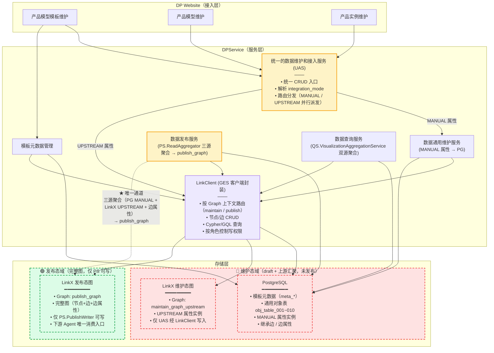

**分层说明**：

| 层级 | 组件 | 职责 |
| --- | --- | --- |
| **接入层** | DP Website | 用户入口，支持三大核心功能：产品模型模板维护、产品模型维护、产品实例维护 |
| **服务层** | **DPService** | 核心业务能力封装，含 5 个组件：UAS + TM + MS + PS + QS + LC |
| ├ 门面 | **UAS（统一的数据维护和接入服务）** | 服务层统一门面，对上层透明，根据 `integration_mode` 路由本地维护 / 外部汇聚 |
| ├ 业务能力 | 模板元数据管理 / 数据通用维护服务 / 数据发布服务 / 数据查询服务 | 核心业务模块 |
| ├ 基础能力 | **LinkClient（GES 客户端封装）** | 位于服务层内部，统一访问 PostgreSQL + LinkX |
| **存储层** | PostgreSQL / LinkX | PostgreSQL 存储模板元数据；LinkX 存储实例数据（图） |

**DPService 子模块说明**：

| 模块 | 职责 |
| --- | --- |
| **UAS（统一的数据维护和接入服务）** | 服务层门面，解析 `integration_mode`，路由到本地维护（MANUAL）或外部汇聚（UPSTREAM），对上层透明 |
| **模板元数据管理** | 管理产品模型模板、元数据 Schema（存储于 PostgreSQL） |
| **数据通用维护服务** | 业务对象的 CRUD 操作（节点、边、关系），含版本管理★ 基础能力 |
| **数据发布服务** | 维护态数据发布到发布态 |
| **数据查询服务** | 实例数据的查询与检索 |
| **LinkClient** | 统一的 LinkX / PostgreSQL 访问封装，隔离底层存储 |

**数据流概览**：

```
┌──────────────────────────────────────────────────────────────┐
│  DP Website（接入层）                                        │
│  ┌────────────┬────────────┬────────────┐                    │
│  │ 产品模型    │ 产品模型    │ 产品实例    │                    │
│  │ 模板维护    │ 维护        │ 维护        │                    │
│  └────────────┴────────────┴────────────┘                    │
└──────────────────────────────────────────────────────────────┘
                            ↓
┌──────────────────────────────────────────────────────────────┐
│  DPService（服务层）                                         │
│                                                              │
│  ┌────────────────────────────────────────────────────────┐  │
│  │ UAS — 统一的数据维护和接入服务（门面）                   │  │
│  │ • 解析 integration_mode → MANUAL / UPSTREAM              │  │
│  │ • 路由：MANUAL → 数据通用维护；UPSTREAM → 外部/LinkClient │  │
│  └────────────────────────────────────────────────────────┘  │
│         ↓ MANUAL              ↓ UPSTREAM                      │
│  ┌──────────┬────────────┬──────────┬──────────┐            │
│  │ 模板元数据 │ 数据通用    │ 数据发布  │ 数据查询  │            │
│  │ 管理(→PG) │ 维护服务    │ 服务      │ 服务      │            │
│  │          │ +版本管理★  │          │          │            │
│  └──────────┴──────┬──────┴──────────┴──────────┘            │
│                    ↓                                          │
│              LinkClient（GES 客户端）                          │
└──────────────────────────────────────────────────────────────┘
                            ↓
┌──────────────────────────────────────────────────────────────┐
│  存储层                                                     │
│  ┌──────────────────┬──────────────────┐                     │
│  │ PostgreSQL        │ LinkX (GES)     │                     │
│  │ 模板元数据         │ 实例数据          │                   │
│  └──────────────────┴──────────────────┘                     │
└──────────────────────────────────────────────────────────────┘
```

---

#### 3.1.3 服务分层架构（详细版）

> 基于 3.1.2 L1 级逻辑视图，将"接入层 / 服务层（内含 LinkClient）/ 存储层"逐层细化，展示每个分层内部的具体模块及依赖关系。LinkClient 已移入服务层内部，作为数据访问的统一通道。

**详细分层架构图**：

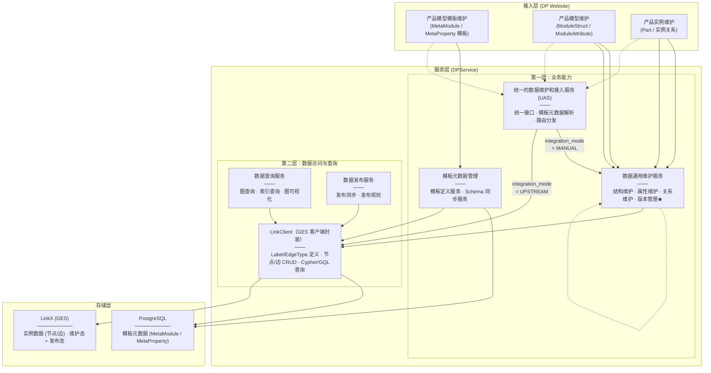

**分层细化说明**：

##### 3.1.3.1 接入层 (DP Website)

| 模块 | 入口能力 | 对应服务 |
| --- | --- | --- |
| **产品模型模板维护** | 维护产品模型模板（MetaModule、MetaProperty） | 模板元数据管理 |
| **产品模型维护** | 维护产品模型定义（ModuleStruct、ModuleAttribute、关系） | 数据通用维护服务 |
| **产品实例维护** | 维护产品实例（Part、实例关系） | 数据通用维护服务 |

##### 3.1.3.2 服务层 (DPService)

**统一的数据维护和接入服务（UAS）— 门面入口**

| 模块 | 职责 | 依赖 |
| --- | --- | --- |
| **统一接口** | 对上层（DP Website / Web 服务）暴露统一 CRUD 接口 | 模板元数据、本地维护服务、外部适配器 |
| **外部系统适配器** | 对接 CB+/CB+New/N6 等外部系统；`integration_mode = UPSTREAM` 时数据**不落本地库** | LinkClient（实时获取） |

> UAS 根据模板元数据上的 `integration_mode` 标记，路由到数据通用维护服务（MANUAL）或外部系统适配器（UPSTREAM），对上层透明。

**模板元数据管理（TM）**

| 模块 | 职责 | 依赖 |
| --- | --- | --- |
| **模板定义服务** | 模板的 CRUD、版本管理 | Schema 同步服务、PG |
| **Schema 同步服务** | 模板元数据落库到 PostgreSQL、Schema 校验 | LinkClient.Schema、PG |

**数据通用维护服务（MS）**

| 模块 | 职责 | 依赖 |
| --- | --- | --- |
| **结构维护** | ModuleStruct / PartClass 的 CRUD | LinkClient.实例查询、LinkX |
| **属性维护** | ModuleAttribute / SPEC 配置的 CRUD | LinkClient.实例查询、LinkX |
| **关系维护** | ModuleStructRelation 的 CRUD | LinkClient.实例查询、LinkX |
| **版本管理 ★** | 业务对象变更的快照、回溯、对比（**基础能力，子子模块**） | LinkClient.实例查询、LinkX |

**数据发布服务（PS）**

| 模块 | 职责 | 依赖 |
| --- | --- | --- |
| **发布同步** | 从维护态图到发布态图的数据搬运 | LinkClient.实例查询、LinkX |
| **发布规则** | 发布过程的过滤/转换/校验规则 | 发布同步 |

**数据查询服务（QS）**

| 模块 | 职责 | 依赖 |
| --- | --- | --- |
| **图查询** | 基于 Cypher / GQL 的图遍历查询 | LinkClient.实例查询、LinkX |
| **索引查询** | 基于索引的多条件组合检索 | LinkClient.实例查询、LinkX |
| **图可视化** | 图结构的前端可视化展示（OPEN-13 待定） | LinkClient.实例查询 |

##### 3.1.3.3 LinkClient（GES 客户端封装）

> LinkClient 已移入 DPService 内部。所有 DPService 子模块均通过 LinkClient 访问存储层。

| 能力 | 说明 |
| --- | --- |
| **Label / EdgeType 管理** | 图 Schema 定义（Label、属性）、建图、清图 |
| **节点/边 CRUD** | 批量添加/更新/删除节点和边 |
| **Cypher / GQL 查询** | 通过 LinkX 执行图查询语言 |

##### 3.1.3.4 存储层

| 存储 | 内容 |
| --- | --- |
| **PostgreSQL** | 模板元数据（MetaModule / MetaProperty 等结构化元数据） |
| **LinkX (GES)** | 实例数据：节点、边、维护态图、发布态图 |

**关键设计要点**：

| 要点 | 说明 |
| --- | --- |
| **接入层到服务层一对一** | 每个接入层入口对应一个明确的 DPService 子模块，避免路由混乱 |
| **UAS 作为服务层门面** | DP Website 调用 UAS，由 UAS 根据 integration_mode 自动路由（MANUAL → 本地维护；UPSTREAM → 外部汇聚） |
| **LinkClient 是 DPService 内部组件** | LinkClient 已移入 DPService，作为所有子模块访问存储的统一通道 |
| **模板与实例分库存储** | 模板元数据存 PostgreSQL，实例数据存 LinkX（GES），物理隔离 |
| **版本管理是基础能力** | 版本管理作为数据通用维护服务的子子模块，对调用方透明 |
| **图 Schema 与实例数据分离** | Schema 管理（Label/EdgeType 定义）与实例 CRUD 通过 LinkClient 暴露 |

---

### 3.2 服务职责划分

> 本节基于 3.1.2 L1 级逻辑视图，对 DPService 的四个子模块做职责拆分，并补充一个"统一的数据维护和接入服务"作为服务层的统一门面。版本管理作为基础能力内嵌于"数据通用维护服务"，不再单独成层。

#### 3.2.1 服务层总览

```
┌──────────────────────────────────────────────────────────────┐
│  DPService（服务层）                                         │
│                                                              │
│  ┌────────────────────────────────────────────────────────┐  │
│  │ 统一的数据维护和接入服务（UAS）                          │  │
│  │ ────────────────────────────────────────────────────── │  │
│  │ • 对上层（DP Website / Web 服务）暴露统一接口           │  │
│  │ • 根据 integration_mode 路由                              │  │
│  └────────────────────────────────────────────────────────┘  │
│           │                                                  │
│      根据模板元数据定义路由                                     │
│           │                                                  │
│  ┌────────┴────────┬──────────────┬──────────────┐            │
│  │ 模板元数据管理    │ 数据通用      │ 数据发布      │            │
│  │ (Template Meta)  │ 维护服务      │ 服务          │            │
│  │                  │ (Common MS)  │ (Publish)    │            │
│  │                  │              │              │            │
│  │                  │ ├─ 结构维护   │ ├─ 发布同步  │            │
│  │                  │ ├─ 属性维护   │ └─ 发布规则  │            │
│  │                  │ ├─ 关系维护   │              │            │
│  │                  │ └─ 版本管理★  │              │            │
│  │                  │   (基础能力)  │              │            │
│  └──────────────────┴──────────────┴──────────────┘            │
│                        │                                      │
│                        ↓                                      │
│  ┌──────────────┬──────────────┐                              │
│  │ 数据查询服务  │ LinkClient   │                              │
│  │ (Query)      │ (GES 客户端) │                              │
│  │ ├─ 图查询    │              │                              │
│  │ ├─ 索引查询  │              │                              │
│  │ └─ 图可视化  │              │                              │
│  └──────────────┴──────────────┘                              │
│                        │                                      │
└────────────────────────┼──────────────────────────────────────┘
                         ↓
         ┌───────────────┴───────────────┐
         ↓                               ↓
     PostgreSQL                    LinkX (GES)
     模板元数据                    维护态 + 发布态图
```

#### 3.2.2 统一的数据维护和接入服务（UAS）

> **定位**：服务层的统一门面。DP Website 和 Web 服务只需调用 UAS，由 `integration_mode` 决定数据走本地维护还是外部汇聚，无需感知底层差异。

**核心设计目标**

- **对上层透明**：上层调用方只关心"读/写某个实体"，不关心数据落本地库还是外部系统
- **路由智能化**：根据实体绑定的模板元数据定义，自动选择本地通用维护或外部对接
- **复用现有能力**：未来对接 CB+New 等外部系统时，不做大规模数据迁移，直接复用其能力
- **统一接口契约**：所有数据维护/查询都走同一套接口规范

**两种数据接入模式**

| 模式 | 触发条件 | 数据落库 | 实现机制 |
| --- | --- | --- | --- |
| **MANUAL（通用维护）** | `integration_mode = MANUAL` | 写入维护态图（LinkX） | UAS → 数据通用维护服务 → LinkClient → LinkX |
| **UPSTREAM（上游汇聚）** | `integration_mode = UPSTREAM` | **不落本地维护库** | UAS → 外部系统适配器 → 实时获取（通过 LinkX 或外部 API） |

**核心职责**

| 职责 | 说明 |
| --- | --- |
| **接口统一** | 对上层提供统一的 CRUD、查询、发布接口 |
| **模板元数据解析** | 解析实体绑定的模板，识别 integration_mode（MANUAL / UPSTREAM） |
| **路由分发** | 根据 integration_mode 路由到"数据通用维护服务"或"外部系统适配器" |
| **外部系统适配** | 对接 CB+、N6、CB+New 等外部系统，复用其既有能力 |
| **差异屏蔽** | 对上层屏蔽底层是 LinkX 本地查询还是外部 HTTP 调用 |

**典型场景示例**

```
场景 1：Part 实体的 integration_mode = MANUAL
  DP Website 调用 UAS.UpsertEntity("Part", part)
       ↓ UAS 解析模板 → MANUAL
  数据通用维护服务.Struct.upsert(part)
       ↓
  LinkClient.createNode(part)
       ↓
  写入维护态图（LinkX）

场景 2：PartClass 实体的 integration_mode = UPSTREAM
  DP Website 调用 UAS.GetEntity("PartClass", id)
       ↓ UAS 解析模板 → UPSTREAM
  外部系统适配器.getPartClass(id)
       ↓
  实时访问 CB+New 服务（或经 LinkX 实时查询）
       ↓
  数据不落本地维护库
       ↓
  上层 DP Website 收到与场景 1 完全一致的数据结构

两种场景对上层调用方完全透明。
```

**接口示例**

```typescript
/**
 * 统一的数据维护和接入服务
 * 上层（DP Website / Web 服务）只需调用此服务
 */
interface IUnifiedAccessService {
    // ========== 通用 CRUD（自动路由） ==========
    upsertEntity<T>(templateCode: string, entity: T): Promise<EntityResult>;
    getEntity<T>(templateCode: string, id: string): Promise<T>;
    deleteEntity(templateCode: string, id: string): Promise<DeleteResult>;
    queryEntities<T>(templateCode: string, criteria: QueryCriteria): Promise<QueryResult<T>>;

    // ========== 批量操作 ==========
    batchUpsert<T>(templateCode: string, entities: T[]): Promise<BatchResult>;
    batchDelete(templateCode: string, ids: string[]): Promise<BatchResult>;

    // ========== 发布 ==========
    publish(templateCode: string, ids: string[]): Promise<PublishResult>;
}
```

#### 3.2.3 模板元数据管理（Template Meta）

> 负责管理产品模型的**模板元数据**与**业务对象↔通用表映射规则**。**不引入新表**——版本和映射直接作为 `MetaModule` / `MetaProperty` 的扩展字段。**存储介质：PostgreSQL**。
>
> 详细设计依据 [RFC-003 v0.3：数据通用维护服务 - 通用对象表映射机制](./adr/RFC-003-数据通用维护服务-通用对象表映射机制.md)。

**子模块（无变化，只是扩展了元数据字段）**

| 子模块 | 职责 | 依赖 |
| --- | --- | --- |
| **模板定义服务** | MetaModule / MetaProperty 的 CRUD、Schema 校验（含 `version` / `target_table` / `attr_column` 扩展字段） | Schema 同步服务、PG |
| **Schema 同步服务** | 元数据落库到 PostgreSQL；维护 `integration_mode` 标记 | PG |

**核心数据表（PG 存储）**

| 表名 | 用途 | 关键字段 |
| --- | --- | --- |
| `meta_module` | 元数据模块（**扩展 3 个字段**） | `version` ★、`target_table` ★、`target_table_key_column` ★、`biz_key_strategy` ★ |
| `meta_property` | 元数据属性（**扩展 3 个字段**） | `attr_column` ★、`attr_required` ★、`attr_indexed` ★ |
| `meta_relation` | 元数据关系（按 4.2.4 现行设计） | — |
| `meta_catalog_node` | 目录节点（按 4.2.4 现行设计） | — |

**`MetaModule` 扩展字段**（仅展示新增部分，原有字段不变）：

```sql
ALTER TABLE meta_module
    ADD COLUMN version VARCHAR(50) NOT NULL DEFAULT 'v1.0.0' COMMENT '当前语义版本，变更时自动递增',
    ADD COLUMN target_table VARCHAR(50) NOT NULL COMMENT '映射到的通用表名，如 obj_table_001',
    ADD COLUMN target_table_key_column VARCHAR(50) NOT NULL DEFAULT 'code' COMMENT '通用表中业务标识字段名，默认 code',
    ADD COLUMN biz_key_strategy VARCHAR(20) NOT NULL DEFAULT 'SINGLE' COMMENT 'SINGLE / COMPOSITE',
    ADD INDEX idx_target_table (target_table);
```

**`MetaProperty` 扩展字段**（仅展示新增部分，原有字段不变）：

```sql
ALTER TABLE meta_property
    ADD COLUMN attr_column VARCHAR(50) COMMENT '映射到的通用表列名，如 attr_01。若为空则按属性名字典序自动推导',
    ADD COLUMN attr_required BOOLEAN NOT NULL DEFAULT FALSE COMMENT '是否必填',
    ADD COLUMN attr_indexed BOOLEAN NOT NULL DEFAULT FALSE COMMENT '是否建索引';
```

**关键设计点**

- **零新增表**：业务模板、映射规则、模板版本均不需要单独建表，直接复用 `MetaModule` / `MetaProperty` 现有结构
- **版本管理轻量化**：`MetaModule.version` 字段记录当前语义版本（变更时递增），无需 `business_template` / `template_version` 表
- **映射规则轻量化**：`MetaModule.target_table` + `MetaProperty.attr_column` 直接定义映射，无需 `obj_to_table_mapping` 表
- **自动推导**：若 `MetaProperty.attr_column` 为空，按属性名字典序自动分配到 `attr_01`、`attr_02` ...
- **单一表查询**：一个模板的所有元数据（版本+映射+属性）从 `MetaModule` + `MetaProperty` 2 张表查出，无需 JOIN 额外表

**核心接口（无变化，只扩展字段）**

```typescript
// 接口签名不变，只需在 createMetaModule / updateMetaModule 时传入扩展字段
interface ITemplateMetaService {
    createMetaModule(metaModule: MetaModule & {
        version?: string;           // 默认 v1.0.0
        targetTable?: string;      // 必填，映射到的通用表名
        targetTableKeyColumn?: string;  // 默认 code
        bizKeyStrategy?: string;   // 默认 SINGLE
    }): Promise<MetaModuleResult>;

    createMetaProperty(metaProperty: MetaProperty & {
        attrColumn?: string;       // 为空时自动推导
        attrRequired?: boolean;    // 默认 false
        attrIndexed?: boolean;      // 默认 false
    }): Promise<MetaPropertyResult>;
}
```

**关键产出**

- 元数据模板定义（含 `integration_mode` 标记 + **版本字段 + 映射字段**）
- 业务对象 ↔ 通用表映射规则（**直接附在元数据上**）
- **重要**：模板元数据管理不存储实例数据，实例数据由数据通用维护服务落通用对象表

#### 3.2.4 数据通用维护服务（Common MS）

> 负责按模板元数据定义的映射规则，对业务对象进行本地 CRUD 操作。**映射规则从 `MetaModule.target_table` / `MetaProperty.attr_column` 直接读取，无需 JOIN 额外表**。**存储介质：PostgreSQL 通用对象表**。
>
> 详细设计依据 [RFC-003 v0.3：数据通用维护服务 - 通用对象表映射机制](./adr/RFC-003-数据通用维护服务-通用对象表映射机制.md)。

**子模块（简化）**

| 子模块 | 职责 | 依赖 |
| --- | --- | --- |
| **通用对象表 CRUD** | 按 `MetaModule.target_table` 路由，对 `obj_table_001...N` 执行 CRUD | 模板元数据管理（解析 target_table）、PG |
| **业务对象映射执行** | 业务属性 ↔ 通用表列的双向转换（按 `MetaProperty.attr_column` 映射）、合法性校验 | 通用对象表 CRUD |
| **数据版本快照** | 以"行快照"方式实现（每条写入产生新 UUID 行） | 通用对象表 CRUD |

**核心数据表（PG 存储）**

| 表名 | 用途 | 关键字段 |
| --- | --- | --- |
| `obj_table_001...N` | 通用对象表（预建 N 张） | `id`（快照 UUID）、`code`（业务标识）、`version`（语义版本）、`object_code`、`attr_01~attr_N`、`attr_extra` JSONB、`_maintenance_state` |

**`obj_table_001` 表结构**：

```sql
CREATE TABLE obj_table_001 (
    -- 1. 快照版本 UUID（每条记录独立 UUID）
    id                  VARCHAR(36) PRIMARY KEY,
    -- 2. 业务数据唯一标识（同一对象的所有版本共享同一 code）
    code                VARCHAR(100) NOT NULL,
    INDEX idx_code (code),
    -- 3. 业务对象编码
    object_code         VARCHAR(50) NOT NULL,
    INDEX idx_object_code (object_code),
    -- 4. 版本号（语义版本，如 v1.0.0，由 MetaModule.version 注入）
    version             VARCHAR(50) NOT NULL,
    -- 5. 通用扩展属性（20 列固定 + JSONB 兜底）
    attr_01 ~ attr_20  VARCHAR(500),
    attr_extra          JSONB,
    -- 6. 维护态/发布态标记
    _maintenance_state  VARCHAR(20) NOT NULL DEFAULT 'DRAFT',
    INDEX idx_state (_maintenance_state),
    -- 7. 审计列
    created_at          DATETIME NOT NULL DEFAULT CURRENT_TIMESTAMP,
    created_by          VARCHAR(100),
    is_deleted          BOOLEAN NOT NULL DEFAULT FALSE
) ENGINE=InnoDB DEFAULT CHARSET=utf8mb4 COMMENT '通用对象表 - 001';
```

**关键设计点**

- **映射从元数据直读**：不需要 `obj_to_table_mapping` 表，直接从 `MetaModule.target_table` + `MetaProperty.attr_column` 获取映射规则
- **版本从元数据注入**：`obj_table_*.version` 由 `MetaModule.version` 决定（变更时递增）
- **版本快照=物理行**：不需要 `template_version` 表，每次写入产生新的 `id`（UUID）
- **索引最小化**：只对 `(code)` / `(object_code)` / `(_maintenance_state)` 建索引

**核心接口**

```typescript
interface ICommonMaintenanceService {
    // ========== 通用对象 CRUD ==========
    upsertEntity(metaModuleCode: string, entity: Record<string, any>): Promise<EntityResult>;
    getEntity(metaModuleCode: string, code: string, version?: string): Promise<Record<string, any>>;
    deleteEntity(metaModuleCode: string, code: string): Promise<DeleteResult>;
    queryEntities(metaModuleCode: string, criteria: QueryCriteria): Promise<QueryResult<Record<string, any>>>;

    // ========== 批量操作 ==========
    batchUpsert(metaModuleCode: string, entities: Record<string, any>[]): Promise<BatchResult>;
    batchDelete(metaModuleCode: string, codes: string[]): Promise<BatchResult>;

    // ========== 版本快照（融入通用表） ==========
    listVersions(metaModuleCode: string, code: string): Promise<VersionListResult>;
    getVersionData(metaModuleCode: string, code: string, version: string): Promise<Record<string, any>>;
}
```

**依赖关系**

- 数据通用维护服务**不**包含模板管理、映射管理、版本管理子模块（已简化）
- 模板管理在 3.2.3 模板元数据管理（只需扩展 `MetaModule` / `MetaProperty` 字段）
- 映射规则从 `MetaModule.target_table` / `MetaProperty.attr_column` 直接读取（无需 JOIN）
- 版本管理通过 `MetaModule.version` + `obj_table_*.id`（UUID）实现

#### 3.2.5 数据发布服务（Publish）

> 负责将维护态数据（PG 通用表 + LinkX 维护态图）聚合后，构造完整图写入发布态 LinkX。**存储介质：维护态 PG + LinkX 维护态图 → 发布态 LinkX**。
>
> 详细设计依据 [RFC-003 v0.4](./adr/RFC-003-数据通用维护服务-通用对象表映射机制.md)。

| 子模块 | 职责 | 依赖 |
| --- | --- | --- |
| **发布聚合** | 读取 PG 通用表数据 + 读取 LinkX 维护态图数据，按 MetaModule 定义聚合 | 数据通用维护服务、LinkClient |
| **图构造写入** | 将聚合后的完整节点写入发布态 LinkX（`publish_graph`） | LinkClient |
| **发布规则** | 发布过程的过滤 / 转换 / 校验规则 | 发布聚合 |

**核心接口**

```typescript
interface IPublishService {
    /**
     * 发布：将维护态数据（PG + LinkX）聚合后，写入发布态 LinkX
     */
    publish(metaModuleCode: string, codes: string[]): Promise<PublishResult>;

    /**
     * 回滚：删除发布态中指定版本的数据
     */
    rollbackPublished(metaModuleCode: string, version: string): Promise<RollbackResult>;
}
```

#### 3.2.6 数据查询服务（Query）

> 提供查询能力。**维护态不支持图查询**（因混合存储），仅支持可视化聚合查询；**发布态支持图查询**（完整图在 LinkX）。**存储介质：LinkX 发布态图（查询）+ PG+LinkX 聚合（可视化）**。
>
> OPEN-Q7 已决策：维护态不需要 Cypher 只读接口；可视化通过聚合层实现。

| 子模块 | 职责 | 依赖 |
| --- | --- | --- |
| **图查询**（发布态） | 基于 Cypher / GQL 的图遍历查询 | LinkClient（发布态图） |
| **可视化聚合**（维护态） | 同时查 PG + LinkX，内存聚合后返回（用于前端图可视化） | 数据通用维护服务、LinkClient（维护态图） |
| **索引查询** | 基于索引的多条件组合检索 | LinkClient |

#### 3.2.7 服务层对外接口关系

```
┌──────────────────────────────────────────────────────────────────┐
│  DP Website（接入层）                                                    │
│  • 产品模型模板维护  • 产品模型维护  • 产品实例维护                   │
└──────────────────────────────────────────────────────────────────┘
                              ↓
┌──────────────────────────────────────────────────────────────────┐
│  DPService（服务层）                                                     │
│                                                                              │
│  ┌────────────────────────────────────────────────────────────┐  │
│  │ 统一的数据维护和接入服务 (UAS) — 门面入口                     │  │
│  └────────────────────────────────────────────────────────────┘  │
│           ↓                            ↓                              │
│  ┌──────────────────┐        ┌──────────────────────────────┐        │
│  │ 数据通用维护服务  │        │  LinkClient               │        │
│  │ (Common MS)     │        │  (LinkX 客户端封装)       │        │
│  │                 │        │                           │        │
│  │ • MANUAL 属性   │        │  ┌─────────────────────┐ │        │
│  │   → PG 通用表   │        │  │ maintain_graph      │ │        │
│  │                 │        │  │ (UPSTREAM 属性)      │ │        │
│  │ • UPSTREAM 属性 │───────▶│  └─────────────────────┘ │        │
│  │   → LinkClient  │        │  ┌─────────────────────┐ │        │
│  │                 │        │  │ publish_graph        │ │        │
│  │ • 可视化聚合    │        │  │ (发布态图)            │ │        │
│  │   → 后台聚合    │        │  └─────────────────────┘ │        │
│  └──────────────────┘        └──────────────────────────────┘        │
│                                                                              │
│  ┌──────────────────┐  ┌──────────────────┐  ┌──────────────────┐   │
│  │ 模板元数据管理   │  │ 数据发布服务     │  │ 数据查询服务     │   │
│  │ (→ PostgreSQL) │  │ (PG+LinkX→PS聚合→LinkX) │  │ (发布态图查询) │   │
│  └──────────────────┘  └──────────────────┘  └──────────────────┘   │
└──────────────────────────────────────────────────────────────────┘
                              ↓
              ┌───────────────────────┴───────────────────────┐
              ↓                                               ↓
          PostgreSQL                                   LinkX (GES)
          模板元数据                                     维护态图（UPSTREAM 属性）
          PG 通用表 obj_table_001~010                   发布态图
```

---

### 3.3 核心服务详细设计

#### 3.3.1 LinkX Client（LinkX 客户端封装）

> **设计目标**：对 LinkX 的所有访问通过此 Client 完成，实现接口隔离和可测试性。
>
> **与 GES API 的对应关系**：LinkClient 对接华为云 GES（Graph Engine Service）持久化版 API，按照 GES 文档中的操作类型组织接口，分为图操作、元数据操作（Label 管理）、节点操作、边操作四类。**GES 不区分 Schema 操作和 Instance 操作，LinkClient 同样不做此区分**，所有操作均通过 GES 标准 API 实现。

**接口设计**：

```typescript
/**
 * LinkX Client 接口
 * 对接华为云 GES 持久化版 API
 * 接口按 GES 操作类型组织：图管理 / 元数据操作 / 节点操作 / 边操作
 */
interface ILinkXClient {
    // ========== 图操作（对应 GES 图操作API）==========

    /** 创建图 */
    createGraph(request: CreateGraphRequest): Promise<GraphResult>;

    /** 删除图 */
    deleteGraph(graphName: string): Promise<DeleteResult>;

    /** 清空图数据 */
    clearGraph(graphName: string): Promise<ClearResult>;

    /** 获取图统计信息 */
    getGraphStats(graphName: string): Promise<GraphStats>;

    // ========== 元数据操作（对应 GES 元数据操作API）==========

    /** 添加 Label（创建 Label 定义） */
    addLabel(request: AddLabelRequest): Promise<LabelResult>;

    /** 查询 Label（获取 Label 定义） */
    queryLabel(request: QueryLabelRequest): Promise<LabelResult>;

    /** 查询所有 Label */
    queryLabels(graphName: string): Promise<LabelsResult>;

    /** 更新 Label（元数据更新） */
    updateLabel(request: UpdateLabelRequest): Promise<LabelResult>;

    /** 删除 Label */
    deleteLabel(request: DeleteLabelRequest): Promise<DeleteResult>;

    // ========== 节点操作（对应 GES 点操作API）==========

    /** 批量添加节点 */
    createNodes(request: CreateNodesRequest): Promise<BatchNodeResult>;

    /** 批量更新节点属性 */
    updateNodes(request: UpdateNodesRequest): Promise<BatchNodeResult>;

    /** 批量删除节点 */
    deleteNodes(request: DeleteNodesRequest): Promise<BatchDeleteResult>;

    /** 批量点查（按 ID 列表） */
    getNodes(request: GetNodesRequest): Promise<BatchNodeResult>;

    /** 按条件查询节点 */
    queryNodes(request: QueryNodesRequest): Promise<QueryNodeResult>;

    // ========== 边操作（对应 GES 边操作API）==========

    /** 批量添加边 */
    createEdges(request: CreateEdgesRequest): Promise<BatchEdgeResult>;

    /** 批量更新边属性 */
    updateEdges(request: UpdateEdgesRequest): Promise<BatchEdgeResult>;

    /** 批量删除边 */
    deleteEdges(request: DeleteEdgesRequest): Promise<BatchDeleteResult>;

    /** 按条件查询边 */
    queryEdges(request: QueryEdgesRequest): Promise<QueryEdgeResult>;

    // ========== Cypher / GQL 查询（对应 GES Cypher操作API / GQL查询语言API）==========

    /** 执行 Cypher 查询 */
    executeCypher(request: CypherRequest): Promise<CypherResult>;

    /** 执行 GQL 查询（OPEN-12 GQL 兼容性待确认） */
    executeGql(request: GqlRequest): Promise<GqlResult>;
}

/**
 * LinkX Client 工厂
 */
interface ILinkXClientFactory {
    /** 创建 LinkX Client 实例 */
    createClient(config: LinkXClientConfig): ILinkXClient;

    /** 创建支持 Mock 的 LinkX Client（用于测试） */
    createMockClient(mockData: MockData): ILinkXClient;
}
```

**GES API 对应关系表**：

| LinkClient 方法 | 对应 GES API | 章节路径 |
| --- | --- | --- |
| `createGraph / deleteGraph / clearGraph / getGraphStats` | 图操作 API | 图操作API |
| `addLabel / queryLabel / queryLabels / updateLabel / deleteLabel` | 元数据操作API | 元数据操作API |
| `createNodes / updateNodes / deleteNodes / getNodes / queryNodes` | 点操作API | 点操作API |
| `createEdges / updateEdges / deleteEdges / queryEdges` | 边操作API | 边操作API |
| `executeCypher` | Cypher操作API / 执行Cypher查询 | Cypher操作API |
| `executeGql` | GQL查询语言API / 执行GQL查询（OPEN-12） | GQL查询语言API |

**实现类结构**：

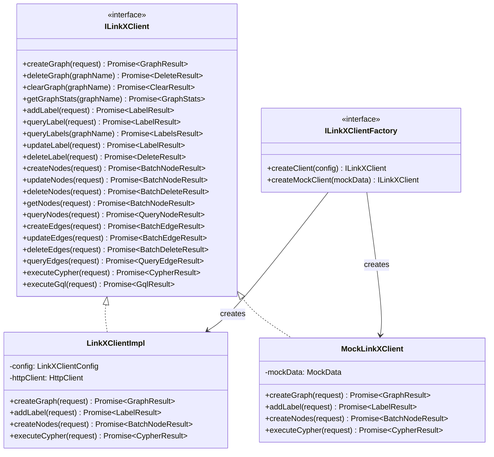

**使用示例**：

```typescript
// 生产代码
const client = linkXClientFactory.createClient({
    endpoint: "http://linkx-service:8080",
    projectId: "xxx",
    timeout: 30000,
    graph: "maintain_graph"
});

// 测试代码
const mockClient = linkXClientFactory.createMockClient({
    nodes: {
        "module-struct-001": { id: "module-struct-001", code: "ProductClass" }
    },
    edges: []
});

// 服务依赖注入
class MSBusinessObjectService {
    constructor(private linkXClient: ILinkXClient) {}

    async createModuleStruct(request: CreateModuleStructRequest) {
        return this.linkXClient.createNodes({
            graphName: "maintain_graph",
            vertices: [{
                vertex: request.id,
                label: "ModuleStruct",
                properties: request
            }]
        });
    }
}
```

**Mock 测试支持**：

```typescript
// 单元测试示例
describe('MSBusinessObjectService', () => {
    let service: MSBusinessObjectService;
    let mockClient: MockLinkXClient;

    beforeEach(() => {
        mockClient = new MockLinkXClient();
        service = new MSBusinessObjectService(mockClient);
    });

    it('should create ModuleStruct successfully', async () => {
        mockClient.mockResponse('createNodes', {
            result: "success"
        });

        const result = await service.createModuleStruct({
            id: 'module-struct-001',
            code: 'ProductClass',
            name: '产品类',
            structType: 'PRODUCT_CLASS'
        });

        expect(result.result).toBe('success');
    });
});
```

---

#### 3.3.2 通用对象表设计（数据通用维护服务核心）

> **定位**：通用对象表是数据通用维护服务的**核心存储设施**，不再依赖 LinkX 维护态图。
>
> 详细设计依据 [RFC-003：数据通用维护服务 - 通用对象表映射机制](./adr/RFC-003-数据通用维护服务-通用对象表映射机制.md)。
>
> **关键变化（v0.3）**：删除 `business_template` / `obj_to_table_mapping` / `template_version` 三张表；版本和映射直接附在 `MetaModule` / `MetaProperty` 上。

**核心设计原则**

| 原则 | 说明 |
| --- | --- |
| **id = 快照 UUID** | 每条记录独立 UUID（含同一业务对象的不同版本） |
| **code = 业务标识** | 同一对象的所有版本共享同一 `code` |
| **version = 语义版本** | 写入时由 `MetaModule.version` 注入（变更时自动递增） |
| **映射直读** | 不需要映射表，从 `MetaModule.target_table` / `MetaProperty.attr_column` 直读 |
| **混合存储** | 一个业务对象的属性按 `integration_mode` 分别落在 PG（MANUAL）或 LinkX（UPSTREAM） |
| **索引最小化** | 只对 `(code)` / `(object_code)` / `(_maintenance_state)` 建索引 |
| **发布态走 LinkX** | 发布服务将 PG + LinkX 聚合后，构造完整图写入发布态 LinkX |

**快照类型（按写入触发时机）**

| 快照类型 | 触发时机 | 存储内容 | 用途 |
| --- | --- | --- | --- |
| **AUTO 快照** | 数据变更时（任何 CRUD 操作） | `obj_table_*.id` 新 UUID 表征 | 审计追溯 |
| **PUBLISH 快照** | 发布时 | 同上，但 `version` 标记当前发布版本 | 发布回溯 |
| **MANUAL 快照** | 用户手动触发 | 同上，但 `version` 标记为 `{target_version}-manual` | 重要节点标记 |

**通用对象表 DDL（统一模板）**

```sql
-- 通用对象表（预建 10 张，此处示例 obj_table_001）
CREATE TABLE obj_table_001 (
    -- 1. 快照版本 UUID（每条记录独立 UUID）
    id                  VARCHAR(36) PRIMARY KEY,
    -- 2. 业务数据唯一标识（同一对象的所有版本共享同一 code）
    code                VARCHAR(100) NOT NULL,
    INDEX idx_code (code),
    -- 3. 业务对象编码（决定"是哪张映射"）
    object_code         VARCHAR(50) NOT NULL,
    INDEX idx_object_code (object_code),
    -- 4. 版本号（语义版本，如 v1.0.0 / v1.1.0）
    version             VARCHAR(50) NOT NULL,
    -- 5. 通用扩展属性（按用户要求预留 20 列 + JSONB 兜底）
    attr_01             VARCHAR(500),
    attr_02             VARCHAR(500),
    attr_03             VARCHAR(500),
    attr_04             VARCHAR(500),
    attr_05             VARCHAR(500),
    attr_06             VARCHAR(500),
    attr_07             VARCHAR(500),
    attr_08             VARCHAR(500),
    attr_09             VARCHAR(500),
    attr_10             VARCHAR(500),
    attr_11             VARCHAR(500),
    attr_12             VARCHAR(500),
    attr_13             VARCHAR(500),
    attr_14             VARCHAR(500),
    attr_15             VARCHAR(500),
    attr_16             VARCHAR(500),
    attr_17             VARCHAR(500),
    attr_18             VARCHAR(500),
    attr_19             VARCHAR(500),
    attr_20             VARCHAR(500),
    attr_extra          JSONB,
    -- 6. 维护态/发布态标记
    _maintenance_state  VARCHAR(20) NOT NULL DEFAULT 'DRAFT',
    INDEX idx_state (_maintenance_state),
    -- 7. 审计列
    created_at          DATETIME NOT NULL DEFAULT CURRENT_TIMESTAMP,
    created_by          VARCHAR(100),
    is_deleted          BOOLEAN NOT NULL DEFAULT FALSE
) ENGINE=InnoDB DEFAULT CHARSET=utf8mb4 COMMENT '通用对象表 - 001';
```

**核心接口（数据通用维护服务）**

```typescript
interface ICommonMaintenanceService {
    // ========== 通用对象 CRUD ==========
    upsertEntity(metaModuleCode: string, entity: Record<string, any>): Promise<EntityResult>;
    getEntity(metaModuleCode: string, code: string, version?: string): Promise<Record<string, any>>;
    deleteEntity(metaModuleCode: string, code: string): Promise<DeleteResult>;
    queryEntities(metaModuleCode: string, criteria: QueryCriteria): Promise<QueryResult<Record<string, any>>>;

    // ========== 批量操作 ==========
    batchUpsert(metaModuleCode: string, entities: Record<string, any>[]): Promise<BatchResult>;
    batchDelete(metaModuleCode: string, codes: string[]): Promise<BatchResult>;

    // ========== 版本快照（融入通用表） ==========
    listVersions(metaModuleCode: string, code: string): Promise<VersionListResult>;
    getVersionData(metaModuleCode: string, code: string, version: string): Promise<Record<string, any>>;
}
```

**通用对象表查询模式**

| 场景 | SQL 示例 |
| --- | --- |
| 取最新版本 | `SELECT * FROM obj_table_001 WHERE code = ? AND object_code = ? ORDER BY created_at DESC LIMIT 1` |
| 取指定版本 | `SELECT * FROM obj_table_001 WHERE code = ? AND id = ?` |
| 取所有版本 | `SELECT * FROM obj_table_001 WHERE code = ? ORDER BY created_at DESC` |
| 取某版本下所有对象 | `SELECT * FROM obj_table_001 WHERE version = ? AND _maintenance_state='PUBLISH' AND is_deleted=0` |
| 数据版本回溯 | 复制目标版本内容 → 写入新行（新 UUID），`version` 标记为 `{target_version}-rollback` |

**通用对象表设计带来的变化**

| 维度 | 原 3.3.2（v1.6） | 本设计（v1.9，依据 RFC-003 v0.4） |
| --- | --- | --- |
| 存储介质 | LinkX 维护态图 | PostgreSQL 通用对象表 |
| 快照实现 | 独立的 `version_history` 等 4 张表 | 通用表的 `id`（UUID）+ `code` 双键 |
| 模板存储 | 无独立模板表 | 扩展 `MetaModule` 字段（`version` / `target_table`） |
| 映射存储 | 无独立映射表 | 扩展 `MetaProperty` 字段（`attr_column`） |
| 新增表数量 | 0 | **0 张**（仅扩展现有字段） |
| 索引策略 | LinkX 标签扫描 | 仅 3 个二级索引 |
| 回溯实现 | UPDATE 覆盖当前数据 | 复制目标版本写入新行（保留历史链路） |
| 与 LinkX Client 关系 | 强依赖 | 仅 UPSTREAM 属性走 LinkX；可视化走聚合层 |

#### 3.3.3 验收验证

> 验收用例设计、服务器简化样例数据、元数据配置示例，见 [RFC-003 v0.4 第 7/8 节](./adr/RFC-003-数据通用维护服务-通用对象表映射机制.md)。

**验收覆盖场景**：

| ID | 场景 | 期望 |
| --- | --- | --- |
| AC-1 | 创建 MetaModule（指定 `target_table` 和 `version`） | 元数据写入成功 |
| AC-2 | 创建 MetaProperty（指定 `attr_column`） | 属性与 PG 列正确映射 |
| AC-3 | MANUAL 属性写入 PG | 落到正确的通用表 |
| AC-4 | UPSTREAM 属性写入 LinkX | 落到 maintain_graph_upstream |
| AC-5 | 同一对象 5 属性，部分 MANUAL、部分 UPSTREAM | 分别落入 PG 和 LinkX |
| AC-6 | 可视化聚合查询 | 后台同时查 PG + LinkX，返回完整对象 |
| AC-7 | 发布服务聚合 PG + LinkX 数据写入发布态 | 发布态 LinkX 包含完整对象 |
| AC-8 | 按 `code` 查询所有版本 | 返回多条记录（不同 `id`，相同 `code`） |

---

### 3.4 服务依赖关系

> 基于 RFC-003 重构后的架构（数据通用维护服务落 PG 通用表，模板管理归模板元数据管理），重新整理服务依赖。

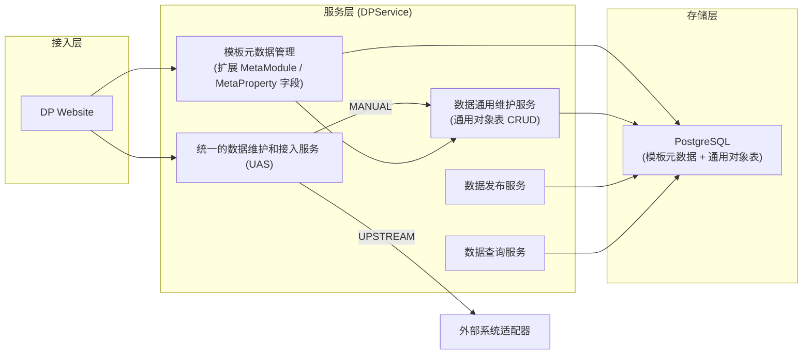

**依赖规则**：

| 规则 | 说明 |
| --- | --- |
| **接入层 → 服务层** | DP Website 直接调用 UAS 或模板元数据管理 |
| **UAS 路由** | 根据 `integration_mode` 路由到数据通用维护服务（MANUAL）或外部系统适配器（UPSTREAM） |
| **服务层 → 存储层** | 所有 DPService 子模块统一访问 PostgreSQL（模板元数据 + 通用对象表） |
| **模板管理归模板元数据管理** | 业务模板、映射规则、模板版本由 3.2.3 模板元数据管理负责 |
| **数据通用维护服务无版本管理子模块** | 版本管理完全融入通用对象表（id=UUID + code=业务标识双键） |
| **PG 单一存储** | 模板元数据 + 通用对象表 + 业务模板相关表全部落 PG（详见 OPEN-Q7 是否保留 LinkX 只读） |

---

### 3.5 本章结论

#### 3.5.1 已确定事项

- ✅ **维护态混合存储**：MANUAL 属性落 PG 通用表（`obj_table_001~010`）；UPSTREAM 属性落 LinkX 维护态图；一个业务对象的两类属性各走各的存储（RFC-003 v0.4）
- ✅ **数据发布服务**：将维护态数据（PG + LinkX）聚合后，构造完整图写入发布态 LinkX
- ✅ **可视化聚合**：维护态不支持图查询，但支持可视化展示（后台同时查 PG + LinkX，内存聚合）
- ✅ **模板元数据管理轻量化**：版本字段和映射字段直接附在 `MetaModule` / `MetaProperty` 上，不引入新表（RFC-003 v0.4）
- ✅ **版本管理轻量化**：`MetaModule.version` 字段 + 通用表 `id`（UUID）实现
- ✅ **integration_mode 路由**：UAS 根据模板的 `integration_mode`（MANUAL → PG / UPSTREAM → LinkX）路由

#### 3.5.2 待决策事项（OPEN）

| ID | 问题 | 状态 | 说明 |
| --- | --- | --- | --- |
| **OPEN-11** | 版本管理的实现方式 | **CLOSED → 见 3.3.2 通用对象表设计** | 版本管理融入通用表 |
| **OPEN-23** | 通用表 SQL 注入防护 | **挂起** | 参数化查询 + 映射表校验 |
| **OPEN-24** | 版本快照的存储策略 | **已决策：融入通用表** | 详见 3.3.2 |
| **OPEN-25** | 批量操作的事务边界 | **细化：按场景决策** | 见下表 |
| **OPEN-Q1（用户决策）** | 维护态存储介质 | **混合存储** | PG（MANUAL）+ LinkX（UPSTREAM）各存一部分；非"退回到 PG" |
| **OPEN-Q2（用户决策）** | 通用表数量 N | **N = 10** | 用户决策 |
| **OPEN-Q3（用户决策）** | 扩展属性列数 | **20+JSONB** | 用户决策 |
| **OPEN-Q4（用户决策）** | 发布态数据 | **走 LinkX** | 由数据发布服务按元数据构造完整图 |
| **OPEN-Q5（用户决策）** | 维护态图查询 | **不支持图查询** | 仅支持可视化聚合；发布态支持图查询 |

**OPEN-25 批量操作事务边界细化**：

| 场景 | 推荐策略 | 说明 |
| --- | --- | --- |
| **单实体多属性批量更新** | PG 单事务 | PG 原生事务支持，应用层保证幂等 + 失败回滚 |
| **多实体同批次变更** | 分批提交 + 幂等设计 | 每批独立事务，应用层记录批次状态，支持断点续传 |
| **发布态全量发布** | 独立事务（标记 `_maintenance_state='PUBLISH'`） | 发布操作有独立快照保护，失败不影响维护态 |
| **跨模块操作（MS + TM）** | 应用层补偿机制 | 跨表无原生分布式事务，依赖业务补偿或消息队列 |

---

## 第四章：数据模型

> 本章将业务模型映射到 PostgreSQL 通用对象表（依据 RFC-003），包括核心抽象、三层结构、元数据层设计。

### 4.1 设计约束与决策

#### 4.1.1 来自前序章节的约束

| 约束来源 | 约束内容 |
| --- | --- |
| **C4（系统边界）** | 维护态与发布态物理分离（维护态落 PG 通用表，发布态由独立 ADR 决定） |
| **第二章用例视图** | 边属性（UC-B1c~f）需在通用对象表 `attr_extra` JSONB 或独立通用表中正确建模 |
| **第三章逻辑视图** | 模板元数据管理（扩展 `MetaModule.target_table` / `MetaProperty.attr_column` 字段）支撑数据通用维护服务 |
| **RFC-003 v0.4** | 维护态 PG + LinkX 混合存储（MANUAL → PG，UPSTREAM → LinkX）；发布态走 LinkX（由 PS 按元数据聚合）；无独立 version 表 |

#### 4.1.2 版本管理策略决策

> **CLOSED - 见 3.3.2 通用对象表设计**
>
> 原 OPEN-11（版本管理策略）已通过 RFC-003 v0.2 解决：
> - 不再有独立的 `version_manager` / `version_history` / `version_tag` / `rollback_record` 四张表
> - 版本管理通过通用对象表的 `id`（UUID）+ `code`（业务标识）双键实现
> - `MetaModule.version` 字段记录当前语义版本（无独立 version 表）
> - 详见 3.3.2 通用对象表设计与 RFC-003：[RFC-003](./adr/RFC-003-数据通用维护服务-通用对象表映射机制.md)

### 4.2 数字产品核心抽象模型

#### 4.2.1 第一张图：数据模型的扩展维度

> 数字产品模型由两大类组成：**Module Structure（结构模型）**和**Module Attribute（属性模型）**。
> - **Module Structure**：描述产品本体的结构，如 ProductClass（产品类）、ProductInstance（产品实例）、PartClass（部件分类）、Part（部件）
> - **Module Attribute**：描述产品的业务特征，如 SPEC（规格）、PARAM（参数）、MARKETING（营销）

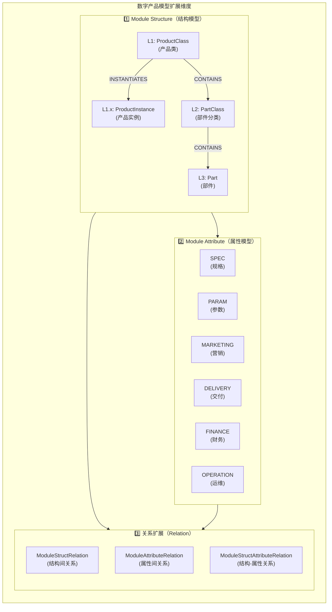

**扩展维度说明**：

| 扩展维度 | 说明 | 示例 |
| --- | --- | --- |
| **Module Structure** | 结构模型，描述产品本体结构，支持层级嵌套 | L1:ProductClass → L1.x:ProductInstance（INSTANTIATES） + L1:ProductClass → L2:PartClass → L3:Part（CONTAINS） |
| **Module Attribute** | 属性模型，描述产品业务特征，支持多维度 | SPEC / PARAM / MARKETING / DELIVERY / FINANCE / OPERATION |
| **关系扩展** | 三类关系覆盖所有连接语义 | 结构间关系 / 属性间关系 / 结构-属性关系 |

**Module Structure vs Module Attribute 区分**：

| 维度 | Module Structure | Module Attribute |
| --- | --- | --- |
| **定义者** | IT 数据架构师（ACT-03） | IT 数据架构师（ACT-03） |
| **描述对象** | 产品本体结构 | 产品业务特征 |
| **层级结构** | 支持层级嵌套（L1→L1.x→L2→L3） | 支持多维度（HBU） |
| **关系类型** | ModuleStructRelation（如 CONTAINS / INSTANTIATES） | ModuleAttributeRelation（如 DEPENDS_ON） |
| **与对方关系** | 通过 ModuleStructAttributeRelation 关联 Attribute | 通过 ModuleStructAttributeRelation 关联 Structure |

#### 4.2.2 第二张图：数字产品抽象模型（核心建模）

> 本图展示数字产品核心抽象模型的两大类：**Module Structure（结构模型）**和**Module Attribute（属性模型）**。

**概念模型**：

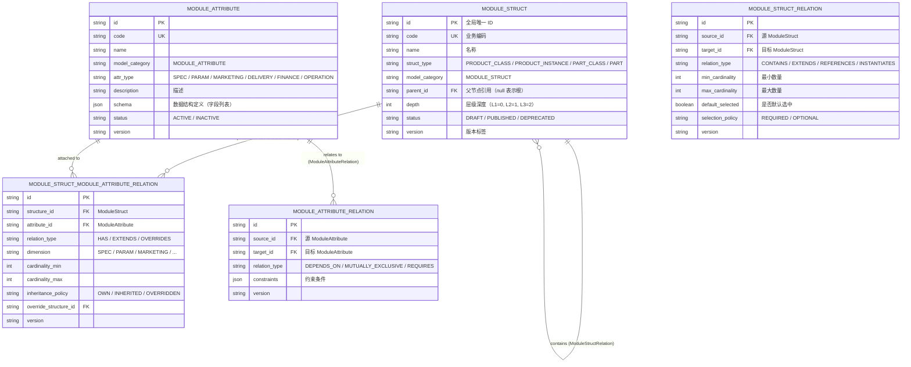

**核心类定义**：

| 类名 | 英文名 | 说明 | 关键属性 |
| --- | --- | --- | --- |
| **ModuleStruct** | 结构模型 | 描述产品本体结构，代表产品/部件的层级结构 | `struct_type`：PRODUCT_CLASS/PART_CLASS/PART<br/>`depth`：层级深度<br/>`parent_id`：父节点引用 |
| **ModuleAttribute** | 属性模型 | 描述产品的业务特征，是多维度的 | `attr_type`：SPEC/PARAM/MARKETING 等<br/>`schema`：数据结构定义 |
| **ModuleStructRelation** | 结构间关系 | 描述 ModuleStruct 之间的关系 | `relation_type`：CONTAINS/EXTENDS/REFERENCES/INSTANTIATES<br/>`cardinality`：数量约束 |
| **ModuleStructAttributeRelation** | 结构-属性关系 | 描述 ModuleStruct 与 ModuleAttribute 的关联 | `dimension`：维度标记<br/>`inheritance_policy`：继承策略 |
| **ModuleAttributeRelation** | 属性间关系 | 描述 ModuleAttribute 之间的关系 | `relation_type`：DEPENDS_ON/MUTUALLY_EXCLUSIVE/REQUIRES |

**Module Structure 层级说明**：

| 层级 | struct_type | 含义 | 示例 |
| --- | --- | --- | --- |
| **L1** | PRODUCT_CLASS | 产品类，代表一类产品的抽象定义 | NetworkProduct（网络产品类）、ServerProduct（服务器产品类） |
| **L1.x** | PRODUCT_INSTANCE | 产品实例，基于 ProductClass 实例化的可售 / 可配置产品 | NetworkPro-2000（销售产品实例 SKU）、Server-SR2（具体服务器产品） |
| **L2** | PART_CLASS | 部件分类，代表产品的组成部分的分类 | RouterPartClass（路由器部件分类）、ServerBoardClass（服务器主板分类） |
| **L3** | PART | 部件，代表具体的可配置部件 | RouterBoard-V1（路由器主板V1）、10G-InterfaceCard（10G接口卡） |

> **重要**：ProductClass 与 ProductInstance 是建模主线。ProductClass 定义"一类产品"的统一规格基线，ProductInstance 是其在销售 / 配置环节的具体实例化对象。两者在 `struct_type` 枚举中并列存在（而不是 ProductInstance 挂在 ProductClass 的子层级下），以便：
> - ProductInstance 模板可独立配置维护/集成方式（如 UPSTREAM 从 ERP 同步）；
> - ProductInstance 与 ProductClass 之间的实例化关系通过 `ModuleStructRelation（INSTANTIATES）` 表达，支持在继承边上携带规格覆盖（`specOverrides`）和部件配置（`partConstraints`）。

**Module Attribute 维度说明**：

| 维度 | attr_type | 含义 | 示例 |
| --- | --- | --- | --- |
| **规格维度** | SPEC | 产品技术规格 | 最大带宽、端口数、传输速率 |
| **参数维度** | PARAM | 产品运行参数 | 功耗、工作温度、尺寸重量 |
| **营销维度** | MARKETING | 产品营销信息 | 产品描述、卖点、应用场景 |
| **交付维度** | DELIVERY | 产品交付信息 | 交付周期、保修期、包装规格 |
| **财务维度** | FINANCE | 产品财务信息 | 成本、价格区间、采购条款 |
| **运维维度** | OPERATION | 产品运维信息 | 运维要求、监控指标、告警阈值 |

**扩展性设计**：

1. **层级扩展（Module Structure）**：
   - 当前设计涵盖四种 `struct_type`：PRODUCT_CLASS / PRODUCT_INSTANCE / PART_CLASS / PART
   - 建模主线为 **ProductClass（产品类）→ ProductInstance（产品实例）**，由 `ModuleStructRelation（INSTANTIATES）` 关联，继承边可携带规格覆盖与部件配置
   - 部件层为 ProductClass → PartClass（CONTAINS）→ Part（CONTAINS），共三层，可满足绝大多数产品配置场景
   - 层级深度通过 `depth` 属性记录（0, 1, 2），支持任意层级遍历
   - 如需支持更复杂层级，可在 PartClass 下再扩展 SubPartClass

2. **多维度扩展（Module Attribute）**：
   - 当前支持 6 个维度（SPEC/PARAM/MARKETING/DELIVERY/FINANCE/OPERATION）
   - 可按需扩展新的维度类型（如 COMPLIANCE 合规维度）
   - 每个维度支持独立的属性集合和关系定义

3. **跨维度关联**：
   - Module Structure 与 Module Attribute 通过 ModuleStructAttributeRelation 关联
   - Module Attribute 之间通过 ModuleAttributeRelation 定义约束关系
   - 如 SPEC_MAX_BANDWIDTH DEPENDS_ON SPEC_PORT_COUNT（带宽依赖端口数）

**示例：产品建模主线（ProductClass + ProductInstance）+ 部件结构（PartClass + Part）**：

> 模型示例分两部分：上半部分展示建模主线（ProductClass → ProductInstance 的 INSTANTIATES 关系），下半部分展示完整的部件结构（ProductClass → PartClass → Part）。

```mermaid
flowchart TB
    subgraph ProductClassLayer["L1: ModuleStruct（产品类）"]
        PC["NetworkProduct<br/>(网络产品类)"]
    end

    subgraph ProductInstanceLayer["L1.x: ModuleStruct（产品实例）"]
        PI1["NetworkPro-2000<br/>(销售产品实例 SKU1)"]
        PI2["NetworkPro-4000<br/>(销售产品实例 SKU2)"]
        PC -->|ModuleStructRelation<br/>INSTANTIATES| PI1
        PC -->|ModuleStructRelation<br/>INSTANTIATES| PI2
    end

    subgraph PartClass["L2: ModuleStruct（部件分类）"]
        CC1["RouterPartClass<br/>(路由器部件分类)"]
        CC2["SwitchPartClass<br/>(交换机部件分类)"]
        PC -->|ModuleStructRelation<br/>CONTAINS| CC1
        PC -->|ModuleStructRelation<br/>CONTAINS| CC2
    end

    subgraph Part["L3: ModuleStruct（部件）"]
        P1["RouterBoard-V1<br/>(路由器主板V1)"]
        P2["RouterInterface-10G<br/>(10G接口卡)"]
        P3["RouterPower-500W<br/>(500W电源模块)"]
        P4["RouterBoard-V2<br/>(路由器主板V2)"]
        CC1 -->|ModuleStructRelation<br/>CONTAINS| P1
        CC1 -->|ModuleStructRelation<br/>CONTAINS| P2
        CC1 -->|ModuleStructRelation<br/>CONTAINS| P3
        CC1 -->|ModuleStructRelation<br/>CONTAINS| P4
    end

    subgraph Attributes["ModuleAttribute（属性模型）"]
        A1["SPEC_MAX_BANDWIDTH<br/>(规格-最大带宽)"]
        A2["SPEC_PORTS<br/>(规格-端口数)"]
        A3["PARAM_POWER<br/>(参数-功耗)"]
        A4["MARKETING_DESC<br/>(营销-产品描述)"]
        P1 -->|ModuleStructAttributeRelation<br/>HAS (SPEC)| A1
        P1 -->|ModuleStructAttributeRelation<br/>HAS (SPEC)| A2
        P1 -->|ModuleStructAttributeRelation<br/>HAS (PARAM)| A3
        P2 -->|ModuleStructAttributeRelation<br/>HAS (MARKETING)| A4
    end
```

**示例数据**：

```json
// L1: ModuleStruct 示例（ProductClass，产品类）
{
  "id": "network-product-001",
  "code": "NetworkProduct",
  "name": "网络产品类",
  "model_category": "MODULE_STRUCT",
  "struct_type": "PRODUCT_CLASS",
  "parent_id": null,
  "depth": 0,
  "status": "PUBLISHED"
}

// L1.x: ModuleStruct 示例（ProductInstance，产品实例）
{
  "id": "network-pro-2000-001",
  "code": "NetworkPro-2000",
  "name": "NetPro 2000 销售产品实例",
  "model_category": "MODULE_STRUCT",
  "struct_type": "PRODUCT_INSTANCE",
  "parent_id": null,
  "depth": 0,
  "status": "PUBLISHED"
}

// L2: ModuleStruct 示例（PartClass，部件分类）
{
  "id": "router-part-class-001",
  "code": "RouterPartClass",
  "name": "路由器部件分类",
  "model_category": "MODULE_STRUCT",
  "struct_type": "PART_CLASS",
  "parent_id": "network-product-001",
  "depth": 1,
  "status": "PUBLISHED"
}

// L3: ModuleStruct 示例（Part，部件）
{
  "id": "router-board-v1-001",
  "code": "RouterBoard-V1",
  "name": "路由器主板V1",
  "model_category": "MODULE_STRUCT",
  "struct_type": "PART",
  "parent_id": "router-part-class-001",
  "depth": 2,
  "status": "PUBLISHED"
}

// ModuleStructRelation 示例（ProductClass → PartClass CONTAINS）
{
  "id": "rel-product-contains-partclass-001",
  "source_id": "network-product-001",
  "target_id": "router-part-class-001",
  "relation_type": "CONTAINS",
  "min_cardinality": 1,
  "max_cardinality": 100,
  "default_selected": true,
  "selection_policy": "REQUIRED"
}

// ModuleStructRelation 示例（ProductClass → ProductInstance INSTANTIATES，含边属性）
{
  "id": "rel-product-instantiates-instance-001",
  "source_id": "network-product-001",
  "target_id": "network-pro-2000-001",
  "relation_type": "INSTANTIATES",
  "min_cardinality": 0,
  "max_cardinality": 1,
  "default_selected": true,
  "selection_policy": "OPTIONAL",
  "edge_attributes": {
    "spec_overrides": {
      "SPEC_MAX_BANDWIDTH": "100"
    },
    "part_constraints": {}
  }
}

// ModuleAttribute 示例（规格属性）
{
  "id": "spec-max-bandwidth-001",
  "code": "SPEC_MAX_BANDWIDTH",
  "name": "最大带宽",
  "model_category": "MODULE_ATTRIBUTE",
  "attr_type": "SPEC",
  "schema": {
    "type": "string",
    "unit": "Gbps",
    "values": ["10", "40", "100", "400"]
  },
  "status": "ACTIVE"
}

// ModuleStructAttributeRelation 示例
{
  "id": "rel-sar-001",
  "structure_id": "router-board-v1-001",
  "attribute_id": "spec-max-bandwidth-001",
  "relation_type": "HAS",
  "dimension": "SPEC",
  "inheritance_policy": "OWN"
}
```

#### 4.2.3 第三张图：抽象模型与 LinkX 图存储的映射

> 本图展示数字产品抽象模型如何映射到底层 LinkX 图数据库的存储。

**映射关系**：

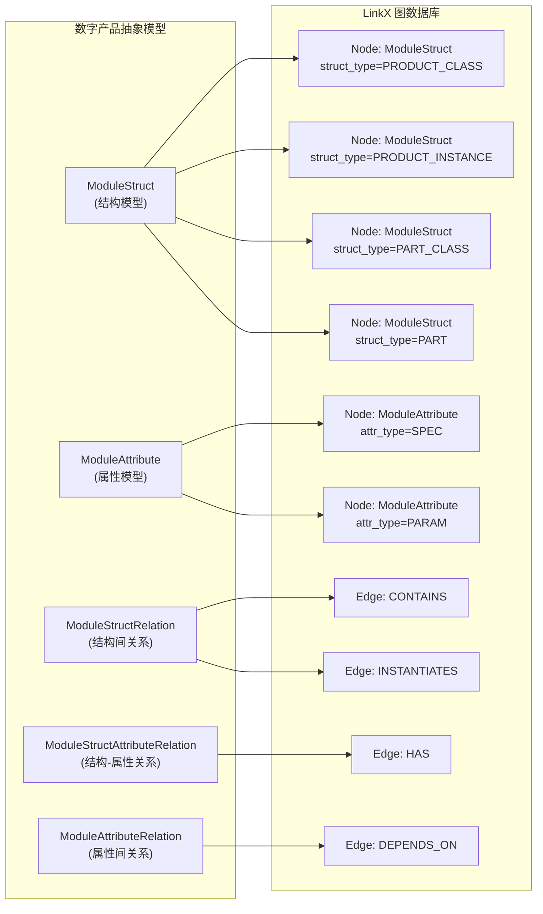

**映射规则**：

| 抽象概念 | LinkX 存储 | 说明 |
| --- | --- | --- |
| **ModuleStruct** | `Node`（节点） | 所有结构对象在 LinkX 中都是节点 |
| **ModuleAttribute** | `Node`（节点） | 所有特性对象在 LinkX 中也是节点 |
| **ModuleStructRelation** | `Edge`（边） | 结构间关系用边表示（如 CONTAINS） |
| **ModuleStructAttributeRelation** | `Edge`（边） | 结构与特性关联用边表示（如 HAS） |
| **ModuleAttributeRelation** | `Edge`（边） | 特性间关系用边表示（如 DEPENDS_ON） |

**LinkX 节点示例**：

```json
// ModuleStruct 节点示例（NetworkProduct，ProductClass）
{
  "node_type": "ModuleStruct",
  "struct_type": "PRODUCT_CLASS",
  "id": "network-product-001",
  "code": "NetworkProduct",
  "name": "网络产品类",
  "parent_id": null,
  "depth": 0,
  "version": "v1.0.0",
  "_maintenance_state": "PUBLISH"
}

// ModuleStruct 节点示例（NetworkPro-2000，ProductInstance）
{
  "node_type": "ModuleStruct",
  "struct_type": "PRODUCT_INSTANCE",
  "id": "network-pro-2000-001",
  "code": "NetworkPro-2000",
  "name": "NetPro 2000 销售产品实例",
  "parent_id": null,
  "depth": 0,
  "version": "v1.0.0",
  "_maintenance_state": "PUBLISH"
}

// ModuleStruct 节点示例（RouterBoard-V1）
{
  "node_type": "ModuleStruct",
  "struct_type": "PART",
  "id": "router-board-v1-001",
  "code": "RouterBoard-V1",
  "name": "路由器主板V1",
  "parent_id": "router-part-class-001",
  "depth": 2,
  "version": "v1.0.0",
  "_maintenance_state": "PUBLISH"
}

```json
// ModuleAttribute 节点示例
{
  "node_type": "ModuleAttribute",
  "attr_type": "SPEC",
  "id": "spec-max-bandwidth-001",
  "code": "SPEC_MAX_BANDWIDTH",
  "name": "最大带宽",
  "schema": {
    "type": "string",
    "unit": "Gbps",
    "values": ["10", "40", "100", "400"]
  },
  "version": "v1.0.0"
}
```

**LinkX 边示例**：

```json
// ModuleStructRelation 边示例（ProductClass → PartClass CONTAINS）
{
  "edge_type": "ModuleStructRelation",
  "relation_type": "CONTAINS",
  "source_id": "network-product-001",
  "target_id": "router-part-class-001",
  "min_cardinality": 1,
  "max_cardinality": 10,
  "default_selected": true,
  "selection_policy": "OPTIONAL",
  "version": "v1.0.0"
}

// ModuleStructRelation 边示例（ProductClass → ProductInstance INSTANTIATES，含边属性）
{
  "edge_type": "ModuleStructRelation",
  "relation_type": "INSTANTIATES",
  "source_id": "network-product-001",
  "target_id": "network-pro-2000-001",
  "min_cardinality": 0,
  "max_cardinality": 1,
  "default_selected": true,
  "selection_policy": "OPTIONAL",
  "version": "v1.0.0",
  "edge_attributes": {
    "spec_overrides": {
      "SPEC_MAX_BANDWIDTH": "100"
    },
    "part_constraints": {}
  }
}

```json
// ModuleStructAttributeRelation 边示例（HAS）
{
  "edge_type": "ModuleStructAttributeRelation",
  "relation_type": "HAS",
  "source_id": "router-board-v1-001",
  "target_id": "spec-max-bandwidth-001",
  "dimension": "SPEC",
  "inheritance_policy": "OWN",
  "version": "v1.0.0"
}
```

#### 4.2.4 第四张图：元数据模型（MetaModule / MetaProperty / MetaRelation / MetaCatalogNode）

> 本图展示数字产品系统的元数据层，用于描述类/实体的元数据、属性的元数据、关系的元数据，以及扩展语义和维护/集成方式。
>
> **RFC-003 v0.3 变更**：`MetaModule` 新增 `target_table` / `target_table_key_column` / `biz_key_strategy` 字段；`MetaProperty` 新增 `attr_column` / `attr_required` / `attr_indexed` 字段。详见 3.2.3 模板元数据管理。

**概念模型**：

```mermaid
erDiagram
    META_CATALOG_NODE {
        string id PK "目录节点 ID"
        string code "目录编码"
        string name "目录名称"
        string description "描述"
        string parent_id FK "父目录（用于层级组织）"
        string owner_role "所属角色（数据权限控制）"
        string version "版本"
        string status "ACTIVE / DEPRECATED"
    }

    META_MODULE {
        string id PK "元数据模块 ID"
        string catalog_node_id FK "所属目录节点 ID（用于权限管理）"
        string name "模块名称（如 ProductClass、ProductInstance、PartClass、Part）"
        string description "描述"
        string synonyms JSON "同义词列表（如 {""zh"": [""网络产品""], ""en"": [""Network Product""]}）"
        string maintenance_mode "维护方式（GENERAL / CB_NEW_COMPATIBLE）"
        string integration_mode "集成方式（MANUAL / UPSTREAM）"
        json integration_config "集成配置（上游系统、转换规则等）"
        string version "版本"
        string status "DRAFT / ACTIVE / DEPRECATED"
        -- ★ 以下为 RFC-003 v0.3 新增字段（通用对象表映射）
        string target_table "映射到的通用表名，如 obj_table_001"
        string target_table_key_column "通用表中业务标识字段名，默认 code"
        string biz_key_strategy "SINGLE / COMPOSITE"
    }

    META_PROPERTY {
        string id PK "元数据属性 ID"
        string module_id FK "所属模块 ID"
        string name "属性名称"
        string data_type "STRING / NUMBER / BOOLEAN / ENUM / JSON"
        string display_name "显示名称"
        string description "描述"
        string unit "单位（如 Gbps、W）"
        json default_value "默认值"
        json validation_rules "校验规则"
        string synonyms JSON "同义词列表"
        boolean required "是否必填"
        string maintenance_mode "属性级维护方式（GENERAL / CB_NEW_COMPATIBLE）"
        string integration_mode "属性级集成方式（MANUAL / UPSTREAM）"
        json integration_config "属性级集成配置（上游系统、转换规则等）"
        string version
        string status
        -- ★ 以下为 RFC-003 v0.3 新增字段（通用对象表映射）
        string attr_column "映射到的通用表列名，如 attr_01。为空时按属性名字典序自动推导"
        boolean attr_required "是否必填"
        boolean attr_indexed "是否建索引"
    }

    META_RELATION {
        string id PK "元数据关系 ID"
        string source_module_id FK "源模块 ID"
        string target_module_id FK "目标模块 ID"
        string relation_type "CONTAINS / EXTENDS / REFERENCES / INSTANTIATES / HAS / DEPENDS_ON"
        string display_name "显示名称"
        string description "描述"
        json cardinality "基数约束 {min: 0, max: 10}"
        json semantics "语义定义（同义词、约束描述）"
        string version
        string status
    }

    META_CATALOG_NODE ||--o{ META_MODULE : "contains"
    META_MODULE ||--o{ META_PROPERTY : "has"
    META_MODULE ||--o{ META_RELATION : "as_source"
    META_MODULE ||--o{ META_RELATION : "as_target"
```

**元数据模型与权限管理**：

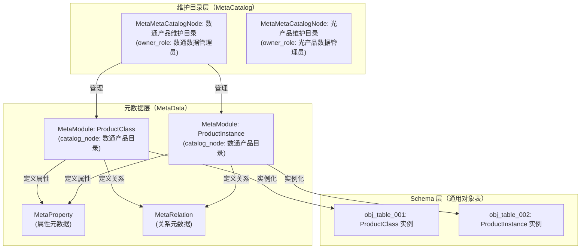

**元数据模型说明**：

| 类名 | 含义 | 作用 |
| --- | --- | --- |
| **MetaCatalogNode** | 目录节点 | 按目录对元数据进行分类组织，是权限管理的基本单元 |
| **MetaModule** | 模块元数据 | 定义类/实体的元信息，包括名称、描述、同义词、所属目录、维护/集成方式；★含 `target_table` / `biz_key_strategy` 字段，定义到通用表的映射 |
| **MetaProperty** | 属性元数据 | 定义属性的元信息，包括数据类型、校验规则、同义词、显示名称、单位等；★含 `attr_column` 字段，定义到通用表列的映射 |
| **MetaRelation** | 关系元数据 | 定义关系的元信息，包括基数约束、语义描述、同义词 |

**维护方式与集成方式说明**：

| 维度 | 方式 | 说明 |
| --- | --- | --- |
| **维护方式**（maintenance_mode） | **GENERAL** | 通用维护管理方式，通过维护界面手动维护 |
| **维护方式** | **CB_NEW_COMPATIBLE** | 兼容老系统（CB+9）的自定义维护方式 |
| **集成方式**（integration_mode） | **MANUAL** | 手动维护，不从上游系统集成 |
| **集成方式** | **UPSTREAM** | 从上游系统自动汇聚（通过 LinkX 集成规则配置） |

**通用对象表映射说明（RFC-003 v0.3 新增）**：

| 字段 | 所属表 | 说明 |
| --- | --- | --- |
| `target_table` | MetaModule | 映射到的通用表名，如 `obj_table_001` |
| `target_table_key_column` | MetaModule | 通用表中业务标识字段名，默认 `code` |
| `biz_key_strategy` | MetaModule | `SINGLE`（单 Key）或 `COMPOSITE`（复合 Key） |
| `attr_column` | MetaProperty | 映射到的通用表列名，如 `attr_01`。为空时按属性名字典序自动推导 |
| `attr_required` | MetaProperty | 该属性写入通用表时是否必填 |
| `attr_indexed` | MetaProperty | 该属性是否需要建索引 |

**核心元数据示例**：

1. **目录节点示例**：

```json
{
  "id": "catalog-network",
  "code": "NETWORK",
  "name": "数通产品目录",
  "description": "数通产业相关产品的数据目录",
  "parent_id": null,
  "owner_role": "数通数据管理员",
  "version": "v1.0.0",
  "status": "ACTIVE"
}
```

2. **ProductClass 元数据定义**：

```json
{
  "id": "meta-product-class",
  "catalog_node_id": "catalog-network",
  "name": "ProductClass",
  "description": "产品类，代表一类可配置产品的抽象定义",
  "synonyms": {
    "zh": ["产品类", "产品定义", "产品模板"],
    "en": ["Product Class", "Product Definition"]
  },
  "maintenance_mode": "GENERAL",
  "integration_mode": "UPSTREAM",
  "integration_config": {
    "upstream_systems": ["PLM", "ERP"],
    "sync_frequency": "realtime"
  },
  "version": "v1.0.0",
  "status": "ACTIVE",
  "target_table": "obj_table_001",
  "target_table_key_column": "code",
  "biz_key_strategy": "SINGLE"
}
```

3. **ProductInstance 元数据定义**：

```json
{
  "id": "meta-product-instance",
  "catalog_node_id": "catalog-network",
  "name": "ProductInstance",
  "description": "产品实例，基于 ProductClass 实例化得到的可售 / 可配置产品对象（含继承边属性覆盖）",
  "synonyms": {
    "zh": ["产品实例", "销售产品", "实例产品"],
    "en": ["Product Instance", "Sales Product", "Instance Product"]
  },
  "maintenance_mode": "GENERAL",
  "integration_mode": "UPSTREAM",
  "integration_config": {
    "upstream_systems": ["ERP"],
    "sync_frequency": "realtime"
  },
  "version": "v1.0.0",
  "status": "ACTIVE",
  "target_table": "obj_table_002",
  "target_table_key_column": "code",
  "biz_key_strategy": "SINGLE"
}
```

4. **属性元数据示例（规格属性，归属 ProductClass）**：

> 该条 MetaProperty **实例**按 UC-A7 中 Module Attribute 模板（属性元数据形式）由产品数据架构师录入。模板定义"属性长什么样（字段结构）"，实例定义"具体是什么属性（如最大带宽）"。

```json
{
  "id": "meta-spec-max-bandwidth",
  "module_id": "meta-product-class",
  "name": "SPEC_MAX_BANDWIDTH",
  "display_name": "最大带宽",
  "data_type": "ENUM",
  "unit": "Gbps",
  "description": "设备支持的最大网络带宽",
  "default_value": "10",
  "synonyms": {
    "zh": ["带宽", "网络带宽", "最大吞吐量"],
    "en": ["Bandwidth", "Max Bandwidth", "Throughput"]
  },
  "validation_rules": {
    "type": "enum",
    "values": ["10", "40", "100", "400"]
  },
  "required": true,
  "maintenance_mode": "GENERAL",
  "integration_mode": "UPSTREAM",
  "integration_config": {
    "upstream_system": "PLM",
    "upstream_field": "MAX_BW",
    "transform_rule": "string_to_enum",
    "mapping": {
      "10G": "10",
      "40G": "40",
      "100G": "100",
      "400G": "400"
    }
  },
  "version": "v1.0.0",
  "attr_column": "attr_01",
  "attr_required": true,
  "attr_indexed": false
}
```

5. **属性元数据示例（营销属性，CB+New 兼容方式，归属 ProductInstance）**：

> 同样作为 MetaProperty **实例**录入。模板在 UC-A7 一次性定义；具体每条属性（无论是 spec / param / marketing / delivery / finance / operation 维度）都是模板的一次实例化。

```json
{
  "id": "meta-marketing-desc",
  "module_id": "meta-product-instance",
  "name": "MARKETING_DESC",
  "display_name": "产品描述",
  "data_type": "STRING",
  "description": "产品营销描述文本",
  "required": false,
  "maintenance_mode": "CB_NEW_COMPATIBLE",
  "integration_mode": "MANUAL",
  "version": "v1.0.0",
  "attr_column": "attr_02",
  "attr_required": false,
  "attr_indexed": false
}
```

6. **关系元数据示例（ProductClass → PartClass CONTAINS）**：

```json
{
  "id": "meta-relation-productclass-contains-partclass",
  "source_module_id": "meta-product-class",
  "target_module_id": "meta-part-class",
  "relation_type": "CONTAINS",
  "display_name": "包含",
  "description": "产品类（ProductClass）包含部件分类（PartClass），表示该产品类由这些部件分类组装而成",
  "cardinality": {
    "min": 1,
    "max": 100
  },
  "semantics": {
    "zh": "表示产品类与其组成的部件分类之间的归属关系",
    "en": "Represents the containment relationship between a product class and its part classes"
  },
  "version": "v1.0.0"
}
```

---

### 4.3 维护态 vs 发布态隔离方案

> **本章已抽离为独立 ADR，详见 [ADR-003](./adr/ADR-003-维护态与发布态数据隔离方案.md)。**
>
> 隔离方案决策：
> - 维护态和发布态使用**不同 Graph**（`maintain_graph_upstream` / `publish_graph`）
> - 跨态数据写入由数据发布服务（PS）作为唯一通道
> - 详细边界规则、隔离架构图和 PS-PublishOrchestrator 子模块职责见 ADR-003

**核心要点摘要**：

| 维度 | 决策 |
| --- | --- |
| **存储隔离** | 维护态 PG + LinkX 混合；发布态 LinkX（PS 聚合构造） |
| **跨图写入** | 仅 PS 跨图写入，其他模块禁止跨态访问 |
| **可视化聚合** | 后台同时查询 PG + LinkX，内存合并（OPEN-Q7） |

---

> **4.4 版本管理存储方案 — 整章已删除（依据 RFC-003 v0.2）**
>
> 原 4.4 章节（4.4.1 方案设计 + 4.4.2 版本管理表设计 + 4.4.3 版本标签过滤策略）已删除。版本管理完全融入通用对象表的 `id`（UUID）+ `code`（业务标识）双键设计，详见 3.3.2 通用对象表设计与 [RFC-003](./adr/RFC-003-数据通用维护服务-通用对象表映射机制.md)。

### 4.5 本章结论与未决问题

#### 4.5.1 已确定事项

- ✅ **四张核心建模图**：
  - **第一张图**：数据模型扩展维度（Module Structure 层级扩展、Module Attribute 多维扩展、关系扩展）
  - **第二张图**：数字产品抽象模型（ModuleStruct / ModuleAttribute / 三类 Relation）
  - **第三张图**：抽象模型与 PG 通用对象表存储映射（详细设计见 3.3.2）
  - **第四张图**：元数据模型（MetaModule / MetaProperty / MetaRelation / MetaCatalogNode）
- ✅ **两大模型分类**：
  - **Module Structure（结构模型）**：描述产品本体结构，支持层级嵌套（L1→L1.x→L2→L3）
  - **Module Attribute（属性模型）**：描述产品业务特征，支持多维度（SPEC/PARAM/MARKETING等）
  - L1: ProductClass（产品类）
  - L1.x: ProductInstance（产品实例，由 ProductClass 经 INSTANTIATES 关系实例化）
  - L2: PartClass（部件分类）
  - L3: Part（部件）
- ✅ **PG 通用对象表映射规则**：ModuleStruct / ModuleAttribute / 三类 Relation 全部以 row-level 形式存 PG 通用表（id=UUID、code=业务标识）
- ✅ **元数据层**：支持同义词、校验规则、维护/集成方式（属性级）
- ✅ **目录节点**：基于 MetaCatalogNode 的权限管理机制
- ✅ **版本管理**：通过通用对象表 `id`+`code` 双键实现，依据 RFC-003 v0.2 简化（原 4.4 章节已删除）
- ✅ **隔离方案**：维护态落 PG 通用对象表；发布态由 ADR-001 后续修订决定（OPEN-Q6）

#### 4.5.2 未决问题（OPEN）

| ID | 问题 | 状态 | 优先级 |
| --- | --- | --- | --- |
| **OPEN-04** | 维护态混合存储的 LinkX 验证（POC） | **OPEN** | P0 |
| OPEN-17 | 发布态图查询性能基线（发布态 LinkX P99 ≤ 200ms） | OPEN | P1 |
| OPEN-18 | ModuleAttribute.schema 的 PG 存储格式（JSON vs 展开） | OPEN | P1 |
| OPEN-19 | 维护态可视化聚合查询性能基线（PG+LinkX 并行查询） | OPEN | P1 |
| OPEN-20 | ModuleStruct 的层级深度限制（N 层） | OPEN | P2 |
| OPEN-21 | ModuleAttributeRelation 的语义定义（DEPENDS_ON / MUTUALLY_EXCLUSIVE / REQUIRES） | OPEN | P2 |
| OPEN-22 | 目录节点（MetaCatalogNode）与 RBAC 权限模型的集成方案 | OPEN | P1 |
| **OPEN-Q1（用户决策）** | 维护态存储介质 | **混合存储（PG+LinkX）** | RFC-003 v0.4 |
| **OPEN-Q2（用户决策）** | 通用表数量 N | **N = 10** | RFC-003 v0.4 |
| **OPEN-Q3（用户决策）** | 扩展属性列数 | **20+JSONB** | RFC-003 v0.4 |
| **OPEN-Q4（用户决策）** | 发布态数据 | **走 LinkX** | RFC-003 v0.4 |
| **OPEN-Q5（用户决策）** | 维护态图查询 | **不支持（仅可视化聚合）** | RFC-003 v0.4 |

---

## 第五章：技术模型

> 本章定义了关键技术选型和公共机制。

### 5.1 关键技术选型

#### 5.1.1 核心技术栈

| 层次 | 技术选型 | 说明 |
| --- | --- | --- |
| **应用框架** | Spring Boot 3.x | 主流 Java 框架，支持微服务 |
| **服务治理** | Spring Cloud / Kubernetes | 服务注册、熔断、限流 |
| **数据存储** | PostgreSQL（模板元数据 + 通用对象表） | 维护态 MANUAL 属性落 PG 通用表（依据 RFC-003 v0.4） |
| **图存储** | LinkX（GES） | 维护态 UPSTREAM 属性 + 发布态完整图（由 PS 按元数据构造） |
| **消息队列** | Kafka / RocketMQ | 异步事件、跨服务通信 |
| **缓存层** | Redis | 会话缓存、热点数据缓存 |
| **链路追踪** | SkyWalking / Jaeger | 分布式追踪 |

#### 5.1.2 接口隔离与可测试性

**LinkX Client 技术方案**：

| 方案 | 优点 | 缺点 | 推荐度 |
| --- | --- | --- | --- |
| **HTTP Client 封装** | 简单、与 LinkX 解耦 | 性能稍差 | ⭐⭐⭐⭐ |
| **SDK 集成** | 性能好、类型安全 | 与 LinkX 强耦合 | ⭐⭐⭐ |
| **GraphQL 适配** | 统一接口、灵活查询 | 学习成本 | ⭐⭐ |

**推荐方案**：HTTP Client 封装 + 接口定义（Interface），通过依赖注入实现 Mock。

---

> LinkX Client 接口与实现见 [3.3.1 LinkX Client 详细设计](#333-linkx-clientlinkx-客户端封装)；通用对象表 SDK（ObjTableSdk）见 [RFC-003 §5](./adr/RFC-003-数据通用维护服务-通用对象表映射机制.md)。

### 5.2 公共 SDK 引用清单

| SDK | 内容 | 详见 |
| --- | --- | --- |
| **digitalproduct-client-linkx** | LinkX 客户端（HTTP/SDK 封装，对接 GES 持久化版 API） | 3.3.1 |
| **digitalproduct-client-pg** | PostgreSQL 通用对象表 SDK（ObjTableSdk，upsertEntity / getByCode / listVersions） | RFC-003 §5 |

---

---

---
### 5.3 公共机制

#### 5.3.1 统一异常处理

```java
@RestControllerAdvice
public class GlobalExceptionHandler {

    @ExceptionHandler(LinkXException.class)
    public Result<?> handleLinkXException(LinkXException e) {
        log.error("LinkX error: {}", e.getMessage(), e);
        return Result.error(ResultCode.LINKX_ERROR, e.getMessage());
    }

    @ExceptionHandler(BusinessException.class)
    public Result<?> handleBusinessException(BusinessException e) {
        log.warn("Business error: {}", e.getMessage());
        return Result.error(e.getCode(), e.getMessage());
    }
}
```

> **注**：原 `VersionException` 处理已删除（依据 RFC-003 v0.2）。版本管理完全融入通用对象表，异常路径由 `BusinessException` 统一处理。

#### 5.3.2 链路追踪

```java
// 使用 OpenTelemetry / SkyWalking 追踪
// 所有 LinkX 调用自动带上 traceId

@Service
public class LinkXTracingInterceptor implements HandlerInterceptor {

    @Override
    public void preHandle(HttpServletRequest request, HttpServletResponse response, Object handler) {
        String traceId = request.getHeader("X-Trace-Id");
        MDC.put("traceId", traceId);
    }

    @Override
    public void afterCompletion(HttpServletRequest request, HttpServletResponse response,
                                Object handler, Exception ex) {
        MDC.remove("traceId");
    }
}
```

---

### 5.4 CB+N6 暂缓说明

> **本章暂不设计 CB+N6 自定义维护方式，相关设计后续单独处理。**

| 项目 | 当前设计 | CB+N6 设计 |
| --- | --- | --- |
| **维护方式** | 通用维护（Web/API） | 自定义维护（CB+N6） |
| **设计状态** | ✅ 本章已完成 | ⏳ 后续单独 ADR |
| **核心差异** | 通用对象表 CRUD（含版本追踪） | 老系统兼容、数据同步 |

---

### 5.5 本章结论

#### 5.5.1 已确定事项

- ✅ **LinkX 双重角色**：维护态 UPSTREAM 属性存 LinkX 维护态图；发布态完整图由 PS 按元数据聚合构造后写入 LinkX 发布态图
- ✅ **LinkX Client 封装**：HTTP Client 封装 + 接口隔离，按维护态/发布态区分调用不同的图
- ✅ **Mock 支持**：通过 `@Profile("test")` 切换 Mock 实现
- ✅ **版本管理**：完全融入通用对象表（依据 RFC-003 v0.4），原 5.3 章节已删除
- ✅ **维护态不支持图查询**：因混合存储，维护态不需要 Cypher 查询接口；可视化通过后台聚合层实现
- ✅ **CB+N6 暂缓**：自定义维护方式不在本章设计范围内

#### 5.5.2 待决策事项（OPEN）

| ID | 问题 | 状态 | 说明 |
| --- | --- | --- | --- |
| **OPEN-26** | LinkX Client 是否需要支持连接池？ | 待决策 | 影响高并发性能 |
| **OPEN-27** | 版本快照是存 LinkX 还是 RDBMS？ | **CLOSED → 融入通用对象表** | RFC-003 v0.4 已决策 |
| **OPEN-28** | 是否需要支持分布式事务？ | 待决策 | 影响跨服务操作一致性 |
| **OPEN-Q7（用户决策）** | 维护态是否保留 LinkX 只读 Cypher | **不需要** | 维护态不支持图查询，仅可视化聚合；发布态支持图查询 |

---
## 第六章：运行视图

> 本章定义系统运行期的核心时序流程，基于 L1 逻辑视图描述组件间交互，不展开内部实现。
>
> **主线样例**：所有时序图以"路由器产品（ROUTER_PLATFORM）"为例，完整展示从模板建模到销售产品实例发布的全生命周期。

### 6.1 样例数据说明

> 本节定义第六章所有时序图使用的样例数据，基于参考文档《数字产品数据模型》的完整案例。

#### 路由器产品完整层级

```
ROUTER_PLATFORM（ProductClass，PRODUCT_CLASS）
├── CONTAINS → router_cpu（PartClass，PART_CLASS）
│   ├── CONTAINS → RTR_CPU_01（Part，核心数=2）
│   ├── CONTAINS → RTR_CPU_02（Part，核心数=4）
│   ├── CONTAINS → RTR_CPU_03（Part，核心数=8）
│   └── CONTAINS → RTR_CPU_04（Part，核心数=16）
├── CONTAINS → router_port（PartClass，PART_CLASS）
│   ├── CONTAINS → RTR_PORT_GE_24（Part，端口类型=GE，数量=24）
│   ├── CONTAINS → RTR_PORT_GE_48（Part，端口类型=GE，数量=48）
│   ├── CONTAINS → RTR_PORT_10GE_4（Part，端口类型=10GE，数量=4）
│   └── CONTAINS → RTR_PORT_40GE_2（Part，端口类型=40GE，数量=2）
├── CONTAINS → router_memory（PartClass，PART_CLASS）
│   └── ...
└── INSTANTIATES → ROUTER_01（ProductInstance，PRODUCT_INSTANCE，低端）
    ├── enabled_parts: [RTR_CPU_01, RTR_PORT_GE_24, RTR_MEM_2G, RTR_LIC_STD_BASE]
    ├── disabled_parts: [RTR_CPU_02/03/04, RTR_PORT_GE_48/10GE_4/40GE_2, RTR_MEM_4G/8G/16G, ...]
    └── spec_overrides: {}   ← 无规格覆盖（低端型号使用基线规格）
```

#### 核心实体数据

**ModuleStructure（结构模型）**

| id | code | struct_type | parent_id | depth | status |
| --- | --- | --- | --- | --- | --- |
| router-platform-001 | ROUTER_PLATFORM | PRODUCT_CLASS | null | 0 | DRAFT |
| router-cpu-001 | router_cpu | PART_CLASS | router-platform-001 | 1 | DRAFT |
| rtr-cpu-01-001 | RTR_CPU_01 | PART | router-cpu-001 | 2 | ACTIVE |
| router-01-001 | ROUTER_01 | PRODUCT_INSTANCE | null | 0 | DRAFT |

**ModuleAttribute（属性模型）**

| id | code | attr_type | schema |
| --- | --- | --- | --- |
| spec-core-num-001 | SPEC_CORE_NUM | SPEC | {type: INTEGER, unit: core} |
| spec-max-bandwidth-001 | SPEC_MAX_BANDWIDTH | SPEC | {type: ENUM, unit: Gbps, values: [10,40,100,400]} |

**ModuleStructRelation（结构间关系）**

| id | code | relation_type | source_id | target_id | selection_policy |
| --- | --- | --- | --- | --- | --- |
| rel-platform-cpu-001 | PC_Contains_PC | CONTAINS | router-platform-001 | router-cpu-001 | REQUIRED |
| rel-platform-instantiates-01 | PC_Instantiates_PI | INSTANTIATES | router-platform-001 | router-01-001 | OPTIONAL |

---

### 6.2 核心时序图

#### 6.2.1 UC-A7：创建模型模板（IT 数据架构师）

> ACT-03（IT 数据架构师）通过 DP Website 创建 ProductClass 模板（ROUTER_PLATFORM 模板），定义 struct_type、parent_struct_type、maintenance_mode、integration_mode 等元数据。

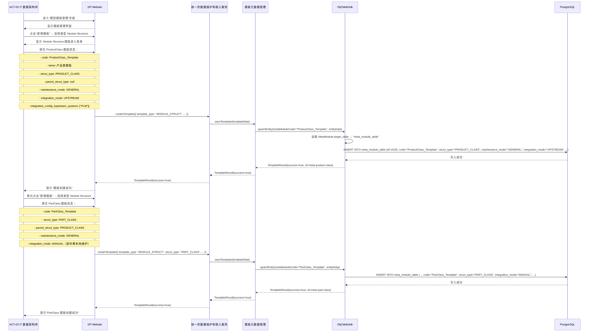

**说明**：IT 数据架构师在模板建模阶段只定义模板本身（元数据），不录入任何具体实例数据（如 ROUTER_PLATFORM、router_cpu）。具体实例数据由产品数据架构师/产品数据工程师在后续用例中录入。

---

#### 6.2.2 UC-A8：创建关系模板（IT 数据架构师）

> ACT-03（IT 数据架构师）创建 ProductClass → PartClass 的 CONTAINS 关系模板，定义源/目标 Module Structure 模板、基数约束（min/max cardinality）、选择策略（selection_policy）等。

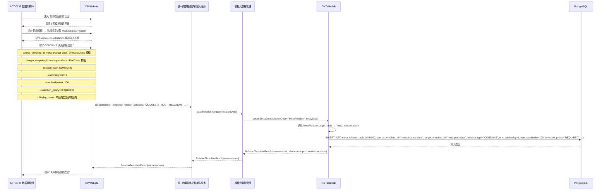

**说明**：关系模板定义后，在 UC-A1/UC-A2 中填充具体实例时可直接引用此模板，系统自动注入基数约束和选择策略。

---

#### 6.2.3 UC-A1：创建产品类（产品数据架构师）

> ACT-01（产品数据架构师）基于 ProductClass 模板，创建路由器产品类实例 `ROUTER_PLATFORM`。**关注点：数据来自上游系统 PLM/ERP，不需要本地维护（integration_mode=UPSTREAM）。**

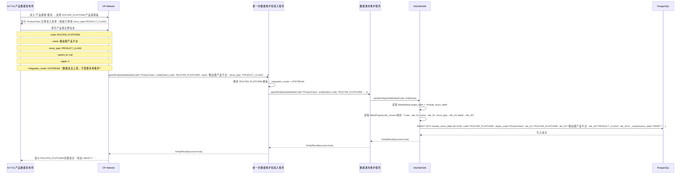

**说明**：产品类数据（ROUTER_PLATFORM）的字段由上游 PLM/ERP 系统同步写入（integration_mode=UPSTREAM），产品数据架构师在此步骤中确认数据并发布到维护态，不需要手动维护具体字段值。

---

#### 6.2.4 UC-A2：创建部件分类及规格（产品数据工程师）

> ACT-02（产品数据工程师）为 ROUTER_PLATFORM 创建部件分类 `router_cpu` 及规格属性 `SPEC_CORE_NUM`、`SPEC_MAX_BANDWIDTH`。**关注点：规格通过 CB+New 自定义维护方式录入（maintenance_mode=CB_NEW_COMPATIBLE，integration_mode=MANUAL）。**

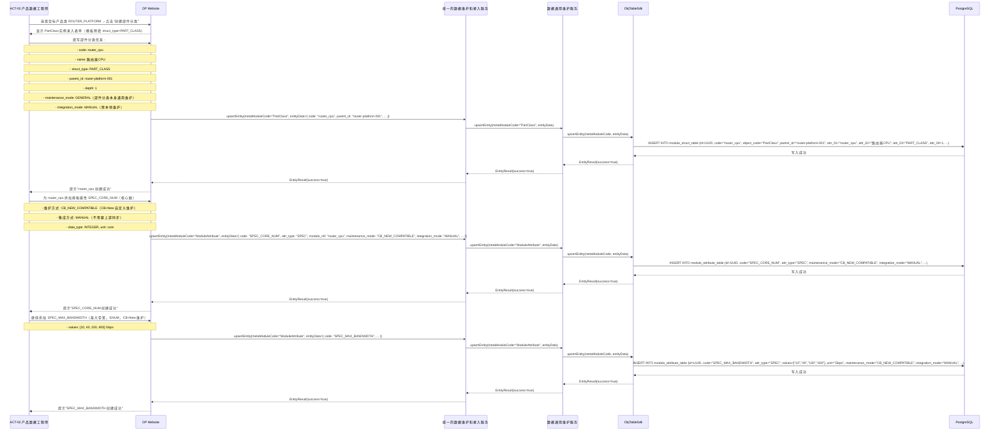

**说明**：规格维度（SPEC_CORE_NUM、SPEC_MAX_BANDWIDTH）通过 CB+New 自定义维护方式录入，数据不依赖上游系统，integration_mode=MANUAL。这是系统"业务规则补齐"能力的体现（GOAL-07）。

---

#### 6.2.5 UC-B1c：建立部件分类与产品的关系（产品数据工程师）

> ACT-02（产品数据工程师）建立 ROUTER_PLATFORM（ProductClass）与 router_cpu（PartClass）的 CONTAINS 关系，设置基数约束（min=1, max=2）和选择策略（REQUIRED）。

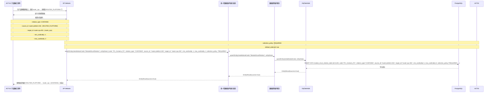

**说明**：此关系定义后，ROUTER_PLATFORM 的所有产品实例（ROUTER_01/02/03）将自动继承 router_cpu 作为 Part 候选集，并通过 enabled_parts/disabled_parts 在实例层级做裁剪。

---

#### 6.2.6 UC-A3：创建 Part 对象（产品数据工程师）

> ACT-02（产品数据工程师）基于 router_cpu（PartClass）创建 Part 实例 `RTR_CPU_01`。**关注点：部分属性来自上游系统 PLM（integration_mode=UPSTREAM，如核心数 CoreNum=2），部分属性需要本地维护（integration_mode=MANUAL，如采购批次）。**

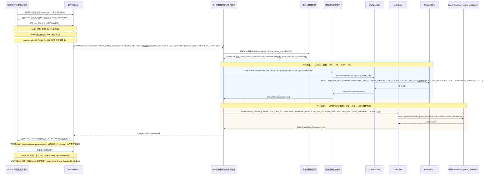

**说明**：Part 对象是混合存储的典型场景——UAS 是服务层唯一入口，按 `MetaProperty.integration_mode` 把同一对象的属性拆成两条独立通道：**MANUAL 属性**走 UAS → MS → SDK → PG（强事务），**UPSTREAM 属性**走 UAS → LinkClient → LinkX 维护态图（弱事务）。两条通道由 UAS 并行派发而非 MS 双写，MS 不知道 LinkX 的存在，LinkClient 不感知 PG，符合 3.1.1"接口隔离"原则。可视化展示由 QS 聚合层完成，DP Website 对混合存储无感知。

---

#### 6.2.7 UC-A4：销售产品实例化与继承修改（产品数据工程师）

> ACT-02（产品数据工程师）基于 ROUTER_PLATFORM（ProductClass）创建销售产品实例 `ROUTER_01`（低端型号）。**关注点：① 体现基础继承（INSTANTIATES 关系）；② 关系的裁剪（enabled_parts/disabled_parts 边属性，禁用 RTR_CPU_02/03/04 等高端 CPU）；③ 不做规格覆盖（低端型号使用基线规格）。**

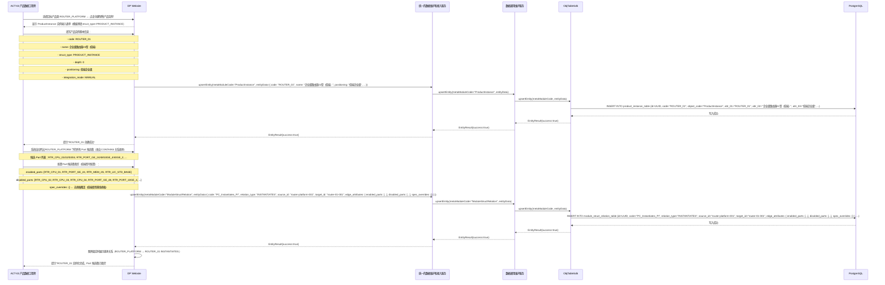

**说明**：销售产品实例（ROUTER_01）是完整的"产品"，代表了可交付给客户的具体 SKU。通过 enabled_parts/disabled_parts 边属性，ROUTER_01 继承了 ROUTER_PLATFORM 的所有 Part 候选，但在实例层级做了裁剪（禁用高端 CPU/端口/内存/许可）。这是产品配置层级与销售层级的关键差异——ProductClass 定义候选范围，ProductInstance 定义具体配置。

---

#### 6.2.8 UC-B1b：发布销售产品实例（产品数据工程师）

> ACT-02（产品数据工程师）触发发布，PS 将 ROUTER_01 的完整数据（ProductInstance + Part 候选集裁剪 + 继承边属性）从维护态 PG 聚合后，构造完整图写入发布态 LinkX。

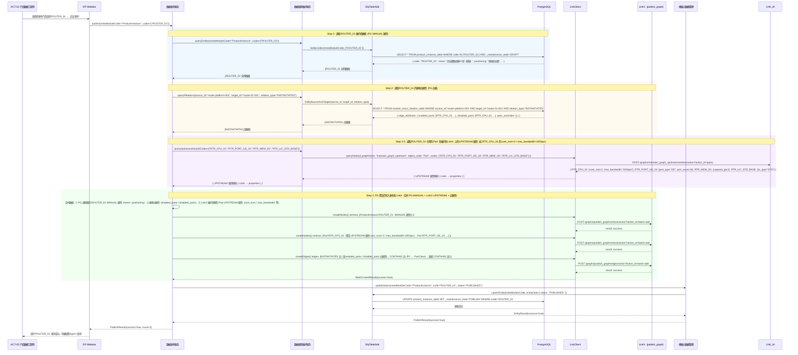

**说明**：发布是维护态→发布态的唯一通道（PS 独家写入 publish_graph）。PS 必须从三个数据源聚合：① **PG 通用表**（ROUTER_01 的 MANUAL 属性：name、positioning、继承边属性）；② **LinkX 维护态图**（RTR_CPU_01 等 Part 对象的 UPSTREAM 属性：core_num=2、max_bandwidth=10Gbps 等规格值）—— 缺失 Step 2.5 会导致 Part 节点在发布态中变成空壳，配置 Agent 拿不到规格数据；③ **继承边属性**（enabled_parts / disabled_parts）。三源数据由 PS.ReadAggregator 合并后，由 PS.PublishWriter 原子化写入 `publish_graph`（失败回滚机制详见 6.3）。

---

#### 6.2.9 UC-B2：发布态数据查询（下游消费）

> ACT-05（配置 Agent）通过数据查询服务查询发布态 LinkX，获取 ROUTER_01 销售产品实例下所有启用的 Part 及其规格数据，验证配置方案。

```mermaid
sequenceDiagram
    participant AGENT as ACT-05 配置 Agent
    participant WEB as DP Website
    participant QS as 数据查询服务
    participant LC as LinkClient
    participant LNK_PUB as LinkX（publish_graph）

    AGENT->>WEB: 查询 ROUTER_01 销售产品实例的完整配置（已启用的 Part 列表及规格）
    WEB->>QS: queryGraph({ entity_type: "ProductInstance", code: "ROUTER_01", depth: 2 })

    QS->>LC: executeGql({ gql: "
        MATCH (pi:ProductInstance {code: 'ROUTER_01'})-[:INSTANTIATES {enabled_parts: [...]}]->(pc:ProductClass)
                 -[:CONTAINS]->(part:Part)
        RETURN pi, pc, part
    " })

    LC->>LNK_PUB: POST /graphs/publish_graph/gql
    LNK_PUB-->>LC: {
        nodes: [
            { code: "ROUTER_01", struct_type: "PRODUCT_INSTANCE", positioning: "低端企业级" },
            { code: "RTR_CPU_01", struct_type: "PART", name: "路由器双核CPU" },
            { code: "RTR_PORT_GE_24", struct_type: "PART", name: "24口千兆" }
        ],
        edges: [
            { type: "INSTANTIATES", source: "ROUTER_PLATFORM", target: "ROUTER_01", edge_attributes: { enabled_parts: ["RTR_CPU_01", ...], disabled_parts: [...] } },
            { type: "CONTAINS", source: "ROUTER_PLATFORM", target: "RTR_CPU_01" }
        ]
    }
    LC-->>QS: 图查询结果
    QS-->>WEB: { productInstance: ROUTER_01, enabledParts: [RTR_CPU_01, RTR_PORT_GE_24, ...], disabledParts: [RTR_CPU_02/03/04, ...] }
    WEB-->>AGENT: 返回 ROUTER_01 完整配置数据
```

**说明**：配置 Agent 可直接利用 enabled_parts/disabled_parts 边属性，在查询结果中直接过滤出当前产品实例已启用的 Part 列表，无需在应用层二次裁剪。这是"继承边属性"设计的核心价值——配置边界在图数据层直接表达，下游消费无感知。

---

### 6.3 异常与降级

|| 场景 | 降级策略 |
|| --- | --- |
| **LinkX 不可用（维护态 UPSTREAM 同步）** | UPSTREAM 属性同步失败 → 记录失败日志，触发重试（max_retry=3）；前端显示"部分规格数据同步中" |
| **LinkX 不可用（发布态查询）** | 发布态 LinkX 查询失败 → 返回错误，阻止配置 Agent 消费；运维告警 |
| **PG 不可用** | PG 写入/查询失败 → 返回 503，前端提示"系统暂时不可用"；不影响 LinkX 维护态数据 |
| **Part 候选集为空** | enabled_parts 为空 → 阻止 ProductInstance 发布，提示"产品实例无有效 Part 候选" |
| **规则校验失败（UC-A6）** | 校验规则引擎返回 violation → 阻止保存/发布，列出具体违规项 |
| **发布失败** | 发布态 LinkX 写入失败 → 维护态不受影响；错误日志记录；运维告警；支持重试 |

---

### 6.4 本章结论

|| 结论 | 说明 |
|| --- | --- |
| **时序基于 L1 视图** | 所有流程均按 L1 逻辑视图的组件关系描述（接入层→UAS→MS/PS/QS→LinkClient→存储层），不展开内部实现 |
| **混合存储透明** | 可视化聚合层（VAS/QS）屏蔽 PG + LinkX 差异；Part 对象的部分字段落 PG（MANUAL），部分字段落 LinkX（UPSTREAM），用户无感知 |
| **发布态走 LinkX** | 发布服务（PS）聚合维护态数据（PG+LinkX）后，统一写入发布态 LinkX（publish_graph），作为下游唯一数据源 |
| **继承边属性下推** | enabled_parts/disabled_parts/spec_overrides 等边属性在 ProductClass→ProductInstance INSTANTIATES 边上表达，配置 Agent 可直接利用，无需应用层二次处理 |
| **路由器案例完整闭环** | 从 ProductClass 模板（UC-A7）→关系模板（UC-A8）→ROUTER_PLATFORM（UC-A1）→router_cpu+规格（UC-A2）→关系建立（UC-B1c）→RTR_CPU_01（UC-A3）→ROUTER_01 实例化（UC-A4）→发布（UC-B1b）→Agent 查询（UC-B2）全链路自洽 |


---

## 第七章：部署视图

> 本章定义交付物、部署拓扑、环境规划和容量估算。

### 7.1 交付物清单（v0.8 简化版）

> **v0.8 简化原则**：DPWebsite 前端 + DPService 后台服务**部署在同一服务单元**中（一体化交付），简化部署运维。

|| 交付物 | 类型 | 说明 |
| --- | --- | --- | 
| └─ DPService | Spring Boot 后台 | 服务层所有子模块（UAS / TM / MS / PS / QS / LinkClient） |
| └─ DPWebsite | React 前端（构建后） | 通过 Nginx / Spring Boot 静态资源托管 | 

### 7.2 部署拓扑

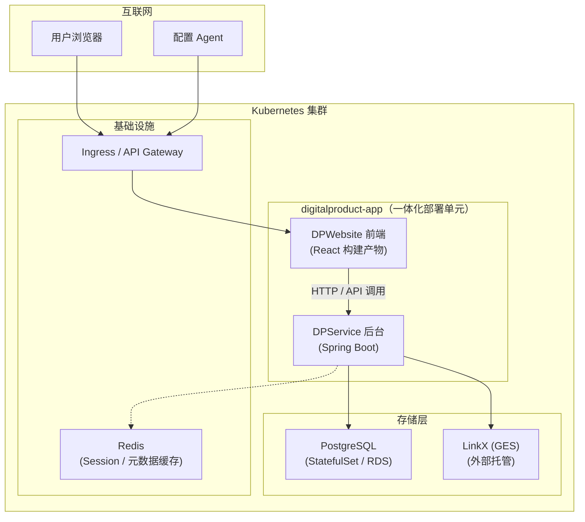

**部署要点**：  
- **运维简化**：只需运维一个镜像、一个 Deployment、一个 Service
- **水平扩展**：按 DPApp 整体水平扩缩容
- **存储独立**：PostgreSQL（RDS）和 LinkX（GES）保持独立部署

### 7.3 环境规划

|| 环境 | 用途 | 规模 |
| --- | --- | --- |
| **开发环境（dev）** | 本地开发、单元测试 | 单节点 K8s |
| **测试环境（test）** | 集成测试、回归测试 | 2 节点 K8s + 测试 DB |
| **预发布环境（staging）** | 生产前验证 | 2 节点 K8s + 模拟 LinkX |
| **生产环境（prod）** | 正式运行 | 3+ 节点 K8s + HA RDS + 托管 LinkX |

### 7.4 容量规划

|| 指标 | 估算 | 说明 |
| --- | --- | --- |
| **PostgreSQL 存储** | 500 GB | 模板元数据 + 通用对象表（按 100 万对象估算） |
| **LinkX 存储** | 2 TB | 维护态 UPSTREAM + 发布态完整图 |
| **Redis 缓存** | 8 GB | 会话 + 元数据缓存 |
| **Pod 副本数** | 2~3 副本 | DPApp 一体化扩展 |
| **JVM Heap** | 4 GB/Pod | Spring Boot 单 Pod 包含前后端 |

### 7.5 本章结论

|| 结论 | 说明 |
| --- | --- | --- | 
| **混合存储** | PostgreSQL（RDS）+ LinkX（GES 外部托管）独立部署 |
| **高可用** | DPApp 多副本（2~3）+ RDS 主备 + Redis 主备 |

---

## 第八章：开发视图

> 本章定义代码结构、构建流程和质量属性落地方案（简化版）。

### 8.1 代码结构（按 3.1.2 L1 逻辑视图组织）

> **设计原则**：DPService 内部严格按 L1 视图的 6 个组件（UAS / TM / MS / PS / QS / LinkClient）组织包结构和 Maven 模块，每个 L1 组件一个独立微模块。

```
digitalproduct/
├── digitalproduct-website/                  # DP Website 前端源码（独立开发）
│   ├── src/
│   │   ├── pages/
│   │   │   ├── TemplateMeta/                # 模板元数据管理页面（对应 UAS.TM）
│   │   │   ├── ProductModel/                # 产品模型维护页面（对应 UAS.MS）
│   │   │   ├── ProductInstance/             # 产品实例维护页面（对应 UAS.MS）
│   │   │   └── Visualization/               # 图可视化页面（对应 UAS.QS）
│   │   ├── components/
│   │   ├── api/                             # 后端 API 调用封装（→ UAS）
│   │   └── App.tsx
│   ├── public/
│   ├── webpack.config.js                    # 输出到 digitalproduct-uasservice/src/main/resources/static
│   └── package.json
│
└── digitalproduct-service/                  # 服务层代码根目录
    │
    ├── digitalproduct-uasservice/           # ★ L1: UAS - 统一的数据维护和接入服务（服务层门面）
    │   ├── src/main/java/com/digitalproduct/uasservice/
    │   │   ├── UASFacadeController.java     # 统一对外 REST 接口
    │   │   ├── IntegrationModeRouter.java   # integration_mode 路由分发
    │   │   ├── TemplateMetaResolver.java    # 模板元数据解析（读 TM）
    │   │   └── ...
    │   ├── src/main/resources/
    │   │   └── static/                      # DP Website 构建产物（一体化部署）
    │   ├── src/test/
    │   └── pom.xml                          # 依赖：digitalproduct-tmservice / msservice / digitalproduct-client-linkx
    │
    ├── digitalproduct-tmservice/            # ★ L1: TM - 模板元数据管理
    │   ├── src/main/java/com/digitalproduct/tmservice/
    │   │   ├── TemplateMetaController.java  # MetaModule/MetaProperty CRUD
    │   │   ├── TemplateDefinitionService.java
    │   │   ├── SchemaSyncService.java       # 模板元数据 → LinkX Schema 同步
    │   │   └── ...
    │   ├── src/test/
    │   └── pom.xml                          # 依赖：digitalproduct-client-linkx / spring-data-jpa
    │
    ├── digitalproduct-msservice/            # ★ L1: MS - 数据通用维护服务
    │   ├── src/main/java/com/digitalproduct/msservice/
    │   │   ├── CommonMaintenanceController.java
    │   │   ├── CommonMaintenanceService.java            # MANUAL 属性 → PG 通用表
    │   │   ├── VersionManagementService.java            # ★ 版本管理（融入通用表）
    │   │   ├── HybridStorageDispatcher.java             # MANUAL / UPSTREAM 分发
    │   │   └── ...
    │   ├── src/test/
    │   └── pom.xml                          # 依赖：digitalproduct-client-pg / digitalproduct-client-linkx
    │
    ├── digitalproduct-psservice/            # ★ L1: PS - 数据发布服务
    │   ├── src/main/java/com/digitalproduct/psservice/
    │   │   ├── PublishController.java
    │   │   ├── PublishOrchestrator.java     # 编排：读 PG + LinkX → 聚合 → 写发布态
    │   │   ├── ReadAggregator.java          # PG 通用表 + LinkX 维护态图数据聚合
    │   │   ├── PublishWriter.java           # 写入 LinkX 发布态图
    │   │   ├── PublishRules.java            # 发布过滤 / 转换 / 校验
    │   │   └── ...
    │   ├── src/test/
    │   └── pom.xml                          # 依赖：digitalproduct-msservice / digitalproduct-client-linkx
    │
    ├── digitalproduct-qsservice/            # ★ L1: QS - 数据查询服务
    │   ├── src/main/java/com/digitalproduct/qsservice/
    │   │   ├── QueryController.java
    │   │   ├── GraphQueryService.java       # 发布态图查询（Cypher/GQL）
    │   │   ├── IndexQueryService.java
    │   │   ├── VisualizationAggregationService.java   # ★ 维护态可视化聚合（PG + LinkX 并行）
    │   │   └── ...
    │   ├── src/test/
    │   └── pom.xml                          # 依赖：digitalproduct-msservice / digitalproduct-client-linkx / digitalproduct-client-pg
    │
    ├── digitalproduct-client/               # ★ L1: LinkClient - GES 客户端封装（DPService 内部组件）
    │   ├── digitalproduct-client-linkx/     # LinkX Client（GES HTTP 封装）
    │   │   ├── src/main/java/com/digitalproduct/client/linkx/
    │   │   │   ├── ILinkXClient.java        # 接口（对齐 3.3.1）
    │   │   │   ├── impl/
    │   │   │   │   └── LinkXClientImpl.java # 生产实现
    │   │   │   ├── mock/
    │   │   │   │   └── MockLinkXClient.java # Mock 实现
    │   │   │   └── config/
    │   │   │       └── LinkXClientConfiguration.java
    │   │   ├── src/test/
    │   │   └── pom.xml
    │   │
    │   └── digitalproduct-client-pg/        # PG Client（ObjTableSdk，见 RFC-003 §5.2）
    │       ├── src/main/java/com/digitalproduct/client/pg/
    │       │   ├── IPgClient.java           # 通用表 CRUD 接口
    │       │   ├── impl/
    │       │   │   └── PgClientImpl.java
    │       │   └── mock/
    │       │       └── MockPgClient.java
    │       ├── src/test/
    │       └── pom.xml
    │
    ├── digitalproduct-common/               # 公共模块（异常、常量、工具类）
    │   ├── exception/
    │   │   ├── VersionException.java
    │   │   ├── MetaNotFoundException.java
    │   │   └── ...
    │   ├── constant/
    │   └── util/
    │
    └── pom.xml                              # digitalproduct-service parent pom
```

**L1 组件 → Maven 模块映射**：

| L1 组件 | Maven 模块 | 对应章节 | 独立部署？ |
| --- | --- | --- | --- |
| UAS（统一的数据维护和接入服务） | `digitalproduct-uasservice` | 3.1.2 / 3.2.2 | ✅ 独立服务（可拆分） |
| TM（模板元数据管理） | `digitalproduct-tmservice` | 3.2.3 | ✅ 独立服务 |
| MS（数据通用维护服务） | `digitalproduct-msservice` | 3.2.4 | ✅ 独立服务 |
| PS（数据发布服务） | `digitalproduct-psservice` | 3.2.5 | ✅ 独立服务 |
| QS（数据查询服务） | `digitalproduct-qsservice` | 3.2.6 | ✅ 独立服务 |
| LinkClient（GES 客户端封装） | `digitalproduct-client-linkx` + `digitalproduct-client-pg` | 3.3.1 | ❌ SDK 模块 |

**模块依赖图（与 3.4 服务依赖关系对应）**：

```
uasservice → tmservice
           → msservice
           → client-linkx, client-pg

tmservice  → client-linkx, client-pg

msservice  → tmservice (读 MetaModule/MetaProperty)
           → client-linkx (UPSTREAM 属性), client-pg (MANUAL 属性)

psservice  → msservice (读 PG)
           → client-linkx (读维护态图 + 写发布态图)

qsservice  → msservice (读 PG)
           → client-linkx (读维护态图 / 发布态图)
           → client-pg (读 PG)
```

### 8.2 构建流程

```bash
# 全量构建
mvn clean package

# 子模块构建（与 8.1 代码结构对应）
mvn -pl digitalproduct-service/digitalproduct-uasservice clean package
mvn -pl digitalproduct-service/digitalproduct-tmservice clean package
mvn -pl digitalproduct-service/digitalproduct-msservice clean package
mvn -pl digitalproduct-service/digitalproduct-psservice clean package
mvn -pl digitalproduct-service/digitalproduct-qsservice clean package
mvn -pl digitalproduct-service/digitalproduct-client/digitalproduct-client-linkx clean package
mvn -pl digitalproduct-service/digitalproduct-client/digitalproduct-client-pg clean package

# Docker 镜像构建（示例：UAS 门面）
docker build -t digitalproduct/uasservice:v1.0 ./digitalproduct-service/digitalproduct-uasservice
docker push digitalproduct/uasservice:v1.0

# K8s 部署
kubectl apply -f k8s/
```

### 8.3 质量属性落地

| 质量属性 | 落地机制 |
| --- | --- |
| **可扩展性** | 通用对象表（`obj_table_001~N`）支撑快速新增业务对象，无需改 Schema |
| **性能** | LinkX Cypher/GQL 查询 P99 ≤ 200ms（GOAL-03）；PG 索引覆盖关键查询路径 |
| **可靠性** | 发布态数据 100% 符合 Schema（GOAL-04）；规则校验失败阻止发布 |
| **可测试性** | LinkX Client Mock 实现；PG Client Mock 实现；所有服务可独立测试 |
| **可观测性** |链路追踪（SkyWalking/Jaeger）；日志统一格式；健康检查端点 |

### 8.4 本章结论

| 结论 | 说明 |
| --- | --- |
| **L1 → Maven 模块一一对应** | 6 个 L1 组件（UAS / TM / MS / PS / QS / LinkClient）各对应一个独立 Maven 模块（5 个服务 + 1 个 SDK） |
| **可独立部署** | 5 个服务模块（uasservice / tmservice / msservice / psservice / qsservice）均可独立打包和部署 |
| **Mock 可测试** | LinkX Client / PG Client 均提供 Mock 实现，支撑单元测试 |
| **质量属性可追溯** | 每个非功能需求均有对应落地机制 |

---

## 附录：ADR 汇总

> 本附录收录了架构设计过程中产生的所有架构决策记录（ADR）。

### ADR 索引

| ADR ID | 标题 | 状态 | 决策日期 |
| --- | --- | --- | --- |
| [ADR-001](./adr/ADR-001-维护态与发布态数据统一存储方案.md) | 维护态与发布态数据统一存储方案 | Accepted | 2026-08-01 |
| [ADR-002](./adr/ADR-002-CB+New并行运行策略.md) | CB+New 并行运行策略 | Accepted | 2026-08-01 |
| [ADR-003](./adr/ADR-003-维护态与发布态数据隔离方案.md) | 维护态与发布态数据隔离方案 | Accepted | 2026-08-02 |
| [RFC-003](./adr/RFC-003-数据通用维护服务-通用对象表映射机制.md) | 数据通用维护服务 - 通用对象表映射机制 | Draft | 2026-08-02 |

**[ 待填充 ]** 更多 ADR 将在后续章节设计中逐步生成。

